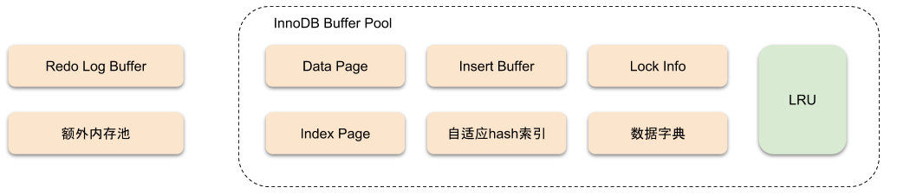
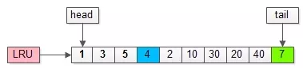
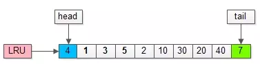
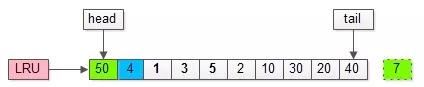
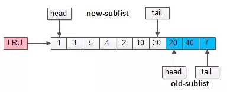
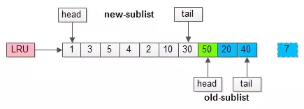
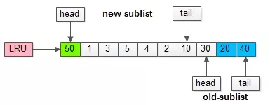

## 为什么使用缓存

对于 `MYSQL` 来说，不管是存储用户数据的索引（包括聚簇索引和二级索引），还是各种系统数据，都是以页的形式存放在磁盘上的，所以如果将被访问的数据页进行缓存，则下次访问的数据刚好在这个页时，则不需要再从磁盘读取，能够提高读取数据的速度，同时，减少访问数据库，减轻数据库压力。

## InnoDB 的 Buffer Pool

InnoDB 内存架构



`Buffer Pool` 中缓存了各种数据页， `MYSQL` 启动时会申请一片连续的空间作为`Buffer Pool`。

可以通过 `show variables like 'innodb_buffer_pool_size'` 查看 `buffer pool`大小，默认为 `128M`。

### buffer pool 组成


每个控制块对应一个缓存页，控制块中存储控制信息，包括该页所属的表空间编号、页号、缓存页在 `Buffer pool` 中的地址、链表节点信息等。

之所以会产生碎片，主要的原因是剩下的空间不够分配给一对控制块和缓存页大小。

启动 `MYSQL` 后会初始化 `buffer pool`， 此时所有的缓存页处于空闲状态，但随着 `MYSQL` 的运行，需要解决三个问题：

1. 数据页读入需要判断哪些缓存页处于空闲状态。
2. 没有空闲的缓存页或者没有空闲的缓存页达到一定占比，需要淘汰以存在数据页
3. 哪些数据页修改过需要刷回磁盘。


### free链表

解决问题一

因为控制块存放缓存页的信息，所以可以通过控制块判断缓存页是否处于空闲状态，因此，将所有处于空闲的控制块连接成为链表，`innodb` 称其为 `free链表`，其结构如下：


注意：基节点并不占用 `buffer pool` 空间。

通过 `free` 链表，当需要从磁盘读取新的数据页时，可以从空闲链表取一个控制块，并将控制块的信息填上（比如该页的表空间，页号等），接着将控制块从空闲链表移除，表示该控制块对应的缓存页已经被使用。


### flush链表

解决问题三

如果我们修改了缓存页中的数据使得它跟磁盘磁盘上的数据不一致，这样的缓存页称为脏页。`innodb` 对脏页的处理，并不是每次修改完缓存页则刷新回磁盘，而是在一定的时机批量写入磁盘。

此时，需要判断哪些缓存页是脏页，跟处理问题一一样，`innodb` 将脏页对应的控制块连接起来称为链表，称为 `flush 链表`，其结构如下：


### LRU链表

解决问题二

因为内存的空间是有限的，也就是我们没办法将所有的数据页进行缓存，所以当 `buffer pool` 没有足够的空间，可是我们又要读入新的数据页，这个时候肯定要淘汰一些数据页，此时需要采取一定的淘汰策略。

在 `innodb` 中，使用的是改进过的 `LRU(Least recently used)`算法 。

传统的 `LRU`  算法，在访问一个页面的时候，如果页面在 `LRU` 链表中，则将其移动到链表头部，如果不在页面中，则将新读入的数据页放在链表头，同时淘汰尾部的数据页。

如下：

初始状态：



访问页号为4的数据页：



因为页号为4的数据页已经处于链表中，所以直接将其移到链表头即可。

访问页号为50的数据页：



因为页号为50的数据页没有在`LRU` 链表中，因此淘汰在链表最后的数据页7，并将刚刚访问数据页50放在链表头。

之所以 `MYSQL` 不使用传统的 `LRU` 算法，主要因为会出现以下两个问题：

+ 预读失败
+ 缓存池污染

### 预读失败

`Innodb` 在执行某些请求后认为之后可能会读取某些页面，于是会预先将这些页面放在缓冲池中，如果之后没有从这些数据页读取数据，则称为预读失败。

为了解决这个问题，`innodb` 将 `LRU` 链表分为新生代和老年代，其中新生代的尾指向老年代的头。**当加载数据页进入缓存池，只将其作为老年代的头，当真正从这个数据页读取数据时才将其作为新生代的头**。

如下，`LRU` 链表前 `70%` 是新生代，后 `30%` 是老年代：


预读页号为50的新页，此时只会将其插入老年代的头部，最后的数据页会被淘汰：



紧接着读取该数据页的数据，则会将其放在新生代头部：



#### 查看老年代占比

`show variables like 'innodb_old_blocks_pct'`

```
+-----------------------+-------+
| Variable_name         | Value |
+-----------------------+-------+
| innodb_old_blocks_pct | 37    |
+-----------------------+-------+
```

可以看到老年代默认占比 `37%`。

#### 修改老年代占比

+ 在配置文件中修改

  ```
  [server]
  innodb_old_blocks_pct=40
  ```

+ 在运行时修改

  `set gloabl innodb_old_block_pct=40`


### 缓存池污染

当我们执行一些需要扫描大量数据的语句时，如全表扫描，会导致大量数据页加载进 `buffer pool` 并且读取每个数据页的数据，这时新读入的数据页会将热数据换出，导致 `mysql` 性能下降，这种情况叫缓冲池污染。

为了解决这个问题，`innodb` 引入“老生代停留时间窗口”的机制，刚插入老年代头部的页，即使被立即访问，也不会作为新生代的头部，只有在老年代停留时间大于 T ，才会作为新生代的头部，这个 T 称为老年代停留窗口。

可以通过 `show variables like 'innodb_old_blocks_time'` 查看老年停留窗口：

```
+------------------------+-------+
| Variable_name          | Value |
+------------------------+-------+
| innodb_old_blocks_time | 1000  |
+------------------------+-------+
```

默认为 1000 ms，通过可以像修改 `innodb_old_blocks_pct`一样修改 `innodb_old_blocks_time`。


## 多个 Buffer Pool 实例

因为访问 `buffer pool`中的各种链表需要加锁，如果  `buffer pool` 特别大且处于高并发环境，则会导致请求速度下降，为了提高并发量，可以将其拆分为多个  `buffer pool` 实例。

可以通过 `show variables like 'innodb_buffer_pool_instances'` 查看实例，同样，可以通过 `innodb_buffer_pool_instances` 配置 `buffer pool` 实例。


## innodb_buffer_pool_chunk_size

`innodb` 在 `5.7.5` 及以后的版本，不再为 `buffer pool` 申请一片连续的空间，而是申请若干个 `chunk` 来组成 `buffer pool` 的空间。


## reference

https://rsy.me/posts/mysql-innodb-preliminary/

从根上理解MYSQL是怎么运行的