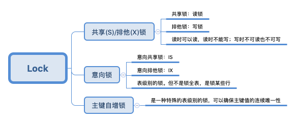
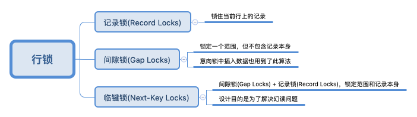

## 锁

数据库的锁主要用来管理对共享资源的并发访问。


## lock 和 latch

+ latch 是轻量级锁，因为没有取得锁的时候会不停自旋尝试获得锁，所以要求锁定时间短。在 InnoDB 中，latch 可以分为 mutex（互斥量）和 rwlock（读写锁），其目的是用来保证并发线程操作临界资源的正确性，并且通常没有死锁检测机制。

+ lock 对象是事务，用来锁定的是数据库中的对象，如表、页、行，并且一般 lock 对象在事务 Commit、rollback 后进行释放。


lock 的种类



## 锁的分类

### 一、全局锁

全局锁就是对整个数据库实例进行加锁。可以使用命令 `flush tables with read lock ` （FTWRL）添加全局锁。

#### 加了全局锁之后以下操作会被阻塞

+ 数据更新语句（数据的增删改）
+ 数据的定义语句（建表、修改表结构）
+ 更新类事务

#### 使用场景

全局逻辑备库（相当于把整个数据库的每个表都 select 出来存成文本），但是在执行 FTWRL 后数据库处于只读状态。这样会导致的后果：

+ 如果在主库上备份，备份期间不得更新，业务基本停摆
+ 如果在从库上备份，备份期间从库不能执行从主库同步过来的 binlog，会导致主从延迟。

#### 那如何备份

MySQL 官方提供了 mysqldump。当 mysqldump 使用参数 -single-transaction 的时候，导数据之前会启动一个事务，确保拿到一致性视图。

但是，上面的方法只适用于所有的表使用支持事务的引擎，如果存在使用不支持事务的引擎的表，只能通过 FTWRL 方法。

设置全库只读还可以使用 `set global readonly=true`。但是还是建议使用 FTWRL 进行备库（在不支持事务的数据库中），原因是 执行 FTWRL 命令后，如果由于客户端发生异常断开，那么 MySQL 会自动释放这个全局锁，而 readonly 不会。

### 二、表级锁

表级别的锁有两种，一种是表锁，一种是元数据锁（meta data lock，MDL）。

### 表锁

表锁的语法是 `lock table 表名 read/write`，使用 `unlock tables`主动释放锁。读锁是共享的，写锁的独占的。

+ 共享读锁

  对MyISAM表的读操作（加读锁），不会阻塞其他进程对同一表的读操作，但会阻塞对同一表的写操作。只有当读锁释放后，才能执行其他进程的写操作。在锁释放前不能取其他表。

+ 独占写锁

  对MyISAM表的写操作（加写锁），会阻塞其他进程对同一表的读和写操作，只有当写锁释放后，才会执行其他进程的读写操作。在锁释放前不能写其他表。

比如，线程A执行 `lock table t1 read, t2 write`。

t1:  **其他线程**可以正常进行读操作，写操作会被阻塞。而对于 A 来说，只能进行读操作，不能进行写操作

```mysql
# 读锁
mysql> lock tables selection read;
Query OK, 0 rows affected (0.00 sec)
# 不能进行写操作，解锁后才可以
mysql> insert into selection values (null, 3, 3);
ERROR 1099 (HY000): Table 'selection' was locked with a READ lock and can't be updated

```

t2：其他线程读写都会被阻塞，线程 A 可以读写操作。

#### 元数据锁（MDL）

元数据锁不用显式定义，在访问任意表时会自动加上。

+ 当对一个表进行增删改查时，加 MDL 读锁
+ 当修改一个表结构时，加 MDL 写锁。

### 三、行级锁

MySQL 的行锁是在引擎层由各个引擎自己实现的。但并不是所有的引擎都支持行锁，比如 MyISAM 引擎就不支持行锁。（下面的行级锁默认为 InnoDB 中的锁）

#### 锁的类型

+ 共享锁（S Lock），允许事务读一行数据
+ 排他锁（X Lock），允许事务删除更新一行数据。


InnoDB 支持多粒度锁定，这种锁定允许事务行级锁和表级锁同时存在。

#### 意向锁

为了支持在不同颗粒上进行加锁操作（让表锁和行锁共存），InnoDB 支持一种额外的锁方式，称为意向锁（Intention Lock）。

在 InnoDB 中，意向锁为表级别的锁。其支持两种意向锁

+ 意向共享锁（IS Lock），事务想要获取一张表中某行的共享锁
+ 意向排它锁（IX Lock），事务想要获取一张表中某行的排他锁

设置意向锁

+ [`SELECT ... FOR SHARE`](https://dev.mysql.com/doc/refman/8.0/en/select.html) 设置一个意向共享锁。

+  [`SELECT ... FOR UPDATE`](https://dev.mysql.com/doc/refman/8.0/en/select.html) 设置一个意向排它锁。


意向锁之间的兼容性

|                      | **意向共享锁（IS）** | **意向排他锁（IX）** |
| :------------------: | :------------------: | :------------------: |
| **意向共享锁（IS）** |         兼容         |         兼容         |
| **意向排他锁（IX）** |         兼容         |         兼容         |

**意向锁之间都是相互兼容的。**

意向锁与其他锁的兼容性

|                 | **意向共享锁（IS）** | **意向排他锁（IX）** |
| :-------------: | :------------------: | :------------------: |
| **共享锁（S）** |         兼容         |         互斥         |
| **排他锁（X）** |         互斥         |         互斥         |

**注意：这里的 S锁、X锁指的是表级锁，意向锁不会和行级锁互斥。**


#### 意向锁的作用

[MySQL 官网的解释](https://dev.mysql.com/doc/refman/8.0/en/innodb-locking.html)：The main purpose of intention locks is to show that someone is locking a row, or going to lock a row in the table.

翻译过来就是意向锁的主要目的是表明在表中某一行被锁住或者某一行将要被锁住。

**那既然意向锁表明表中某些行将要加锁或者已经加锁，那为何不直接加锁？**

假设有如下的 course 表：

|  id  | course_name |
| :--: | :---------: |
|  1   |    java     |
|  2   |     c++     |

假设事务 A  获取了某一行的排它锁，并没有提交

```mysql
select * from course where id = 1 for update
```

事务 B 想要获取这个表的表锁

```mysql
lock table course read
```

假设这时事务 B 加锁成功，则会发现，事务 A 可以修改 id = 1的数据，而事务 B 的读锁又要求表中的数据不能被修改，这就造成了冲突。

所以，事务 B 在获得锁之前应该做以下的判断：

+ 判断当前没有其他事务持有表 course 的排他锁。
+ 判断当前没有其他事务持有表 course 某一行的排他锁。

对于第二种判断，InnoDB 要检测表中的每一行是否存在排他锁，这个会花费很多时间，效率极低。


当加入意向锁之后：

事务 A  获取了某一行的排它锁，并没有提交

```mysql
select * from course where id = 1 for update
```

此时，course 存在两把锁，course表的意向排他锁（自动）和 id = 1 数据行的排他锁。

事务 B 想要获取这个表的表锁

```mysql
lock table course read
```

此时事务 B 会先尝试给表加上意向共享锁（IS），因为表中已经存在意向排他锁（IX），所以加锁失败，所以事务 B 的加锁请求会被阻塞。上面过程不需要一行一行去检测是否存在行级排他锁。

**由上可以得知，意向锁（Intention Lock）主要作用是让表级锁和行级锁共存，提高锁检测的效率。**


#### 行级锁的分类

**InnoDB存储引擎的行锁是通过锁住索引实现的。**



+ 记录锁（Record Locks）

  锁住某一行**索引记录**（就算没有索引，InnoDB也会自动生成隐藏的索引列）。比如执行

  ```mysql
  select * from t where id = 1 for update;
  ```

  事务会锁定该行的索引记录，**其他事务不能 insert, update, delete 该行**。

  被选中的 id 这一列需要满足以下条件：

  + 为唯一索引列
  + 需要精准匹配，像 >、<、like 会退化成临键锁

  如果通过唯一索引对数据进行 update 操作，会触发记录锁。

  ```mysql
  update course set course_name=java where id = 1;
  ```

  例如一个非唯一索引有 10,11,13,20 这四个值，Gap Lock划分出 (-∞,10)，(10,11)，(11,13)，(13,20)，(20, +∞) 五个区间。**假设存在没有索引的列，我们执行**

  ```mysql
  # 注意，d 没有索引
  select * from where d=5 for update
  ```

  **这时不仅会锁住表中所有的数据，还会加上上面五个间隙锁。**

+ 间隙锁（Gap Locks）RR隔离级别

  在根据非唯一索引进行区间查询时，会使用间隙锁，使用间隙锁锁住的是一个区间，而不仅仅是这个区间中的每一条数据。比如执行

  ```mysql
  SELECT c1 FROM t WHERE c1 BETWEEN 10 and 20 FOR UPDATE;
  ```

  这时如果其他事务想要插入 c1 = 15的数据（不管 t 中存不存在 c1=15 的值）会失败，因为15在区间 10 - 20 中。

  

+ 临键锁（Next-Key Locks）RR隔离级别

  记录锁和间隙锁结合起来称为临键锁。**对于行的等值查询，一般情况下都是用 Next-Key Lock，如果发现查询条件是唯一索引，则升级为记录锁，锁住的不是范围，而是索引本身。**

  假设存在如下表：**MySql**，**InnoDB**，**Repeatable-Read**：table(id PK, age KEY, name)

  |  id  | age  | name |
  | :--: | :--: | :--: |
  |  1   |  10  |  a   |
  |  3   |  24  |  b   |
  |  5   |  32  |  c   |
  |  7   |  45  |  d   |

  则对于 age 列存在潜在的`临键锁`：

  (-∞, 10],
  (10, 24],
  (24, 32],
  (32, 45],
  (45, +∞],

  在事务 A 执行以下语句

  ```mysql
  SELECT * FROM table WHERE age = 24 FOR UPDATE;
  ```

  当在事务 B 执行以下命令时会被阻塞

  ```mysql
  INSERT INTO table VALUES(100, 26, 'Ezreal');
  ```

  因为事务 A 取得了 （24, 32] 这个区间的临键锁。

  若事务 B 再执行也会被阻塞。

  ```mysql
  INSERT INTO table VALUES(100, 30, 'Ezreal');
  ```

  因为在根据`非唯一索引` 对记录行进行 `UPDATE \ FOR UPDATE \ LOCK IN SHARE MODE` 操作时，InnoDB 会获取该记录行的 `临键锁` ，并同时获取该记录行下一个区间的`间隙锁`。

  所以对于事务 A 来说，锁住的区间为 ( 10,  32 )，同时，对于聚簇索引，会对 `id=3`的数据行加上记录锁。

  关闭间隙锁

  ```text
  方式一：将事务的隔离级别设置成 READ COMMITTED
  方式二：将参数 innodb_locks_unsafe_for_binlog 设置为 1
  ```


## 加锁规则

### 加锁规律

1. 原则一：加锁的基本单位是 next-key lock。

2. 原则二：查找过程中访问到对象才会加锁。

3. 优化一：索引上的**等值查询**，给唯一索引加锁时，会退化为行锁。

4. 优化二：索引上的**等值查询**，向右遍历且最后一个值不满足等值条件时（也就是没有该条数据），next-key lock 退化成间隙锁。

5. 一个bug：唯一索引上的范围查询会访问到不满足条件的第一个值为止。

下面用到的表：

```mysql
CREATE TABLE `t` (
`id` int(11) NOT NULL,
`c` int(11) DEFAULT NULL,
`d` int(11) DEFAULT NULL,
PRIMARY KEY (`id`),
KEY `c` (`c`)
) ENGINE=InnoDB;
insert into t values(0,0,0),(5,5,5),
(10,10,10),(15,15,15),(20,20,20),(25,25,25);
```

gap lock ：(-∞， 0)， (0，5)，(5，10)，(10, 15)，(15, 20)，(20, 25)，(25, +∞)。

next-gap lock  ：(-∞， 0]， (0，5]，(5，10]，(10, 15]，(15, 20]，(20, 25]，(25, +∞]


### 等值查询间隙锁

| session A                                            | session B                                     | session C                                             |
| :--------------------------------------------------- | :-------------------------------------------- | :---------------------------------------------------- |
| begin;<br />select * from t where id = 7 for update; |                                               |                                                       |
|                                                      | insert into t values(8,8,8);<br />**(block)** |                                                       |
|                                                      |                                               | update t set d=d+1 where id = 10;<br />**(query ok)** |

1. 首先加锁的是 next-key lock，session A 加锁的范围是 (5, 10];
2. 根据优化二，这是等值查询，而且 id = 10 不满足查询条件，next-key lock 退化成间隙锁，所以锁住的范围是 (5, 10)。

**通过这里可以看出，就算是唯一索引，也是会加上间隙锁的。**

### 非唯一索引等值锁

| session A                                                 | session B                                             | session C                                      |
| --------------------------------------------------------- | ----------------------------------------------------- | ---------------------------------------------- |
| begin;<br />select id from t where c=5 lock in share mode |                                                       |                                                |
|                                                           | update t set d = d+1 where id = 5<br />**(query ok)** |                                                |
|                                                           |                                                       | insert into t values(7,7,7)<br />**(blocked)** |

1. 根据原则1，加锁的单位是 next-key lock，因此会给 (0, 5]加锁。

2. **因为c是普通索引**，所以访问到 c=5 这条数据不会马上停下来，会向右遍历直到 c=10 才结束**（不符合条件c=5， 其实这里是要找到所有 c=5 的数据，因为索引 c 不是唯一索引）**。根据原则二，访问到的都要加锁，因此给 (5,10] 加上 next-key lock。注意，这里访问到的指的是 c 这一列的索引。

3. 因为这是等值判断，最后一个值不满足 c = 5这个等值条件，所以间隙退化成间隙锁 (5, 10)

4. 根据原则2，**只有访问到的对象才加锁**，因为 session A 查询语句只用到了覆盖索引（id, c），并不需要访问主键索引，所以主键索引不会加锁，所以 session B 语句执行成功。

   注意：

   + **如果在这里将 session A的执行语句修改成 `select d from t where c=5 lock in share mode  ` 则会锁住对应数据的主键索引。因为在 c 列的索引没有我们要查找的数据列 d ，所以查找到相应的数据索引后，还需要访问到主索引，此时才会对主键索引加上行锁（记录锁）。**

   + **如果这里是 `for update`，系统会认为你接下来要更新数据，所以会锁住主键索引。**

5. **所以对于 session A 来说，锁住的是索引 c  (0, 10)，这里主键索引没有被加上行锁。**


### 主键索引范围锁

对于下面的查询语句，加锁范围是不同的。

```mysql
select * from t where id = 10 for update;
select * from t where id >=10 and id < 11 for update;
```

对于第一句：首先找到 id = 10 的数据行，给对应的 next-key lock (5, 10] 加锁，因为 id 是唯一索引，所以退化成行锁并且不再向后进行范围查找，最后锁上的只有 id = 10 这个数据行。

对于第二句：

| session A                                                    | session B                                                    | session C                                              |
| ------------------------------------------------------------ | ------------------------------------------------------------ | ------------------------------------------------------ |
| begin;<br />select * from t where id >=10 and id < 11 for update; |                                                              |                                                        |
|                                                              | insert into t values(8,8,8);<br />**(query ok)**<br />insert into t values(13,13,13);<br />**(blocked)** |                                                        |
|                                                              |                                                              | update t set d = d+1 where id = 15;<br />**(blocked)** |

1. 开始执行，找到第一个 id = 10 的行，加锁范围 (5, 10]。根据优化一，因为 id 是主键，所以退化成行锁，只加了 id=10 这一行的行锁。**（这里是等值查找）**
2. 接下来是范围查找，找到 id=15 就停下来，因此加锁范围 (10, 15]**（这里是范围查找，所以不会退化成间隙锁）**
3. 因此这里加锁的是 id=10 这一数据行的行锁和 next-key lock (10, 15]。

### 非唯一索引范围锁

| session A                                                    | session B                                       | session C                                         |
| ------------------------------------------------------------ | ----------------------------------------------- | ------------------------------------------------- |
| begin;<br />select * from t where c>=10 and c<11 for update; |                                                 |                                                   |
|                                                              | insert into t values(8,8,8);<br />**(blocked)** |                                                   |
|                                                              |                                                 | update t set d=d+1 where c=15;<br />**(blocked)** |

1. 当用 c = 10 定位数据后，索引 c 加了 next-Key lock (5, 10]，因为 c 是非唯一索引，所以不会退化成行锁。
2. 接下来是范围查找查找到第一个不符合范围的数据行 c=15，根据原则二，访问到的对象会加锁，所以 (10, 15] 也会被加锁，因为不是等值查询，所以临键锁不会退化成间隙锁。注意，这里不仅索引 c 加上锁，主索引对应的数据也有加锁。 

### 唯一索引范围锁bug

| session A                                                    | session B                                          | session C                                          |
| ------------------------------------------------------------ | -------------------------------------------------- | -------------------------------------------------- |
| begin;<br />select * from t where id > 10 and id <= 15 for update |                                                    |                                                    |
|                                                              | update t set d=d+1 where id=20;<br />**(blocked)** |                                                    |
|                                                              |                                                    | insert into t values(16,16,16);<br />**(blocked)** |

按照原则一，session A加锁的范围应该是 (10, 15]，因为 id 是唯一索引，所以循环判断到 id=15 就应该停止了。

但实际的情况是，InnoDB 会继续向前扫描到第一个不满足条件的行为止，也就是 id=20，因此，索引 id (15,20] 的 next-key lock 也会被锁上。因此 session B 和 session C 的执行语句都被阻塞了。

### limit 语句加锁

我们给表 t 插入数据 (id = 30, c = 10, d=10)

| session A                                     | session B                                           |
| --------------------------------------------- | --------------------------------------------------- |
| begin;<br />delete from t where c=10 limit 2; |                                                     |
|                                               | insert into t values(12,12,12);<br />**(query ok)** |

session A 会 gap-key lock 区间 (5, 10]，然后继续遍历，直到 (c = 10, id = 30) 后满足 limit 2 这个条件，所以加锁范围到这里就结束了。如下图，阴影为加锁区间。


所以，session B 执行的语句成功。

### 一个死锁的例子

**对于 next-key lock ，只是单纯由间隙锁和行锁（记录锁）结合的。**

| session A                                                   | session B                                                    |
| ----------------------------------------------------------- | ------------------------------------------------------------ |
| begin;<br />select id from t where c=10 lock in share mode; |                                                              |
|                                                             | update t set d=d+1 where c=10;<br />**(blocked)**            |
| insert into t values(8,8,8);                                |                                                              |
|                                                             | ERROR 1213 (40001): Deadlock found when trying to get lock; try restarting transaction |

1. session A 执行后，在索引 c 上加上 next-key lock (5, 10] 和间隙锁 (10, 15)。
2. session B 的 update 语句在加 next-key lock 锁时会先加上间隙锁 (5, 10)，加锁成功，然后再加 c=10 的行锁，此时进入锁等待。
3. 当 session A 插入 (8,8,8)时，会被 session B 的间隙锁锁住，出现死锁。 

所以在分析加锁规则的时候可以用next-key lock来分析。但是要知道，具体执行的时候，是要分成间隙锁和行锁两段来执行的

**注意：以上例子都是在可重复读的隔离级别执行的**


[InnoDB 存储引擎的锁学习 - 张佃鹏的文章 - 知乎](https://zhuanlan.zhihu.com/p/66973337)

[MySQL探秘(七):InnoDB行锁算法 - 历小冰的文章 - 知乎](https://zhuanlan.zhihu.com/p/66676020)

[MySQL锁机制——你想知道的都在这！](https://juejin.im/post/5d3e8b63f265da1bce3e1988#heading-8)

MySQL实战45讲