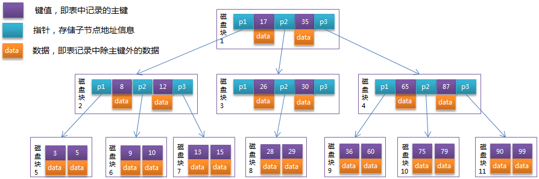
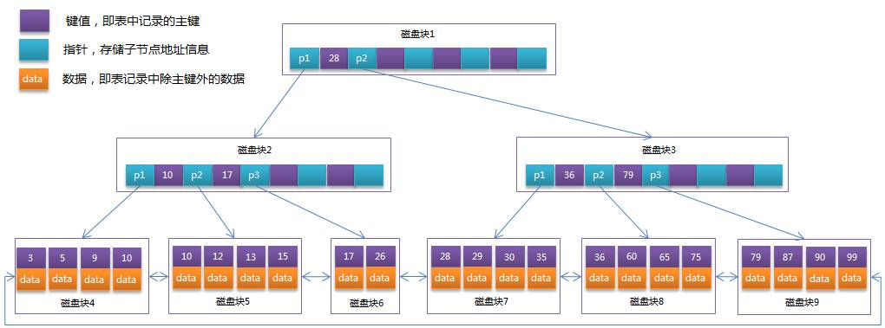
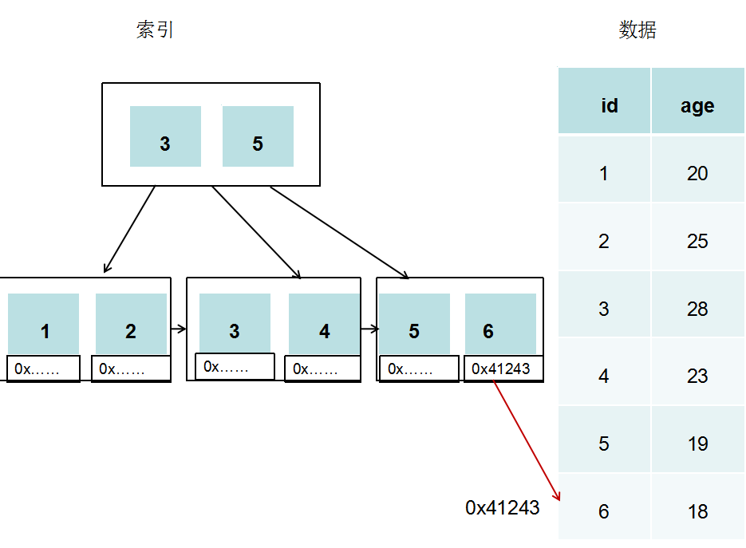
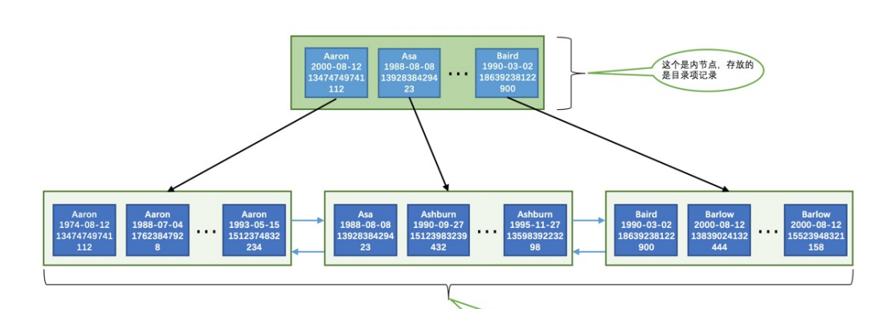
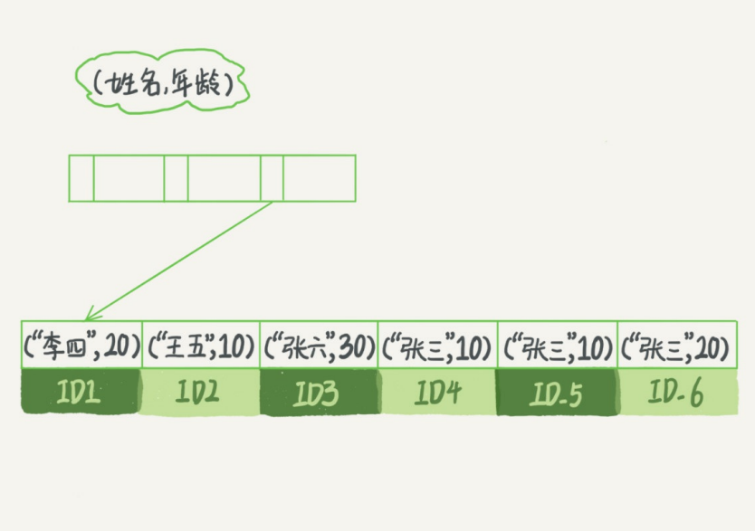
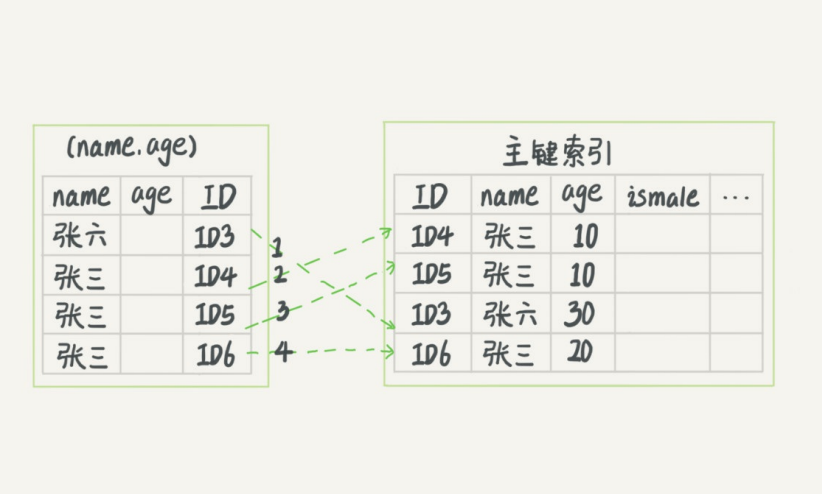
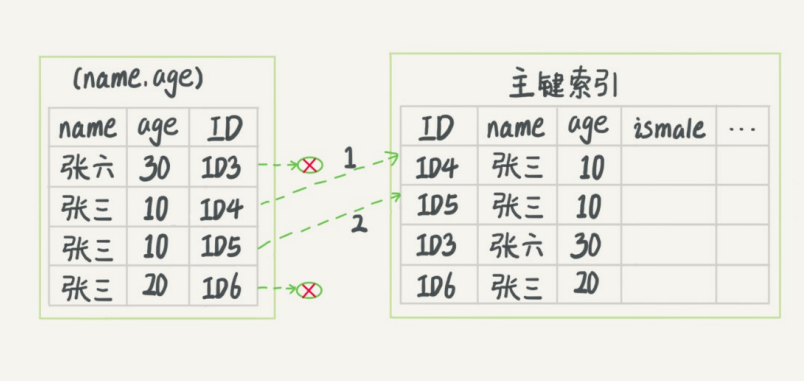

### 数据库索引

索引是帮助 MySQL 高效获取数据的**排好序**的**数据结构**

### 索引的优缺点

优点：

+ 减少查询需要扫描的数据量
+ 减少服务器排序操作和创建临时表的操作（如 groupby 和 orderby等操作）
+ 将服务器的随机IO变为顺序IO

缺点：

+ 存储索引需要额外的空间
+ 在插入、更新、删除等操作时需要维护索引带来额外的时间开销

### 索引的常见模型


#### Hash索引

Hash索引根据将索引列的值作为哈希函数的输入值，计算出hashcode，然后在hashcode对应的位置上存储该行的物理位置。如果hashcode重复，则在此位置添加链表，在链表后添加数据。

由于Hash表中的数据并不是有序的，所以当我们进行范围查找时，需要进行全表扫描。因此，Hash索引适用于只有等值查询的场景。


#### B-树、B+树索引

#### B-树

B-树是多路平衡查找树，对于一棵m阶的B-树有以下性质：

1. 根节点至少有两个子女
2. 每个节点包含 k-1 元素和 k 个孩子， 其中 m/2 <= k <= m

3. 每一个叶子节点都包含k-1个元素,其中m/2 <= k <= m.

4. 所有的叶子节点位于同一层.

5. 每个节点中的元素从小到大排列,那么k-1个元素正好是k个孩子包含的值域的划分.

B树其实可以理解为多叉搜索树

如图为3阶B树



因为是3阶，所以最多有3个孩子，每个节点最多包含2个元素。

#### B+树

B+树是B-树的进阶版本,在B-树的基础上又做了如下的限制:

1. 每个中间节点不保存数据,只用来索引,也就意味着所有非叶子节点的值都被保存了一份在叶子节点中.
2. 叶子节点之间根据自身的顺序进行了链接.

如图为4阶B+树




#### B+树对比B树优点

1. 磁盘读写代价低

   外存（磁盘）的最小存储单位是扇区（sector），而操作系统的块（block）通常是整数倍的 sector，操作系统以页（page）为单位管理内存，一页通常默认为 4k， 数据库的页通常设置为操作系统页的整数倍。因此索引结构的节点设计为一个页大小（数据库的页），因为外存在读取数据时会进行预读，在读取的时候，有利于将整个节点读取到内存中，然后在内存中进行查找。

   因为内存读取的速度比外存块很多，因此提升查找速度的关键是尽可能少的进行磁盘IO。所以，当节点中 Key 个数越多，那么树的高度越小，需要的磁盘 IO 次数越少。因此一般来说 B+Tree 比 BTree 更快，因为 B+Tree 的非叶子节点中不存储 data，可以存储更多key。

2. 查询速度更稳定

   由于B+Tree非叶子节点不存储数据（data），因此所有的数据都要查询至叶子节点，而叶子节点的高度都是相同的，因此所有数据的查询速度都是一样的。

[来源](https://blog.csdn.net/tongdanping/article/details/79878302)

### 不同存储引擎的索引结构

#### MyISAM

MyISAM 采用 B+Tree 作为索引模型。因为 Myisam 中索引和数据分别存放在不同的文件，所以索引树中的叶子节点存储的是该索引对应的数据记录的物理地址。我们将这种数据和索引不在一起的索引称为非聚簇索引。

非聚簇索引在查找到相应的记录物理地址后还需要到另外的文件查找对应的数据。



#### InnoDB

InnoDB使用了B+树索引模型，所以数据都是存储在B+树中的，将数据和主键索引组织在一起存储称为聚簇索引。

在 InnoDB 中，主键索引的叶子节点存储的是整行数据，所以主键索引也称为聚簇索引，而对于非主键索引，叶子节点存储的是主键的值，非主键也称为二级索引。

因为非主键索引存储的是主键的值，所以当使用非主键的值（已经建立索引）进行查询时，会先搜索该值对应的 B+Tree 得到主键值，然后再根据主键值到主键对应的 B+Tree 查询数据（这个过程称为回表）。


聚簇索引

+ 通过聚簇索引查找目标数据时理论上比非聚簇索引要快，因为非聚簇索引定位到对应主键时还要多一次目标记录寻址,即多一次I/O。

+ 因为聚簇索引主索引**的叶子结点存储的是键值对应的数据本身，辅助索引的叶子结点存储的是键值对应的数据的主键键值**。因此主键的值长度越小越好，类型越简单越好,可以减少空间消耗。

+ 聚簇索引推荐使用自增主键。这样插入数据可以不指定主键的值，系统会获取当前ID最大值加1作为下一条记录的主键值。每次插入数据时是追加操作，不涉及其他数据的移动，也不会触发叶子节点的分裂。

聚簇索引存在的缺点：

[来源](https://juejin.im/post/5cdd701ee51d453a36384939)

+ 插入速度严重依赖插入顺序。按照主键顺序插入是最快的方式，否则可能出现页分裂。

+ 更新主键代价高，会导致被更新的数据行移动。

+ **二级索引访问需要两次索引查找，第一次找到主键值，第二次根据主键值找到行数据。**

  二级索引的叶节点存储的是主键值，而不是行指针（非聚簇索引存储的是指针或者说是地址），这是为了减少当出现行移动或数据页分裂时（都是物理地址改变）二级索引的维护工作，但会让二级索引占用更多的空间。

+ **采用聚簇索引插入新值比采用非聚簇索引插入新值的速度要慢很多**，因为插入要保证主键不能重复，判断主键不能重复，采用的方式在不同的索引下面会有很大的性能差距，聚簇索引遍历所有的叶子节点，非聚簇索引也判断所有的叶子节点，但是聚簇索引的叶子节点除了带有主键还有记录值，记录的大小往往比主键要大的多。这样就会导致聚簇索引在判定新记录携带的主键是否重复时进行昂贵的I/O代价。

### 索引概念


#### 联合索引

以多个列作为组成的索引

首先创建一个表

```mysql
CREATE TABLE person_info(
id INT NOT NULL auto_increment,
name VARCHAR(100) NOT NULL,
birthday DATE NOT NULL,
phone_number CHAR(11) NOT NULL,
country varchar(100) NOT NULL,
PRIMARY KEY (id),
KEY idx_name_birthday_phone_number (name, birthday, phone_number)
);
```

在这个表中

+ 主键是 id 列，是自动递增的整数，InnoDB存储引擎会自动为 id 列建立聚簇索引。
+ 自己定义了一个二级索引 `idx_name_birthday_phone_number`，它是由 name、birthday、phone_numbe 3个列组成的索引。所以这个索引对应的二叉树的叶子节点处存储的用户记录只保留name、birthday、phone_numbe 三个列的值以及主键 id 的值，并不会保存 country 列的值。

该索引对应的B+Tree：



因为我们创建索引语句中列的顺序为 name, birthday, phone_number。所以 B+Tree 按照该顺序进行排序：

+ 先按照name列的值进行排序。
+ 如果name列的值相同，则按照birthday列的值进行排序。
+ 如果birthday列的值也相同，则按照phone_number的值进行排序


#### 覆盖索引

当一个索引包含(或者说是覆盖)需要查询的所有字段的值时,我们称之为覆盖索引。

比如上面的表，如果我们执行下面的查找语句

```mysql
SELECT name, birthday, phone_number FROM person_info WHERE name = 'Ashburn' AND birthday = '1990-09-27' AND phone_number = '15123983239';
```

这个查询语句所包含的三个列刚好对于我们所建立的索引的三个列，因此查询的过程如下

1. 因为B+树的数据页和记录是先按name列的值进行排序，所以先定位到 name 列是 Ashburn 的位置
2. 在 name 相同的记录里是按 birthday 列的值进行排序的，所以在 name 列是 Ashburn 的位置中可以快速找到位birthday列的值是'1990-09-27'的记录。
3. 因为在 name 和 birthday 相同的记录中按照 phone_number的值进行排序，在进行前面的查找后定位数据的位置。

如果我们的查询语句查询列的顺序顺序发生改变会不会搜索过程发生改变呢？答案是不会的，因为MySQL中的查询优化器会自动优化我们的查询语句，使查询条件的顺序与定义索引列的顺序一致。


那如果我们的查询语句包含索引没有的列会发生什么？比如查询语句如下

```mysql
SELECT * FROM person_info WHERE name = 'Ashburn' AND birthday = '1990-09-27' AND phone_number = '15123983239';
```

因为我们创建的联合索引中不包含 country 列，所以会按照上面的查询过程找到对应数据行的主键。然后根据主键到主索引中查找，即回表。


再定义一个表

```mysql
CREATE TABLE `tuser` (
`id` int(11) NOT NULL,
`id_card` varchar(32) DEFAULT NULL,
`name` varchar(32) DEFAULT NULL,
`age` int(11) DEFAULT NULL,
`ismale` tinyint(1) DEFAULT NULL,
PRIMARY KEY (`id`),
KEY `id_card` (`id_card`),
KEY `name_age` (`name`,`age`)
) ENGINE=InnoDB
```

为了减少回表，我们可以根据高频查询请求建立联合索引。比如上面的表，假设现在有一个高频请求，要根据市民的身份证号查询他的姓名。即查询涉及到的只有两个字段 身份证号， 姓名。所以可以建立联合索引 name_age(name, age) 。这样在这个高频请求就能用到覆盖索引，不用再回表查询整行记录。


#### 最左前缀原则

我们建立的联合索引如图



假设要查找名字是张三的人，因为 name_age 索引的第一个字段是 name，所以可以根据B+树快速查找到ID4的位置，然后向后遍历得到需要的结果。

假设需求是查找所有名字第一个字是 ”张“ 的人，即 SQL 语句的条件为 where name like '张%'。此时，也可以利用联合索引查找到符合条件的记录ID3，然后向后遍历直至条件不成立。

所以，不只是索引的全部定义，只要满足最左前缀，就可以利用索引来加速检索。这个最左前缀可以是联合索引的最左N个字段，也可以是字符串索引的最左M个字符。


那建立联合索引时，如何安排索引内的字段？

首先考虑索引的复用性， 假设已经有了索引 (a, b)，那一般不需要在 a 上单独建立索引了。因此，如果通过调整顺序可以减少维护一个索引，那么这个顺序往往就是优先考虑的。

那如果除了索引(a, b)，又有基于 a, b各自的查询怎么办？如果查询条件只有 b ，其实是无法使用索引 (a, b)的，这个时候不得不维护另外一个索引 b。这个时候，可以根据字段的大小选择建立索引。比如上面的表，因为 name 字段比 age 字段大，所以索引 (name) 比索引 (age) 占用空间大，所以考虑创建索引 (age)，再创建索引 (name, age)。这样两个索引占据的空间相对较小。


#### 索引下推

如果我们的查询语句中包含不符合最左前缀的部分，查询过程会怎样？如下的查询语句

```mysql
select * from tuser where name like '张%' and age=10 and ismale=1;	
```

首先可以通过搜索B+树找到符合条件记录 ID3，然后在再判断其他条件是否满足。

在 MySQL5.6 之前，只能从 ID3 开始将每个数据回表，到主键索引找出数据行，再对比字段值



而MySQL 5.6 引入的索引下推优化（index condition pushdown)， 可以在索引遍历过程中，对索
引中包含的字段先做判断，直接过滤掉不满足条件的记录，减少回表次数。




#### 回表的代价

对于上面的数据表，因为我们建立的索引 （name, age）对应的 B+树本来就是先按照名字进行排序存储的，假设我们查找名字在 张三～王五 之间的数据，因为这些数据在磁盘中是顺序存储在一个或多个页中的，所以我们可以较快的读取出所有记录。

但是如果我们查询索引不包含的字段时，则需要将查找到的主键值（不连续）一一到聚簇索引中查找，这样要读取全部记录可能要访问更多的页，消耗的时间相应更多。