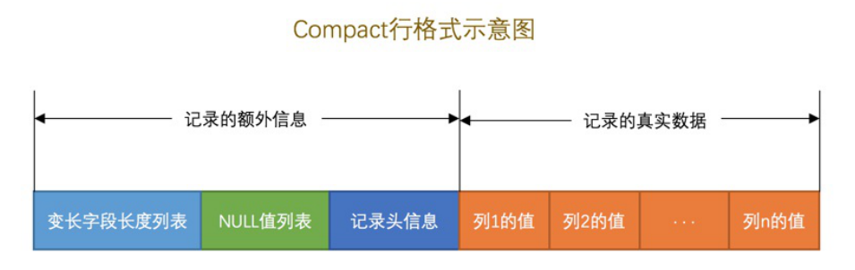
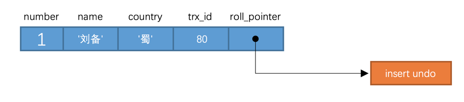
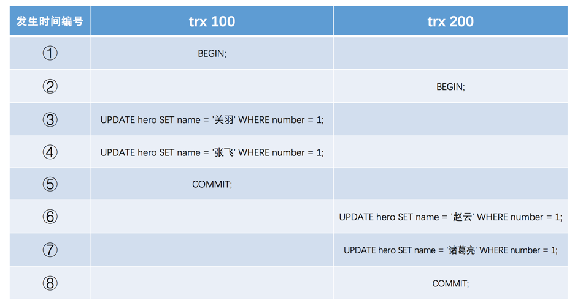
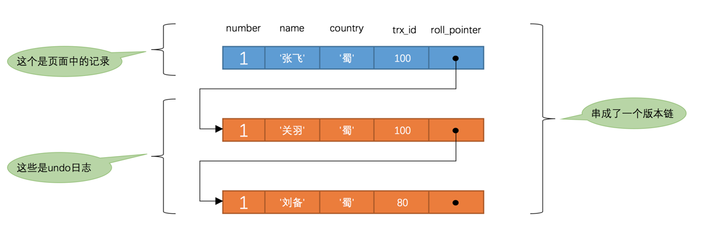
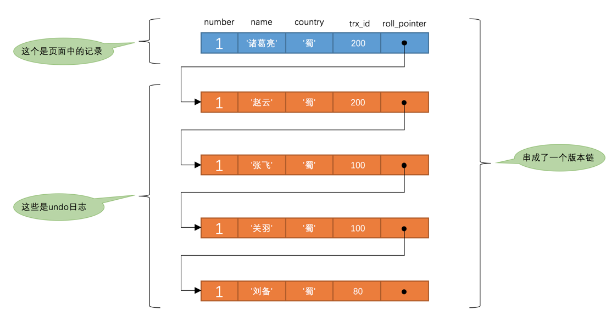

### 事务定义

事务由一系列访问和更新操作组成的程序执行单元，这些操作要么都做，要么都不做，是不可分割的整体。

### MySQL中的事务

1. 事务以 `begin transaction` 开始，以 `commit` 或 `rollback` 语句结束

2. commit 语句：

   提交事务，此时事务正常结束，事务所做的修改操作都必须永久写入数据库。

3. rollback 语句

   回滚事务，此时事务非正常结束，事务所做的修改操作都必须撤销，即修改回旧值。数据库回退到事务开始前的状态。如果事务在还没有 commit 之前发生异常退出，系统会自动回滚这个事务。


#### 自动提交

MySQL 默认开启了自动提交模式，在该模式下，如果没有显式的开启一个事务，则每个 sql 语句都会被当成一个事务自动提交。

可以通过 `set autocommit = false` 关闭自动提交。需要注意的是，该命令是针对连接的，在一个连接中关闭了自动提交，不会影响到其他连接。


#### 隐式提交

就算关闭了自动提交，当我们输入某些语句后还是会被系统悄悄提交掉，这些语句包括：

+ 定义或修改数据库对象的数据定义语言 (Data definition language)。所谓的数据库对象，指的是数据库、表、视图，存储过程等。如果我们使用 CREATE、ALTER、DROP 等语句修改数据库对象时，就会隐式提交前面语句所属的事务。
+ 开启事务后还没有提交或者回滚又开启一个事务，会隐式提交上一个事务。
+ 将 `autocommit` 从 off 修改为 on，使用 `lock tables`、`unlock tables` 等会隐式提交前面语句所属的事务。

### 事务的ACID特性

#### 一、原子性

1. 定义

   指事务是一个不可分割的整体，对于一个事务中的全部操作，要么全部做，要么全不做。

2. 实现原理：undo log、redo log

   redo 是物理逻辑日志，记录了每条语句的修改记录，如在哪个数据页修改了哪个值，uodo 记录的是每条语句的反向修改记录，比如 insert 操作，在 undo log 中会记录 delete 这条记录。当事务执行过程中出现错误，
   
   + 如果事务还没有提交，则会通过 uodo log undo 事务的操作，恢复到事务执行前的状态
   + 如果事务已经提交，数据库的缓存还没有刷新到硬盘，则会通过 redo log redo 事务中的操作，执行到事务的 commit 语句

#### 二、持久性

1. 定义

   指事务一旦提交，它对数据库的修改是永久性的。

2. 实现原理：redo log

#### 三、隔离性

1. 定义

   指事务内部操作与其他事务是隔离的，并发执行的事务之间不能相互干扰，严格的隔离性，对应了务隔离级别中的Serializable (可串行化)，但实际应用中出于性能方面的考虑很少会使用可串行化。

   例如两个事务T1、T2同时对帐户A、B操作。如果T1读取的A是T2修改前的A，而读取的B是T2修改后的B，这就违反了隔离性，并可能导致数据错误

2. 实现原理

   可以通过锁机制使事务之间看起来像是串行化的

#### 四、一致性

1. 定义

   指事务结束后，**数据库的完整性约束没有被破坏，事务执行的前后都是合法的数据状态。**数据库的完整性约束包括但不限于：实体完整性（如行的主键存在且唯一）、列完整性（如字段的类型、大小、长度要符合要求）、外键约束、用户自定义完整性（如转账前后，两个账户余额的和应该不变）。

2. 实现原理

   一致性是事务的目的，前面提到的原子性，隔离性，持久性都是为了保证一致性。

   所以，保持一致性包括：

   + 保证原子性，隔离性，持久性
   + 数据库自身保障：比如不能向一个域中插入其他域的值，列约束等
   + 应用层提供保证：这需要编写代码的人保证代码的鲁棒性，例如如果转账操作只扣除转账者的余额，而没有增加接收者的余额，无论数据库实现的多么完美，也无法保证状态的一致。


### 事务并发执行产生的问题

#### 一、丢失修改（脏写）

比如并发两个事务同时从数据库读取同一数据分别修改再写入数据库

| 事务T1                 | 事务T2                 |
| ---------------------- | ---------------------- |
| read(A)                |                        |
|                        | read(A)                |
| A += 200<br />write(A) |                        |
|                        | A += 100<br />write(A) |

当 T1 提交后 T2 再提交，会使 T1 的修改丢失。


#### 二、不可重复读

事务 T1 读取某些数据后，事务 T2 对这些数据进行修改，当 T1 再次读取数据时，得到的数据跟前一次读取不同。

在事务 T1 的两次读取之间：

+ 事务 T2 更新了记录。则当 T1 第二次读取时，得到与前一次不同的记录值

#### 三、幻读

在事务 T1 的两次读取之间：

- 事务 T2 删除了部分记录。则当 T1 第二次读取时，发现其中的某些数据神秘地消失了
- 事务 T2 插入了一些数据。则当 T1 第二次读取时，发现神秘的多出一些记录

#### 四、脏读

事务T1 读到了 事务 T2 未提交事务修改过的数据

| 事务T1                                           | 事务T2   |
| ------------------------------------------------ | -------- |
|                                                  | read(A)  |
|                                                  | A += 100 |
| read(A)<br />use(A)  // 利用读到的 A进行其他操作 |          |
| commit                                           |          |
|                                                  | rollback |

如上面的表格，事务 T2 读取了 A（假设初始值为100），然后修改 A 为 200，事务 T1 读到的 A 为 200，对 A 进行其他操作后提交，可是事务 T2 因为某些原因进行了回滚，那么相当于 T1 操作了一个不存在的数，这种情况称为脏读。 

### SQL标准中的四种隔离级别

+ READ UNCOMMITTED：未提交读。
+ READ COMMITTED：已提交读。
+ REPEATABLE READ：可重复读。
+ SERIALIZABLE：可串行化。

SQL标准中规定，针对不同的隔离级别，并发事务可以发生不同严重程度的问题，具体情况如下：

| 隔离级别         | 脏读 | 不可重复读 | 幻读 |
| ---------------- | ---- | ---------- | ---- |
| READ UNCOMMITTED | √    | √          | √    |
| READ COMMITTED   | ×    | √          | √    |
| REPEATABLE READ  | ×    | ×          | √    |
| SERIALIZABLE     | ×    | ×          | ×    |

无论在那种隔离级别，脏写都不存在。


### MySQL中的四种隔离级别

不同数据库厂商对 SQL 标准的隔离级别支持不一样，比如 Oracle 只支持 `read committed` 和 `serializable`隔离级别。MySQL 虽然支持四种隔离级别，**但是与SQL标准中所规定的各级隔离级别允许发生的问题却有些出入，MySQL在REPEATABLEREAD隔离级别下，是可以禁止幻读问题的发生的**。


#### 设置隔离级别

+ 通过语句 `SET [GLOBAL|SESSION] TRANSACTION ISOLATION LEVEL level;`

  其中 level 可选：

  ```mysql
  level: {
  	REPEATABLE READ
  	| READ COMMITTED
  	| READ UNCOMMITTED
  	| SERIALIZABLE
  }
  ```

  + 使用GLOBAL关键字（在全局范围影响）：
    `SET GLOBAL TRANSACTION ISOLATION LEVEL SERIALIZABLE;`
    则：
    1. 只对执行完该语句之后产生的会话起作用。
    2. 当前已经存在的会话无效。
  + 使用SESSION关键字（在会话范围影响）：
    `SET SESSION TRANSACTION ISOLATION LEVEL SERIALIZABLE;`
    则：
    1. 对当前会话的所有后续的事务有效
    2. 该语句可以在已经开启的事务中间执行，但不会影响当前正在执行的事务。
    3. 如果在事务之间执行，则对后续的事务有效。
  + 上述两个关键字都不用（只对执行语句后的下一个事务产生影响）：
    `SET TRANSACTION ISOLATION LEVEL SERIALIZABLE;`
    则：
    1. 只对当前会话中下一个即将开启的事务有效。
    2. 下一个事务执行完后，后续事务将恢复到之前的隔离级别。
    3. 该语句不能在已经开启的事务中间执行，会报错的

+ 在启动 MySQL 时指定参数 `transaction-isolation` 的值。比方说我们在启动服务器时指定了`--transactionisolation=SERIALIZABLE`，那么事务的默认隔离级别就从原来的 `REPEATABLE READ` 变成了 `SERIALIZABLE`。

#### 查看隔离级别

```
mysql> SHOW VARIABLES LIKE 'transaction_isolation';

+-----------------------+-----------------+
| Variable_name | Value |
+-----------------------+-----------------+
| transaction_isolation | REPEATABLE-READ |
+-----------------------+-----------------+
1 row in set (0.02 sec)
```

或者使用更简便的写法：

```
mysql> SELECT @@transaction_isolation;

+-------------------------+
| @@transaction_isolation |
+-------------------------+
| REPEATABLE-READ |
+-------------------------+
1 row in set (0.00 sec)
```


[MySQL 四种隔离级别例子](https://juejin.im/entry/5997cc93518825243d1eecae)


### MySQL隔离级别实现

#### 行格式

我们**每一行数据**在 MySQL 中存放的格式称为行格式，现在有 Compact、Redundant、Dynamic、Compressed 四种行格式，以 Compact 为例



+ 变长字段长度

  MySQL 支持一些可变长的数据类型，如 varchar(n)、text、blog 等。因为变长数据类型长度是可以动态变化的，所以需要有记录变长字段长度的地方。**需要注意的是，变长字段长度列表中只存储值为 非NULL 的列内容占用的长度，值为 NULL 的列的长度是不储存的**。

+ NULL 列表

  如果表中有存在没有被 `NOT NULL` 修饰的字段，则在 `NULL` 值列表中有对应的位来记录该数据是否为 NULL。如果对应的位为 0，则该行数据的对应的值不为 NULL， 如果对应的位为 1，则该行数据对应的值为 NULL。

+ 记录的真实信息

  记录的真实信息除了我们自己定义的列之外，**还存在一些隐藏列**。

  |       列名       | 是否必须 | 占用空间 |          描述          |
  | :--------------: | :------: | :------: | :--------------------: |
  |     `row_id`     |    否    | `6`字节  | 行ID，唯一标识一条记录 |
  | `transaction_id` |    是    | `6`字节  |         事务ID         |
  |  `roll_pointer`  |    是    | `7`字节  |        回滚指针        |

  **InnoDB 主键的生成策略：优先使用用户定义的主键，如果用户没有定义主键，则选取一个 Unique 的键作为主键，如果表中没有 Unique 键，则自动生成 row_id 的隐藏列作为主键。**

  所以，当我们没有指定主键而且表中没有 Unique 键时，row_id 存在，否则不存在。所以 row_id 不一定是必须的。

#### 实现隔离级别 - MVCC

创建如下表

```mysql
CREATE TABLE hero (
    number INT,
    name VARCHAR(100),
    country varchar(100),
    PRIMARY KEY (number)
) Engine=InnoDB CHARSET=utf8;
```

#### 版本链

上面说到的行中的隐藏列，主要用于这里。

+ transaction_id：每个事务都有属于它唯一的版本，当一个事务修改了一行数据，这个事务会将它的事务 id 赋值给该行的 transaction_id。
+ roll_pointer：指向对应的 undo 日志，undo 日志会记录每个操作修改前的值，通过 undo 日志可以找到该记录的各个修改版本

比如，id 为 80 的事务向 hero 表中插入一条数据，对应的行示意图如下



如果有多个事务修改一条记录



每次改动都会生成一条 undo log，undo log 也有 roll_pointer 属性，指向上一条修改记录（INSERT 操作对应的 undo log 没有该属性，因为该记录没有更早的版本，之所以这样做是为了节省空间），每个 undo log 连起来，形成版本链，每个版本链的终点是 insert undo 。


如果事务提交了，undo log 也就没有用了，它所占用的空间也会被回收，比如这里id 为80 的事务提交了，则它对应的空间将会释放，这时倒数第二条数据的 roll_pointer 不会被删除，roll_pointer属性占用7个字节，第一个比特位就标记着它指向的 undo 日志的类型，如果该比特位的值为1时，就**代表着它指向的 undo 日志类型为insert undo**。

**这里可能有个疑惑，如果对应 id 为 80的事务前面还有事务还没有提交，那我不是将它也释放了？？？其实这样的情况不会发生的。当一个事务修改一条数据时，会将这条记录上锁，其他事务只能在这个事务提交后才可以修改，所以如果这个事务可以提交，它之前记录对应的事务肯定也是提交了的。**


#### ReadView

对于 `READ UNCOMMITED` 隔离级别的事务来说，可以读到未提交事务修改的值，所以直接读取记录最新版本就行了；对于 `SERIALIZABLE` 隔离级别的事务来说，会通过锁来实现；对于 `READ COMMITED` 和 `REPEATABLE READ` 隔离级别来说，需要保证读到的是已经提交事务修改过的记录。

为了判断哪些事务在当前事务之前已经提交，也就是**哪些数据行版本**对当前事务是可见的，InnoDB 提出了 ReadView 的概念，主要包括以下几个概念

+ `m_ids`：表示在生成`ReadView`时当前系统中活跃的读写事务的`事务id`列表。
+ `min_trx_id`：表示在生成`ReadView`时当前系统中活跃的读写事务中最小的`事务id`，也就是`m_ids`中的最小值。
+ `max_trx_id`：表示生成`ReadView`时系统中应该**分配给下一个事务**的`id`值。
+ `creator_trx_id`：表示生成该`ReadView`的事务的`事务id`。

**注意1：只有对表中记录进行改动时才会为事务分配事务 id，如果是只读事务，id 默认为 0。**

**注意2：`min_trx_id` 和 `max_trx_id` 之间的事务不一定是运行的，可能是已经提交的。**


通过 ReadView 判断哪些记录哪个版本是可见的。

1. 如果被访问版本的 `transanction_id` 属性值与 `ReadView` 中的 `creator_trx_id` 相同，说明当前事务在访问它自己修改过的记录，所以该版本可以被当前事务访问。
2. 如果被访问版本的 trx_id 属性值小于 ReadView 中的 min_trx_id，表明生成该版本的事务在当前事务生成ReadView 前已经提交，所以该版本可以被当前事务访问。
3. 如果被访问的 trx_id 属性值大于 ReadView 中的 max_trx_id，说明生成该版本的事务是在当前事务生成 ReadView 才开启的，所以该版本不可以被当前事务访问。
4. 如果被访问的版本的 trx_id 在 min_trx_id 和 max_trx_id 之间，则需要判断一下 trx_id 是否在 m_ids 中，如果在，说明创建 ReadView 时生成该版本的事务还是活跃的，该版本不可访问；如果不在，则说明生成该版本的事务已经被提交，该版本可以访问。

**这里好像通过 m_ids 就可以判断哪些记录是可见的，哪些是不可见的，那我为什么还要其他三个字段？**

**最主要的原因还是节省时间，用空间换时间，有了其他三个字段，可以大大减少遍历 m_ids 的次数，节省时间。**


**Read Committed 和 Repeatable Read 都是依赖 MVCC 实现的，它们最主要的区别就是生成 ReadView 时机不同。**

id 为 80 的事务在 hero 表中插入一条记录

```mysql
mysql> SELECT * FROM hero;
+--------+--------+---------+
| number | name   | country |
+--------+--------+---------+
|      1 | 刘备   | 蜀      |
+--------+--------+---------+
1 row in set (0.07 sec)
```


**Read Committed 在每一次读取数据前都会生成一个 ReadView**

假设现在系统中有两个事务在执行，id 分别为 100， 200

```mysql
# Transaction 100
BEGIN;
UPDATE hero SET name = '关羽' WHERE number = 1;
UPDATE hero SET name = '张飞' WHERE number = 1;

# Transaction 200
BEGIN;
# 更新了一些别的表的记录
```

此时，number 为 1 的记录版本链如下：



假设现在一个使用读提交隔离级别的事务开始执行：

```mysql
# 使用READ COMMITTED隔离级别的事务
BEGIN;
# SELECT1：Transaction 100、200未提交
SELECT * FROM hero WHERE number = 1; # 得到的列name的值为'刘备'
```

这个语句执行过程：

+ 在执行时生成一个 ReadView，m_ids = [100, 200]，max_trx_id = 201，min_trx_id = 100，creator_trx_id = 0（因为这个事务到现在只执行了查询操作，系统不会分配事务 id）
+ 从版本链中查询最近的可见记录。于是遍历版本链，得到刘备这一列


现在提交事务 id 为 100 的事务，然后到事务 id 为 200 的事务中执行更新操作

```mysql
# Transaction 100
BEGIN;
UPDATE hero SET name = '关羽' WHERE number = 1;
UPDATE hero SET name = '张飞' WHERE number = 1;
COMMIT;


# Transaction 200
BEGIN;
# 更新了一些别的表的记录
UPDATE hero SET name = '赵云' WHERE number = 1;
UPDATE hero SET name = '诸葛亮' WHERE number = 1;
```

此时的版本链



接着我们继续用刚才的事务查询 number 为 1 的记录

```MySQL
# 使用READ COMMITTED隔离级别的事务
BEGIN;

# 第一次查询 SELECT1：Transaction 100、200均未提交
SELECT * FROM hero WHERE number = 1; # 得到的列name的值为'刘备'

# 第二次查询 SELECT2：Transaction 100提交，Transaction 200未提交
SELECT * FROM hero WHERE number = 1; # 得到的列name的值为'张飞'
```

第二次查询过程：

+ 在执行语句前**重新生成一个 ReadView**，m_ids = [200]，min_trx_id = 200，max_trx_id = 201，creator_trx_id = 0
+ 遍历版本链，第一条和第二条记录 trx_id 都为 200，在 m_ids 中，因此是不可见的，接下来第三条，trx_id = 100，小于 min_trx_id，所以读取这条记录。


**Repeattable Read：只在第一次查询时生成 ReadView**

假设现在系统中有两个事务在执行，id 分别为 100， 200

```mysql
# Transaction 100
BEGIN;
UPDATE hero SET name = '关羽' WHERE number = 1;
UPDATE hero SET name = '张飞' WHERE number = 1;

# Transaction 200
BEGIN;
# 更新了一些别的表的记录
```

此时，number 为 1 的记录版本链如下：


假设现在一个使用可重复读隔离级别的事务开始执行：

```mysql
# 使用READ COMMITTED隔离级别的事务
BEGIN;
# SELECT1：Transaction 100、200未提交
SELECT * FROM hero WHERE number = 1; # 得到的列name的值为'刘备'
```

这个语句执行过程：

- 在执行时生成一个 ReadView，m_ids = [100, 200]，max_trx_id = 201，min_trx_id = 100，creator_trx_id = 0（因为这个事务到现在只执行了查询操作，系统不会分配事务 id）
- 从版本链中查询最近的可见记录。于是遍历版本链，得到刘备这一列

到这里跟读提交似乎没有区别

现在提交事务 id 为 100 的事务，然后到事务 id 为 200 的事务中执行更新操作

```mysql
# Transaction 100
BEGIN;
UPDATE hero SET name = '关羽' WHERE number = 1;
UPDATE hero SET name = '张飞' WHERE number = 1;
COMMIT;


# Transaction 200
BEGIN;
# 更新了一些别的表的记录
UPDATE hero SET name = '赵云' WHERE number = 1;
UPDATE hero SET name = '诸葛亮' WHERE number = 1;
```

此时的版本链


接着我们继续用刚才的事务查询 number 为 1 的记录

```MySQL
# 使用READ COMMITTED隔离级别的事务
BEGIN;

# 第一次查询 SELECT1：Transaction 100、200均未提交
SELECT * FROM hero WHERE number = 1; # 得到的列name的值为'刘备'

# 第二次查询 SELECT2：Transaction 100提交，Transaction 200未提交
SELECT * FROM hero WHERE number = 1; # 得到的列name的值为'张飞'
```

**注意此时事务 id 为 100 的事务已经提交！**

此时 select 执行过程如下

+ **因为第一次查询已经生成 ReadView，所以这次查询直接使用上次的 ReadView**，m_ids = [100, 200]，max_trx_id = 201，min_trx_id = 100，creator_trx_id = 0。
+ 接下来遍历版本链，得到的是刘备这一行

也就是多次读取得到的结果是一样的，这就是可重复读的含义。

### MVCC小结

从上边的描述中我们可以看出来，所谓的`MVCC`（Multi-Version Concurrency Control ，多版本并发控制）指的就是在使用`READ COMMITTD`、`REPEATABLE READ`这两种隔离级别的事务在执行普通的`SEELCT`操作时访问记录的版本链的过程，这样子可以使不同事务的`读-写`、`写-读`操作并发执行，从而提升系统性能。`READ COMMITTD`、`REPEATABLE READ`这两个隔离级别的一个很大不同就是：生成ReadView的时机不同，READ COMMITTD在每一次进行普通SELECT操作前都会生成一个ReadView，而REPEATABLE READ只在第一次进行普通SELECT操作前生成一个ReadView，之后的查询操作都重复使用这个ReadView就好了。


### reference

https://www.cnblogs.com/kismetv/p/10331633.html

MySQL是怎样运行的
