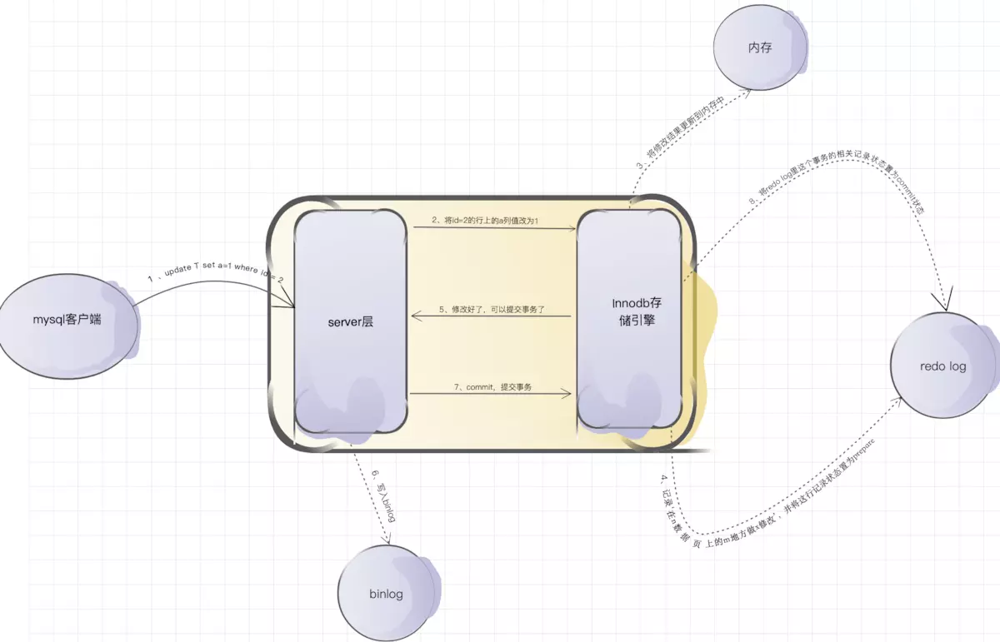
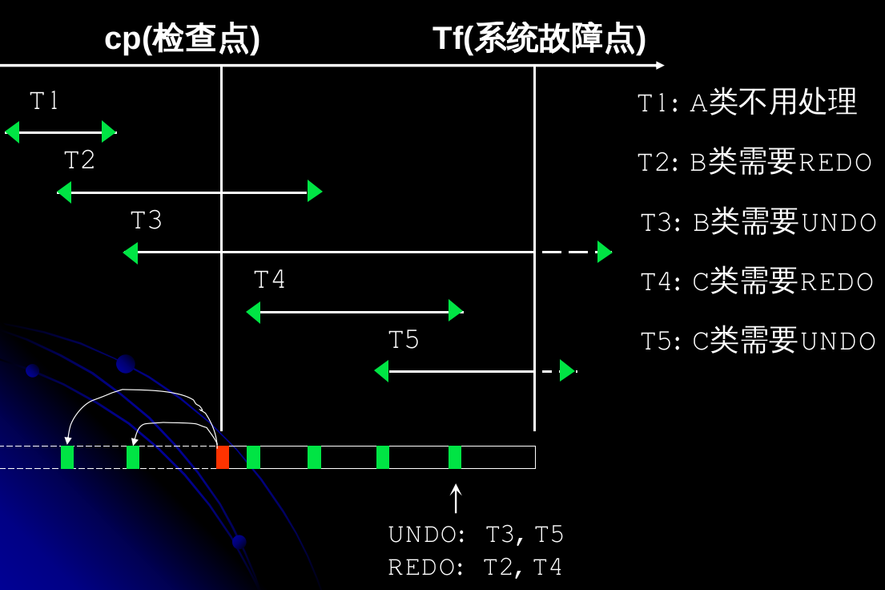

### redo log

当需要修改数据库数据时，为了节省时间，InnoDB 引擎会更新内存并且记录到 redo log 文件中，这个时候修改操作完成。等到比较空闲的时候，InnoDB 会将修改的操作一一写入磁盘。

具体过程：

InnoDB 大小是固定的，当文件被写满后，就会从头开始写。所以，为了知道写入的记录可以覆盖到哪里，在 redo log 中有 checkpoint。如下图：

checkpoint 之前的记录是已经写入磁盘，可以覆盖的记录。

如果在一个事务提交的时候就将所有的修改写入磁盘，会造成性能比较低下

+ 刷新一个完整的数据页太浪费了
  有时候我们仅仅修改了某个页面中的一个字节，但是我们知道在InnoDB中是以页为单位来进行磁盘IO的，也就是说我们在该事务提交时不得不将一个完整的页面从内存中刷新到磁盘，我们又知道一个页面默认是16KB大小，只修改一个字节就要刷新16KB的数据到磁盘上显然是太浪费了。
+ 随机IO刷起来比较慢
  一个事务可能包含很多语句，即使是一条语句也可能修改许多页面，而且该事务修改的这些页面可能并不相邻，这就意味着在将某个事务修改的 BufferPool 中的页面刷新到磁盘时，需要进行很多的随机IO，随机IO比顺序IO要慢，尤其对于传统的机械硬盘来说

REDO日志记录的是物理逻辑，比如`将第0号表空间的100号页面的偏移量为1000处的值更新为2。`这样恢复的时候只要按照日志所记录的步骤重新更新数据页就行了。

与在事务提交时将所有修改过的内存中的页面刷新到磁盘中相比，只将该事务执行过程中产生的redo日志刷新到磁盘的好处如下：

+ redo日志占用的空间非常小
+ redo日志是顺序写入磁盘的，即顺序IO

### binlog

binlog 是 mysql Server 层的日志，是属于 mysql 的。

### redo log 和 binlog 的不同

1. redo log 是 InnoDB 引擎特有的，而 binlog 是 MySQL 的Server 层实现的，所有引擎都能使用。
2. redo log 是物理日志，记录的是 “在哪个数据页进行了什么修改”；而 binlog 是逻辑日志，记录了语句的原始逻辑，比如“给ID=2这一行的c字段加1 ”。
3. redo log 是循环写的，会覆盖之前的修改记录，而 binlog 在一个文件写到指定大小后会切换到下一个文件继续写，不会丢失之前的修改。

### 两阶段提交

保证了 redo log、binlog 内容一致。

以数据修改为例子：

1. 加载数据页到内存（或者数据页已经在内存中）
2. 修改数据
3. 更新数据页
4. 更新操作写入 redo log，并将该记录状态置为prepare
5. 执行器生成这个操作的 binglog 并写入磁盘
6. 提交事务，引擎会将刚刚写入的 redo 改成提交状态。

[相关参数设置](https://www.jianshu.com/p/4bcfffb27ed5)

+ innodb_flush_log_at_trx_commit：设置为1，表示每次事务的redolog都直接持久化到磁盘（注意是这里指的是redolog日志本身落盘），保证mysql重启后数据不丢失。

+ sync_binlog： 设置为1，表示每次事务的binlog都直接持久化到磁盘（注意是这里指的是binlog日志本身落盘），保证mysql重启后binlog记录是完整的。

### 利用日志恢复故障数据库

### 故障种类

#### 事务故障

+ 因某种原因事务无法继续执行而失败

  1. 事务内部执行语句产生的逻辑错误。比如：除零，运算溢出。
  2. 事务外部条件造成的系统错误。比如：死锁。

+ 特征

  发生故障的事务异常结束，系统和其他事务正常运行。

+ 恢复策略

  1. 反向扫描日志文件，查找该事务的全部修改记录。
  2. 撤销每个修改记录，将记录中“修改前的旧值”写入磁盘。
  3. 扫描至该事务的开始记录，事务故障恢复完成

#### 系统故障(Soft Crash, 软故障)

+ 因某种错误，造成DBMS停止运行
  1、硬件错误。例如CPU或内存故障等
  2、软件错误。例如OS或者DBMS本身的异常。
  3、其它，例如突然停电等。

+ 特征

  系统需要重新启动，缓冲中的数据丢失。

+ 恢复策略

  1. 正向扫描日志文件，找到故障发生前已提交（有开始和 Commit 记录）的事务，将其**事务标示**放入重做队列；找到故障前尚未提交的事务，将其**事务标示**放入撤销队列。
  2. UNDO 撤销队列中的所有事务。
  3. REDO 重做队列中的所有事务。

#### 磁盘故障

+ 因某种原因，磁盘上的数据部分或完全丢失。
  一般是相关的人为破坏或者硬件故障，例如：错误的格式化、磁盘坏道、机房失火等。

+ 特征
  磁盘上的数据丢失。

+ 恢复策略

  1. 装入最近一次转储的数据库副本，并使数据库恢复到最近一次转储时的状态。（对于动态转储得到的副本，还需同时装入转储时的日志文件副本，通过REDO+UNDO恢复到一致性状态）

  2. 装入转储后到故障发生时的日志文件副本，REDO那些已提交事务。恢复到故障发生时的数据库状态。

### 检查点

在恢复系统故障中，我们正向扫描了日志文件，然后又反向扫描（undo日志）进行undo，正向扫描（redo日志）进行 redo 。这样可能会造成很多的性能浪费。

1. 日志文件长，完整扫描需要时间长。
2. 对于大部分事务，它们的修改早已经写入磁盘，或者已经取消。redo、undo 实际上不会带来什么改变，但是浪费时间。

为此引入了**检查点**。

#### 周期性建立检查点

1. 将缓冲中的所有日志记录写入磁盘。（先写日志）
2. 将缓冲中的所有修改写入磁盘。（再写数据）
3. 在日志文件中写入一个检查点。
4. 把这个检查点记录在日志文件中的地址写入重新开始文件 (检查点生效)

检查点一旦建立成功，说明在检查点之前提交（commit）的事务已经全部写入磁盘，所以无需再进行 REDO（REDO是为了防止已提交事务修改未写入磁盘的错误）。

根据最后建立的检查点cp，可以把事务分为：

+ A类: cp前已提交的事务 (Start<Commit<cp)+
+ B类: cp时正活动的事务 (Start<cp)+
+ C类: cp后才开始的事务 (cp<Start)Start:  事务开始记录；Commit:  事务提交记录

如前所述，发生故障时，A类事务不用处理，要处理的是BC类事务。B类事务实际上就是检查点的活动事务列表。C类事务特征是事务开始记录在 cp 后。

BC类事务有提交的 (需要REDO) ，也有未提交的 (需要UNDO)。如果BC类事务已提交，那么在日志中有commit记录，并且这个记录一定在cp后面。

#### 引入检查点后系统故障的恢复：

1. 在重新开始文件中找到最后一个检查点的地址，由该地址定位日志文件中的最后一个检查点记录。、
2.  由该检查点记录得到建立检查点时的所有活动事务列表，赋予UNDO-LIST，REDO-LIST暂为空。

3. 从检查点开始正向扫描日志文件，直到日志文件结束：遇到新事务Ti的开始记录，把Ti 暂时放入UNDO-LIST；遇到事务Tj的提交记录，把Tj 从UNDO-LIST移到REDO-LIST。

4. 反向扫描一遍日志，找到UNDO-LIST中事务的修改记录，并撤销之
5. 正向扫描日志，找到REDO-LIST中事务的修改记录，并重做之。

在检查点记录中包括了当时正在活动的事务的开始记录地址，比如上面的图，被记录的活动中的事务有 T2、T3。假设活动中的事务最早开始的是Ts，则在步骤四和步骤五中，扫描的范围是 Ts 到日志结束。

