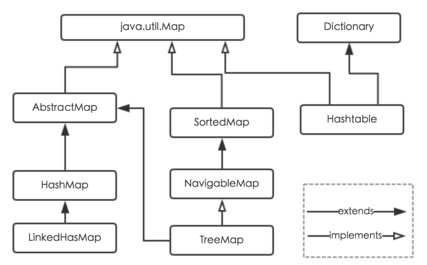
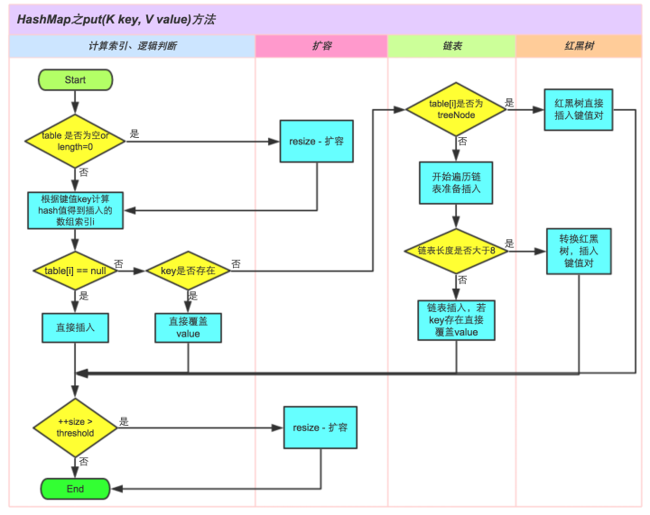

## 简介

HashMap 是一个关联数组，键值对的数据结构。

Java为映射的数据结构定义了一个接口 java.util.Map，它的主要实现类有 HashMap、Hashtable、LinkedHashMap 和 TreeMap。



## 存储结构

底层是 `Node`数组来存储数据。而 Node 数组中存储的可能是链表，也可能是红黑树（Java8 引入）。大体结构如下：


### Node 的结构

```java
static class Node<K,V> implements Map.Entry<K,V> {
        final int hash;    //用来定位数组索引位置
        final K key;
        V value;
        Node<K,V> next;   //链表的下一个node

        Node(int hash, K key, V value, Node<K,V> next) { ... }
        public final K getKey(){ ... }
        public final V getValue() { ... }
        public final String toString() { ... }
        public final int hashCode() { ... }
        public final V setValue(V newValue) { ... }
        public final boolean equals(Object o) { ... }
}
```

`Node`本质是键值对，实现了 Map.Entry 接口。HashMap 中还有 TreeNode，也是从 Node 转化的。

### HashMap 中的字段

```java
//默认初始大小，值为16，要求必须为2的幂
static final int DEFAULT_INITIAL_CAPACITY = 1 << 4; // aka 16
//最大容量，必须不大于2^30
static final int MAXIMUM_CAPACITY = 1 << 30;
//默认加载因子，值为0.75
static final float DEFAULT_LOAD_FACTOR = 0.75f;
//hash冲突默认采用单链表存储，当单链表节点个数大于8时，会转化为红黑树存储
static final int TREEIFY_THRESHOLD = 8;
// hash冲突默认采用单链表存储，当单链表节点个数大于8时，会转化为红黑树存储。
// 当红黑树中节点少于6时，则转化为单链表存储
static final int UNTREEIFY_THRESHOLD = 6;
/**
 * hash冲突默认采用单链表存储，当单链表节点个数大于8时，会转化为红黑树存储。
 * 但是有一个前提：要求数组长度大于64，否则不会进行转化
 */
static final int MIN_TREEIFY_CAPACITY = 64;


// 扩容的阀值
int threshold;
//负载因子
final float loadFactor;
//记录 HashMap 结构性操作的次数
transient int modCount;
// 实际存在的 Node 数量
transient int size;
// Node 数组
transient Node<K,V>[] table;
```

table 的默认长度 length 是16，loadFactor 为0.75，threshold 是 HashMap所能容纳的最多的 Node 的个数，计算公式： threshold = length * loadFactor。在这里可以看出 loadFactor 实际上代表了对 Node 数组的利用率，它的作用是减少哈希碰撞的几率。

**modCount 字段主要用来记录HashMap内部结构发生变化的次数**，比如 put 新键或者删除元素，但是，如果 put 的 key 已经存在，只是对 value 进行更新，则不属于结构变化。

> 我们知道java.util.HashMap不是线程安全的，因此在使用**迭代器Iterator**的过程中，如果有其他线程修改了map，将抛出ConcurrentModificationException，这就是所谓fail-fast策略。**这一策略在源码中的实现就是通过modCount**，它记录修改次数，在迭代器初始化过程中会将这个值赋给迭代器的expectedModCount，在迭代过程中，判断modCount跟expectedModCount是否相等，如果不相等就表示已经有其他线程修改了Map。所以遍历那些非线程安全的数据结构时，尽量使用迭代器Iterator。

### 构造函数

#### 无参构造

```java
public HashMap() {
    this.loadFactor = DEFAULT_LOAD_FACTOR; // all other fields defaulted
}
```

这里没有初始化 Node 数组，说明 Node 数组是 lazy load。

#### 带参构造函数，指定初始容量：

```java
public HashMap(int initialCapacity) {
    this(initialCapacity, DEFAULT_LOAD_FACTOR);
}
```

#### 带参构造函数，指定初始容量和加载因子：

```java
public HashMap(int initialCapacity, float loadFactor) {
    // 对自定义初始化容量判断
    if (initialCapacity < 0)  //小于0
        throw new IllegalArgumentException("Illegal initial capacity: " +
                                           initialCapacity);
    if (initialCapacity > MAXIMUM_CAPACITY)  // 大于最大容量
        initialCapacity = MAXIMUM_CAPACITY;
    // 对loadFactor判断
    if (loadFactor <= 0 || Float.isNaN(loadFactor))
        throw new IllegalArgumentException("Illegal load factor: " +
                                           loadFactor);
    this.loadFactor = loadFactor;
	// 如果传入的参数不是 2^n 的整数，tableSizeFor会找到比initialCapacity大
    // 的最小二次幂的数再赋值给threshold，比如 1 -> 2，14->16
    // 注意，这里为什么一定要是二次幂的数
    this.threshold = tableSizeFor(initialCapacity);
}
```

### 如何确定索引位置

在 HashMap 中索引的计算公式为：`index = (n-1) & hash`。这里是 hash 是经过处理的。主要实现：

```java
//方法一：
static final int hash(Object key) {   //jdk1.8 & jdk1.7
     int h;
     // h = key.hashCode() 为第一步 取hashCode值
     // h ^ (h >>> 16)  为第二步 高位参与运算
     return (key == null) ? 0 : (h = key.hashCode()) ^ (h >>> 16);
}
//方法二：
static int indexFor(int h, int length) {  //jdk1.7的源码，jdk1.8没有这个方法，但是实现原理一样的
     return h & (length-1);  //第三步 取模运算
}
```

**方法一将 key 高位的 bit 与低位的 bit 进行异或操作，保证了 table 的 length 比较小的时候也能让高位的bit 参与 hash 计算，目的还是为了减小 hash 冲突。**

计算过程如下：


不止构造函数会保证 table 数组初始化容量为二次幂的数，在以后的扩容操作也是，newCapacity = oldCapacity << 1（新容量为旧容量的两倍）。那为什么这样的要求？

**一、使索引公式：`i = (length-1) & hash` 等价于  `i = hash & length`（位运算比取余运算要高效的多）**

对于 2^n^ ，它的二进制为 1...0（后面为 n 个 0），而 2^n^ - 1 二进制为 1...(一共有 n 个1)，所以 hash & 2^n^ -1 相当于取 hash 后面的 n 位，从二进制 hash / 2^n^ 相当于 hash >> n，而被移掉的 n 位，则是 hash % 2^n^ 。

比如 ：8 = 2^3^ = 1000， hash = 1010001011110，8-1 = 7 = 0111。

hash & 7 = 110：计算出的索引。

**二、使扩容后 rehash（重新计算索引位置） 更容易。**

### put 方法

流程：



```java
public V put(K key, V value) {
    //调用 putVal
    return putVal(hash(key), key, value, false, true);
}

final V putVal(int hash, K key, V value, boolean onlyIfAbsent,
               boolean evict) {
    Node<K,V>[] tab; Node<K,V> p; int n, i;
    // table为空，说明第一次插入元素，进行扩容，tab->table,n->length
    if ((tab = table) == null || (n = tab.length) == 0)
        n = (tab = resize()).length;
    // 如果计算出来的索引位置没有元素，直接新建节点插入, i -> (n-1)&hash, p-> table[i]
    if ((p = tab[i = (n - 1) & hash]) == null)
        tab[i] = newNode(hash, key, value, null);
    // 来到这里则说明索引位置 i = (n - 1) & hash 存在元素，即出现hash冲突
    else {
        Node<K,V> e; K k;
        //判断插入的元素是否与p相同，即是否与 table[(n-1)&hash]相同。
        if (p.hash == hash &&
            ((k = p.key) == key || (key != null && key.equals(k))))
            e = p; //条件成立，e -> p
        // 如果是树节点
        else if (p instanceof TreeNode)
            e = ((TreeNode<K,V>)p).putTreeVal(this, tab, hash, key, value);
        //来到这里，说明是链表，遍历插入
        else {
            for (int binCount = 0; ; ++binCount) {
                //遍历完节点，直接在链表最后面插入
                if ((e = p.next) == null) {
                    p.next = newNode(hash, key, value, null);
                    //插入后判断是否要变成红黑树，注意这个操作不一定会让链表 -> 红黑树
                    if (binCount >= TREEIFY_THRESHOLD - 1) // -1 for 1st
                        treeifyBin(tab, hash);
                    break;
                }
                //遍历中找到节点
                if (e.hash == hash &&
                    ((k = e.key) == key || (key != null && key.equals(k))))
                    break;
                p = e;
            }
        }
        // e不为null，说明添加的键已经存在
        if (e != null) { // existing mapping for key
            // 保存旧值
            V oldValue = e.value;
            if (!onlyIfAbsent || oldValue == null)
                //更新新值
                e.value = value;
            afterNodeAccess(e);
            return oldValue;
        }
    }
    //修改结构性操作次数，注意上面，更新操作不会修改 modCount
    ++modCount;
    //判断是否到达阀值，需要扩容
    if (++size > threshold)
        resize();
    afterNodeInsertion(evict);
    return null;
}
```

### 扩容操作

前面说了，table数组的初始化容量和以后的扩容的容量一定是二次幂的数有利于索引位置的计算，主要的原因是：扩容后 table 数组长度为原数组的两倍，于是可以将 table数组分为两部分，高位及低位，通过 `hash & oldCap`判断该节点放在高位还是低位的数组。

+ 若`hash & oldCap == 0`，则扩容后位置 = 原位置
+ 若`hash & oldCap == 1`，则扩容后位置 = 原位置 +  oldCap

比如，oldCap = 16 = 10000，hash & oldCap 是否为 0 取决于 hash 第五位是 0 还是 1。 其效果等价于 hash & (newCap-1)。


```java
final Node<K,V>[] resize() {
    // oldTab -> table
    Node<K,V>[] oldTab = table;
    // oldCap记录旧的table长度
    int oldCap = (oldTab == null) ? 0 : oldTab.length;
    // oldThr记录旧的扩容阀值
    int oldThr = threshold;
    //新数组容量和阀值
    int newCap, newThr = 0;
    //旧数组元素个数大于零，说明已经存在元素
    if (oldCap > 0) {
        //如果旧数组容量超过限定的最大值
        if (oldCap >= MAXIMUM_CAPACITY) {
            // 设置扩容阀值为最大整数值，再乘2就发生溢出
            // 限定hashmap容量最大值就是为了处理扩容可能出现溢出 
            threshold = Integer.MAX_VALUE;
            return oldTab;
        }
        // 旧数组容量不超过限定值且大于等于初始化容量，新数组容量newCap为oldCap两倍
        else if ((newCap = oldCap << 1) < MAXIMUM_CAPACITY &&
                 oldCap >= DEFAULT_INITIAL_CAPACITY)
            newThr = oldThr << 1; // double threshold
    }
    //旧数组没有元素但是 oldThr > 0，说明指定了初始化容量
    //实际上调用了public HashMap(int initialCapacity, float loadFactor)构造函数
    //这个构造函数将计算出来的初始化容量赋值给threshold。
    /*我是上面*/
    else if (oldThr > 0) // initial capacity was placed in threshold
        newCap = oldThr;
    //来到这里说明调用了无参构造函数，全部赋予默认值
    else {               // zero initial threshold signifies using defaults
        newCap = DEFAULT_INITIAL_CAPACITY;
        newThr = (int)(DEFAULT_LOAD_FACTOR * DEFAULT_INITIAL_CAPACITY);
    }
    //对应上面
    //计算新的扩容阀值
    if (newThr == 0) {
        float ft = (float)newCap * loadFactor;
        newThr = (newCap < MAXIMUM_CAPACITY && ft < (float)MAXIMUM_CAPACITY ?
                  (int)ft : Integer.MAX_VALUE);
    }
    // 设置新的扩容阀值
    threshold = newThr;
    @SuppressWarnings({"rawtypes","unchecked"})
    // 新数组
    Node<K,V>[] newTab = (Node<K,V>[])new Node[newCap];
    // table指向新数组
    table = newTab;
    //旧数组不为空，存在元素，要重新计算元素位置
    if (oldTab != null) {
        // 遍历table数组的每一个节点
        // 其实就是将每个节点存储的链表或者树的每一个节点重新计算位置
        for (int j = 0; j < oldCap; ++j) {
            Node<K,V> e;
            // 将e指向table[j]
            // 如果节点j不为空
            if ((e = oldTab[j]) != null) {
                //让堆中的节点被回收
                oldTab[j] = null;
                //没有下一个节点，直接计算新位置
                if (e.next == null)
                    newTab[e.hash & (newCap - 1)] = e;
                // 为树节点调用 split
                else if (e instanceof TreeNode)
                    ((TreeNode<K,V>)e).split(this, newTab, j, oldCap);
                // 到这里说明还是链表。
                else { // preserve order
                    // loHead：低位头结点、loTail：低位尾节点
                    Node<K,V> loHead = null, loTail = null;
                    // hiHead：高位头结点、hiTail：高位尾节点
                    Node<K,V> hiHead = null, hiTail = null;
                    Node<K,V> next;
                    // 遍历链表
                    do {
                        next = e.next;
                        // e.hash & oldCap) == 0 说明在原位置，所以将节点存在低位链表
                        if ((e.hash & oldCap) == 0) {
                            if (loTail == null)
                                loHead = e;
                            else
                                loTail.next = e;
                            loTail = e;
                        }
                        // e.hash & oldCap) == 1 说明在原位置+oldCap
                        // 所以将节点存在高位链表
                        else {
                            if (hiTail == null)
                                hiHead = e;
                            else
                                hiTail.next = e;
                            hiTail = e;
                        }
                    } while ((e = next) != null);
                    if (loTail != null) {
                        // 断开连接，防止出现环
                        loTail.next = null;
                        // 低位链表存放在原位置
                        newTab[j] = loHead;
                    }
                    if (hiTail != null) {
                        hiTail.next = null;
                        // 高位链表存放在原位置+oldCap
                        newTab[j + oldCap] = hiHead;
                    }
                }
            }
        }
    }
    return newTab;
}
```

