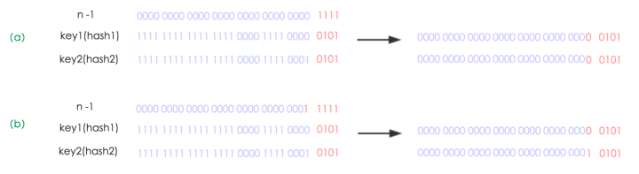

## HashMap

### 简介

HashMap 是一个关联数组，键值对的数据结构。

Java为映射的数据结构定义了一个接口 java.util.Map，它的主要实现类有 HashMap、Hashtable、LinkedHashMap 和 TreeMap。


### 存储结构

底层是 `Node`数组来存储数据。而 Node 数组中存储的可能是链表，也可能是红黑树（Java8 引入）。大体结构如下：


#### Node 的结构

```java
static class Node<K,V> implements Map.Entry<K,V> {
        final int hash;    //用来定位数组索引位置
        final K key;
        V value;
        Node<K,V> next;   //链表的下一个node

        Node(int hash, K key, V value, Node<K,V> next) { ... }
        public final K getKey(){ ... }
        public final V getValue() { ... }
        public final String toString() { ... }
        public final int hashCode() { ... }
        public final V setValue(V newValue) { ... }
        public final boolean equals(Object o) { ... }
}
```

`Node`本质是键值对，实现了 Map.Entry 接口。HashMap 中还有 TreeNode，也是从 Node 转化的。

#### HashMap 中的字段

```java
//默认初始大小，值为16，要求必须为2的幂
static final int DEFAULT_INITIAL_CAPACITY = 1 << 4; // aka 16
//最大容量，必须不大于2^30
static final int MAXIMUM_CAPACITY = 1 << 30;
//默认加载因子，值为0.75
static final float DEFAULT_LOAD_FACTOR = 0.75f;
//hash冲突默认采用单链表存储，当单链表节点个数大于8时，会转化为红黑树存储
static final int TREEIFY_THRESHOLD = 8;
// hash冲突默认采用单链表存储，当单链表节点个数大于8时，会转化为红黑树存储。
// 当红黑树中节点少于6时，则转化为单链表存储
static final int UNTREEIFY_THRESHOLD = 6;
/**
 * hash冲突默认采用单链表存储，当单链表节点个数大于8时，会转化为红黑树存储。
 * 但是有一个前提：要求数组长度大于64，否则不会进行转化
 */
static final int MIN_TREEIFY_CAPACITY = 64;


// 扩容的阀值
int threshold;
//负载因子
final float loadFactor;
//记录 HashMap 结构性操作的次数
transient int modCount;
// 实际存在的 Node 数量
transient int size;
// Node 数组
transient Node<K,V>[] table;
```

table 的默认长度 length 是16，loadFactor 为0.75，threshold 是 HashMap所能容纳的最多的 Node 的个数，计算公式： threshold = length * loadFactor。在这里可以看出 loadFactor 实际上代表了对 Node 数组的利用率，它的作用是减少哈希碰撞的几率。

**modCount 字段主要用来记录HashMap内部结构发生变化的次数**，比如 put 新键或者删除元素，但是，如果 put 的 key 已经存在，只是对 value 进行更新，则不属于结构变化。

> 我们知道java.util.HashMap不是线程安全的，因此在使用**迭代器Iterator**的过程中，如果有其他线程修改了map，将抛出ConcurrentModificationException，这就是所谓fail-fast策略。**这一策略在源码中的实现就是通过modCount**，它记录修改次数，在迭代器初始化过程中会将这个值赋给迭代器的expectedModCount，在迭代过程中，判断modCount跟expectedModCount是否相等，如果不相等就表示已经有其他线程修改了Map。所以遍历那些非线程安全的数据结构时，尽量使用迭代器Iterator。

#### 构造函数

无参构造

```java
public HashMap() {
    this.loadFactor = DEFAULT_LOAD_FACTOR; // all other fields defaulted
}
```

这里没有初始化 Node 数组，说明 Node 数组是 lazy load。

带参构造函数，指定初始容量：

```java
public HashMap(int initialCapacity) {
    this(initialCapacity, DEFAULT_LOAD_FACTOR);
}
```

带参构造函数，指定初始容量和加载因子：

```java
public HashMap(int initialCapacity, float loadFactor) {
    // 对自定义初始化容量判断
    if (initialCapacity < 0)  //小于0
        throw new IllegalArgumentException("Illegal initial capacity: " +
                                           initialCapacity);
    if (initialCapacity > MAXIMUM_CAPACITY)  // 大于最大容量
        initialCapacity = MAXIMUM_CAPACITY;
    // 对loadFactor判断
    if (loadFactor <= 0 || Float.isNaN(loadFactor))
        throw new IllegalArgumentException("Illegal load factor: " +
                                           loadFactor);
    this.loadFactor = loadFactor;
	// 如果传入的参数不是 2^n 的整数，tableSizeFor会找到比initialCapacity大
    // 的最小二次幂的数再赋值给threshold，比如 1 -> 2，14->16
    // 注意，这里为什么一定要是二次幂的数
    this.threshold = tableSizeFor(initialCapacity);
}
```

#### 如何确定索引位置

在 HashMap 中索引的计算公式为：`index = (n-1) & hash`。这里是 hash 是经过处理的。主要实现：

```java
//方法一：
static final int hash(Object key) {   //jdk1.8 & jdk1.7
     int h;
     // h = key.hashCode() 为第一步 取hashCode值
     // h ^ (h >>> 16)  为第二步 高位参与运算
     return (key == null) ? 0 : (h = key.hashCode()) ^ (h >>> 16);
}
//方法二：
static int indexFor(int h, int length) {  //jdk1.7的源码，jdk1.8没有这个方法，但是实现原理一样的
     return h & (length-1);  //第三步 取模运算
}
```

**方法一将 key 高位的 bit 与低位的 bit 进行异或操作，保证了 table 的 length 比较小的时候也能让高位的bit 参与 hash 计算，目的还是为了减小 hash 冲突。**

计算过程如下：


不止构造函数会保证 table 数组初始化容量为二次幂的数，在以后的扩容操作也是，newCapacity = oldCapacity << 1（新容量为旧容量的两倍）。那为什么这样的要求？

**一、使索引公式：`i = (length-1) & hash` 等价于  `i = hash & length`（位运算比取余运算要高效的多）**

对于 2^n^ ，它的二进制为 1...0（后面为 n 个 0），而 2^n^ - 1 二进制为 1...(一共有 n 个1)，所以 hash & 2^n^ -1 相当于取 hash 后面的 n 位，从二进制 hash / 2^n^ 相当于 hash >> n，而被移掉的 n 位，则是 hash % 2^n^ 。

比如 ：8 = 2^3^ = 1000， hash = 1010001011110，8-1 = 7 = 0111。

hash & 7 = 110：计算出的索引。

**二、使扩容后 rehash（重新计算索引位置） 更容易。**

#### put 方法

流程：


```java
public V put(K key, V value) {
    //调用 putVal
    return putVal(hash(key), key, value, false, true);
}

final V putVal(int hash, K key, V value, boolean onlyIfAbsent,
               boolean evict) {
    Node<K,V>[] tab; Node<K,V> p; int n, i;
    // table为空，说明第一次插入元素，进行扩容，tab->table,n->length
    if ((tab = table) == null || (n = tab.length) == 0)
        n = (tab = resize()).length;
    // 如果计算出来的索引位置没有元素，直接新建节点插入, i -> (n-1)&hash, p-> table[i]
    if ((p = tab[i = (n - 1) & hash]) == null)
        tab[i] = newNode(hash, key, value, null);
    // 来到这里则说明索引位置 i = (n - 1) & hash 存在元素，即出现hash冲突
    else {
        Node<K,V> e; K k;
        //判断插入的元素是否与p相同，即是否与 table[(n-1)&hash]相同。
        if (p.hash == hash &&
            ((k = p.key) == key || (key != null && key.equals(k))))
            e = p; //条件成立，e -> p
        // 如果是树节点
        else if (p instanceof TreeNode)
            e = ((TreeNode<K,V>)p).putTreeVal(this, tab, hash, key, value);
        //来到这里，说明是链表，遍历插入
        else {
            for (int binCount = 0; ; ++binCount) {
                //遍历完节点，直接在链表最后面插入
                if ((e = p.next) == null) {
                    p.next = newNode(hash, key, value, null);
                    //插入后判断是否要变成红黑树，注意这个操作不一定会让链表 -> 红黑树
                    if (binCount >= TREEIFY_THRESHOLD - 1) // -1 for 1st
                        treeifyBin(tab, hash);
                    break;
                }
                //遍历中找到节点
                if (e.hash == hash &&
                    ((k = e.key) == key || (key != null && key.equals(k))))
                    break;
                p = e;
            }
        }
        // e不为null，说明添加的键已经存在
        if (e != null) { // existing mapping for key
            // 保存旧值
            V oldValue = e.value;
            if (!onlyIfAbsent || oldValue == null)
                //更新新值
                e.value = value;
            afterNodeAccess(e);
            return oldValue;
        }
    }
    //修改结构性操作次数，注意上面，更新操作不会修改 modCount
    ++modCount;
    //判断是否到达阀值，需要扩容
    if (++size > threshold)
        resize();
    afterNodeInsertion(evict);
    return null;
}
```

#### 扩容操作

前面说了，table数组的初始化容量和以后的扩容的容量一定是二次幂的数有利于索引位置的计算，主要的原因是：扩容后 table 数组长度为原数组的两倍，于是可以将 table数组分为两部分，高位及低位，通过 `hash & oldCap`判断该节点放在高位还是低位的数组。

+ 若`hash & oldCap == 0`，则扩容后位置 = 原位置
+ 若`hash & oldCap == 1`，则扩容后位置 = 原位置 +  oldCap

比如，oldCap = 16 = 10000，hash & oldCap 是否为 0 取决于 hash 第五位是 0 还是 1。 其效果等价于 hash & (newCap-1)。




```java
final Node<K,V>[] resize() {
    // oldTab -> table
    Node<K,V>[] oldTab = table;
    // oldCap记录旧的table长度
    int oldCap = (oldTab == null) ? 0 : oldTab.length;
    // oldThr记录旧的扩容阀值
    int oldThr = threshold;
    //新数组容量和阀值
    int newCap, newThr = 0;
    //旧数组元素个数大于零，说明已经存在元素
    if (oldCap > 0) {
        //如果旧数组容量超过限定的最大值
        if (oldCap >= MAXIMUM_CAPACITY) {
            // 设置扩容阀值为最大整数值，再乘2就发生溢出
            // 限定hashmap容量最大值就是为了处理扩容可能出现溢出 
            threshold = Integer.MAX_VALUE;
            return oldTab;
        }
        // 旧数组容量不超过限定值且大于等于初始化容量，新数组容量newCap为oldCap两倍
        else if ((newCap = oldCap << 1) < MAXIMUM_CAPACITY &&
                 oldCap >= DEFAULT_INITIAL_CAPACITY)
            newThr = oldThr << 1; // double threshold
    }
    //旧数组没有元素但是 oldThr > 0，说明指定了初始化容量
    //实际上调用了public HashMap(int initialCapacity, float loadFactor)构造函数
    //这个构造函数将计算出来的初始化容量赋值给threshold。
    /*我是上面*/
    else if (oldThr > 0) // initial capacity was placed in threshold
        newCap = oldThr;
    //来到这里说明调用了无参构造函数，全部赋予默认值
    else {               // zero initial threshold signifies using defaults
        newCap = DEFAULT_INITIAL_CAPACITY;
        newThr = (int)(DEFAULT_LOAD_FACTOR * DEFAULT_INITIAL_CAPACITY);
    }
    //对应上面
    //计算新的扩容阀值
    if (newThr == 0) {
        float ft = (float)newCap * loadFactor;
        newThr = (newCap < MAXIMUM_CAPACITY && ft < (float)MAXIMUM_CAPACITY ?
                  (int)ft : Integer.MAX_VALUE);
    }
    // 设置新的扩容阀值
    threshold = newThr;
    @SuppressWarnings({"rawtypes","unchecked"})
    // 新数组
    Node<K,V>[] newTab = (Node<K,V>[])new Node[newCap];
    // table指向新数组
    table = newTab;
    //旧数组不为空，存在元素，要重新计算元素位置
    if (oldTab != null) {
        // 遍历table数组的每一个节点
        // 其实就是将每个节点存储的链表或者树的每一个节点重新计算位置
        for (int j = 0; j < oldCap; ++j) {
            Node<K,V> e;
            // 将e指向table[j]
            // 如果节点j不为空
            if ((e = oldTab[j]) != null) {
                //让堆中的节点被回收
                oldTab[j] = null;
                //没有下一个节点，直接计算新位置
                if (e.next == null)
                    newTab[e.hash & (newCap - 1)] = e;
                // 为树节点调用 split
                else if (e instanceof TreeNode)
                    ((TreeNode<K,V>)e).split(this, newTab, j, oldCap);
                // 到这里说明还是链表。
                else { // preserve order
                    // loHead：低位头结点、loTail：低位尾节点
                    Node<K,V> loHead = null, loTail = null;
                    // hiHead：高位头结点、hiTail：高位尾节点
                    Node<K,V> hiHead = null, hiTail = null;
                    Node<K,V> next;
                    // 遍历链表
                    do {
                        next = e.next;
                        // e.hash & oldCap) == 0 说明在原位置，所以将节点存在低位链表
                        if ((e.hash & oldCap) == 0) {
                            if (loTail == null)
                                loHead = e;
                            else
                                loTail.next = e;
                            loTail = e;
                        }
                        // e.hash & oldCap) == 1 说明在原位置+oldCap
                        // 所以将节点存在高位链表
                        else {
                            if (hiTail == null)
                                hiHead = e;
                            else
                                hiTail.next = e;
                            hiTail = e;
                        }
                    } while ((e = next) != null);
                    if (loTail != null) {
                        // 断开连接，防止出现环
                        loTail.next = null;
                        // 低位链表存放在原位置
                        newTab[j] = loHead;
                    }
                    if (hiTail != null) {
                        hiTail.next = null;
                        // 高位链表存放在原位置+oldCap
                        newTab[j + oldCap] = hiHead;
                    }
                }
            }
        }
    }
    return newTab;
}
```


## ConcurrentHashMap

**下面代码基于java9**

从 Java8 开始，JDK 的 ConcurrentHashMap 放弃使用分段锁而开始使用 synchronized + CAS 操作来保证并发操作。


#### 主要属性

```java
// 存储数组的 Node 数组
transient volatile Node<K,V>[] table;

// 接下来会被使用的数组，只有扩容的时候才不会 null
private transient volatile Node<K,V>[] nextTable;

// 控制table初始化和扩容
// 如果为负数表示table正在初始化或者扩容 : -1 表示初始化， -n 表示有 n-1 个线程在进行扩容
// 如果为正数 ： 如果table为 null，表示table的初始长度(0代表默认长度16)，
//  		   table不为null表示扩容阀值
private transient volatile int sizeCtl;

// ForwardingNode节点的hash值，表示扩容后正在转换节点
static final int MOVED     = -1; // hash for forwarding nodes
// 红黑树根节点的hash值
static final int TREEBIN   = -2; // hash for roots of trees
static final int RESERVED  = -3; // hash for transient reservations
static final int HASH_BITS = 0x7fffffff; // usable bits of normal node hash
```

#### 相关方法及类

Node 节点类，链表节点，存放数据。

```java
static class Node<K,V> implements Map.Entry<K,V> {
    final int hash;
    final K key;
    volatile V val;
    volatile Node<K,V> next;
    //...省略
}
```

TreeNodes 

```java
/**
 * Nodes for use in TreeBins.
 */
// 继承Node，通过注释可以得知这个类不是树节点，需要二次封装
static final class TreeNode<K,V> extends Node<K,V> {
    TreeNode<K,V> parent;  // red-black tree links
    TreeNode<K,V> left;
    TreeNode<K,V> right;
    TreeNode<K,V> prev;    // needed to unlink next upon deletion
    boolean red;
	// ... 省略
}


 static final class TreeBin<K,V> extends Node<K,V> {
     TreeNode<K,V> root;
     volatile TreeNode<K,V> first;
     volatile Thread waiter;
     volatile int lockState;
     // values for lockState
     static final int WRITER = 1; // set while holding write lock
     static final int WAITER = 2; // set when waiting for write lock
     static final int READER = 4; // increment value for setting read lock
	// ...省略
 }
```


ForwardingNode节点类，只有在扩容的时候才会出现，hash值固定为-1，并且不存储数据。如果旧数组的一个 hash 桶中全部的节点都迁移出去了，则会在旧数组这个 hash 桶放置一个 ForwardingNode。**读操作或者迭代读碰到 ForwardingNode 时，将读操作转发到扩容后的新数组上去执行，写操作碰见 ForwardingNode 时，则会尝试帮助扩容。**

```java
 static final class ForwardingNode<K,V> extends Node<K,V> {
     // 指向新数组的引用
     final Node<K,V>[] nextTable;
     ForwardingNode(Node<K,V>[] tab) {
         super(MOVED, null, null, null);
         this.nextTable = tab;
     }
    .....
 }
```

**ReservationNode：保留节点**

或者叫空节点，computeIfAbsent和compute这两个函数式api中才会使用。它的hash值固定为-3，就是个占位符，不会保存实际的数据，正常情况是不会出现的，在jdk1.8新的函数式有关的两个方法computeIfAbsent和compute中才会出现。
为什么需要这个节点，因为正常的写操作，都会想对hash桶的第一个节点进行加锁，但是null是不能加锁，所以就要new一个占位符出来，放在这个空hash桶中成为第一个节点，把占位符当锁的对象，这样就能对整个hash桶加锁了。put/remove不使用ReservationNode是因为它们都特殊处理了下，并且这种特殊情况实际上还更简单，put直接使用cas操作，remove直接不操作，都不用加锁。但是computeIfAbsent和compute这个两个方法在碰见这种特殊情况时稍微复杂些，代码多一些，不加锁不好处理，所以需要ReservationNode来帮助完成对hash桶的加锁操作。

```java
static final class ReservationNode<K,V> extends Node<K,V> {
    ReservationNode() {
        super(RESERVED, null, null, null);
    }
 
    // 空节点代表这个hash桶当前为null，所以肯定找不到“相等”的节点
    Node<K,V> find(int h, Object k) {
        return null;
    }
}
```


#### 操作表格的CAS函数

```java
// 获取tab[i]
static final <K,V> Node<K,V> tabAt(Node<K,V>[] tab, int i) {
    return (Node<K,V>)U.getObjectAcquire(tab, ((long)i << ASHIFT) + ABASE);
}

// 利用cas操作设置tab[i]的值
static final <K,V> boolean casTabAt(Node<K,V>[] tab, int i,
                                        Node<K,V> c, Node<K,V> v) {
    return U.compareAndSetObject(tab, ((long)i << ASHIFT) + ABASE, c, v);
}

// 设置tab[i]的值，这里跟上面的区别是这里是直接设置，不需要比较旧值
static final <K,V> void setTabAt(Node<K,V>[] tab, int i, Node<K,V> v) {
    U.putObjectRelease(tab, ((long)i << ASHIFT) + ABASE, v);
}
```


#### 构造函数

以比较重要一个为例

```java
// concurrencyLevel : 预计同时操作数据的线程,这个参数是为了兼容之前的版本，并不是实际的并发级别
// loadFactor也不是实际的加载因子
// 这两个参数仅仅对控制初始容量有作用
public ConcurrentHashMap(int initialCapacity,
                         float loadFactor, int concurrencyLevel) {
    if (!(loadFactor > 0.0f) || initialCapacity < 0 || concurrencyLevel <= 0)
        throw new IllegalArgumentException();
    if (initialCapacity < concurrencyLevel)   // Use at least as many bins
        initialCapacity = concurrencyLevel;   // as estimated threads
    // size = 初始化容量+1 除以 加载因子
    long size = (long)(1.0 + (long)initialCapacity / loadFactor);
    // 保证初始化容量为2的幂次方
    int cap = (size >= (long)MAXIMUM_CAPACITY) ?
        MAXIMUM_CAPACITY : tableSizeFor((int)size);
    // 赋值给sizeCtl
    this.sizeCtl = cap;
}

// 返回大于c的最小二次幂的数
private static final int tableSizeFor(int c) {
    int n = -1 >>> Integer.numberOfLeadingZeros(c - 1);
    return (n < 0) ? 1 : (n >= MAXIMUM_CAPACITY) ? MAXIMUM_CAPACITY : n + 1;
}
```

#### 重hash

```java
static final int spread(int h) {
    return (h ^ (h >>> 16)) & HASH_BITS;
}
```

将高16位和低16为进行异或操作，得到的值再跟 0x7fffffff 进行与操作，目的是为了减少 hash 冲突。

这里为什么还要与 0x7fffffff ？

保证最高位为0，即得到的 hash 为正数，负数的hash有特殊的含义。

#### 插入元素

put 流程：


```Java

public V put(K key, V value) {
    return putVal(key, value, false);
}

/** Implementation for put and putIfAbsent */
final V putVal(K key, V value, boolean onlyIfAbsent) {
    if (key == null || value == null) throw new NullPointerException();
    // 计算hash值
    int hash = spread(key.hashCode());
    // 记录链表长度
    int binCount = 0;
    // 开始插入元素，这里一直循环
    for (Node<K,V>[] tab = table;;) {
        Node<K,V> f; int n, i, fh; K fk; V fv;
        // 如果数组为空，进行数组的初始化
        if (tab == null || (n = tab.length) == 0)
            tab = initTable();
        // 找到元素应该存放的位置i，如果table[i]为null，直接cas插入
        else if ((f = tabAt(tab, i = (n - 1) & hash)) == null) {
            // 这里无锁直接插入
            // 如果插入失败说明存在竞争，进入下一个循环
            if (casTabAt(tab, i, null, new Node<K,V>(hash, key, value)))
				// 首节点插入成功，退出循环
                break;                   // no lock when adding to empty bin
        }
        // 如果当前节点正在迁移则帮助迁移
        else if ((fh = f.hash) == MOVED)
            tab = helpTransfer(tab, f);
        // 如果key存放的位置有值了且设置了不更新值则直接返回
        else if (onlyIfAbsent // check first node without acquiring lock
                 && fh == hash
                 && ((fk = f.key) == key || (fk != null && key.equals(fk)))
                 && (fv = f.val) != null)
            return fv;
        // 上面的分支都没有进去，说明了i这个位置已经有元素了(hash冲突)，且onlyIfAbsent为false
        // 那接下来应该新建节点或者更新值(不一定)
        // 注意此时的 f 为table[i]的头节点
        else {
            V oldVal = null;
            // 获取头结点的监视器锁
            synchronized (f) {
                // 如果头结点发生了变化，退出同步代码块
                if (tabAt(tab, i) == f) {
                    // 头结点hash大于0，说明为链表
                    if (fh >= 0) {
                        // 记录链表长度
                        binCount = 1;
                        // 遍历链表
                        for (Node<K,V> e = f;; ++binCount) {
                            K ek;
                            // 找到相同的key，判断是否需要覆盖，退出循环
                            if (e.hash == hash &&
                                ((ek = e.key) == key ||
                                 (ek != null && key.equals(ek)))) {
                                oldVal = e.val;
                                if (!onlyIfAbsent)
                                    e.val = value;
                                break;
                            }
                            Node<K,V> pred = e;
                            // 如果到链表末端，直接将节点加在链表末端
                            if ((e = e.next) == null) {
                                pred.next = new Node<K,V>(hash, key, value);
                                break;
                            }
                        }
                    }
                    // 如果是红黑树，采用红黑树的方法插入
                    else if (f instanceof TreeBin) {
                        Node<K,V> p;
                        // 保证大于零，这样在调用addCount会检查是否需要扩容
                        binCount = 2;
                        if ((p = ((TreeBin<K,V>)f).putTreeVal(hash, key,
                                                       value)) != null) {
                            oldVal = p.val;
                            if (!onlyIfAbsent)
                                p.val = value;
                        }
                    }
                    // 如果为保留节点
                    else if (f instanceof ReservationNode)
                        throw new IllegalStateException("Recursive update");
                }
            }
            if (binCount != 0) {
                // 是否需要树化，这里也有可能进行扩容
                if (binCount >= TREEIFY_THRESHOLD)
                    treeifyBin(tab, i);
                if (oldVal != null)
                    return oldVal;
                break;
            }
        }
    }
    // 这个函数会判断是否需要扩容
    addCount(1L, binCount);
    return null;
}
```

#### initTable

在 putVal 中，如果 table 为空，会调用 initTable初始化 table

```java
private final Node<K,V>[] initTable() {
    Node<K,V>[] tab; int sc;
    // Thread.yeild() 和 CAS 都不是100%和预期一致的方法，所以用循环
    while ((tab = table) == null || tab.length == 0) {
        // 小于0说明有线程正在扩容，所以让出线程执行权
        if ((sc = sizeCtl) < 0)
            Thread.yield(); // lost initialization race; just spin
        // 将sizeCtl更新为-1，说明有线程正在初始化
        else if (U.compareAndSetInt(this, SIZECTL, sc, -1)) {
            try {
                if ((tab = table) == null || tab.length == 0) {
                    int n = (sc > 0) ? sc : DEFAULT_CAPACITY;
                    @SuppressWarnings("unchecked")
                    Node<K,V>[] nt = (Node<K,V>[])new Node<?,?>[n];
                    
                    table = tab = nt;
                    // sc = n - n/4，也就是说扩容的阀值已经在这里固定了，为0.75
                    sc = n - (n >>> 2);
                }
            } finally {
                // 设置扩容阀值
                sizeCtl = sc;
            }
            break;
        }
    }
    return tab;
}
```

#### 链表红黑树互转

```java

private final void treeifyBin(Node<K,V>[] tab, int index) {
    Node<K,V> b; int n;
    if (tab != null) {
        // 如果数组的长度小于64，进行扩容，而不是树化
        if ((n = tab.length) < MIN_TREEIFY_CAPACITY)
            tryPresize(n << 1);
        // b 是头结点
        else if ((b = tabAt(tab, index)) != null && b.hash >= 0) {
            // 对头结点加锁
            synchronized (b) {
                if (tabAt(tab, index) == b) {
                    TreeNode<K,V> hd = null, tl = null;
                    for (Node<K,V> e = b; e != null; e = e.next) {
                        TreeNode<K,V> p =
                            new TreeNode<K,V>(e.hash, e.key, e.val,
                                              null, null);
                        if ((p.prev = tl) == null)
                            hd = p;
                        else
                            tl.next = p;
                        tl = p;
                    }
                    setTabAt(tab, index, new TreeBin<K,V>(hd));
                }
            }
        }
    }
}

/**
 * Returns a list of non-TreeNodes replacing those in given list.
 */
static <K,V> Node<K,V> untreeify(Node<K,V> b) {
    Node<K,V> hd = null, tl = null;
    for (Node<K,V> q = b; q != null; q = q.next) {
        Node<K,V> p = new Node<K,V>(q.hash, q.key, q.val);
        if (tl == null)
            hd = p;
        else
            tl.next = p;
        tl = p;
    }
    return hd;
}

```

#### 扩容

扩容主要有两个步骤，第一是扩大数组容量，第二是将节点从旧数组转移到新数组。扩大数组容量一个线程就可以完成，多个线程完成无意义。而对于数据转移，则是可以并发执行的。

在 ConcurrentHashMap 中，数组转移被这个大任务被切割成多个小任务执行，假设数组长度为n，也就是有 n 个小任务需要被执行，每次一个线程负责 x 个小任务，用 stride 来表示，（假设为16，即stride=16）这样，每来一个线程，就会领取属于它的 stride 个任务，还有一个问题是怎么确定接下来过来的线程需要从哪里开始领取任务，ConcurrentHashMap 用 transferIndex 来解决这个问题，每次一个线程领取属于它的 stride 个线程后，transferIndex 会更新位置，指向下一个应该被领取任务的位置。

另外，迭代操作的下标是从小往大，也就是正向，为了减少扩容时的transfer和迭代的冲突，transfer使用反向，也就是下标从大到小。顺序相反时，二者相遇过后，迭代没处理的都是已经transfer的hash桶，transfer没处理的，都是已经迭代的hash桶，冲突会变少。

过程示意图：


扩容相关常量

```Java
// stride 最小值，最小步长
private static final int MIN_TRANSFER_STRIDE = 16;

// sizeCtl中用于生成标记的位数
private static final int RESIZE_STAMP_BITS = 16;

// 最大扩容的线程数
private static final int MAX_RESIZERS = (1 << (32 - RESIZE_STAMP_BITS)) - 1;

// 在sizeCtl中记录大小标记的位移位
private static final int RESIZE_STAMP_SHIFT = 32 - RESIZE_STAMP_BITS;

// 返回跟扩容有关的一个生成戳rs，因为每次扩容n都是不同的，所以根据n生成的数字也是不同的
// 另外 rs << RESIZE_STAMP_SHIFT 必须为负数
static final int resizeStamp(int n) {
    return Integer.numberOfLeadingZeros(n) | (1 << (RESIZE_STAMP_BITS - 1));
}
```

Integer.numberOfLeadingZeros(n)，是返回二进制表示中，前面有多少个连续的0。

扩容

```java
private final void tryPresize(int size) {
    int c = (size >= (MAXIMUM_CAPACITY >>> 1)) ? MAXIMUM_CAPACITY :
        tableSizeFor(size + (size >>> 1) + 1);
    int sc;
    while ((sc = sizeCtl) >= 0) {
        Node<K,V>[] tab = table; int n;
        if (tab == null || (n = tab.length) == 0) {
            n = (sc > c) ? sc : c;
            if (U.compareAndSetInt(this, SIZECTL, sc, -1)) {
                try {
                    if (table == tab) {
                        @SuppressWarnings("unchecked")
                        Node<K,V>[] nt = (Node<K,V>[])new Node<?,?>[n];
                        table = nt;
                        sc = n - (n >>> 2);
                    }
                } finally {
                    sizeCtl = sc;
                }
            }
        }
        else if (c <= sc || n >= MAXIMUM_CAPACITY)
            break;
        else if (tab == table) {
            int rs = resizeStamp(n);
            if (U.compareAndSetInt(this, SIZECTL, sc,
                                    (rs << RESIZE_STAMP_SHIFT) + 2))
                transfer(tab, null);
        }
    }
}
```


数据转移 transfer

```java
// nextTab是新数组
private final void transfer(Node<K,V>[] tab, Node<K,V>[] nextTab) {
    int n = tab.length, stride;
    // 根据cpu数计算步长
    if ((stride = (NCPU > 1) ? (n >>> 3) / NCPU : n) < MIN_TRANSFER_STRIDE)
        stride = MIN_TRANSFER_STRIDE; // subdivide range
    // 第一个发起迁移的线程会保证调用这个方法时参数 nextTab 为null
    // 之后参与迁移的线程调用此方法时，nextTab 不会为 null
    // 初始化 nextTab
    if (nextTab == null) {            // initiating
        try {
            @SuppressWarnings("unchecked")
            Node<K,V>[] nt = (Node<K,V>[])new Node<?,?>[n << 1];
            nextTab = nt;
        } catch (Throwable ex) {      // try to cope with OOME
            sizeCtl = Integer.MAX_VALUE;
            return;
        }
        // 赋值给nextTable
        nextTable = nextTab;
        // 记录迁移的起始位置
        transferIndex = n;
    }
    int nextn = nextTab.length;
    // 这个节点表示该位置的hash桶已经处理过了
    // 注意，这个节点类型的key、value 和 next 都为 null，hash为MOVED
    ForwardingNode<K,V> fwd = new ForwardingNode<K,V>(nextTab);
    
    // 表示做完一个hash桶的迁移工作
    boolean advance = true;
    
    boolean finishing = false; // to ensure sweep before committing nextTab
    // i是索引位置，bound是边界
    for (int i = 0, bound = 0;;) {
        Node<K,V> f; int fh;
        
        while (advance) {
            int nextIndex, nextBound;
            if (--i >= bound || finishing)
                advance = false;
            // nextIndex <= 0说明原数组的所有位置都有线程处理
            else if ((nextIndex = transferIndex) <= 0) {
                i = -1;
                advance = false;
            }
            // 利用cas操作修改nextIndex
            else if (U.compareAndSetInt
                     (this, TRANSFERINDEX, nextIndex,
                      nextBound = (nextIndex > stride ?
                                   nextIndex - stride : 0))) {
                // 更新下一次领取任务线程的边界
                bound = nextBound;
                // 更新开始位置
                i = nextIndex - 1;
                advance = false;
            }
        } //while结束
        
        
        // i<0说明这次transfer完成
        // i>=n说明扩容轮次跟预想的不一样
        if (i < 0 || i >= n || i + n >= nextn) {
            int sc;
            // 本轮迁移完成
            if (finishing) {
                nextTable = null;
                table = nextTab;
                // 重新计算sizeCtl，为新数组的0.75
                sizeCtl = (n << 1) - (n >>> 1);
                return;
            }
            if (U.compareAndSetInt(this, SIZECTL, sc = sizeCtl, sc - 1)) {
                if ((sc - 2) != resizeStamp(n) << RESIZE_STAMP_SHIFT)
                    return;
                finishing = advance = true;
                i = n; // recheck before commit
            }
        }
        
        else if ((f = tabAt(tab, i)) == null)
            advance = casTabAt(tab, i, null, fwd);
        else if ((fh = f.hash) == MOVED)
            advance = true; // already processed
        else {
            synchronized (f) {
                if (tabAt(tab, i) == f) {
                    Node<K,V> ln, hn;
                    if (fh >= 0) {
                        int runBit = fh & n;
                        Node<K,V> lastRun = f;
                        for (Node<K,V> p = f.next; p != null; p = p.next) {
                            int b = p.hash & n;
                            if (b != runBit) {
                                runBit = b;
                                lastRun = p;
                            }
                        }
                        if (runBit == 0) {
                            ln = lastRun;
                            hn = null;
                        }
                        else {
                            hn = lastRun;
                            ln = null;
                        }
                        for (Node<K,V> p = f; p != lastRun; p = p.next) {
                            int ph = p.hash; K pk = p.key; V pv = p.val;
                            if ((ph & n) == 0)
                                ln = new Node<K,V>(ph, pk, pv, ln);
                            else
                                hn = new Node<K,V>(ph, pk, pv, hn);
                        }
                        setTabAt(nextTab, i, ln);
                        setTabAt(nextTab, i + n, hn);
                        setTabAt(tab, i, fwd);
                        advance = true;
                    }
                    else if (f instanceof TreeBin) {
                        TreeBin<K,V> t = (TreeBin<K,V>)f;
                        TreeNode<K,V> lo = null, loTail = null;
                        TreeNode<K,V> hi = null, hiTail = null;
                        int lc = 0, hc = 0;
                        for (Node<K,V> e = t.first; e != null; e = e.next) {
                            int h = e.hash;
                            TreeNode<K,V> p = new TreeNode<K,V>
                                (h, e.key, e.val, null, null);
                            if ((h & n) == 0) {
                                if ((p.prev = loTail) == null)
                                    lo = p;
                                else
                                    loTail.next = p;
                                loTail = p;
                                ++lc;
                            }
                            else {
                                if ((p.prev = hiTail) == null)
                                    hi = p;
                                else
                                    hiTail.next = p;
                                hiTail = p;
                                ++hc;
                            }
                        }
                        ln = (lc <= UNTREEIFY_THRESHOLD) ? untreeify(lo) :
                            (hc != 0) ? new TreeBin<K,V>(lo) : t;
                        hn = (hc <= UNTREEIFY_THRESHOLD) ? untreeify(hi) :
                            (lc != 0) ? new TreeBin<K,V>(hi) : t;
                        setTabAt(nextTab, i, ln);
                        setTabAt(nextTab, i + n, hn);
                        setTabAt(tab, i, fwd);
                        advance = true;
                    }
                }
            }
        }
    }
}

```

