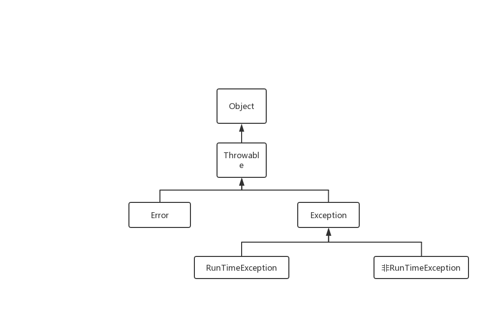

### Throwable

在 `java` 中只有 `Throwable` 才可以被抛出（throw）和捕获（catch），它是异常处理机制的基本组成类型，`Error` 和` Exception` 都继承了 `Throwable`。

### Error

`Error` 是编译时错误和系统错误，绝大部分的 `Error` 会导致程序处于非正常，不可恢复状态。`Error` 类主要包括了一些严重的错误，程序无法处理也不应处理。常见的错误包括：内存溢出、虚拟机错误、栈溢出等。

### Exception

`Exception` 是可被抛出的基本类型，主要分为 `RunTimeException` 和其他 `Exception`。

+ 其他 `Exception` 又称为受检查异常，开发者必须解决才能编译通过，解决方法有 `try-catch` 捕获和 `throw` 到上层，常见有 `IOException`、`ClassNotFoundException`、`SQLException`等。

  

+ `RunTimeException` 是运行时异常，又称不受检查异常，`Java` 编译时不会出现异常，可是在运行中可能出现异常，如 `NullPointerException`、`ArrayIndexOutOfBoundsException`、`ClassCastException`之类。

### Reference

[Java基础知识——异常Throwable和Exception](https://blog.csdn.net/doujinlong1/article/details/80343958)