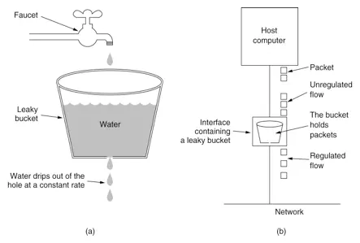
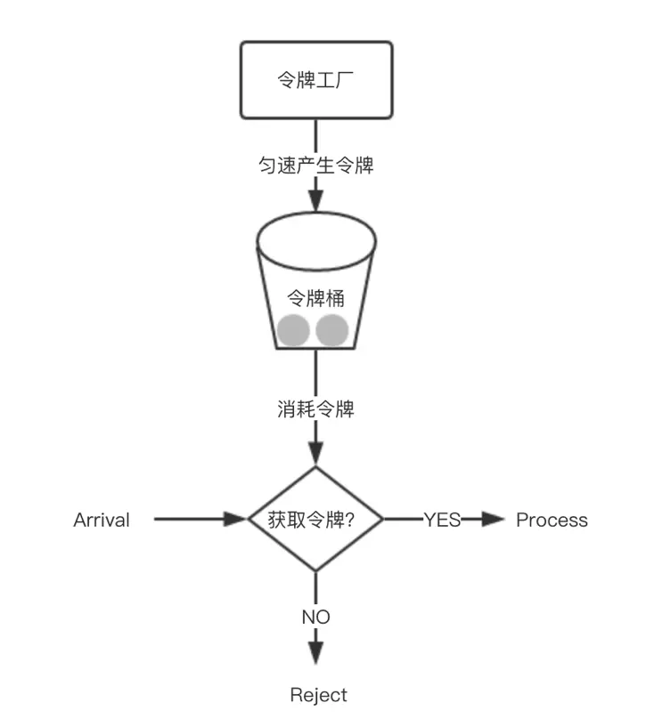

### 一、计数器

维护一个时间单位的计数器 `count`，如果过来一个请求，将 `count` 加一，然后进行判断：

1、如果 `count` 达到设定的限值则拒绝请求

2、如果当前请求与第一个请求超过时间单位，则计数器清零

#### 可能出现的问题：

假设时间单位是 1s，限定的阈值是100，一个用户在一秒的最后几毫秒发送了100个请求，接着计数器清零，用户又发送了 100 个请求，也就是说，在一秒的时间内，用户发出了 200 个请求，实际上是超出阈值的。

### 二、漏桶算法

1、漏桶具有固定容量，出水速率固定（处理请求）

2、如果桶是空的，则无需流出水滴

3、可以以任意速率流入水滴到漏桶（流入请求速率）

4、如果流入水滴后超过桶的容量，水滴溢出（请求丢弃）

#### 可能出现的问题：

无法应对短时间的大量请求

### 三、令牌桶

可以认为是对漏桶算法的改进，系统以一个恒定的速度往桶里放入令牌，而如果请求需要被处理，则需要先从桶里获取一个令牌，当桶里没有令牌可取时，则拒绝服务。桶中最多存放一定数量的令牌,当桶满时，新添加的令牌被丢弃或拒绝。

### reference

[谈限流算法]([https://pjmike.github.io/2018/09/14/%E6%B5%85%E8%B0%88%E9%99%90%E6%B5%81%E7%AE%97%E6%B3%95/#%E8%AE%A1%E6%95%B0%E5%99%A8%E9%99%90%E6%B5%81](https://pjmike.github.io/2018/09/14/浅谈限流算法/#计数器限流))

[谈谈限流算法的几种实现](https://www.jianshu.com/p/76cc8ba5ca91)