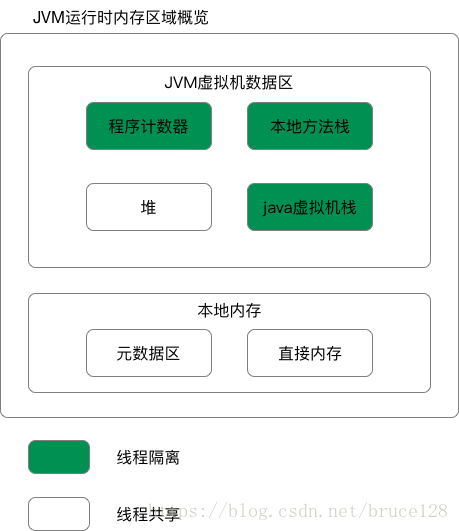

### Java运行时的数据区域

jdk1.8运行时的数据区域

注意：jdk1.7以后，方法区（永久代）被元数据区取代，元数据区（元空间）与永久代功能类似，但是元数据区已经不存放在 JVM 中，而是存放在本地内存。

#### 各个区域

+ 程序计数器

  每个线程私有，指向执行线程正在执行的虚拟机字节码指令地址，如果执行的是 native 方法，则计数器的值为空（Undefined）。

+ Java 虚拟机栈

  线程私有。生命周期与线程一致，基本单位是栈帧。栈帧包含局部变量表，操作数栈，动态链接，方法出口等信息。线程执行一个方法时，会在虚拟机栈中创建对应的栈帧（Stack Frame）。

  

  局部变量表中存放编译期可知的基本数据类型，对象引用，returnAddress类型（指向了一条字节码指令的地址）。其中long 、double 类型的数据会占据两个局部变量空间（Slot），其余类型只占据一个。

  方法出口：保存调用当前栈帧对应方法的方法接下来要执行的位置。

+ 本地方法栈

  与虚拟机栈类似，只不过本地方法栈为 native 方法服务。由于虚拟机规范没有对本地方法栈中方法的使用语言，数据结构等做强制规定，所以不同虚拟机的实现不同，比如 HotSpot 虚拟机直接将本地方法栈和虚拟机栈合二为一。

+ Java堆

  线程共享区域。堆是 Java 虚拟机最大的一块内存空间，在虚拟机启动时创建。

  堆主要存放对象实例，几乎所有的对象实例在这里分配内存。尽管虚拟机规范规定了所有的对象实例和数组都要在堆上分配，但是随着 JIT 编译器的发展与逃逸分析技术的成熟，有些对象可能会在栈上分配。

  由于方法区（永久代）的移除，从 HotSpot的jdk1.7 起，字符串常量池移至堆中。

+ 元空间区

  线程共享区域。存储已经被虚拟机加载的类信息、常量、静态变量、即时编译器编译后的代码等数据。

  [为什么移除永久代](https://juejin.im/post/5ca02d046fb9a05e6a086cb7)

  1. **方法区大小难以设定，容易发生内存溢出**。永久代会存放Class的相关信息，一般这些信息在编译期间就能确定大小。但是如果是在一些需要动态生成大量Class的应用中，如：Spring的动态代理、大量的JSP页面或动态生成JSP页面等，由于方法区的大小在一开始就要分配好，因此就能难确定大小，容易出现内存溢出

  2. **GC复杂且效率低**。方法区存储了类的元数据信息和各种常量，它的内存回收目标理应当是对这些类型的卸载和常量的回收。但由于这些数据被类的实例引用，卸载条件变得复杂且严格，回收不当会导致堆中的类实例失去元数据信息和常量信息。因此，回收方法区内存不是一件简单高效的事情。

  3. **促进HotSpot JVM与JRockit VM的融合**。JRockit没有方法区，移除永久代可以促进HotSpot JVM与JRockit VM的融合。

+ 运行时常量池

  本来运行时常量池存在于永久代中，随着永久代被元空间代替，运行时常量池也就被移动到了元空间中。Class 文件元信息描述，**编译后的代码数据**，引用类型数据，类文件常量池存放在运行时常量池中。

### HotSpot虚拟机对象

#### 对象的创建

