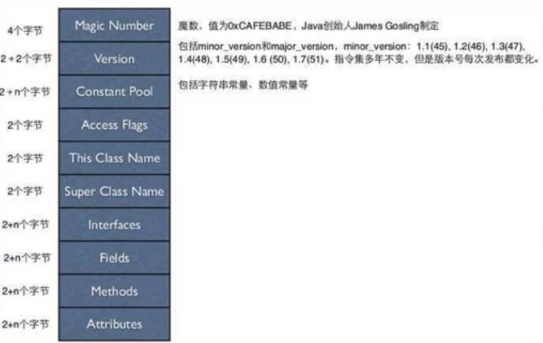
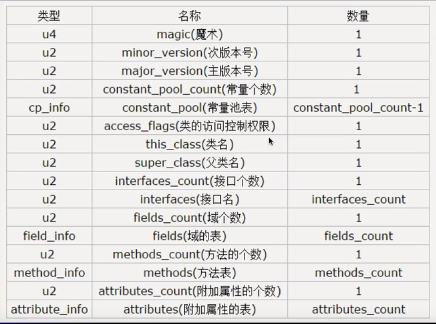
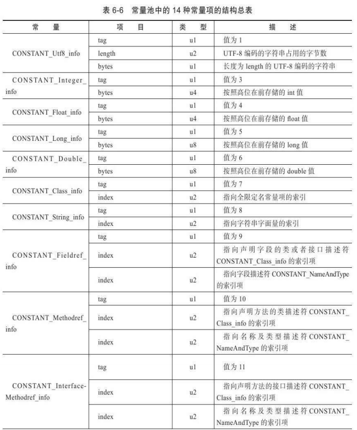
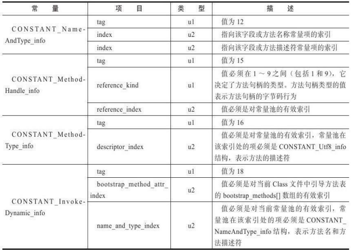
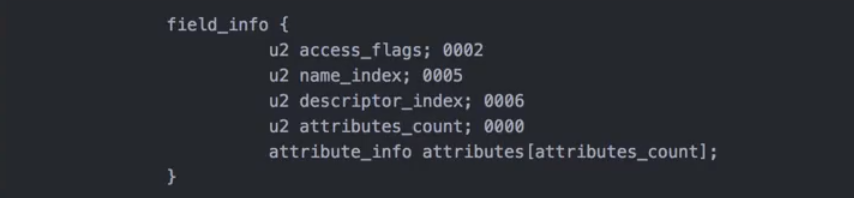
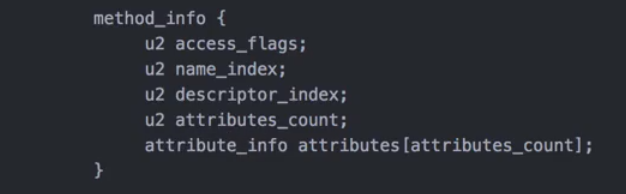
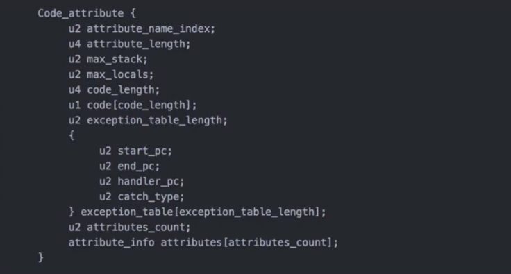

### 反编译指令

javap 【类的完全限定名】， 大体信息

javap -c 【类的完全限定名】， 稍微详细

javap -verbose 【类的完全限定名】，更详细

### 描述信息

+ 在 JVM 规范中，每个变量、字段都有描述信息，描述信息主要的作用是描述字段的数据类型、方法的参数列表（包括数量、类型、顺序）与返回值。根据描述符规则，基本类型和代表无返回值的 void 类型都用一个大写字符来表示，如下所示：B - byte，C - char，D - double，F - float，I - int，J - long， S - short， Z - boolean， V - void，L - 对象类型，如 Ljava/lang/String
+ 对于数组类型来说，每一个维度使用一个前置的 [ 来表示，如 int[] 表示为 [I，String[]\[]被记录为[[Ljava/lang/String。
+ 对于描述符描述方法时，按照先参数列表，后返回值的顺序来描述。参数列表按照参数的顺序严格放在一组 () 之间，如方法 String getNickName(int id, String name) 的描述符为 (I, Ljava/lang/String)Ljava/lang/String。

---

### Java字节码整体结构





---


### 字节码格式

1. 魔数：所有的.class字节码文件的前四个字节都是魔数，魔数值为固定值：0xCAFEBABE。
2. 魔数之后的４个字节为版本信息，前两个字节表示 minor version（次版本号），后两个字节表示 major version（主版本号）。例如　1.8.0，　1.8为主版本号，０为次版本号。
3. 常量池 (constant pool)：紧接着主版本号之后的是常量池入口。一个 Java 类中定义的很多信息都是由常量池来维护和描述的，可以将常量池看作是 Class 文件的资源仓库，比如说 Java 类中定义的方法与变量信息，都是存储在常量池中。常量池主要存储两类常量：**字面量**和**符号引用**。字面量如文本字符串， Java 中声明为 final 的常量值等，而符号引用如类和接口的全局限定名，字段的名称和描述符等。**注意，常量池并非存储的都是不变的量。**
4. 常量池的总体结构：Java 类所对应的常量池主要由常量池常量数量和常量池数组（常量表）这两部分共同构成。常量池常量数量紧跟在主版本号后面，占据两个字节；常量池数组则跟在常量池常量数量后面。常量池数组与一般数组不同的是，常量池数组中不同的元素的类型、结构都是不同的，长度当然不相同。但是，每一种元素的第一个数据都是一个 u1 类型，占据一个字节，是标志位。JVM 在解析常量池时，会根据这个 u1 类型来获取元素的具体类型。值得注意的是，常量池数组中元素的个数 = 常量池常量数 - 1（其中 0 暂时不使用），目的是满足某些常量池索引值的数据在特定的情况下需要表达不引用任何一个常量池的含义；根本原因在于，索引为 0 也是一个常量（保留常量），只不过它不位于常量表中，这个常量对应为`null`。






​		u(n) 代表占据 n 个字节。

5. 字段（类成员变量）表

   字段个数只包含类的成员变量，而方法中的字段不在此处。

   字段表结构

   

   access_flag：访问标志符，如 public, final, private 等

   name_index：名字索引

   descriptor_index：描述符索引

   attributes_count：附加属性数量

   attributes_info：附加属性表

   其中，访问修饰符

   |     标志名     | 标志值 |         标志含义          | 针对的对象 |
   | :------------: | :----: | :-----------------------: | :--------: |
   |   ACC_PUBLIC   | 0x0001 |        public类型         |  所有类型  |
   |   ACC_FINAL    | 0x0010 |         final类型         |     类     |
   |   ACC_SUPER    | 0x0020 | 使用新的invokespecial语义 |  类和接口  |
   | ACC_INTERFACE  | 0x0200 |         接口类型          |    接口    |
   |  ACC_ABSTRACT  | 0x0400 |         抽象类型          |  类和接口  |
   | ACC_SYNTHETIC  | 0x1000 |   该类不由用户代码生成    |  所有类型  |
   | ACC_ANNOTATION | 0x2000 |         注解类型          |    注解    |
   |    ACC_ENUM    | 0x4000 |         枚举类型          |    枚举    |

6. 方法表

   方法表结构

   

7. 附加属性

   附加属性表

   

---

### 字节码中的Code类型

Code结构



+ attribute_length

  表示 attribute 所包含的字节数，不包含 attribute_name_index 和 attribute_length 字段。

+ max_stack

  表示这个方法运行的任何时刻所能达到的操作数栈的最大深度。

+ max_locals 

  表示方法执行期间创建的局部变量数目，包含用来表示传入的参数的局部变量。

+ code_length

  表示该方法所包含的字节码的字节数以及具体的指令码。具体的指令码即是该方法被调用时，虚拟机所执行的字节码。

+ exception_table

  存放处理异常的信息。每个 exception_table 表项由 start_pc，end_pc，handle_pc，catch_type 组成。

  start_pc 和 end_pc 表示在 code 数组中的从 start_pc 到 end_pc 处（左闭右开）的指令抛出的异常会由这个表项来处理。

  hadler_pc 表示处理异常的代码的开始处。

  catch_type 表示会被处理的异常类型，它指向常量池里的一个异常类。当 catch_type 为 0 时，表示处理所有的异常。 


### 类的非静态成员变量初始化在构造方法中

```java
package com.jvm.bytecode;

public class Test1 {

    private String s = "world";
    private Integer a = 10;
    public static String str = "hello";

    public int getA() {
        return a;
    }

    public void setA(int a) {
        this.a = a;
    }
}
```

对于上面的类，使用 javap 命令查看默认构造方法（也可以显示指定） 

```java
  public com.jvm.bytecode.Test1();
    Code:
       0: aload_0
       1: invokespecial #1                  // Method java/lang/Object."<init>":()V
       4: aload_0
       5: ldc           #2                  // String world
       7: putfield      #3                  // Field s:Ljava/lang/String;
      10: aload_0
      11: bipush        10
      13: invokestatic  #4                  // Method java/lang/Integer.valueOf:(I)Ljava/lang/Integer;
      16: putfield      #5                  // Field a:Ljava/lang/Integer;
      19: return

```

从结果可以看出，实际上对于非静态的类成员变量 s, a, 都是在构造方法中进行了初始化。

**对于静态属性和静态代码块，jvm 会生成  <clinit\> 方法并在里面初始化。**


### 字节码中的this

通过分析字节码文件可以得知就算在默认的无参构造函数中，会在方法中初始化一个指向本类的对象，即 this。

对于 java 类中的每一个实例方法（非 static 方法）其在编译后的所生成的字节码中，方法参数总会比源代码方法中参数的数量多一个（this），它位于方法的第一个参数位置处。

### 栈帧

栈帧是一种用于帮助虚拟机执行方法调用与方法执行的数据结构

栈帧本身是一种数据结构。封装了方法的局部变量表、动态链接信息、方法返回地址（方法的调用者地址）以及操作栈等信息。

### 方法调用

有些符号引用是类加载阶段或是第一次使用时就会转换为直接引用，这种转换叫做静态解析；另外一些符号引用在每次运行期转换为直接引用，这种转换叫做动态链接。

#### 静态解析情形：

1. 静态方法
2. 父类方法
3. 构造方法
4. 私有方法

以上四类方法称作非虚方法，它们在类加载阶段就可以将符号引用转换为直接引用。

---

#### 方法调用的情形

1. invokeinterface：调用接口中的方法，实际上是在运行期决定的，决定到底调用实现该接口的哪个对象的特定方法。
2. invokestatic：调用静态方法
3. invokespecial：调用自己的私有方法，构造方法以及父类的方法。
4. invokevirtual：调用虚方法，运行期动态查找的过程。
5. invokedynamic：动态调用方法。

---

#### 方法的静态分派

```java
public class Test3 {
    
    public void test(Grandpa grandpa){
        System.out.println("Grandpa");
    }
    public void test(Parent parent){
        System.out.println("Parent");
    }
    public void test(Child child){
        System.out.println("child");
    }

    public static void main(String[] args) {
        Grandpa g1 = new Parent();
        Grandpa g2 = new Child();

        Test3 test3 = new Test3();
        
        test3.test(g1);
        test3.test(g2);
    }
}

class Grandpa{
}
class Parent extends Grandpa{
}
class Child extends Parent{
}

```

结果

```java
Grandpa
Grandpa
```

首先要清楚对于三个 test 方法是方法的重载，方法的重载是静态的行为，根据方法参数的类型和个数进行区分，在编译期可以完全确定。

对于

```java
Grandpa g1 = new Parent();
```

g1 的静态类型是 Grandpa，而 g1 的实际类型（真正指向的类型）是Father。变量静态类型不会发生变化，而变量的实际类型是可以发生变化的（多态的一种体现），实际类型在运行期才可以确定。

因为 test 方法的参数类型在编译期已经确定，所以该方法会根据传入参数的静态类型确定调用哪个方法。

---

#### 方法的动态分派

```java
public class Test4 {
    public static void main(String[] args) {
        Fruit apple = new Apple();
        Fruit orange = new Orange();

        apple.test();
        orange.test();

        apple = new Orange();
        apple.test();
    }
}

class Fruit{
    public void test(){
        System.out.println("Fruit");
    }
}
class Apple extends Fruit{
    @Override
    public void test() {
        System.out.println("Apple");
    }
}

class Orange extends Fruit{
    @Override
    public void test() {
        System.out.println("Orange");
    }
}

```

结果

```
Apple
Orange
Orange
```

main 方法对应字节码的执行指令

```
 0 new #2 <com/jvm/bytecode/Apple>
 3 dup
 4 invokespecial #3 <com/jvm/bytecode/Apple.<init>>
 7 astore_1
 8 new #4 <com/jvm/bytecode/Orange>
11 dup
12 invokespecial #5 <com/jvm/bytecode/Orange.<init>>
15 astore_2
16 aload_1
17 invokevirtual #6 <com/jvm/bytecode/Fruit.test>
20 aload_2
21 invokevirtual #6 <com/jvm/bytecode/Fruit.test>
24 new #4 <com/jvm/bytecode/Orange>
27 dup
28 invokespecial #5 <com/jvm/bytecode/Orange.<init>>
31 astore_1
32 aload_1
33 invokevirtual #6 <com/jvm/bytecode/Fruit.test>
36 return
```

指令的具体作用：

0 ：创建指定类型的对象实例，对其进行默认初始化，并将指向该实例的一个引用压入操作数栈顶

3 ： 复制该实例引用到操作数栈顶

4 ：执行对象构造函数

7 ： 将存放在栈顶指向创建出来实例的引用取出存储到局部变量中

8-15 类似

16: ： 将 astore_1 存储的引用（即 apple）取出

17 ： 执行 test 方法，注意这里执行的是`com/jvm/bytecode/Fruit.test`，明显与结果不同。


这里为什么要使用 dup 命令复制实例到操作数栈顶。

主要是 invokespecial 指令会消耗操作数栈顶的引用作为传递给构造函数的 this 参数，因为我们之后还需要维持一个指向该对象的引用进行操作，所以在该指令执行之前要先复制一个指向当前实例的引用到操作数栈顶。

[关于JVM字节码中dup指令的问题？ - RednaxelaFX的回答 - 知乎](https://www.zhihu.com/question/52749416/answer/132831920)

---

在这里之所以调用相同的方法，但是执行了实际类型的方法而不是静态类型的方法，主要与 invokevirtual 的执行流程有关

invokevirtual 的执行流程

1. 查找操作数栈顶第一个元素所指向的对象的实际类型，记作 C
2. 如果 C 中存在与常量中的描述符和简单名称都相符的方法（即方法签名与当前目标调用的方法匹配），则进行访问权限校验，校验通过则返回这个方法的直接引用，否则抛 IllegalAccessError
3. 如果不存在，则 **从沿继承关系下往上** 依次遍历 C 的各个父类型，执行步骤 2 中的验证过程
4. 如果没有找到，抛 AbstractMethodError
   

以上面代码为例

```
16 aload_1
17 invokevirtual #6 <com/jvm/bytecode/Fruit.test>
```

aload_1 将存在 apple 中的引用压到栈顶，接下来执行 invokevirtual ,它所指向的方法是 `com.jvm.bytecode.Fruit.test`。首先查找操作数栈顶第一个元素所指向的类型，为 Apple，接着查找 Apple 是否有跟 `com.jvm.bytecode.Fruit.test`描述符和简单名称相同的方法，发现方法`com.jvm.bytecode.Apple.test`，接着进行权限校验，通过后返回方法的引用，最后对方法进行调用。