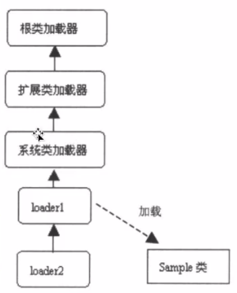
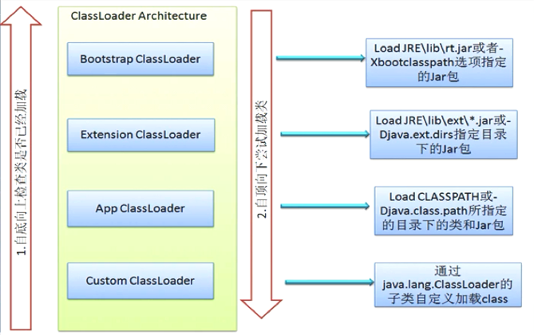

**类的加载、连接、初始化是在程序运行期间完成的。**

+ 加载：查找并加载类的二进制数据
+ 连接
  - 验证：确保被加载的类的正确性
  - 准备：为类的**静态变量**分配内存，并将其初始化为默认值
  - 解析：把类中的符号引用转换为直接引用
+ 初始化：为类的静态变量赋予正确的初始值
+ 使用
+ 卸载类

```java
class demo{
    public static int num = 1;
}
```

在连接阶段中，首先验证`demo`类字节码的正确性，接着为**静态变量**`num`分配内存并初始化为默认值0。

在初始化阶段才将1赋值给**静态变量**`num`。


#### 主动使用和被动使用

`java`对类的使用方式分为**主动使用**和**被动使用**。

**所有的`java`虚拟机实现必须在每个类或接口被`java`程序首次主动使用时才初始化他们。**

+ 主动使用
  + 创建类的实例
  + 访问某个类或接口的静态变量，或者对该静态变量赋值
  + 调用类的静态方法
  + 反射（如` Class.forName("className")`）
  + 初始化一个类的子类
  + `java`虚拟机启动时被标记为启动类的类
  + `JDK`提供的动态语言支持

```java
class MyParent1 {
    public static String str = "parent1 str";
    static {
        System.out.println("MyParent1 static block");
    }
}

class MyChild1 extends MyParent1{
    public static String str1 = "child1 str";
    static {
        System.out.println("MyChild1 static block");
    }
}
public class MyTest1 {
    public static void main(String[] args) {
        System.out.println(MyChild1.str); //打印的是父类的str
        
    }
}

```

> 运行结果：
> MyParent1 static block
> parent1 str

程序运行后发现并没有初始化`MyChild1`类，因为对于静态字段来说，只有直接定义该字段的类才会被初始化，`str`是其父类定义的，所以只初始化了`MyParent1`。

如果执行`System.out.println(MyChild1.str1)`，那么则会打印如下

>MyParent1 static block
>MyChild1 static block
>child1 str

因为要打印在`MyChild1`定义的静态变量，所以要初始化子类`MyChild1`，进而要先初始化其父类`MyParent1`，所以有以上的运行结果。


#### 虚拟机参数

-XX:+<option>   表示开启 option 选项

-XX:-<option>   表示关闭 option 选项

-XX:<option>=<value>   表示将 option 选项的是设置为 value

#### 类的加载

类的加载是指将类的`.class`文件中的二进制数据读入到内存中，将其放在运行时数据区的方法区内，然后**在内存中创建一个 `java.lang.Class`对象**(规范并未说明`Class`对象位于哪里，`HotSpot`虚拟机将其放在方法区中) 用来封装类在方法区内的数据结构。

##### 加载`.class`文件的方式

- 从本地系统中直接加载
- 从网络下载`.class`文件
- 从`zip`、`jar`等归档文件加载`.class`文件
- 从专有数据库提取`.class`文件
- 将`java`源文件**动态**编译为`.class`文件。（生成代理，`jsp`->`servlet`）

**-XX:+TraceClassLoading**   用于追踪类的加载信息。

**两种类型的类加载器**

- Java 虚拟机自带的加载器
  - 根类加载器（bootstrap）
  - 扩展类加载器（extension）
  - 系统（应用）类加载器（System）
- 用户自定义的类加载器
  - java.lang.ClassLoader 的子类
  - 用户可以定制类的加载方式

**类加载器并不需要等到某个类被首次主动使用时再加载它**

#### 类加载器的双亲委托机制

​	在双亲委托机制中，各个记载器按照父子关系形成树形结构，除了根类加载器之外，其余类加载器都有且只有一个父加载器。



如上图加载过程，如果 loader1 要加载 Simple 类，那么 loader1 会委托它的父亲系统加载器加载，同样，系统加载器会委托它的父亲扩展类加载器加载，直至根类加载器。因为根类加载器会在指定的目录加载 class 文件，而在我们没有做任何特殊的配置的时候，Simple 类不会在那些目录出现，所以根类加载器会加载失败，所以根类加载器将加载任务返回给扩展类加载器，同样，扩展类加载器也会加载失败，接下来返回加载任务到系统类加载器。因为系统类加载器会加载类路径下或者指定路径的类和 jar 包，所以一般系统类加载器能加载我们项目的类。



#### classloader

数组类型不是由类加载器加载的，而是 java 虚拟机在运行是动态创建的。对于一个数组对象，使用`Class.getClassLoader()`时会返回跟数组元素类型一样的 classloader ，如果数组元素的类型是原生类型，则这个数组没有对应的 classloader。

#### 命名空间

+ 每个类加载器都有自己的命名空间，命名空间由该类加载器及所有父亲加载器记载的类组成。
+ 在同一个命名空间，不会出现类的完整名字相同的两个类，而不同的命名空间则可能会。

#### 不同类加载器的命名空间关系

+ 同一个命名空间内的类是相互可见的。

+ 子加载器的命名空间包含所有父加载器的命名空间。因此由子类加载的类能看见父加载器加载的类。
+ 由父加载器加载的 类不能看见子加载器加载的类
+ 如果两个加载器之间没有直接或间接的父子关系，那么它们各自加载的类相互不可见。

#### 自定义类加载器

```java
public class Test10 extends ClassLoader {

    private String classLoaderName;
    //路径
    private String path;

    public Test10(String classLoaderName){
        super();
        this.classLoaderName = classLoaderName;
    }

    public Test10(String classLoaderName, ClassLoader parentLoader) {
        //定义了父加载器
        super(parentLoader);
        this.classLoaderName = classLoaderName;
    }

    public void setPath(String path) {
        this.path = path;
    }

    //这里其实是从指定的路径读取 .class 文件并存放在字节数组
    private byte[] loadClassData(String className) throws IOException {
        InputStream is = null;
        ByteArrayOutputStream bas = null;
        className = className.replace(".", "/");
        try {
            is = new FileInputStream(path + className + ".class");
            bas = new ByteArrayOutputStream();
            int ch;
            while ( (ch = is.read())!= -1){
               bas.write(ch);
            }
        }catch (Exception e){
            e.printStackTrace();
        }finally {
            is.close();
            bas.close();
        }
        return bas.toByteArray();
    }

    //重写的父类方法，loadClass会调用这个方法
    @Override
    protected Class<?> findClass(String className) {
        System.out.println("invoke findclass");
        byte[] data = null;
        try {
            data = loadClassData(className);
        } catch (IOException e) {
            e.printStackTrace();
        }
        //根据字节数组返回一个字节码对象
        return this.defineClass(className,data, 0, data.length);
    }
}

```


**注意，我现在在类路径下和指定加载类的路径下都有要加载的类 MyTest1**，现在执行 main 方法

```java

    public static void main(String[] args) throws Exception {
        Test10 loder1= new Test10("loder1");
        loder1.setPath("/home/zpffly/");
        Class<?> clazz1 = loder1.loadClass("com.jvm.classloader.MyTest1");
        System.out.println("class: " + clazz1.hashCode());
        Object object = clazz1.newInstance();
        System.out.println(object);
        System.out.println("--------------------");

        Test10 loader2 = new Test10("loader2");
        loader2.setPath("/home/zpffly/");
        Class<?> clazz2 = loader2.loadClass("com.jvm.classloader.MyTest1");
        System.out.println("class:" + clazz2.hashCode());
        Object object1 = clazz2.newInstance();
        System.out.println(object1);

    }
```

结果

```
class: 1018547642
com.jvm.classloader.MyTest1@56cbfb61
--------------------
class:1018547642
com.jvm.classloader.MyTest1@d041cf
```

从结果可以看出，两个类对象是同一个对象，而且 loadClass() 明显就没有执行重写的 findclass() 方法（如果有会打印 invoke findclass ）。**这里要注意一下我们的运行前提，类路径下和指定的 ~ 路径下都有要加载的类**。

输出这一结果的主要原因就是双亲委托机制，当自定义的类加载器要加载类时，它会委托它的父亲加载，直至根类加载器，而根类和扩展类加载器都加载不了，将加载任务返还直至应用加载器，应用加载器尝试在类路径下查找MyTest1类，发现有这个 .class 文件，所以就进行了加载。

这里 main 中有两个自定义类加载器，他们都要加载的类都由它们的父亲应用加载器进行了加载。因为类加载器在加载类前会调用 findLoadedClass() 检查类是否已经被加载，所以当 loader2 再次加载 MyTest1时，会直接返回之前加载的类。


**注意，现在我删除了类路径下的 MyTest1.class 文件并再次运行**

结果：

```
invoke findclass
class: 312116338
com.jvm.classloader.MyTest1@1b0375b3
--------------------
invoke findclass
class:1809787067
com.jvm.classloader.MyTest1@6b71769e
```

从结果可以看出我们自己写的 findClass() 终于被调用了。原因就是所有的父类加载器都没有办法加载该类，只能自定义 的类加载器自己加载。 

同样，从结果可以看出生成了两个该类的类对象，这主要是两个自定义类加载器不在同一个命名空间，所以同一个类被加载了两次。

#### 线程上下文类加载器

+ 当前类加载器（Current Classloader）

  每个类都会使用自己的类加载器（即加载自身的类加载器）来去加载其他类（指的是所依赖的类），比如在 ClassX 引用了 ClassY ，那么 ClassX 的类加载器就会去加载 ClassY （如果ClassY还没有被加载）。

+ 线程上下文类加载器

  线程上下文类加载器是从 JDK1.2 开始引入的， 类 Thread 中的 getContentClassLoader() 与 setContentClassLoader(ClassLoader  cl) 分别获取和设置上下文类加载器。

  如果没有通过 setContextClassLoader(ClassLoader cl) 进行设置的话，线程将继承其父线程的上下文类加载器。Java 应用运行时的初始上下文类加载器是系统类加载器。在线程中运行的代码可以通过该类加载器加载类和资源

+ 线程上下文类加载器的重要性

  解决 SPI （Service  Provider  Interface）

  父加载器可以使用当前线程 Thread.CurrentThread().getContentClassLoader() 所指定的 classloader加载的类。这就改变了父ClassLoader不能使用子 ClassLoader 或者是其他没有直接父子关系的的 classloader 加载的类的情况，即改变了双亲委托模型。

  **线程上下文类加载器就是当前线程的 Current Classloader。**

  在双亲委托机制下，类加载是由下至上的，即下层的类加载器会委托上层进行加载。但是对于SPI来说，有些接口是 Java 核心库所提供的，这些接口由启动类加载器加载的。而这些接口的实现类由厂商提供，Java启动类不会对其进行加载，而是由 APPClassLoader 进行加载。这样的话接口的实现类对接口来说是不可见的，所以传统的双亲委托模型不能满足 SPI 的要求。而通过给当前线程设置上下文类加载器，就可以由设置的上下文类加载器来实现对于接口实现类的加载。


#### 类初始化时机

当虚拟机初始化一个类时，要求它的所有父类都已经被初始化，**但是这条规则并不适用于接口**。

+ 在初始化一个类时，并不会先初始化它所实现的接口

  ```java
  interface MyParent5{
      public static Thread thread = new Thread(){
          {
              System.out.println("MyParent5 invoked");
          }
      };
  }
  
  class MyChild5 implements MyParent5{
      public static int b = 5;
  }
  
  public class MyTest5 {
  
      public static void main(String[] args) {
          System.out.println(MyChild5.b);
      }
  }
  
  ```

  打印的结果为5。

  由这个例子可以得知，尽管类 MyChild5 实现了接口 MyParent，但是在类初始化后，并没有输出`MyParent5 invoked`，由此可以说明接口并没有进行初始化。


+ 在**初始化**一个接口时，并**不会先初始化**它的父接口。

  ```java
  interface MyParent5{
      public static Thread thread = new Thread(){
          {
              System.out.println("MyParent5 invoked");
          }
      };
  }
  
  interface MyChild5_1 extends MyParent5 {
  
      public static Thread thread = new Thread(){
          {
              System.out.println("MyChild5_1 invoked");
          }
      };
  }
  
  public class MyTest5 {
  
      public static void main(String[] args) {
          System.out.println(MyChild5_1.thread);
      }
  }
  ```

  打印的结果：

  ```
  MyChild5_1 invoked
  Thread[Thread-0,5,main]
  ```

  从结果我们可以得出，尽管`MyChild5_1`接口继承了`MyParent5`接口，可是，在`MyChild5_1`初始化后，父接口`MyParent5`并没有初始化（否则会打印MyParent5 invoked），这跟类是有很大的区别的。

因此，一个父接口并不会因为它的子接口或者实现类的初始化而初始化，只有当程序首次使用特定接口的静态变量时，才会导致该接口的初始化。


#### 常量的本质含义

```java
class MyParent2 {
    public static final String str = "hello";  //注意这里是静态常量
    static {
        System.out.println("MyParent2 static block");
    }
}

public class MyTest2 {

    public static void main(String[] args) {
        System.out.println(MyParent2.str);
    }
}
```

对于以上的程序，运行结果是

```
hello
```

为什么类`MyParent2`的静态代码块没有输出，该类没有被初始化吗？

是的，对于常量，**在编译阶段会存入到调用这个常量的方法所在的类的常量池中**。本质上，调用类并没有直接引用到定义常量的类，因此不会触发。在这个例子中，常量`str`被存放在了`MyTest2`的常量池中，之后`MyTest2`和`MyParent2`再无联系，甚至可以将`MyParent2`的字节码文件删除。


**如果静态常量是在编译期不可确定？**

```java
class MyParent3 {
    public static final String str = UUID.randomUUID().toString();
    static {
        System.out.println("MyParent3 static block");
    }
}
public class MyTest3 {
    public static void main(String[] args) {
        System.out.println(MyParent3.str);
    }
}
```

结果：

```
MyParent3 static block
883d3e81-9a82-4814-9a6c-58ecb483e5ae
```

这里跟上面例子不同， 对于`str`，这里在编译期并不能确定常量值，所以并不会将`str`放在调用类的常量池中，如果程序运行，那么会导致主动使用常量所在的类，显然会导致这个类被初始化。


#### 类加载的准备阶段和初始化阶段的重要意义

```java
public class MyTest6 {
    public static void main(String[] args) {
        Singleton singleton = Singleton.getInstance();
        System.out.println("counter1: " + Singleton.counter1);
        System.out.println("counter2: " + Singleton.counter2);
    }
}

class Singleton{
    public static int counter1;
    public static int counter2 = 0;
    private static Singleton singleton = new Singleton();
    private Singleton(){
        counter1++;
        counter2++;
    }
    public static Singleton getInstance(){
        return singleton;
    }
}
```

运行结果

```
counter1: 1
counter2: 1
```

对于以上程序过程：

当我们调用`Singleton.getInstance()`，相当于对类`Singleton`的主动使用，所以会初始化类`Singleton`。

在准备阶段：

​	虚拟机按顺序给静态变量分配内存空间赋予初值

​		counter1 = 0

​		counter2 = 0

​		singleton = null

在初始化阶段

​	虚拟机按顺序给静态变量初始化

​		counter1没显式定义，所以还是为0

​		counter2被初始化为0

​		singleton初始化为Singleton对象（调用了构造函数，counter->1，counter2 -> 1）

经过以上过程打印出结果 1， 1。

**接下来改变counter2位置**

```java
class Singleton{
    public static int counter1;
    private static Singleton singleton = new Singleton();
    public static int counter2 = 0;
    private Singleton(){
        counter1++;
        counter2++;
    }
    public static Singleton getInstance(){
        return singleton;
    }
}
```

此时结果变为

```
counter1: 1
counter2: 0
```

为什么结果发生了变化？

准备阶段跟上面类似，按变量定义顺序分配内存，赋予初值。

主要在初始化阶段，首先要明确 singleton 在 counter2 之前初始化（counter2为默认值0），此时`singleton = new Singleton()`会调用构造函数，构造函数对 counter1 和 counter2 自增，所以它们的值都会变成1。**接着初始化 counter2，也就是把初始化的值0赋值给 counter2 ，所以 counter2 会从 1 变成 0**。

所以打印的结果为0，1。

对于这个例子，准备阶段重要意义是让 counter2 在还没有初始化的时候就能被使用，因为它在之前已经分配内存空间并具有默认值了。对于虚拟机来说，准备阶段使虚拟机具有更好的鲁棒性。


