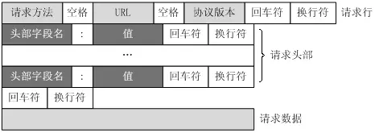
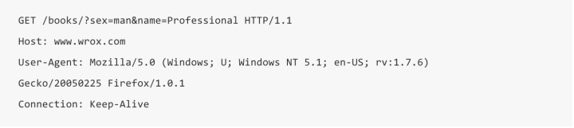
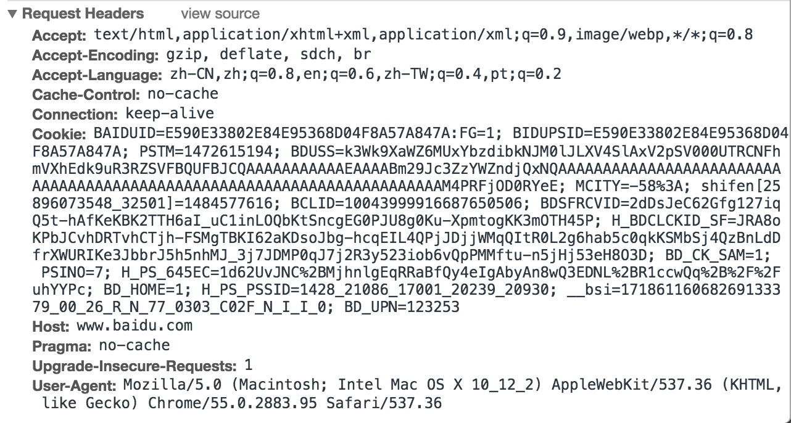

## 一、简介

HTTP 全称为`Hyper Text Transfer Protocol`，即为超文本传输协议。HTTP 是无状态的，基于 `tcp/ip` 协议。


## 二、资源标识

**HTTP使用统一资源标识符（Uniform Resource Identifiers, URI）来传输数据和建立连接。**URL是一种特殊类型的URI，包含了用于查找某个资源的足够的信息

### 2.1 URI

全称为 `uniform resource identifier`，统一资源标识符，强调标识（identifier），可以**唯一标识一个资源**。

### 2.2 URL

全称为 `uniform resource locator`，统一资源定位符，强调定位（locator），用于提供找到该资源的路径。因为 `URL` 同时可以唯一标识一个资源，所以 `URL` 是 `URI` 的子集。但是，`URI` 不等同于 `URL`，比如，`urn:isbn:0-486-27557-4`，这个是一本书的isbn，可以唯一标识这本书，但是它不是 `URL`。


## 三、HTTP请求

### 3.1 请求格式

请求消息主要包括状态行、请求头部、空行、请求数据四个部分，格式如下（HTTP 0.9之后）：



如下是 `GET` 请求报文实例：



### 3.2 常见请求方法

+ GET

  HTTP 0.9 版本唯一支持的请求方法，表示获取 `URL` 指定的资源。

+ HEAD

  HTTP 1.0 引入，与 `GET` 类似请求指定的资源，但是服务器在响应 `HEAD` 请求时不会回传资源的内容部分，即响应主体。这样，我们可以在不传输全部内容的情况下，获取服务器响应头信息，`HEAD` 方法常用于客户端查看服务器性能。

+ POST

  HTTP 1.0 引入，向指定资源提交数据，请求服务器进行处理，如表单上传、文件上传等，`POST` 是非幂等的，因为这个请求会创建或修改现有资源。

+ PUT

  向指定 `URL` 更新资源。

+ DELETE

  删除指定 `URL` 资源。

+ OPTIONS

  与 `HEAD` 类似，一般也是用于客户端查看服务器的性能。 这个方法会请求服务器返回该资源所支持的所有HTTP请求方法，该方法会用'*'来代替资源名称，向服务器发送OPTIONS请求，可以测试服务器功能是否正常

+ TRACE

  请求服务器回显其收到的请求信息，通常用于 HTTP 请求的测试或诊断。

+ PATCH

  与 `PUT` 类似，主要有两点不同：

  1. `PATCH` 一般用于资源的部分更新，而 `PUT` 一般用于整体更新。
  2. 如果资源不存在，`PATCH` 会创建新资源，而 `PUT` 只会对已存在资源进行更新。

### 3.3 常见请求头字段

如请求百度



+ Accept

  表示客户端能处理的媒体类型，如 `text/html`

+ Accept-Charset

  表示客户端支持的字符集，如 gbk、utf8

+ Accept-Encoding

  表示客户端支持的内容编码格式，如 gzip

+ Accept-Language：表示客户端支持的语言。如：Accept-Language: zh-cn, en

+ Host

  表示资源所在的主机名

+ If-Modified-Since

  用于确认客户端缓存的本地资源的有效性，如果客户端请求的资源在该字段指定的时间发生了变化，则服务器处理该请求。

+ Connection

  是否持久连接，有 keep-live、close 可选

**请求头字段是可以自定义的**

## 四、HTTP 响应

### 4.1 响应格式

HTTP响应也由四个部分组成，分别是：状态行、响应头部、空行和响应正文。下面格式基于 HTTP 1.1


又称持久连接、连接重用）时，Keep-Alive 功能使客户端到服务器端的连接持续有效，当出现对服务器的后继请求时，Keep-Alive 功能避免了建立或者重新建立连接。

在 HTTP 1.0 版本中，并没有官方的标准来规定 Keep-Alive 如何工作，因此实际上它是被附加到 HTTP 1.0协议上，如果客户端浏览器支持 Keep-Alive ，那么就对应例子


### 4.2 状态码

状态码定义了服务器对客户端的响应结果，一般由3位数字构成：

+ 1xx：表示请求已经接受，继续处理。
+ 2xx：表示请求已经处理完成。
+ 3xx：表示重定向
+ 4xx：一般表示客户端有错误，请求无法实现
+ 5xx：一般为服务端出错

常见的状态码：

| 状态码 | 短语                  | 描述                                                 |
| ------ | --------------------- | ---------------------------------------------------- |
| 200    | OK                    | 请求成功                                             |
| 301    | Moved Permanently     | 请求永久重定向                                       |
| 302    | Moved Temporarily     | 请求临时重定向                                       |
| 304    | Not Modified          | 文件未修改，直接使用缓存的文件                       |
| 400    | Bad Request           | 客户端请求语法有错误，不能被服务器理解               |
| 403    | Forbidden             | 请求收到，但是拒绝提供服务                           |
| 404    | Not Found             | 请求资源不存在                                       |
| 500    | Internal Server Error | 服务器发生不可预期的错误，导致无法完成客户端的请求。 |
| 503    | Service Unavailable   | 务器当前不能够处理客户端的请求，以后可能恢复正常     |

### 4.3 常见响应头字段

+ Date

  原始服务器消息发出的i时间

+ Last-Modified

  告知客户端请求资源的最后修改时间

+ Expires

  资源的失效日期，如果下次访问在时间允许的范围内，可以直接访问缓存

+ Content-Encoding

  服务器对资源内容的编码

+ Content-Language

  资源使用的自然语言

+ Content-Type

  资源的媒体类型，常见有：

  ```http
  text/plain
  text/html
  text/css
  image/jpeg
  image/png
  image/svg+xml
  audio/mp4
  video/mp4
  application/javascript
  application/pdf
  application/zip
  application/atom+xml
  ```

  

  除了预定义的类型，厂商也可以自定义类型。这些类型还可以在后面添加参数，如`Content-Type: text/html; charset=utf-8` 表明发送的是网页，编码是 `utf8`。

+ Content-Length

  告知客户端资源的长度

**响应头字段同样可以自定义**


## 五、HTTP协议的演进

### 5.1 HTTP/9

发布于 1991，只有 `GET` 命令，并且只支持传输文本，每发送一个 `HTTP` 请求，会建立一个 `TCP` 连接，请求发送完毕后 `TCP` 连接关闭。

### 5.2 HTTP/1.0

#### 5.2.1 基本改动

发布于 1996，添加了 `POST`、`HEAD` 请求方法，支持传输任何格式的内容，HTTP请求和回应的格式也变了。除了数据部分，每次通信都必须包括头信息（HTTP header），用来描述一些元数据。

#### 5.2.1 缺点：

HTTP/1.0 主要缺点是，每个 `TCP` 连接只能发送一个请求，发送数据完毕后，连接就关闭。如果继续请求，则需要新建连接。

因为新建 `TCP` 连接成本比较高，消耗资源和时间，并且现如今网页加载的外部资源（图片、音频等）越来越多，一个网页可能需要多次`HTTP` 请求，所以会使网页打开速度下降。

为了解决这个问题，有些浏览器在请求时，会使用非标准字段 `Connection : keep-alive`，请求服务器不要关闭 `TCP` 连接，以便其他请求复用。如果服务器在响应报文回复同样字段，则一个可以复用的连接就建立了。

### 5.3 HTTP/1.1

#### 5.3.1 改动

发布于1997，引进了持久连接，即 `TCP` 连接默认不关闭，不用再声明 `Connection:keep-alive`。

客户端和服务端发现对方在一段时间没有活动的话就可以主动关闭连接。不过，规范的做法是，客户端在最后一个请求时，发送`Connection: close`，明确要求服务器关闭TCP连接。

```http
Connection: close
```

**目前，对于同一个域名，大多数浏览器允许同时建立6个持久连接。**

#### 5.3.2 管道机制

在一个可复用的 `TCP` 连接中：

`HTTP/1.1` 之前：发送 A 请求后需要等待服务器对该请求进行回应后才能继续发送 B 请求。

`HTTP/1.1`：允许浏览器同时发出请求 A、B，**浏览器需要按照请求的顺序进行回应。**

如下，假设我们的一个页面要发送三个独立的请求，一个获取 css，一个获取 js，一个获取图片 jpg。左边是串行的，右边使用管道机制发送请求。


为什么管道机制需要按照请求顺序进行回应？

因为 `HTTP/1.1` 是文本协议，浏览器无法根据返回的内容区分哪个响应对应哪个请求。

管道机制缺点：

因为管道机制需要按照请求顺序进行回应，所以如果服务器在处理某个请求时耗费了大量时间，那么后面的请求都需要等待首个请求才能响应，这种现象称为**连接头阻塞（Head-of-line Blocking ）**。

因为管道机制实现存在较多问题，所以现代浏览器默认是不开启 HTTP Pipelining 的。


### 5.4 HTTP/2


#### 5.4.1 使用二进制传输

在 `HTTP/1.1` 中，头信息肯定是文本（ASCII 编码），数据可以是文本，也可以是二进制。到了 `HTTP/2`，请求头和请求数据都是二进制，并且通称为帧。

`HTTP/2` 传输的数据量相较于之前的版本大幅减少，主要的原因就是使用了 Header 压缩 和二进制传输。

#### 5.4.2 多路复用

在 HTTP/2 中，有两个非常重要的概念，分别是帧（frame）和流（stream）。帧代表着最小的数据单位，每个帧会标识出该帧属于哪个流，流也就是多个帧组成的数据流。

多路复用，就是在一个 TCP 连接中可以存在多条流。换句话说，也就是可以发送多个请求并且不按序作出响应，对端可以通过帧中的标识知道属于哪个请求。通过这个技术，可以避免 HTTP 旧版本中的队头阻塞问题，极大的提高传输性能。

#### 5.4.3 服务器推送

`HTTP/2` 允许服务器在客户端没有请求的情况下，主动向客户端发送资源，称为服务器推送（server push）。

常见场景是客户端请求一个网页，这个网页里面包含很多静态资源。正常情况下，客户端必须收到网页后，解析HTML源码，发现有静态资源，再发出静态资源请求。其实，服务器可以预期到客户端请求网页后，很可能会再请求静态资源，所以就主动把这些静态资源随着网页一起发给客户端了。


## reference

[HTTP请求方法详解](https://juejin.im/entry/5b004085f265da0b886daf7c)

[阮一峰，HTTP协议入门](http://www.ruanyifeng.com/blog/2016/08/http.html)

https://zhuanlan.zhihu.com/p/24913080

[HTTP和HTTPS详解](https://juejin.im/post/5af557a3f265da0b9265a498#heading-26)