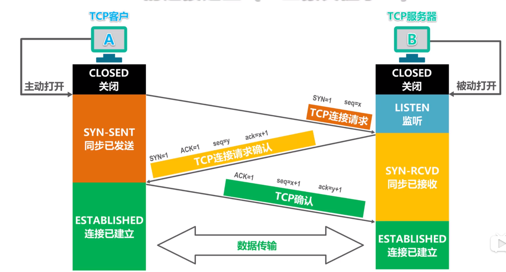
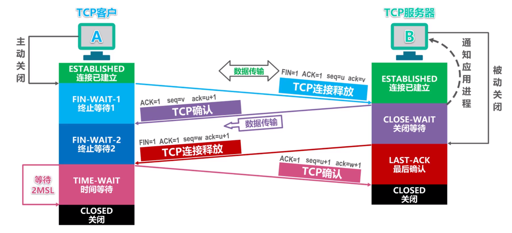

### 一、三次握手

### 二、四次挥手

### 三、TIME-WAIT过多

主动断开连接的主机会进入 `TIME-WAIT` 状态，也就是说大量的关闭操作在等待2个MSL后结束，正常我们的tcp 端口是65535个，如果并发再高一些，可能会大量的socket不能及时被释放，从而导致性能下降。

#### 解决

**net.ipv4.tcp_tw_reuse = 1**

表示开启重用。允许将TIME-WAIT sockets重新用于新的TCP连接，默认为0，表示关闭；

**net.ipv4.tcp_tw_recycle = 1**

表示开启TCP连接中TIME-WAIT sockets的快速回收，默认为0，表示关闭。

**net.ipv4.ip_local_port_range = 1024 65000**

表示用于向外连接的端口范围。缺省情况下很小：32768到61000，改为1024到65000。

### 四、影响TCP网络时延的因素

+ 请求与响应报文的大小
+ 网络和服务器的负载
+ 硬件速度
+ 客户端和服务端的距离
+ TCP连接建立握手（优化：建立长连接）