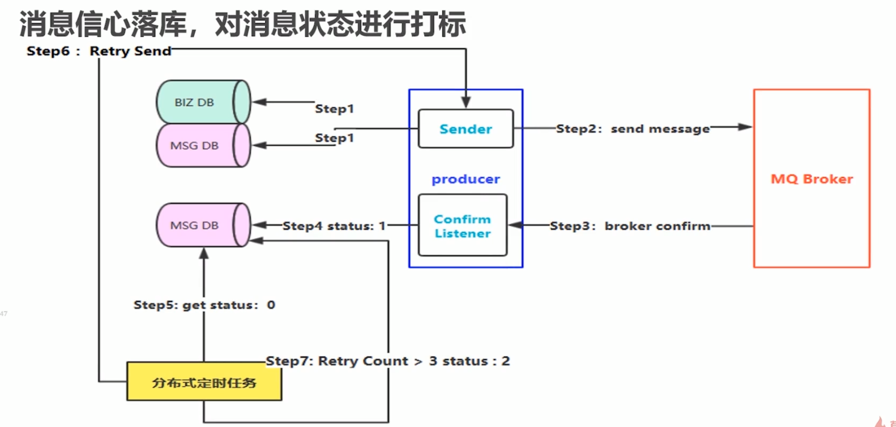
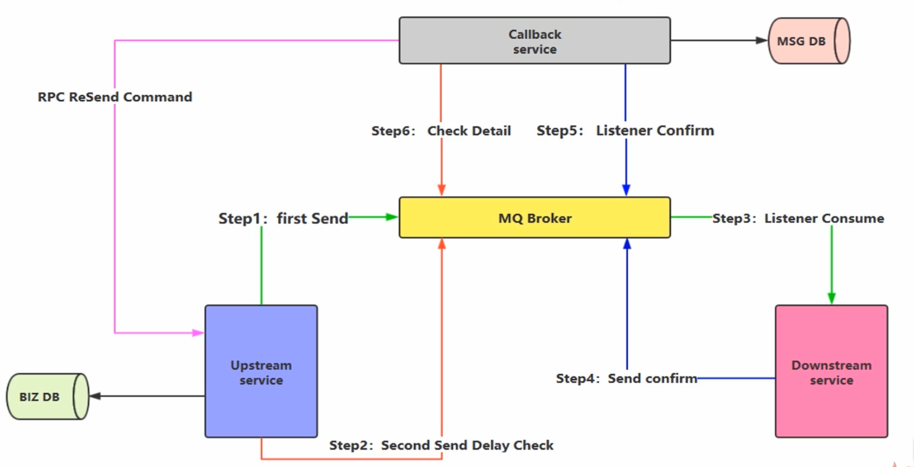

## 消息如何保障 100% 投递

### 生产端的可靠性投递

需要保证以下几点：

+ 保障消息的成功发出
+ 保障 MQ 节点的成功接收
+ 发送端收到 MQ 节点的确认应答
+ 完善的消息进行补偿机制

### 解决生产端可靠性投递


#### 一、消息落库，对消息状态进行打标

将发送的消息持久化到数据库，并且设置状态，比如发送中状态为 0，收到服务端的确认收到消息后修改状态为1。

但是可能因为网络问题存在一些没有响应的消息，此时可以对未发送的消息进行轮询，并尝试重发消息



+ step1: 发送业务消息前，先将业务数据和消息状态入库，并将消息状态初始化为**发送中**
+ step2: 发送业务消息，设置超时时间，同时异步监听 RabbitMQ 响应
+ step3: RabbitMQ 返回响应
+ step4: 根据响应结果，更新消息状态，投递成功则将消息状态设置成**成功**
+ step5: 定时任务找出状态为**发送中**，且时间超时的
+ step6: 重新投递
+ step7: 经过上述步骤多次(通常是3次)循环后，依然失败的，设置消息状态为**失败**
+ step8: 人工去解决状态为**失败**的消息

两个持久化数据库分别记录具体业务和消息内容。因为存在两个持久化，当处于高并发下性能比较低下。


#### 二、消息的延迟投递，做第二次确认，回调检查



`Upstram service` 是生产端，`Downstream service` 是消费端。注意在 `Step1` 之前要先将业务消息入库。

`step2` 在生产端发送消息后再发送二次确认消息，可以设置发送时间，使 MQ 延迟收到消息。

`Callback server` 主要监听延迟投递消息和消费端的确认消费信息。当收到消费端发送的确认消费消息，会将这条消息写入数据库；当收到延迟投递消息，会从数据库查看消息是否成功消费，如果不是，则通知生产端重发消息。


## 消费端幂等性保障

消费端实现幂等性，就意味着我们的消息永远不会被消费多次，即使我们收到了多条一样的消息。


### 一、唯一ID + 指纹码 机制

将 `ID` 和指纹码拼接作为数据库主键，利用数据库主键去重。指纹码可以是我们业务数据或自定义数据，最主要就是保障一个 `ID `+ 指纹码 能唯一标识一个消息。

当收到消息，我们可以通过 `SELECT  COUNT(*) FROM table_name WHERE ID = 唯一ID + 指纹码` 查询是否已经存在消息。

这样做的好处是实现简单，坏处是高并发下存在数据库写入性能瓶颈。

解决办法数据库瓶颈可以根据 `ID` 对数据库分表分库。


### 二、利用 Redis 原子特性实现

利用Redis需要考虑的问题：

一、是否进行数据库落库，如果落库，关键要解决的问题是数据库和缓存如何做到原子性，也就是数据一致性。

如果数据库和缓存不是原子性的，可能存在以下问题，来了一条新消息，`redis` 发现缓存不存在，则进行缓存和写入数据库，可是这时写入数据库失败，也就是数据库没有这条消息。当再来同样的消息，`Redis` 会直接过滤，可是数据库并没有这条数据。

二、如果不进行落库，如何设置同步策略。


## Confirm 确认消息

消息的确认，指生产者投递消息后，如果 `Broker` 收到消息，则会给生产者一个应答。生产者进行接收应答，用来确认这条消息是否正常发送到 `Broker` ，这种方式是消息可靠性投递的核心保障。

### 如何实现Confirm确认消息？

第一步，在 `channel` 开启确认模式：`channel.confirmSelect()`

第二步，在 `channel` 添加监听：`addConfirmListener`，监听成功和失败的返回结果，根据具体结果进行后续操作。

```java
// producer set confirmListener
channel.addConfirmListener(new ConfirmListener() {
    @Override
    public void handleAck(long deliveryTag, boolean multiple) throws IOException {
        System.err.println("========== ack =============");
    }

    @Override
    public void handleNack(long deliveryTag, boolean multiple) throws IOException {
        System.out.println("=============no ack===============");
    }
});
```


## Return 消息机制

`Return Listener` 用于处理不可路由的消息。在某些情况下，我们发送消息的 `Exchange` 不存在或者指定的`routeKey ` 路由不到，我们需要通过 `Return Listener` 监听这些不可达消息。

  

生产端发布消息一个重要参数：`Mandatory` ，如果为 `true` 则监听器会接收到路由不可达的消息，然后进行后续处理，如果为 `false` ，那么 `broker` 端会自动删除消息。

​         

## 消费端限流

### 为什么进行限流

假设我们 `RabbitMQ` 服务器存在大量未处理的消息，如果我们随便打开一个消费端，则此时巨量的消息会全部推送过来，消费端无法瞬间处理这么多消息，可能会出现崩溃。

### 解决

`RabbitMQ` 提供了一种 `qos`（服务质量保证）功能，即在**非自动确认消息的前提下**，如果一定数量的的消息（通过基于 `consumer` 或者 `channel` 设置 `Qos` 的值）为被确认前，不进行消费新的消息。

主要APi：

`void BasicQos(unit prefetchSize, ushort prefetchCount, bool global)`

+ prefetchSize：消息大小限制，一般不限制

+ prefetchCount：通知 `rabbitMQ` 最多不要同时给消费者推送多于 N 个消息，即一旦有 N 个消息没有 `ack`，则该 `consume` 将阻塞，直到有消息 `ack`

+ global：

  true：将上面的设置应用在 `channel` 级别（channel 可以有多个消费者）

  false：将上面的设置应用在 `consumer` 级别

```java
// 消费端设置Qos
channel.basicQos(0, 2, false);
// 注意自动消息回复要设置为false
channel.basicConsume(queueName, false, consumer);
```


## TTL队列/消息

TTL（Time to Live）指生存时间。

RabbitMQ 支持消息的过期时间，在消息发送时可以指定，从消息入队开始计时，只要超过配置的时间，消息会自动清除。


## 死信队列

DLX， Dead-Letter-Exchnge，当消息在一个队列中变成死信（dead message）之后，它能被重新 `publish` 到另一个 `Exchange` ，这个 `Exchange` 就是 `DLX`。

### 消息变成死信几种情况

一、消息被拒绝

二、消息 TTL 过期

三、队列达到最大长度


