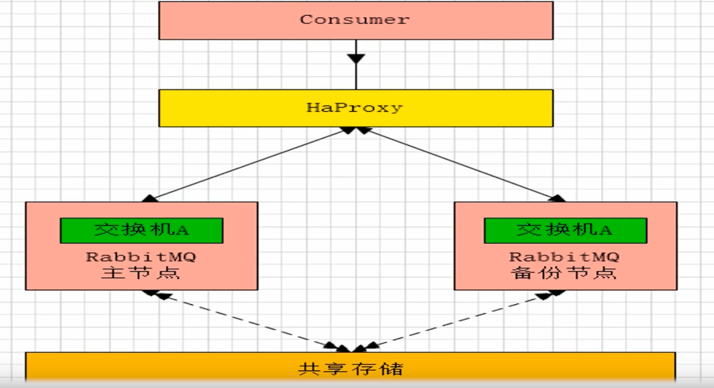
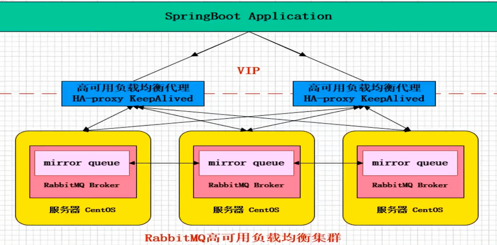
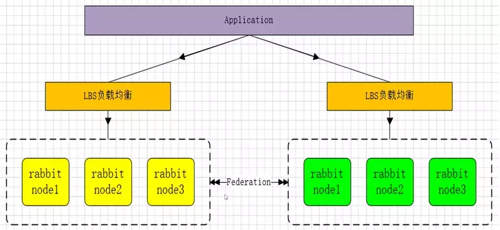

## 主备模式

实现 `RabbitMQ` 的高可用集群，一般在并发和数据量不高的情况下，这种模型简单好用，主备模式也称为 `Warren` 模式。

注意：主备模式和主从模式存在区别，主从模式中从机会提供读服务，而主备模式中，备机并不会提供任何服务。



主备模式主要通过 `HaProxy` 进行故障转移，当主节点出现问题，将备用节点升级为主节点。

### Haproxy 简单配置

```shell
# rabbitmq_cluster为集群名字
listen rabbitmq_cluster
# 监听端口 5672
bind 0.0.0.0:5672
# TCP 模式
mode tcp
# 简单轮询
balance roundrobin
# 主节点, inter每隔5s对mq集群进行健康检查，2次正确说明服务器可用，2次失败说明服务器不可用
server bhz76 127.0.0.1:5672 check inter 5000 rise 2 fall 2
# 备用节点
server bhz77 127.0.0.2:5672 backup check inter 5000 rise 2 fall 2	
```


## 镜像模式

架构图




## 多活模式

部署了多套数据中心，每套数据中心除了 `RabbitMQ` 服务器提供服务外，中心之间还需要实现消息共享。




集群之间的数据共享主要通过 `Federation` 实现。

#### Federation

一个不需要构建 `Cluster` ，而在 `Brokers` 之间传输消息的高性能插件，`Federation` 插件可以在 `Brokers` 或者 `Cluster` 之间传输消息，连接双方可以使用不同的 `users` 和 `virtual hosts`，双方也可以使用版本不同的 `RabbitMQ` 和 `Erlang`。`Federation` 插件使用 `AMQP` 协议通讯，可以接受不连续传输。