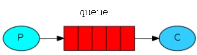
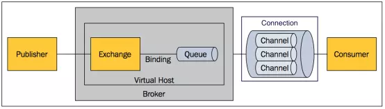
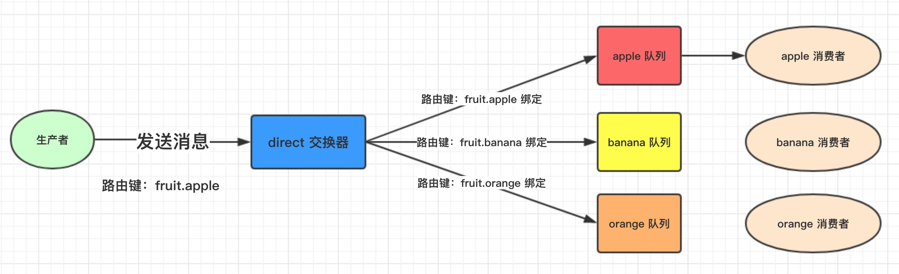
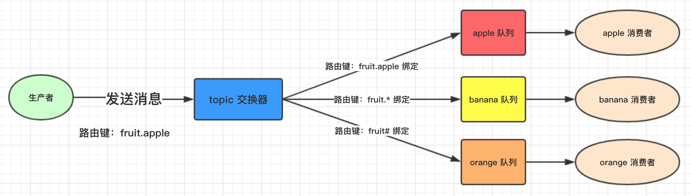
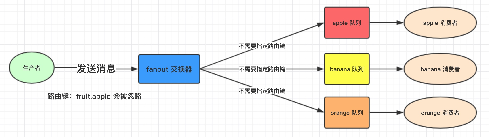

## 概述

RabbitMQ 是一个由 Erlang 语言开发的 AMQP 的开源实现。

AMQP ：Advanced Message Queue，高级消息队列协议。它是应用层协议的一个开放标准，为面向消息的中间件设计，基于此协议的客户端与消息中间件可传递消息，并不受产品、开发语言等条件的限制。


## 相关概念


### 消息模型

所有的消息队列可以大致认为执行的是以下的消息模型，生产者生产消息并发布到队列中，消费者订阅队列并从队列中消费消息。



### AMQP协议模型




+ Broker

  又称 `Server`，接受客户端的连接，实现 `AMQP` 实体服务

+ Connection

  连接，指应用程序与 `Broker` 的网络连接

+ Channel

  网络信道，是进行消息读写的通道，每个 `Channel` 代表一个会话任务

+ Message

  消息，服务器和应用程序之间传送的数据，由 `properties` 和 `body` 组成。`properties`可以对消息进行修饰，如消息优先级、延迟等特性，`Body` 则是消息体内容。

+ Virtual host

  虚拟地址，用于进行逻辑隔离，最上层的消息路由。（如 redis 16个db也是逻辑隔离）一个 `Virtual host` 里面可以有若干个 `Exchange` 和 `Queue`，同一个 `Virtual Host` 不能有相同名称的 `Exchange` 和 `Queue`。

+ Exchange

  交换机，接受消息，根据路由建转发消息到绑定的队列。

+ Binding

  `Exchange` 和 `Queue` 之间的虚拟连接，`binding` 中可以包含 `routing key`。

+ routing key

  一个路由规则，虚拟机根据它来确定如何路由一个特定的消息。

+ Queue

  消息队列，保存和转发消息。

#### RabbitMQ架构


##  基本使用

#### 生产端：

```java
public class Producer {

    public static void main(String[] args) throws Exception{

        // 创建连接工厂
        ConnectionFactory factory = new ConnectionFactory();
        // 配置工厂
        factory.setHost("127.0.0.1");
        factory.setPort(5672);
        factory.setVirtualHost("/");
        // 通过获取连接
        Connection connection = factory.newConnection();
        // 通过连接获取通道
        Channel channel = connection.createChannel();
        // 通过 channel 发送数据
        for (int i = 0; i < 5; i++) {
            String msg = "msg" + i;
            // 参数分别为 exchange, routingKey, properties, message
            // exchange 为空则默认为default的exchange，它会绑定所有的消息队列，将消息路由到队列名与routingKey相等的队列
            channel.basicPublish("", "test", null, msg.getBytes());
        }
        // 关闭资源
        channel.close();
        connection.close();
    }
}
```

#### 消费端：

```java
public class Consumer {

    public static void main(String[] args) throws Exception{
        // 创建连接工厂
        ConnectionFactory factory = new ConnectionFactory();
        // 配置工厂
        factory.setHost("127.0.0.1");
        factory.setPort(5672);
        factory.setVirtualHost("/");
        // 通过获取连接
        Connection connection = factory.newConnection();
        // 通过连接获取通道
        Channel channel = connection.createChannel();
        // 声明队列
        String queueName = "test";
        channel.queueDeclare(queueName,true, false, false, null);
        // 创建消费者
        DefaultConsumer consumer = new DefaultConsumer(channel){
            // handle消息
            @Override
            public void handleDelivery(String consumerTag, Envelope envelope, AMQP.BasicProperties properties, byte[] body) throws IOException {
                String msg = new String(body, StandardCharsets.UTF_8);
                System.out.println("收到消息：" + msg);
            }
        };
        // 设置channel,连接队列和消费者
        channel.basicConsume(queueName, true, consumer);
    }
}

```


## Exchange交换机

主要功能，接收消息，并根据路由建转发消息所绑定的队列。

### 属性

+ name：交换机名称

+ Type：交换机类型 direct、topic、fanout、headers

+ Durability：是否需要持久化，true为持久化

+ Auto Delete：当最后一个绑定到 `Exchange` 上队列删除后，自动删除该 `Exchange`

+ Internal：当前 `Exchange` 是否用于 `RabbitMQ` 内部使用，一般为 `false`

+ Arguments：扩展参数，用于扩展 `AMQP` 协议自定化使用

  

### 交换机类型(type)


#### Direct Exchange

所有发送到 `Direct Exchange` 的消息被转发到 `RouteKey` 中指定的 `Queue`




#### Topic Exchange

所有发送到 `topic exchange` 的消息被转发到所有匹配路由键通配符的队列。

`Exchange` 将 `RouteKey` 和某 `Topic` 进行模糊匹配，此时队列需要绑定一个 `topic`



可以使用通配符进行模糊匹配

| 符号 | 匹配规则                                  |
| ---- | ----------------------------------------- |
| #    | 匹配一个或多个单词                        |
| *    | 只匹配一个词，* 操作符将 “.” 视为分割符。 |


#### Fanout Exchange

不需要路由键，会将消息转发给绑定该路由器的所有队列，Fanout 转发消息最快，因为不需要判断 `routeKey`



