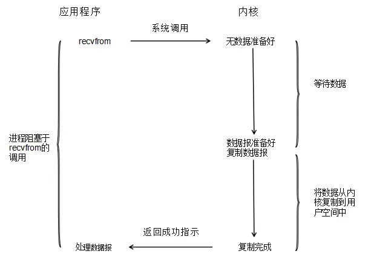
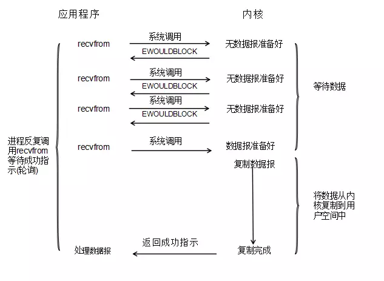
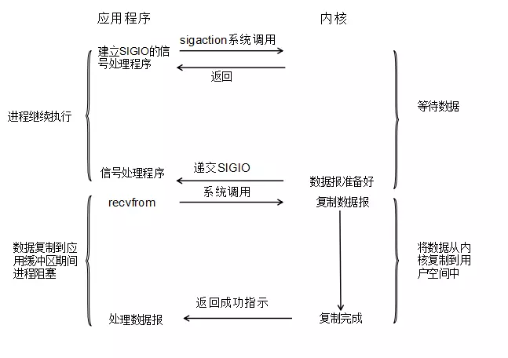
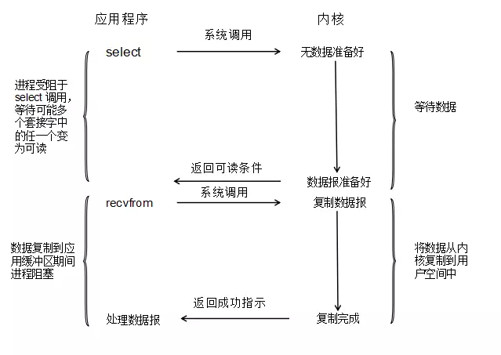
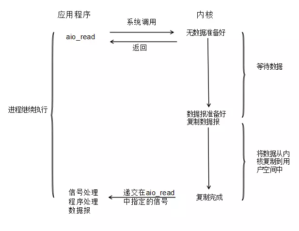
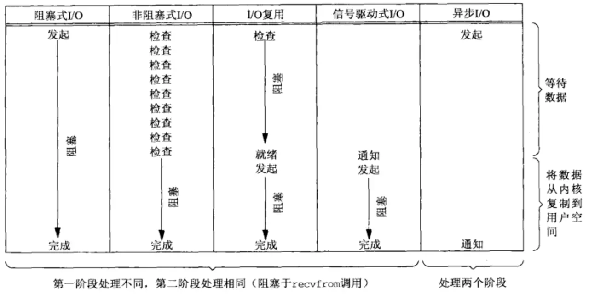

## 同步异步

#### 同步

同步是发起一个请求后，被调用者未处理完请求之前，调用不返回。

#### 异步

异步是发起一个请求后，被调用者立即返回，表示被调用者收到了请求，但返回的不是结果，此时调用者可以去干其他事情，当被调用者处理完请求，可以通过事件、回调函数将结果返回给调用者。


## 阻塞与非阻塞

#### 阻塞

调用者发起一个请求后，一直等待请求结果的返回（在多线程中对应线程被挂起），无法从事其他任务，只有当请求返回结果时才继续执行。

#### 非阻塞

调用者发起请求，不管请求有没有返回结果，调用者都可以去做其他事情。


## 区别

阻塞和同步不是一回事，同步，异步与阻塞，非阻塞针对的对象是不一样的，**阻塞,非阻塞是说的调用者，同步，异步说的是被调用者**


## IO发生时涉及的对象

以 network 读操作为例

#### 主要涉及的两个对象

1. 调用这个 IO 的 process (或者 thread)
2. 一个是系统内核（kernel）

#### 当读操作发生时，会经历两个阶段：

1. 等待数据准备，比如 `accept()`、`recv()` 等待数据，数据被存放在内核
2. 将数据从内核拷贝到用户进程空间中


## IO模型


### 一、阻塞IO模型（BIO）



用户进程通过 `recvfrom` 去接收数据，由于内核数据没有准备好，所以用户进程会阻塞，直到**内核准备好数据并将数据复制到应用进程的缓冲区或者发生错误**才返回。此时用户进程从调用 `recvfrom` 开始到返回结果的过程都是阻塞的。


### 二、非阻塞IO模型（NIO）



当用户进程发出 `read` 操作，通过不停调用 `recvfrom` 去和内核交互，如果内核数据没有准备好，就会返回 `error`。对于用户进程来说，如果得到的结果是 `error` ，则可以判断数据没有准备好，可以去做其他事情，但还是固定时间调用`recvfrom` 去询问内核是否准备好数据。


### 三、信号驱动IO模型



用户进程向内核注册一个信号处理函数，然后立即返回，进程继续工作，不会被阻塞，当内核准备好数据，会产生一个信号通知用户进程，然后用户进程再调用 `recvfrom` 将数据从内核拷贝到用户进程。

#### 信号驱动IO不是异步IO

信号驱动式IO在数据准备阶段是异步的，当内核中有数据报准备后再通知进程，但是在调用 recvfrom操作进行数据拷贝时是同步的，所以总体来说，整个IO过程不能是异步的。


### 四、IO复用模型



IO多路复用使用`select/poll/epoll`函数，单个进程可以处理多个 `IO` 请求。主要做法是多个进程的 `IO` 注册到同一个 `select` 上，当用户进程调用该`select`, `select` 会监听所有注册好的IO，**如果被监听的 IO 需要的数据都没有准备好，那么 select 调用进程会被阻塞**。当任意一个 `IO` 数据准备好之后，`select`调用就会返回，然后用户进程调用 `recvfrom` 将数据复制到用户进程中。

**注意：IO 多路复用并不是非阻塞 IO，因为进程调用 select 后，要一直阻塞等待其监听的 IO 请求中有准备好的数据才返回。**

select函数进化 --> poll --> epoll


### select、poll、epoll

### select

```c
int select(int nfds, fd_set *readfds, fd_set *writefds, fd_set *exceptfds, struct timeval *timeout);
```

对 `select` 的调用会一直阻塞，直到给定的文件描述符数据准备完成或者超时为止。

监视的文件描述符分为三组：

- 监视readfds集中列出的文件描述符，以查看是否有数据可读取。
- 监视writefds集中列出的文件描述符，以查看写操作是否将完成而不会阻塞。
- 监视exceptionfds集中的文件描述符，以查看是否发生了异常或带外数据是否可用（这些状态仅适用于套接字）。


#### select使用例子

```c
sockfd = socket(AF_INET, SOCK_STREAM, 0);
memset(&addr, 0, sizeof (addr));
addr.sin_family = AF_INET;
addr.sin_port = htons(2000);
addr.sin_addr.s_addr = INADDR_ANY;
bind(sockfd,(struct sockaddr*)&addr ,sizeof(addr));
listen (sockfd, 5); 

for (i=0;i<5;i++) 
{
    memset(&client, 0, sizeof (client));
    addrlen = sizeof(client);
    // 返回文件描述符对应整数，随机
    fds[i] = accept(sockfd,(struct sockaddr*)&client, &addrlen);
    // 保存最大文件描述符整数，select函数需要
    if(fds[i] > max)
        max = fds[i];
}
// 上面创建了五个文件描述符


while(1){
    //初始化rset，rset可以认为是 bitmap，是一个由32个整数构成的数组,(32*32bit=1024bit)
    FD_ZERO(&rset);
    // 设置rset，比如fd[i] = 0，则rset第0位的bit为1,表示该位对应的文件描述符编号需要监听
    for (i = 0; i< 5; i++ ) {
        FD_SET(fds[i],&rset);
    }

    puts("round again");
    select(max+1, &rset, NULL, NULL, NULL);

    //遍历所有文件描述符
    for(i=0;i<5;i++) {
        if (FD_ISSET(fds[i], &rset)){
            memset(buffer,0,MAXBUF);
            read(fds[i], buffer, MAXBUF);
            puts(buffer);
        }
    }	
}
```

设置完 `rset` 后，进入 `select` 函数， `select` 会将 `rset` 拷贝到内核，通过内核判断是否有数据到来，如果没有数据到来，程序就会一直阻塞在 `select` 上。

当有数据到来，内核会将 `rset` 对应文件描述符置位，表示该文件描述符有数据到来，然后 `select` 函数返回。

接下来我们就要遍历所有文件描述符，判断哪一个文件描述符被置位，然后去读取对应的数据。 


#### select 不足：

+ `rset`  使 `select` 监听的文件描述符受限制，默认1024
+ 每次循环都要重新设置 `rset`
+ `rset` 从用户态到内核态存在开销
+ 因为 `select` 返回只是表示有数据，并不会告知哪一个文件描述符数据准备好，所以每次都要以 O(n) 的时间去遍历所有的文件描述符


### poll

```c
int poll (struct pollfd *fds, unsigned int nfds, int timeout);
```

第一个参数的结构体

```c
struct pollfd {
     //文件描述符
      int fd;
     //对应的事件，读、写 
      short events; 
      short revents;
};
```

将上面代码改为 poll 实现

```c
for (i=0;i<5;i++) 
{
    memset(&client, 0, sizeof (client));
    addrlen = sizeof(client);
    // 存储文件描述符
    pollfds[i].fd = accept(sockfd,(struct sockaddr*)&client, &addrlen);
    pollfds[i].events = POLLIN;
}
sleep(1);
while(1){
    puts("round again");
    poll(pollfds, 5, 50000);

    for(i=0;i<5;i++) {
        // 判断是否是fd[i]准备好数据
        // 如果有数据，revents会被置为POLLIN
        if (pollfds[i].revents & POLLIN){
            // 将被内核置位的revents重新变为0
            pollfds[i].revents = 0;
            memset(buffer,0,MAXBUF);
            // 处理数据
            read(pollfds[i].fd, buffer, MAXBUF);
            puts(buffer);
        }
    }
}
```

`poll` 和 `select` 很相似，只是不再用 `rset` 来表示文件描述符，这样的话就解决了监听文件描述符受限制的问题。

### epoll


```c
struct epoll_event events[5];
  int epfd = epoll_create(10);
  ...
  ...
  for (i=0;i<5;i++) 
  {
    static struct epoll_event ev;
    memset(&client, 0, sizeof (client));
    addrlen = sizeof(client);
    // 创建文件描述符
    ev.data.fd = accept(sockfd,(struct sockaddr*)&client, &addrlen);
    ev.events = EPOLLIN;
     // 增加文件描述符
    epoll_ctl(epfd, EPOLL_CTL_ADD, ev.data.fd, &ev); 
  }
  
  while(1){
  	puts("round again");
  	nfds = epoll_wait(epfd, events, 5, 10000);
	
	for(i=0;i<nfds;i++) {
			memset(buffer,0,MAXBUF);
			read(events[i].data.fd, buffer, MAXBUF);
			puts(buffer);
	}
  }
```


在 `epoll` 中，可以通过 `epoll_ctl` 动态的增加、删除文件描述符。

`epoll_wait` 函数是返回值的，这跟 `select` 、`poll`  有所区别，如果 `epoll` 监控的文件描述符有数据准备好，跟 `select` 和 `poll` 一样，对应的文件描述符会被置位。只是 `epoll` 处理有所不同，它会将对应的文件描述符移动到文件描述符集合的前面，有多少个文件描述符存在准备好的数据就移动多少个，比如 `[1,2,3,4,5]` 当文件描述符 3, 5 有数据，则会变成 `[3, 5, 1, 2, 4]`，同时，返回准备好数据的文件描述符个数 `nfds` 。这样，`epoll` 就**无需每次都遍历所有文件描述符**，使性能提高。


### 五、异步IO模型 （AIO）



用户进程调用 `aio_read` 函数，给内核传递描述符，缓存区指针，缓存区大小和文件偏移，并通知内核当操作完成后如何通知进程，当内核收到`aio_read`后，会立刻返回，然后内核开始等待数据准备，数据准备好以后，直接把数据拷贝到用户进程空间，然后再通知进程本次IO已经完成。

#### 与信号驱动 IO 区别

信号驱动 `IO` 是由内核通知我们何时去启动一个 `IO` 操作，而异步 `IO` 由内核通知我们 `IO` 操作何时完成。


## 5种 IO 模型比较




## 为什么 Redis 是单线程还这么快

1. redis 是基于内存的，内存读写速度快
2. 因为 redis 是单线程，所以省去很多上下文切换时间
3. redis 使用 IO 多路复用，保证了多连接时，系统的吞吐量


## reference

[怎样理解阻塞非阻塞与同步异步的区别？](https://www.zhihu.com/question/19732473)

[LINUX – IO MULTIPLEXING – SELECT VS POLL VS EPOLL](https://devarea.com/linux-io-multiplexing-select-vs-poll-vs-epoll/)

[漫话：如何给女朋友解释什么是Linux的五种IO模型？](https://juejin.im/post/5b94e93b5188255c672e901e#heading-4)