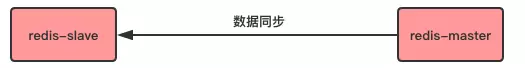
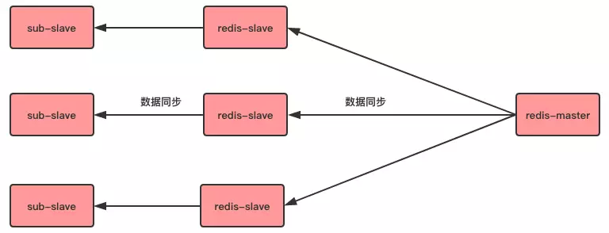
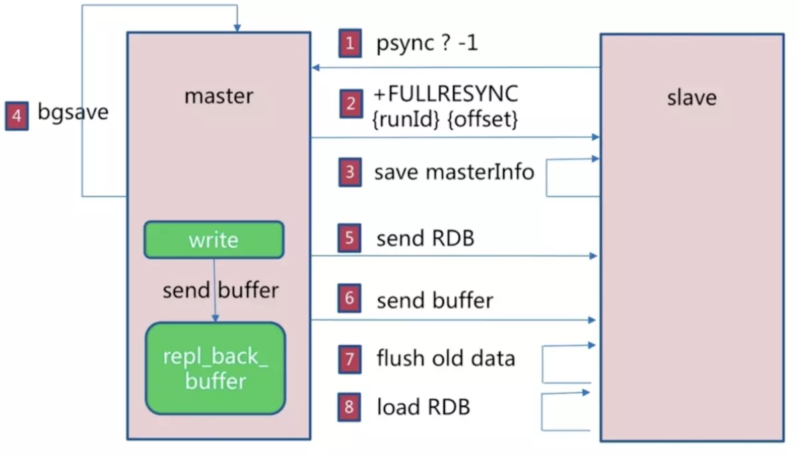
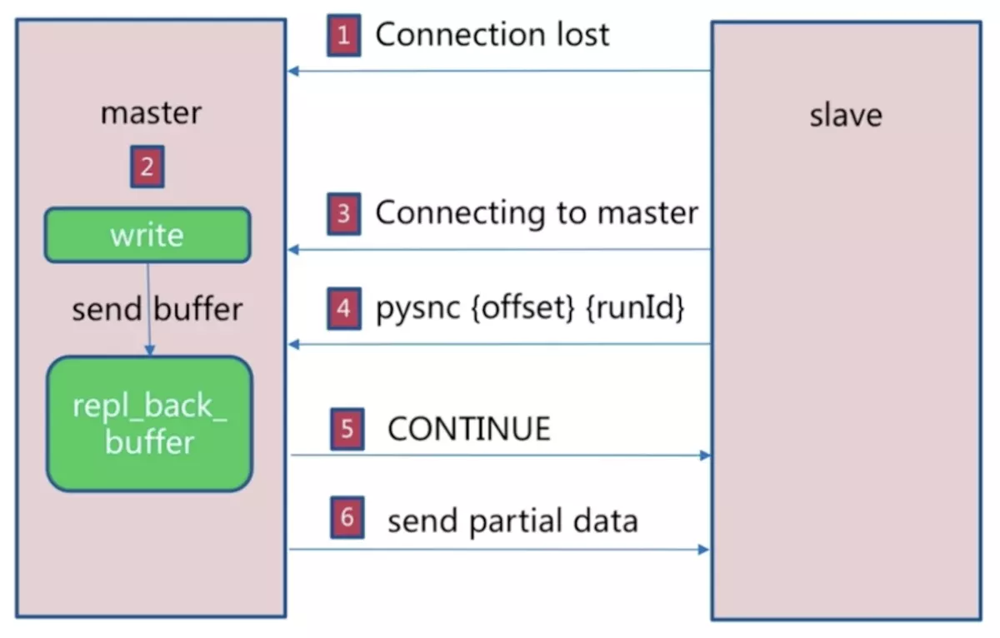

### 主从复制

指主服务器的数据被完全复制到从服务器

### 简单的三种架构

+ 一对一

  一台主服务器的数据被复制到一台从服务器

  

+ 一对多

  一台主服务器的数据被复制到多台从服务器

  

+ 链式一对多

  一对多会造成服务器在同步上消耗过多性能，所以可以让部分从机完成这个工作。

### 配置

使用命令 `slaveof <host> <port>`

在连接过程中，可能会出现的情况。

1. 主节点挂掉

   此时从节点会保持原地待命，并不会主动升级成主节点，但是可以使用命令 `slaveof no one` 变成主节点。

2. 从节点挂掉

   如果从节点挂掉，重新连接后不会主动变为主节点的从节点，除非在配置文件中配置 `slaveof <host> <port>`

### 数据间同步

#### redis 同步命令

sync ：2.8 之前的同步命令

psync：2.8 之后的同步命令，sync 的优化版，支持增量同步

#### psync 命令

格式：`psnyc <runid> <offset>`

+ runid 

  节点运行ID。redis **每次启动**后都会生成一个运行 ID。如果运行 ID 不同，slave 节点会请求进行全量复制。

+ offset

  节点的复制偏移量。参与复制的主从节点都会维护自身的复制偏移量，主节点在处理完**写命令**之后，会将命令长度做累加记录，从节点在接收到主节点发送的命令后也会执行自身的偏移量，**通过对比主从节点的复制偏移量可以判断主从节点是否一致**。

  从节点每秒会发送自身的复制偏移量给主节点，所以主节点会保存它所属的所有从节点的复制偏移量。以上的信息都可以通过命令 `info replication` 获得。

**psync 执行时主节点还需要一个缓冲区（默认1MB）。**因为从节点在接受同步数据时，主节点还在接受新的写入命令，所以主节点需要开辟一个缓冲区来保存同步过程中新的写入命令，等全量同步完成后再将这些命令发送给从节点执行，保持主从一致。

psync 执行流程：

从节点发送 `psync` 命令给主节点，如果没有目标节点的ID， runid 默认为 -1，offset 是从节点保存的复制偏移量，如果是第一次复制，则为-1。

主节点的回复：

1. 回复 `+FULLRESYNC {runId} {offset}`，从节点触发全量复制
2. 回复 `+CONTINUE`，从节点触发部分复制
3. 回复 `+ERR`，表明主节点不支持 `psync` 命令，将执行 `sync` 进行全量复制

### 全量复制

将主节点的全部数据一次性发送给从节点。

#### 复制过程：

1. 从节点发送 `psync` 命令
2. 主节点根据命令返回 `FULLRESYNC`
3. 从节点保存主节点的 runId 和 offset
4. 主节点执行 `bgsave` 命令，在后台生成 RDB 文件，并在复制缓存区记录从现在开始执行的所有写命令
5. 主节点发送 RDB 文件给从节点
6.  主节点发送缓冲区数据
7. 从节点清空数据后加载 RDB 文件
8. 从节点加载完 RDB 文件后，如果开启了 AOF，则立即进行 `bgrewriteaof` 命令

注意：从节点在接受主节点数据时，即从主节点执行 `bgsave` 命令到从节点加载完 RDB 文件的过程中，如果花费的时间太久，可能会导致缓存区堆压大量写命令溢出，全量同步失败。

### 部分复制

部分复制在 Redis 2.8 之后出现，用于处理主从复制中因为网络闪断等问题造成的数据丢失场景。在**命令传播阶段**，断线重复制只需要发送主服务器在断开期间执行的写命给从服务器即可，因为补发的数据量远远小于全量数据，可以有效减少成本。如果网络中断时间过长，造成主节点没有能够完整地保存中断期间执行的写命令，则无法进行部分复制，仍使用全量复制

1. 如果从节点出现网络中断，超过了 repl-timeeout 时间，主节点就会中断复制连接
2. 主节点会将请求的数据写入复制积压缓冲区，默认1MB
3. 当从节点恢复，重新连接上主节点，从节点会将自己的 offset 和主节点 ID 发送到主节点，执行 psync 命令
4. 如果主节点发现从节点的偏移量在缓冲区的范围内，则会返回 continue 命令
5. 主节点将缓冲区的数据发送到从节点

### 复制过程

### 心跳机制

主从中都有心跳机制，模拟成对方的客户端进行通信，可以通过 `client list` 查看相关客户端信息，主节点连接状态 flags = M， 从节点的连接状态为 flags = S。

主节点默认每隔 10 秒向从节点发送 `ping` 命令，可以通过修改配置 `repl-ping-slave-period` 修改发送频率。

从节点每秒向主节点发送 `replconf ack <offset>` 命令，汇报自身复制偏移量。

主节点收到 replconf 信息后，判断从节点是否超时，默认超过 60 秒超时。

## 哨兵(Sentinel)模式

### 什么是哨兵模式

在上面提到的主从复制模式下，如果主服务器不能正常工作，从服务器是不能主动转为主服务器的，只能手动操作，这样会造成服务停止，为了解决这个问题，redis 提出了哨兵模式。

哨兵模式是（Sentinel）redis 提供的高可用解决方案，由一个或多个 Sentinel 实例组成的 Sentinel 系统用来监控、管理主服务器以及连接的所有从服务器。

哨兵模式主要提供了以下功能：

+ 集群监控（Monitoring）：Sentinel 会不断检查所监控的主服务器和从服务器是否正常工作
+ 故障通知（Notification）：如果被监控的某个 Redis 服务出现故障，Sentinel 可以通过 API 通知管理员
+ 自动故障转移（Automatic failover）：如果主服务器不能正常工作，Sentinel 会开始自动故障转移，将故障的主服务器一个从服务器升级为主服务器，并且让故障主服务器的其他从节点改为复制新的主服务器。
+ 配置中心（Configuration provider）：如果发生故障转移，Sentinel 会通知 client 新的 master 地址

架构图：

### Reference

[Redis的复制是如何实现的？ - 忠实的码农的文章 - 知乎]( https://zhuanlan.zhihu.com/p/62910849)

https://juejin.im/post/5c973584e51d455ecf51cb20#heading-4

https://juejin.im/post/5db9796c6fb9a0202610c235

