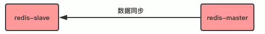
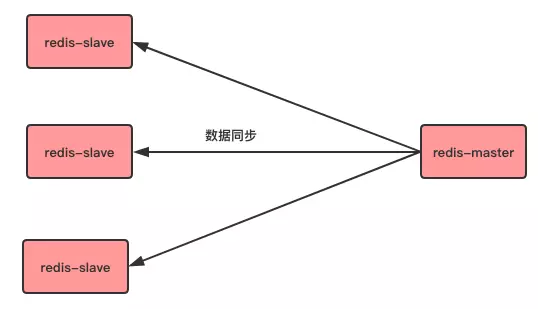
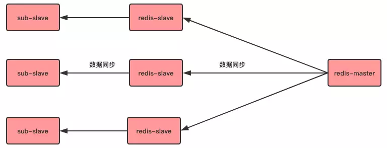
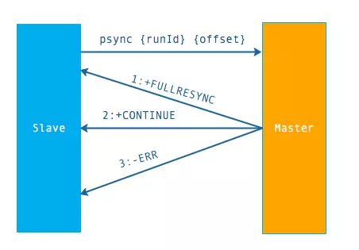
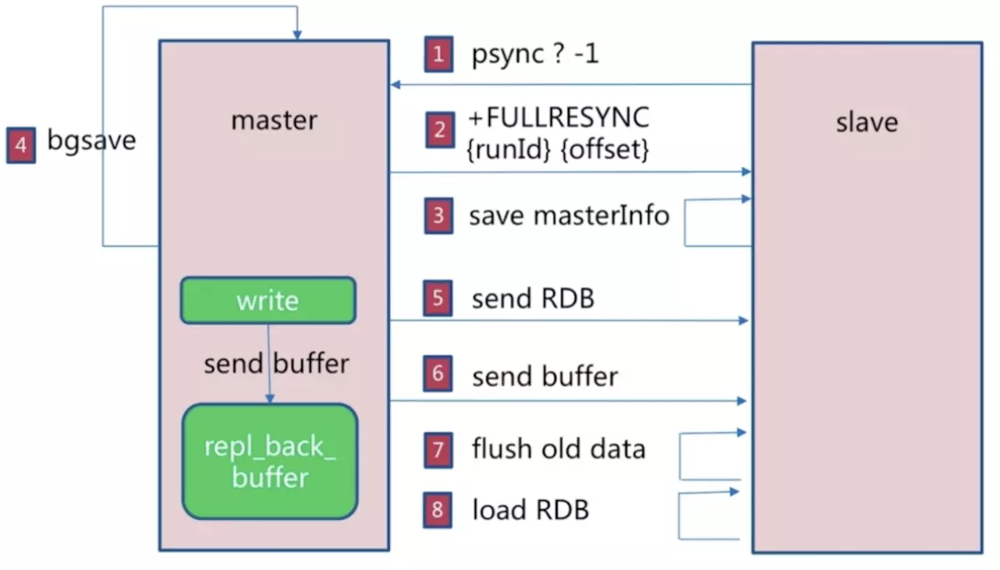
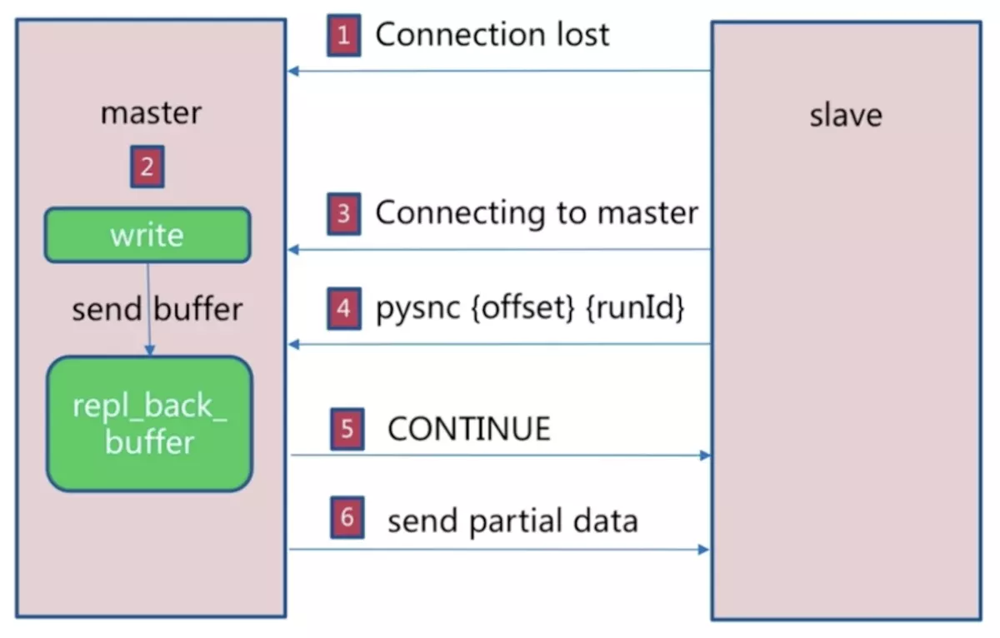
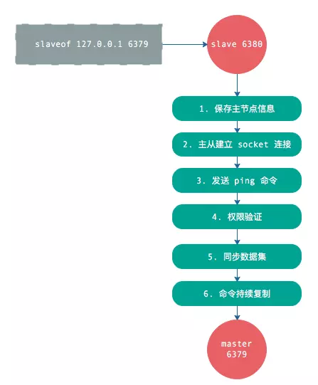
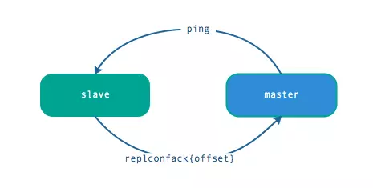
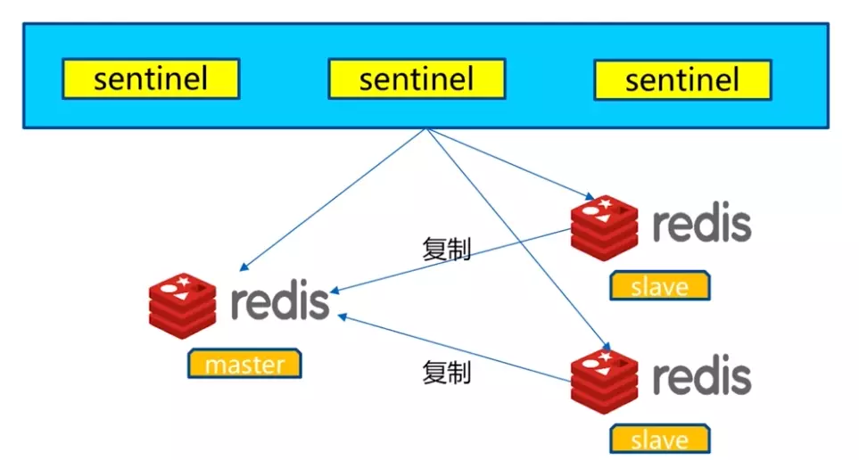
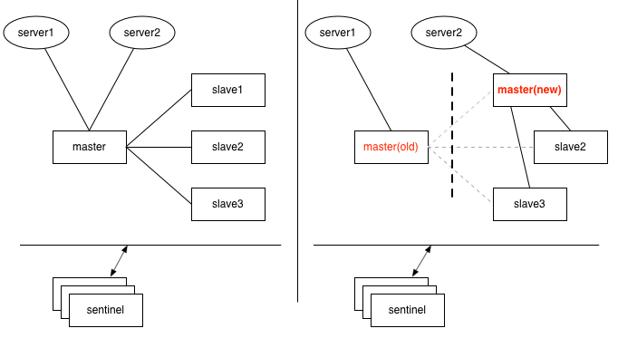

### 主从复制

指主服务器的数据被完全复制到从服务器

### 简单的三种架构

+ 一对一

  一台主服务器的数据被复制到一台从服务器

  



+ 一对多

  一台主服务器的数据被复制到多台从服务器

  



+ 链式一对多

  一对多会造成服务器在同步上消耗过多性能，所以可以让部分从机完成这个工作。



### 配置

使用命令 `slaveof <host> <port>`

在连接过程中，可能会出现的情况。

1. 主节点挂掉

   此时从节点会保持原地待命，并不会主动升级成主节点，但是可以使用命令 `slaveof no one` 变成主节点。

2. 从节点挂掉

   如果从节点挂掉，重新连接后不会主动变为主节点的从节点，除非在配置文件中配置 `slaveof <host> <port>`

### 数据间同步

#### redis 同步命令

sync ：2.8 之前的同步命令

psync：2.8 之后的同步命令，sync 的优化版，支持增量同步


#### psync 命令

格式：`psnyc <runid> <offset>`

+ runid 

  节点运行ID。redis **每次启动**后都会生成一个运行 ID。如果运行 ID 不同，slave 节点会请求进行全量复制。

+ offset

  节点的复制偏移量。参与复制的主从节点都会维护自身的复制偏移量，主节点在处理完**写命令**之后，会将命令长度做累加记录，从节点在接收到主节点发送的命令后也会执行自身的偏移量，**通过对比主从节点的复制偏移量可以判断主从节点是否一致**。

  从节点每秒会发送自身的复制偏移量给主节点，所以主节点会保存它所属的所有从节点的复制偏移量。以上的信息都可以通过命令 `info replication` 获得。

**psync 执行时主节点还需要一个缓冲区（默认1MB）。**因为从节点在接受同步数据时，主节点还在接受新的写入命令，所以主节点需要开辟一个缓冲区来保存同步过程中新的写入命令，等全量同步完成后再将这些命令发送给从节点执行，保持主从一致。

psync 执行流程：



从节点发送 `psync` 命令给主节点，如果没有目标节点的ID， runid 默认为 -1，offset 是从节点保存的复制偏移量，如果是第一次复制，则为-1。

主节点的回复：

1. 回复 `+FULLRESYNC {runId} {offset}`，从节点触发全量复制
2. 回复 `+CONTINUE`，从节点触发部分复制
3. 回复 `+ERR`，表明主节点不支持 `psync` 命令，将执行 `sync` 进行全量复制

### 全量复制

将主节点的全部数据一次性发送给从节点。



#### 复制过程：

1. 从节点发送 `psync` 命令
2. 主节点根据命令返回 `FULLRESYNC`
3. 从节点保存主节点的 runId 和 offset
4. 主节点执行 `bgsave` 命令，在后台生成 RDB 文件，并在复制缓存区记录从现在开始执行的所有写命令
5. 主节点发送 RDB 文件给从节点
6.  主节点发送缓冲区数据
7. 从节点清空数据后加载 RDB 文件
8. 从节点加载完 RDB 文件后，如果开启了 AOF，则立即进行 `bgrewriteaof` 命令

注意：从节点在接受主节点数据时，即从主节点执行 `bgsave` 命令到从节点加载完 RDB 文件的过程中，如果花费的时间太久，可能会导致缓存区堆压大量写命令溢出，全量同步失败。


### 部分复制

部分复制在 Redis 2.8 之后出现，用于处理主从复制中因为网络闪断等问题造成的数据丢失场景。在**命令传播阶段**，断线重复制只需要发送主服务器在断开期间执行的写命给从服务器即可，因为补发的数据量远远小于全量数据，可以有效减少成本。如果网络中断时间过长，造成主节点没有能够完整地保存中断期间执行的写命令，则无法进行部分复制，仍使用全量复制



1. 如果从节点出现网络中断，超过了 repl-timeeout 时间，主节点就会中断复制连接
2. 主节点会将请求的数据写入复制积压缓冲区，默认1MB
3. 当从节点恢复，重新连接上主节点，从节点会将自己的 offset 和主节点 ID 发送到主节点，执行 psync 命令
4. 如果主节点发现从节点的偏移量在缓冲区的范围内，则会返回 continue 命令
5. 主节点将缓冲区的数据发送到从节点


### 复制过程



### 心跳机制

主从中都有心跳机制，模拟成对方的客户端进行通信，可以通过 `client list` 查看相关客户端信息，主节点连接状态 flags = M， 从节点的连接状态为 flags = S。

主节点默认每隔 10 秒向从节点发送 `ping` 命令，可以通过修改配置 `repl-ping-slave-period` 修改发送频率。

从节点每秒向主节点发送 `replconf ack <offset>` 命令，汇报自身复制偏移量。

主节点收到 replconf 信息后，判断从节点是否超时，默认超过 60 秒超时。




## 哨兵(Sentinel)模式


### 什么是哨兵模式

在上面提到的主从复制模式下，如果主服务器不能正常工作，从服务器是不能主动转为主服务器的，只能手动操作，这样会造成服务停止，为了解决这个问题，redis 提出了哨兵模式。

哨兵模式是（Sentinel）redis 提供的高可用解决方案，由一个或多个 Sentinel 实例组成的 Sentinel 系统用来监控、管理主服务器以及连接的所有从服务器。

哨兵模式主要提供了以下功能：

+ 集群监控（Monitoring）：Sentinel 会不断检查所监控的主服务器和从服务器是否正常工作
+ 故障通知（Notification）：如果被监控的某个 Redis 服务出现故障，Sentinel 可以通过 API 通知管理员
+ 自动故障转移（Automatic failover）：如果主服务器不能正常工作，Sentinel 会开始自动故障转移，将故障的主服务器一个从服务器升级为主服务器，并且让故障主服务器的其他从节点改为复制新的主服务器。
+ 配置中心（Configuration provider）：如果发生故障转移，Sentinel 会通知 client 新的 master 地址

架构图：



### 部署

Sentinel 需要通过配置文件部署，Sentinel System 会使用这个文件来保存当前状态，以便在重启时重新加载。如果未提供配置文件或配置文件路径不可写，Sentinel只会拒绝启动。

Sentinels 默认监听 TCP 端口 26379。redis 官网推荐至少部署三个 Sentinel 实例，并且在不同主机上，以保证系统健壮性。

#### 配置文件

一个简单的配置文件 sentinel.conf：

```shell
# 监控的第一个主机
sentinel monitor mymaster 127.0.0.1 6379 2
sentinel down-after-milliseconds mymaster 60000
sentinel failover-timeout mymaster 180000
sentinel parallel-syncs mymaster 1

# 监控的第二个主机
sentinel monitor resque 192.168.1.3 6380 4
sentinel down-after-milliseconds resque 10000
sentinel failover-timeout resque 180000
sentinel parallel-syncs resque 5
```

其中，配置监控 master 的语句为：

`sentinel monitor <master-group-name> <ip> <port> <quorum>`

对应 sentinel.conf 中的：

`sentinel monitor mymaster 127.0.0.1 6379 2`

`sentinel monitor resque 192.168.1.3 6380 4`


如第一个表示监控 127.0.0.1:6379 这个主机，并且设置主机名为 mymaster，2 表示至少需要两个 Sentinel 同意才能判断主节点出现故障并进行故障转移，**如果Sentinel 数量不够，自动故障迁移就不会执行**。

注意：quorum 仅仅用于决定是否主节点出现故障。为了进行故障转移，需要进行投票，选出一个哨兵来进行故障转移。

#### 一、部署主从节点

一个主节点（port=6379），两个从节点（port=6380、6381）

主节点

```shell
port 6379
daemonize yes
logfile "6379.log"
dbfilename "dump-6379.rdb"
```

两个从节点

```shell
# 6380
port 6380
daemonize yes
logfile "6380.log"
dbfilename "dump-6380.rdb"
slaveof 192.168.92.128 6379

# 6381
port 6381
daemonize yes
logfile "6381.log"
dbfilename "dump-6381.rdb"
slaveof 192.168.92.128 6379
```

接着启动，使用 `info replication` 查看主节点状态

```shell
# Replication
# 节点角色
role:master
# 从节点数量
connected_slaves:2
slave0:ip=127.0.0.1,port=6380,state=online,offset=112,lag=1
slave1:ip=127.0.0.1,port=6381,state=online,offset=112,lag=1
master_replid:023b0c821463304c8e1719cd6673ca5be6cea06c
master_replid2:0000000000000000000000000000000000000000
master_repl_offset:112
second_repl_offset:-1
repl_backlog_active:1
repl_backlog_size:1048576
repl_backlog_first_byte_offset:1
repl_backlog_histlen:112
```


#### 二、部署 Sentinel 节点

部署三个 Sentinel 实例构成 Sentinel System

sentinel26379.conf

```shell
port 26379
daemonize yes
logfile "26379.log"
sentinel monitor mymaster 127.0.0.1 6379 2
```

启动哨兵的两种方法，两者没有区别

```shell
redis-sentinel sentinel-26379.conf
redis-server   sentinel-26379.conf --sentinel
```

启动后连接其中一个哨兵实例 

```shell
redis-cli -p 26379
```

查看其中一个哨兵状态

```shell
current-epoch127.0.0.1:26379> info Sentinel
# Sentinel
sentinel_masters:1
sentinel_tilt:0
sentinel_running_scripts:0
sentinel_scripts_queue_length:0
sentinel_simulate_failure_flags:0
# 主节点信息，以及发现了其他哨兵
master0:name=mymaster,status=ok,address=127.0.0.1:6379,slaves=2,sentinels=3
```

此时查看 Sentinel 的配置文件会发现多了一些内容

```shell
port 26379
daemonize yes
logfile "26379.log"
sentinel myid a39c4723d1265b71c50bbb02e42abbdc5c087719
# Generated by CONFIG REWRITE
dir "/home/zpffly/application/redisconf"
protected-mode no
sentinel deny-scripts-reconfig yes
sentinel monitor mymaster 127.0.0.1 6379 2
sentinel config-epoch mymaster 0
sentinel leader-epoch mymaster 0
sentinel known-replica mymaster 127.0.0.1 6380
sentinel known-replica mymaster 127.0.0.1 6381
sentinel known-sentinel mymaster 127.0.0.1 26381 15d3a0fc91ee1914e82eb235d3d57fdf411b02bb
sentinel known-sentinel mymaster 127.0.0.1 26380 d06bd80d17f75fdf472c6126507c6b61d3df62eb
sentinel current-epoch 0
```

其中 current-epoch 是计数器，每进行一轮哨兵选举，该数据会加一。

#### 三、故障转移

1. kill 主节点

2. 在哨兵节点中使用 `info Sentinel` 查看相关信息，可以发现，主节点还没有切换

   ```shell
   # Sentinel
   sentinel_masters:1
   sentinel_tilt:0
   sentinel_running_scripts:0
   sentinel_scripts_queue_length:0
   sentinel_simulate_failure_flags:0
   master0:name=mymaster,status=ok,address=127.0.0.1:6379,slaves=2,sentinels=3
   ```

3. 一段时间后重新查看

   ```shell
   # Sentinel
   sentinel_masters:1
   sentinel_tilt:0
   sentinel_running_scripts:0
   sentinel_scripts_queue_length:0
   sentinel_simulate_failure_flags:0
   master0:name=mymaster,status=ok,address=127.0.0.1:6380,slaves=2,sentinels=3
   ```

   发现主节点已经被切换为 127.0.0.1:6380，并且该节点有两个从节点。因为哨兵将故障的 127.0.0.1:6379 节点作为新主节点的从节点。当我们重新启动 6379 节点，会发现它是 6380 的从节点。

   ```shell
   $ redis-cli -p 6380 info replication
   # Replication
   role:master
   connected_slaves:2
   slave0:ip=127.0.0.1,port=6381,state=online,offset=765407,lag=1
   slave1:ip=127.0.0.1,port=6379,state=online,offset=765407,lag=1
   master_replid:3ee1ba0d6077f2e61d848506b19a1cd3612a9c9a
   master_replid2:023b0c821463304c8e1719cd6673ca5be6cea06c
   master_repl_offset:765407
   second_repl_offset:276188
   repl_backlog_active:1
   repl_backlog_size:1048576
   repl_backlog_first_byte_offset:1
   repl_backlog_histlen:765407
   ```

   查看 6379 和 6380 的配置文件可以发现，新的主节点没有了 slaveof 的配置，而从节点的 slaveof 新的节点，故障重新启动的节点也多了 replicaof 的命令

   6379.conf

   ```shell
   port 6379
   daemonize yes
   logfile "6379.log"
   dbfilename "dump-6379.rdb"
   # Generated by CONFIG REWRITE
   dir "/home/zpffly/application/redisconf"
   # 相当于slaveof 127.0.0.1 6380
   replicaof 127.0.0.1 6380
   ```

   6380.conf，没有了 slaveof 语句

   ```shell
   port 6380
   daemonize yes
   logfile "6380.log"
   dbfilename "dump-6380.rdb"
   
   # Generated by CONFIG REWRITE
   dir "/home/zpffly/application/redisconf"
   ```

   6381.conf

   ```shell
   port 6381
   daemonize yes
   logfile "6381.log"
   dbfilename "dump-6381.rdb"
   replicaof 127.0.0.1 6380
   # Generated by CONFIG REWRITE
   dir "/home/zpffly/application/redisconf"
   ```


### 哨兵节点支持的命令

哨兵节点可以认为是特殊的 Redis 节点，其支持的命令和普通的 Redis 节点不同。

+ `info Sentinel`：获取监控的所有主节点的基本信息
+ `Sentinel masters`：获取监控的所有主节点的详细信息
+ `Sentinel master {masterName}`：获取监控的所有主节点中指定的主节点信息
+ `Sentinel slaves {masterName}`：获取指定的监控主节点的从节点信息
+ `Sentinel sentinel {masterName}`：获取监控指定主节点的哨兵信息
+ `Sentinel monitor {masterName} {host} {port} {quorum}`：增加监控节点
+ `Sentinel remove {masterName}` ： 对指定节点取消监控
+ `Sentinel failover {masterName}` ：强制进行故障转移，不需要询问其他 Sentinel


### Sentinel 相关概念

#### 主观下线

Subjectively Down，简称 SDOWN，指单个 Sentinel 实例对服务器做出的下线判断。如果一个服务器在指定的时间内没有对向它发送 PING 命令的 Sentinel 返回一个有效的回复，那么这个 Sentinel 会将这个服务器标记为主观下线。

#### 客观下线

Objectively Down，简称 ODOWN，指多个 Sentinel 实例对同一个服务器做出 SDOWN 判断。从主观下线状态切换到客观下线状态并没有使用严格的法定人数算法（strong quorum algorithm）， 而是使用了流言协议： **如果 Sentinel 在给定的时间范围内， 从其他 Sentinel 那里接收到了足够数量的主服务器下线报告， 那么 Sentinel 就会将主服务器的状态从主观下线改变为客观下线。 如果之后其他 Sentinel 不再报告主服务器已下线， 那么客观下线状态就会被移除。**

**需要特别注意的是，客观下线是主节点才有的概念；如果从节点和哨兵节点发生故障，被哨兵主观下线后，不会再有后续的客观下线和故障转移操作。**

#### 定时任务

每个 Sentinel 维护了 3 个定时任务。

1. 向主从节点发送 `info` 命令获取最新的主从结构
2. 通过发布订阅功能获取其他哨兵节点信息
3. 以每秒钟一次的频率向它所知的主服务器、从服务器以及其他 Sentinel 实例发送一个 PING 命令，判断节点是否在线

#### 哨兵集群的自动发现机制

哨兵互相之间的发现，是通过 redis 的 `pub/sub` 系统实现的。

+ 每个 Sentinel 会以每两秒一次的频率，向被它监视的所有主服务器和从服务器的 `__sentinel__:hello` 频道发送一条信息，信息中包括 Sentinel 的 IP 地址、端口号和、runId、对这个 master 的监控配置
+ 每个 Sentinel 都订阅了被它监视的所有主服务器和从服务器的 `__sentinel__:hello` 频道，查找之前没有出现 Sentinel。当发现新的 Sentinel，当前 Sentinel 会将新的 Sentinel 添加入一个列表，这个列表保存了 Sentinel 已知的，监视同一主服务器的其他 Sentinel。


### Sentinel 基本原理

#### 一、Sentinel集群选举Leader

当主节点被判定为客观下线，各个哨兵会进行协商，选举出一个领导者哨兵，由这个领导者哨兵进行故障转移。

监视该主节点的所有哨兵都有可能被选为领导者，选举使用 Raft 算法，其主要思想是先到先得，选举成为Leader的最低票数为`quorum`和`Sentinel节点数/2+1`的最大值。**在一轮选举中，哨兵 A 向哨兵 B 发送成为领导者的申请，如果 B 没有同意过其他哨兵，则会同意 A 成为领导。**

一般来说，选举的过程很快，谁先完成客观下线，一般就能成为领导哨兵。


#### 二、Sentinel Leader选取新的主节点

Sentinel Leader 按照如下的顺序选取新的主节点

1. 过滤故障节点，如果从节点和主节点断开连接的时间超过 `down-after-milliseconds` 的10倍，则会被认为是故障节点被过滤。
2. 选择优先级 `slave-priority` 最大的从节点作为主节点，如果不存在或者一样大则继续
3. 选择复制偏移量最大的节点
4. 选择 runId 最小从节点 


#### 三、故障转移

选举出新的主节点后

1. 更新主从状态：通过 `slaveof no one` 命令，让选出来的节点称为主节点，并通过 `slaveof` 命令让其他节点成为新节点的从节点。
2. 将已经下线的主节点设置为新主节点的从节点，当下线的主节点重新上线，会成为新主节点的从节点。
3. 更新完成后，新主节点生成最新的 master 配置，并同步给其他节点。


### sentinel 配置文件其他配置

配置的基本格式如下：

```
sentinel <选项的名字> <主服务器的名字> <选项的值>
```

几个常用选项：

+ `down-after-milliseconds` 

  指定 Sentinel 认为服务器已经断线所需要的毫秒数。哨兵使用 `ping` 命令对其他节点进行心跳检测，如果超过 `down-after-milliseconds` 配置的时间没有正常回复，则哨兵对其进行主观下线。该配置对主节点、从节点和哨兵节点的主观下线判定都有效。

+ `parallel-syncs`

  指定了故障转移后，每次向主节点发起复制操作的从节点个数。 比如，主节点切换后，有三个节点要向新节点发起复制，如果指定 `parallel-syncs=1`，则节点会一个一个开始复制，如果 `parallel-syncs=3`，则 3 个节点会同时开始复制。

+ `failover-timeout`

  故障转移超时判断相关。但是该参数不是用来判断整个故障转移阶段的超时，而是其几个子阶段的超时，例如如果主节点晋升从节点时间超过 timeout，或从节点向新的主节点发起复制操作的时间（不包括复制数据的时间）超过 timeout，都会导致故障转移超时失败。
  
  

## 相关问题

### 为什么官方推荐最少三个 Sentinel 节点

一个 Sentinel 节点选举成为 Leader 最低票数为 `quorum` 和 `Sentinel节点数/2+1` 的最大值，如果 Sentinel 集群只有两个节点，则

 ```
Sentinel节点数/2 + 1 = 2
 ```

即 Leader 最低票数为2，如果有一个 Sentinel 出现故障，则剩下的节点无法成为 Leader，则故障转移不会发生。


### 数据丢失问题

+ 异步复制导致数据丢失

  因为 master 和 slave 的数据同步是异步的，所以可能存在部分数据还没有复制到 slave，master 就宕机了，此时未同步的数据就丢失了。

+ 脑裂导致的数据丢失

  脑裂：指 master 脱离了正常的网络，跟其他的节点（slave 及 Sentinel）不能连接，但实际上 master 还在运行，此时哨兵可能认为 master 宕机了，然后选举出新的 master，这时，集群中存在两个 master。

  虽然某个 slave 被选举成 master，但是可能 client 还没来得及切换到新的 master，继续向旧的 master 写入数据。当旧 master 恢复后，会被作为新节点的一个 slave，这时，旧 master 的数据会被清空，同步新 master 的数据。而 client 向旧 master写入的数据就丢失了。 



#### 如何解决？

进行如下配置

```shell
# 至少有一个slave才进行写操作
min-slaves-to-write 1
# 从服务器的延迟不超过10s，超过则不再接受请求
min-slaves-max-lag 10
```

+ 减少异步复制数据的丢失

  `min-slaves-max-lag` 确保了一旦 slave 和 master 延时太长，就可以认为 master 宕机后会损失较多的数据，拒绝写请求。这样可以把 master 宕机时未同步数据范围降低。

+ 减少脑裂的数据丢失

  如果一个 master 出现脑裂，上面配置保证了如果没有指定数量的 slave 或者 slave 超过 10s 没有给自己发送 ack 消息，那么拒绝请求。这样，在脑裂的场景下，最多丢失 10s 的数据。


### Reference

[Redis的复制是如何实现的？ - 忠实的码农的文章 - 知乎]( https://zhuanlan.zhihu.com/p/62910849)

https://juejin.im/post/5c973584e51d455ecf51cb20#heading-4

https://juejin.im/post/5db9796c6fb9a0202610c235

https://redis.io/topics/sentinel

[https://www.kuranado.com/2018/11/04/Redis%E5%93%A8%E5%85%B5%E6%A8%A1%E5%BC%8F/](https://www.kuranado.com/2018/11/04/Redis哨兵模式/)

https://github.com/doocs/advanced-java/blob/master/docs/high-concurrency/redis-sentinel.md