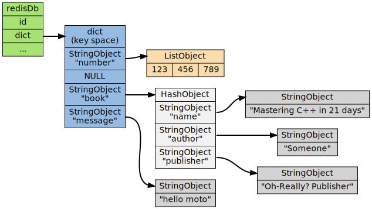
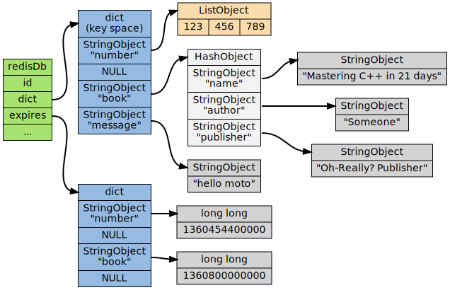
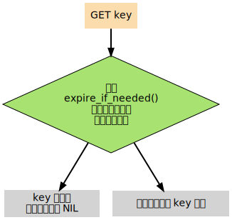

## 内存回收机制

Redis 内存回收机制主要分为过期删除策略和内存淘汰策略


### 过期删除策略

删除过期的键


#### 一、定时删除

在设置键过期时间的同时创建一个定时器，一旦键到达过期时间就立即删除。这个方法对内存友好，可是占用了大量 CPU 资源去处理过期数据。


#### 二、惰性删除

每次访问一个键时才判断它是否过期，如果过期则删除。该策略能节省 CPU 资源，但是对内存不友好。可能出现大量过期的键没有再被访问，因此不会清除，导致占用大量内存。


#### 三、定期删除

每隔一段时间，扫描 Redis 中过期的 Key 字典，并随机清除部分过期的 Key。该策略是前两者的折中方案，可以通过调整定期扫描的时间间隔和每次的扫描时间，使 CPU 和内存资源达到平衡。


#### 在 redis 中，同时使用了定期删除和惰性删除两种策略


### 两种策略体现

对于每一个 redis 数据库，使用 [redisDb](https://github.com/antirez/redis/blob/unstable/src/server.h) 结构体来体现

```c
typedef struct redisDb {
    dict *dict;                 /* 数据库键空间，保存所有键值对 */
    dict *expires;              /* 保存数据库中键的过期信息 */
    dict *blocking_keys;        /* Keys with clients waiting for data (BLPOP)*/
    dict *ready_keys;           /* Blocked keys that received a PUSH */
    dict *watched_keys;         /* WATCHED keys for MULTI/EXEC CAS */
    int id;                     /* 数据库ID */
    long long avg_ttl;          /* 数据库平均过期时间 */
    list *defrag_later;         /* List of key names to attempt to defrag one by one, gradually. */
} redisDb;
```

redisDb 大体结构：



expires 属性结构：



注意：

为了展示的方便， 图中重复出现了两次 `number` 键和 `book` 键。 在实际中， 键空间字典的键和过期时间字典的键都指向同一个字符串对象， 所以不会浪费任何空间。

#### 一、过期键的判断

1. 在取键的时候，首先判断该键是否处于 expires 字典，如果存在，取出键的过期时间
2. 检查当前的 UNIX 时间戳是否大于键的过期时间，是则过期，否则不过期


#### 二、过期键的惰性删除策略

实现惰性删除策略函数： `db.c/expireIfNeeded`，在所有命令读取或写入之前，程序会调用 `expireIfNeeded` 对输入的键进行检查，如果过期则删除。

以 `get` 为例：



代码：

```c
int expireIfNeeded(redisDb *db, robj *key) {
    // 判断是否在 expires 字典
    if (!keyIsExpired(db,key)) return 0;
    if (server.masterhost != NULL) return 1;

    /* 删除键*/
    server.stat_expiredkeys++;
    // 将删除命令传播到 AOF 文件和附属节点
    propagateExpire(db,key,server.lazyfree_lazy_expire);
    notifyKeyspaceEvent(NOTIFY_EXPIRED,
        "expired",key,db->id);
    return server.lazyfree_lazy_expire ? dbAsyncDelete(db,key) :
                                         dbSyncDelete(db,key);
}
```


#### 三、过期键的定期删除策略

redis 在启动时，会注册两种事件，一种是时间时间，另一种是文件事件。时间时间主要是 redis 处理后台操作的一类事件，比如客户端超时，删除过期键；而文件事件是处理请求。

在时间事件中，redis 注册的回调函数是 `serverCorn`，在定时任务回调函数中，通过调用databasesCron清理部分过期key。


### 过期键对持久化及主从复制的影响

#### RDB

+ 生成 RDB 文件

  redis 会检查数据库中的键，过期的键不会被保存到新创建的 RDB 文件中

+ 载入 RDB 文件

  + 如果 redis 以 master 模式运行，则在载入 RDB 文件时，程序会对文件保存的键进行检查，过期的键不会被载入，**所以过期键不会对载入 RDB 文件的主服务器造成影响。**
  + 如果 redis 以 salve 模式运行，则在载入 RDB 文件时会全部载入。但是由于主从节点在进行数据同步时，从服务器数据会被清空，所以一般来说，**期键对载入 RDB 文件的从服务器也不会造成影响**。

#### AOF

+ AOF 文件

  在键已经过期，当时还没有被惰性删除或者定性删除之前，这个键不会对 AOF 文件有任何影响。当过期键被删除，redis 会在 AOF 文件后面追加一条 DEL 命令，来显示记录该键被删除。

+ AOF 重写

  和 RDB 文件类似，当进行 AOF 重写时，程序会检查每个键，过期的键不会被写入重写后的 AOF 文件，所以，过期键对重写后的 AOF 文件没有影响。

#### 复制

当服务器运行在复制模式下时，**从服务器的过期键删除动作由主服务器控制**：

- 主服务器在删除一个过期键之后，**会显式地向所有从服务器发送一个DEL命令，告知从服务器删除这个过期键**；
- **从服务器在执行客户端发送的读命令时，即使碰到过期键也不会将过期键删除**，而是继续像处理未过期的键一样来处理过期键；
- **从服务器只有在接到主服务器发来的DEL命令之后**，才会删除过期键。


### 内存淘汰机制

虽然过期键策略会删除一些过期的键，可是内存中还是有可能存在大量过期的键，导致占用过多内存，这时就需要内存淘汰机制来回收内存。内存淘汰机制主要有以下几种策略：

+ noeviction：当没有足够的内存写入新数据，写入操作会报错。
+ allkeys-lru：如果内存不足以容纳新数据，移除最近最少用的 key。
+ volatile-lru：如果内存不足以容纳新数据，在**设置了过期时间的键**中移除最近最少用的 key。
+ volatile-random：如果内存不足以容纳新数据，在**设置了过期时间的键**中随机移除。
+ volatile-ttl：如果内存不足以容纳新数据，在**设置了过期时间的键**中，删除过期时间更早的键


### Reference：

https://www.hoohack.me/2019/06/24/redis-expire-strategy

https://www.cnblogs.com/lukexwang/p/4710333.html

https://segmentfault.com/a/1190000017776475#articleHeader3

https://github.com/doocs/advanced-java/blob/master/docs/high-concurrency/redis-expiration-policies-and-lru.md