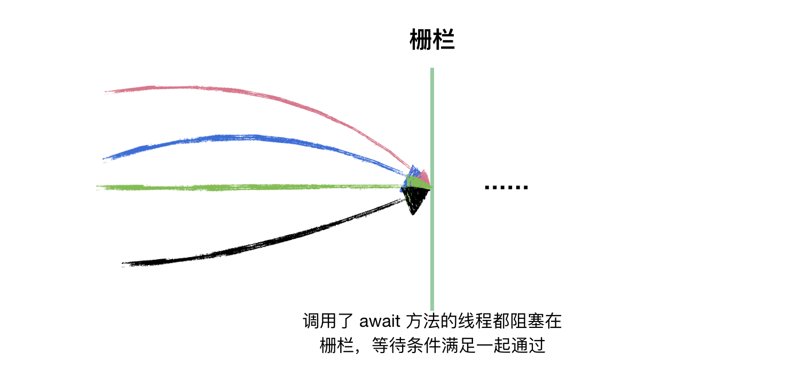

## CountDownLatch

countDownLatch 是一个同步工具类，它允许一个或多个线程等待直到其他线程执行完再执行。

### 如何使用？

#### 1. 构造方法

```java
// count 指定需要等待的线程数量
public CountDownLatch(int count) {
    if (count < 0) throw new IllegalArgumentException("count < 0");
    this.sync = new Sync(count);
}
```

#### 2. 常用方法

```java
// 调用此方法的线程会被阻塞，直到 CountDownLatch 的 count 为 0
public void await() throws InterruptedException 

// 和上面的 await() 作用基本一致，只是可以设置一个最长等待时间
public boolean await(long timeout, TimeUnit unit) throws InterruptedException

// 会将 count 减 1，直至为 0
public void countDown()
```

#### 3. 基本使用

场景：假设有小朱、小胡、小陈、小陈男要出去玩，每个人抽象为一条线程，要等到人齐后在出发，为主线程，那代码如下：

```java
public class CountDownLatchDemo1 {

    // 线程类
     static class Person implements Runnable{
        String name;
        CountDownLatch countDownLatch;
        static Random random = new Random();
        public Person(String name, CountDownLatch countDownLatch){
            this.name = name;
            this.countDownLatch = countDownLatch;
        }
        @Override
        public void run() {
            int time = random.nextInt(500);
            try {
                TimeUnit.MILLISECONDS.sleep(time);
                System.out.printf("%s 花了%ds到达\n", name, time);
            } catch (InterruptedException e) {
                e.printStackTrace();
            }finally {
                // 执行完任务 countDown
                countDownLatch.countDown();
            }
        }
    }

    public static void main(String[] args) throws InterruptedException{
        CountDownLatchDemo1 demo = new CountDownLatchDemo1();
        CountDownLatch countDownLatch = new CountDownLatch(4);

        Thread t1 = new Thread(new Person("小朱", countDownLatch));
        Thread t2 = new Thread(new Person("小胡", countDownLatch));
        Thread t3 = new Thread(new Person("小陈", countDownLatch));
        Thread t4 = new Thread(new Person("小陈男", countDownLatch));
        t1.start();
        t2.start();
        t3.start();
        t4.start();

        System.out.println("等待中...");
        // 主线程等待
        countDownLatch.await();
        System.out.println("人齐，冲冲冲");
    }

}
```

结果

```
等待中...
小朱 花了302s到达
小陈男 花了320s到达
小胡 花了377s到达
小陈 花了432s到达
人齐，冲冲冲
```

#### 4. CountDownLatch 和 join

当主函数做出下面的改动

```java
        System.out.println("等待中...");
        // 主线程等待
//        countDownLatch.await();
        t1.join();
        t2.join();
        t3.join();
        t4.join();
        System.out.println("人齐，冲冲冲");
```

同样可以达到目的。那为什么要用 CountDownLatch？

**假设我们为了减少创建线程的开销，上面线程执行完毕后会被回收到线程池，也就是没有死亡，那就没办法通过 join 判断线程是否执行完毕，这时 CountDownLatch 就有明显的优势了。**




### 源码分析

构造函数

```java
public CountDownLatch(int count) {
    if (count < 0) throw new IllegalArgumentException("count < 0");
    this.sync = new Sync(count);
}

private static final class Sync extends AbstractQueuedSynchronizer {
    Sync(int count) {
        // 直接将 state 设置为 count
        setState(count);
    }
    ...
}
```

await 方法

```java
public void await() throws InterruptedException {
    sync.acquireSharedInterruptibly(1);
}


public final void acquireSharedInterruptibly(int arg) //arg == 1
        throws InterruptedException {
    // 如果线程中断，抛给上层并重置中断标志
    if (Thread.interrupted())
        throw new InterruptedException();
    // 小于0说明state不为0
    if (tryAcquireShared(arg) < 0)
        doAcquireSharedInterruptibly(arg);
}

protected int tryAcquireShared(int acquires) {
    // state 为0返回1，否则返回-1
    return (getState() == 0) ? 1 : -1;
}

// state不为0执行doAcquireSharedInterruptibly，其实就是获取共享锁
private void doAcquireSharedInterruptibly(int arg)
    throws InterruptedException {
    // 添加到同步队列
    final Node node = addWaiter(Node.SHARED);
    try {
        for (;;) {
            final Node p = node.predecessor();
            // 如果 p 为头结点
            if (p == head) {
                // 只要 state 不等于 0，那么这个方法返回 -1
                int r = tryAcquireShared(arg);
                if (r >= 0) {
                    // 唤醒阻塞的线程并设置头结点为node
                    setHeadAndPropagate(node, r);
                    p.next = null; // help GC
                    return;
                }
            }
            // 假设还没有 countDown 到0，则 r == -1,会进来这个分支
            // shouldParkAfterFailedAcquire 会阻塞线程
            // 也就是调用 await 的线程被阻塞在这里
            if (shouldParkAfterFailedAcquire(p, node) &&
                parkAndCheckInterrupt())
                throw new InterruptedException();
        }
    } catch (Throwable t) {
        cancelAcquire(node);
        throw t;
    }
}
```

countDown 方法

```java
public void countDown() {
    sync.releaseShared(1);
}

public final boolean releaseShared(int arg) {
    // 每次 try 将 state 减 1，如果 state 为0，tryReleaseShared 返回true
    if (tryReleaseShared(arg)) {
        // 唤醒 await 的线程
        doReleaseShared();
        return true;
    }
    return false;
}

// 每次将 state 减1， 如果 state 为0，返回 true
protected boolean tryReleaseShared(int releases) {
    for (;;) {
        int c = getState();
        if (c == 0)
            return false;
        int nextc = c-1;
        if (compareAndSetState(c, nextc))
            return nextc == 0;
    }
}
```

也就是 CountDown 方法实际上就是将 state 减 1，直至 state 为 0，开始唤醒等待的线程

假设执行 CountDown 后 state 为 0，则执行 doReleaseShared 开始唤醒等待的线程

```Java
private void doReleaseShared() {
    /*
     * 以下的循环做的事情就是，在队列存在后继线程的情况下，唤醒后继线程；
     * 或者由于多线程同时释放共享锁由于处在中间过程，读到head节点等待状态为0的情况下，
     * 虽然不能unparkSuccessor，但为了保证唤醒能够正确稳固传递下去，设置节点状态为PROPAGATE。
     * 这样的话获取锁的线程在执行setHeadAndPropagate时可以读到PROPAGATE，从而由获取锁的线程去释放后继等待线程。
     */
    for (;;) {
        Node h = head;
        if (h != null && h != tail) {
            int ws = h.waitStatus;
            if (ws == Node.SIGNAL) {
                if (!compareAndSetWaitStatus(h, Node.SIGNAL, 0))
                    continue;            // loop to recheck cases
                // 唤醒阻塞队列线程
                unparkSuccessor(h);
            }
            // 如果h节点的状态为0，需要设置为PROPAGATE用以保证唤醒的传播。
            else if (ws == 0 &&
                     !compareAndSetWaitStatus(h, 0, Node.PROPAGATE)) // todo
                continue;                // loop on failed CAS
        }
        if (h == head)                   // loop if head changed
            break;
    }
}
```

假设线程被唤醒，它会从 doAcquireSharedInterruptibly 中阻塞的地方继续执行

```java
private void doAcquireSharedInterruptibly(int arg)
    throws InterruptedException {
    final Node node = addWaiter(Node.SHARED);
    boolean failed = true;
    try {
        for (;;) {
            final Node p = node.predecessor();
            if (p == head) {
                int r = tryAcquireShared(arg);
                if (r >= 0) {
                    setHeadAndPropagate(node, r); // 2. 这里是下一步
                    p.next = null; // help GC
                    failed = false;
                    return;
                }
            }
            if (shouldParkAfterFailedAcquire(p, node) &&
                // 1. 唤醒后这个方法返回
                parkAndCheckInterrupt())
                throw new InterruptedException();
        }
    } finally {
        if (failed)
            cancelAcquire(node);
    }
}
```

假设此时没有中断，于是被唤醒的线程 A 执行 setHeadAndPropagate（之所以执行是现在 state 已经为0）

```java
private void setHeadAndPropagate(Node node, int propagate) {
    Node h = head; // Record old head for check below
    // 线程A设置自己为头结点
    setHead(node);
	// 线程A唤醒后会继续尝试唤醒 node 后面的节点
    if (propagate > 0 || h == null || h.waitStatus < 0 ||
        (h = head) == null || h.waitStatus < 0) {
        Node s = node.next;
        if (s == null || s.isShared())
            // 此时头结点已经被设置为原来线程A所在的节点了
            doReleaseShared();
    }
}
```

此时又回到 doReleaseShared

```java
private void doReleaseShared() {
    for (;;) {
        Node h = head;
        // head为null，阻塞队列为空
        // head为tail，节点都已经被唤醒
        if (h != null && h != tail) {
            int ws = h.waitStatus;
            if (ws == Node.SIGNAL) {
                if (!compareAndSetWaitStatus(h, Node.SIGNAL, 0))
                    continue;            // loop to recheck cases
                unparkSuccessor(h);
            }
            else if (ws == 0 &&
                     // 这里失败是因为有节点入队将 ws 设置为-1
                     !compareAndSetWaitStatus(h, 0, Node.PROPAGATE)) // todo
                continue;                // loop on failed CAS
        }
        // 如果 h == head，说明刚刚被唤醒的线程还没来得及将自己设置为头结点
        // h != head，则刚唤醒的线程成功设置自己为头结点，继续上面的for循环，唤醒后继节点
        if (h == head)                   // loop if head changed
            break;
    }
}
```


