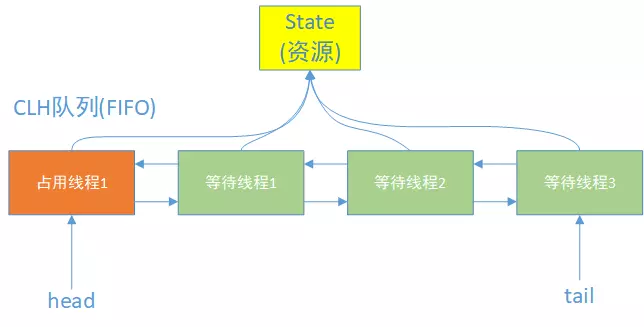

## Java 线程阻塞与唤醒

Java 线程的阻塞和唤醒除了 `Object` 类的方法之外，还有 Unsafe 类的 park 和 unpark。

```java
public class Unsafe {
  ...
  public native void park(boolean isAbsolute, long time);
  public native void unpark(Thread t);
  ...
}
```

+ park 方法是让当前运行的线程阻塞，time 指定了阻塞时间，单位是毫秒。而 isAbsoulte 表示第二个参数是绝对时间还是相对时间。
+ unpark 会唤醒指定的线程。

### parkBlocker

线程对象 Thread 里面有一个重要的属性 parkBlocker，**这个对象是用来记录线程被阻塞时被谁阻塞的,用于线程监控和分析工具来定位原因的。**

这个属性主要由 LockSupport 来设置，它对 Unsafe 的 park 和 unpark 方法进行了简单封装。

```java
class LockSuport{
    //...
    public static void park(Object blocker) {
        // 获取当前线程
		Thread t = Thread.currentThread();    
        // 设置 blocker
		setBlocker(t, blocker);
        // 中断
		U.park(false, 0L);    
		// 唤醒后会从这里继续执行
        // 将 blocker 设置为 null
        setBlocker(t, null);
	}
    public static void unpark(Thread thread) {
        if (thread != null)
            U.unpark(thread);
    }
    //...
}
```


## 相关概念

### 公平锁与非公平锁

+ 公平锁

  如果当前锁处于自由状态，如果同步代码块进来一个线程要尝试获得锁，那么公平锁会查看此时有没有正在排队的队列，有的话尝试先唤醒排队的线程。

+ 非公平锁

  如果当前锁处于自由状态，同步代码块进来的线程可以直接尝试获取锁。

## AQS

AbstractQueuedSynchronized 是 java 并发包中大部分类的基石，他们的内部实现都依赖了 AbstractQueuedSynchronized。

AbstractQueuedSynchronized 定义了一套多线程访问共享资源的同步器框架，是抽象的**队列式**的同步器。

其维护队列大致如下：



+ state 变量代表共享资源，线程通过获取更改该值进行获取、释放锁。
+ head 节点代表目前得到锁的线程，后面的节点代表的是阻塞队列。

### AQS的主要工作

- 同步状态的管理
- 线程的阻塞和唤醒
- 同步队列的维护

### 自定义同步器

AQS 定义两种资源共享方式

- Exclusive：独占锁，只允许一个线程执行，如 ReentrantLock
- Share：共享锁，如 Semaphore。

自定义同步器只需要实现共享资源 state 的获取和释放即可，而对于线程的阻塞、唤醒，阻塞队列的维护，都是由 AQS 实现。

在自定义基于AQS的同步工具时，我们可以选择覆盖实现以下几个方法来实现同步状态的管理：

| 方法                              | 描述                     |
| :-------------------------------- | :----------------------- |
| boolean tryAcquire(int arg)       | 试获取独占锁             |
| boolean tryRelease(int arg)       | 试释放独占锁             |
| int tryAcquireShared(int arg)     | 试获取共享锁             |
| boolean tryReleaseShared(int arg) | 试释放共享锁             |
| boolean isHeldExclusively()       | 当前线程是否获得了独占锁 |


## 源码

### AQS 属性

```java
// 阻塞队列的头结点，但是这个节点比较特殊，代表当前持有锁的线程
private transient volatile Node head;
// 阻塞队列的尾节点
private transient volatile Node tail;
// 共享资源，代表当前锁的状态，0代表没有被占用，大于 0 代表有线程持有当前锁
// 如果是可重入锁，该值可以大于1，每次重入加1
private volatile int state;
// 来自父类的属性，代表当前持有独占锁的线程
private transient Thread exclusiveOwnerThread;
```

### 阻塞队列的 Node 节点

```java
static final class Node {
    // 标识节点当前在共享模式下
    static final Node SHARED = new Node();
    // 标识节点当前在独占模式下
    static final Node EXCLUSIVE = null;

    // ======== 下面的几个int常量是给waitStatus用的 ===========
    /** waitStatus value to indicate thread has cancelled */
    // 代码此线程取消了争抢这个锁
    static final int CANCELLED =  1;
    /** waitStatus value to indicate successor's thread needs unparking */
    // 官方的描述是，其表示当前node的后继节点对应的线程需要被唤醒
    static final int SIGNAL    = -1;
    /** waitStatus value to indicate thread is waiting on condition */
    // 条件等待
    static final int CONDITION = -2;
    /**
     * waitStatus value to indicate the next acquireShared should
     * unconditionally propagate
     */
    // 等待状态：传播
    static final int PROPAGATE = -3;
    // =====================================================

    /**
     * 等待队列中的后继节点
     */
    Node nextWaiter;	
	// 等待状态
    volatile int waitStatus;
    // 前驱节点的引用
    volatile Node prev;
    // 后继节点的引用
    volatile Node next;
    // 这个就是线程本尊
    volatile Thread thread;

}
```

节点等待状态，也就是上面的静态属性

| 值             | 描述                                                         |
| -------------- | :----------------------------------------------------------- |
| CANCELLED (1)  | 当前线程因为超时或者中断被取消。这是一个终结态，也就是状态到此为止。 |
| SIGNAL (-1)    | 当前线程的后继线程被阻塞或者即将被阻塞，当前线程释放锁或者取消后需要唤醒后继线程。这个状态一般都是后继线程来设置前驱节点的。 |
| CONDITION (-2) | 当前线程在condition队列中。                                  |
| PROPAGATE (-3) | 用于将唤醒后继线程传递下去，这个状态的引入是为了完善和增强共享锁的唤醒机制。在一个节点成为头节点之前，是不会跃迁为此状态的 |
| 0              | 表示无状态。                                                 |

### 加锁（以独占锁为例）

#### 加锁流程图


使用 ReentrantLock

```java
class Test{
    private static ReentrantLock lock = new ReentrantLock();

    public void method(){
        lock.lock();
        try{
            // do something
        }finally{
            lock.unlock();
        }
    }
}
```

查看 lock 和 unlock，发现其都是通过 Sync 类来执行。

```java
public void lock() {
    sync.acquire(1);
}

public void unlock() { 
    sync.release(1);
}

abstract static class Sync extends AbstractQueuedSynchronizer {//...}
```

而 Sync 同样由两个类来实现

```java
//公平锁
static final class FairSync extends Sync {
    private static final long serialVersionUID = -3000897897090466540L;
    /**
     * Fair version of tryAcquire.  Don't grant access unless
     * recursive call or no waiters or is first.
     */
    @ReservedStackAccess
    protected final boolean tryAcquire(int acquires) {
        final Thread current = Thread.currentThread();
        int c = getState();
        if (c == 0) {
            if (!hasQueuedPredecessors() &&
                compareAndSetState(0, acquires)) {
                setExclusiveOwnerThread(current);
                return true;
            }
        }
        else if (current == getExclusiveOwnerThread()) {
            int nextc = c + acquires;
            if (nextc < 0)
                throw new Error("Maximum lock count exceeded");
            setState(nextc);
            return true;
        }
        return false;
    }
}
```

```java
// 非公平锁
static final class NonfairSync extends Sync {
    private static final long serialVersionUID = 7316153563782823691L;
    protected final boolean tryAcquire(int acquires) {
        return nonfairTryAcquire(acquires);
    }
}
```

下面以公平锁为例。

在调用了 lock 后，通过 Sync 类调用了 acquire 方法（父类实现）

```java
public final void acquire(int arg) {   //这里 arg == 1
    // 尝试获取锁
    if (!tryAcquire(arg) &&
        // 如果上面尝试失败，则需要将线程挂起，加入阻塞队列
        acquireQueued(addWaiter(Node.EXCLUSIVE), arg))
        selfInterrupt();
}
```

首先会调用 tryAcquire 方法

```java
// 由 FairSync 实现
// 尝试直接获取锁 返回结果：true:成功，false:失败
protected final boolean tryAcquire(int acquires) {  // 这里 acquires == 1
    final Thread current = Thread.currentThread();
    // 获取 state
    int c = getState();
    // 如果 c == 0，说明此时没有线程持有锁
    if (c == 0) {
        // 因为是公平锁，所以要查看是否有线程正在排队
        if (!hasQueuedPredecessors() &&
            // 如果没有线程正在排队，尝试设置state来标示得到锁
            // 在这里可能不成功，可能被其他线程抢先拿到锁了
            compareAndSetState(0, acquires)) {
            // 到这里成功获取了锁，设置ExclusiveOwnerThread标记得到锁的线程
            setExclusiveOwnerThread(current);
            return true;
        }
    }
    // 来到这里，说明 c != 0
    // 判断当前线程是不是持有锁的线程
    else if (current == getExclusiveOwnerThread()) {  // 进来这个分支，说明是可重入锁
        // 设置 state = state + 1，记录重入次数
        int nextc = c + acquires;
        if (nextc < 0)
            throw new Error("Maximum lock count exceeded");
        setState(nextc);
        return true;
    }
    // 获取锁失败
    return false;
}
```

如果 tryAcquire 失败，则会开始执行 `acquireQueued(addWaiter(Node.EXCLUSIVE), arg)`

 上面的函数会先执行 addWaiter(Node.EXCLUSIVE) 方法：

```java
// 这个方法将获锁失败的线程包装成节点并添加到队尾排队等待
private Node addWaiter(Node mode) {   // 这里mode传入的是Node.EXCLUSIVE,代表独占模式
    Node node = new Node(mode);

    for (;;) {
        Node oldTail = tail;
        // 如果队尾不为空，队尾为空说明队列还没有初始化
        if (oldTail != null) {
            // 先将要插入的node节点的前驱指针指向队尾
            node.setPrevRelaxed(oldTail);
            // 通过CAS尝试将自己(node)设置为队尾，注意此时可能有多个线程在竞争队尾，所以需要不断循环
            if (compareAndSetTail(oldTail, node)) {
                // 竞争成功
                oldTail.next = node;
                return node;
            }
        } else {
            // tail为空会初始化队列
            initializeSyncQueue();
        }
    }
}
```

执行完 addWaiter 进入 acquireQueued

**等待中的线程通过acquireQueued把放入队列的线程不断进行获取锁，直到它“成功获锁”或者“不再需要锁（如被中断）”**

```java
// node是addWaiter(Node mode)返回的Node，arg == 1
final boolean acquireQueued(final Node node, int arg) {
    boolean interrupted = false;
    try {
        for (;;) {  //一直循环
            // 得到node节点的前驱结点，保存在变量p
            final Node p = node.predecessor();
            // 如果p是头结点就尝试取获取锁
            // 这里说明了只要进入阻塞队列，必须是第一个节点（头结点后面）才能尝试获取锁
            // acquireQueued是AQS实现的，所以不管是公平锁还是非公平锁，只要节点进入队列
            // 排在前面的节点就比在后面的节点优先取得锁
            // 非公平锁和公平锁的区别在于当队列中的第一个节点尝试获取锁的时候，刚好进来一个新的线程
            // 这个线程不需要判断是否队列中有等待的节点，可以直接竞争锁
            if (p == head && tryAcquire(arg)) {
                //成功获得锁，将node设置为头结点,
                setHead(node);
                // 断掉原来头节点和下个节点的连接 
                p.next = null; // help GC
                return interrupted;
            }
            // 来到这里，说明node的前驱不是头结点或者尝试获取锁失败
            if (shouldParkAfterFailedAcquire(p, node))
                interrupted |= parkAndCheckInterrupt();
        }
    } catch (Throwable t) {
        cancelAcquire(node);
        if (interrupted)
            selfInterrupt();
        throw t;
    }
}
```

当节点在 acquireQueued 获取锁失败，会通过下面的函数判断是否需要挂起

```java
// pred是前驱节点， node是当前节点
private static boolean shouldParkAfterFailedAcquire(Node pred, Node node) {
    int ws = pred.waitStatus;
    if (ws == Node.SIGNAL)
        /*
         * This node has already set status asking a release
         * to signal it, so it can safely park.
         * 当前节点已经设置前驱节点为SIGNAL状态，当前驱节点释放锁的时候会唤醒
         * 它的后继节点，也就是当前节点，所以当前节点可以阻塞自己。
         */
        return true;
    if (ws > 0) {
        /*
         * Predecessor was cancelled. Skip over predecessors and
         * indicate retry.
         * ws>0 说明前驱节点取消了等待，所以向前遍历，找到第一个非取消的节点
         * 之所以要向前遍历是因为当前节点要靠前驱节点来唤醒，如果前驱节点取消等待
         * 那以后的节点也就不会被唤醒(acquire中得到锁的线程会被设置会head)
         */
        do {
            node.prev = pred = pred.prev;
        } while (pred.waitStatus > 0);
        pred.next = node;
    } else {
        /*
         * waitStatus must be 0 or PROPAGATE.  Indicate that we
         * need a signal, but don't park yet.  Caller will need to
         * retry to make sure it cannot acquire before parking.
         * 来到这里说明等待状态为0或者PROPAGATE(-3)，此时会设置前驱节点的waitStatus
         * 前驱节点的waitStatus就是在这里被设置的
         */
        pred.compareAndSetWaitStatus(ws, Node.SIGNAL);
    }
    // 如果来到这里返回false，节点node还不会被阻塞，此时会回到acquireQueued的for循环中继续执行
    // 执行过程中可能获取锁成功，也有可能继续进入此函数直到从第一个分支返回true
    return false;
}
```

当 shouldParkAfterFailedAcquire 返回true，说明线程应该被阻塞。

```java
if (shouldParkAfterFailedAcquire(p, node))
    interrupted |= parkAndCheckInterrupt();
```
所以会执行 parkAndCheckInterrupt

```java
private final boolean parkAndCheckInterrupt() {
    //挂起线程，在此阻塞，等待被唤醒
   LockSupport.park(this);
   return Thread.interrupted();
}
```

如果线程取消了等待，则acquireQueued中会抛出异常并捕获，执行 cancelAcquire

```java
private void cancelAcquire(Node node) {
    // Ignore if node doesn't exist
    if (node == null)
        return;

    node.thread = null;

    // Skip cancelled predecessors
    // 将node前驱指向前面最近一个非取消节点pred
    Node pred = node.prev;
    while (pred.waitStatus > 0)
        node.prev = pred = pred.prev;

    // predNext is the apparent node to unsplice. CASes below will
    // fail if not, in which case, we lost race vs another cancel
    // or signal, so no further action is necessary, although with
    // a possibility that a cancelled node may transiently remain
    // reachable.
    // 记录pred的后继节点为predNext
    Node predNext = pred.next;

    // Can use unconditional write instead of CAS here.
    // After this atomic step, other Nodes can skip past us.
    // Before, we are free of interference from other threads.
    // 将node状态设置为取消，就算后继节点在cancel也可以跳过
    node.waitStatus = Node.CANCELLED;

    // If we are the tail, remove ourselves.
    // 如果node是尾节点，直接将pred设置为尾节点，pred后面的将会被gc
    if (node == tail && compareAndSetTail(node, pred)) {
        // 这里更新失败也没有关系，说明有其他线程入队或者其他取消线程更新掉了
        pred.compareAndSetNext(predNext, null);
    } else { // 如果node有后继节点
        // If successor needs signal, try to set pred's next-link
        // so it will get one. Otherwise wake it up to propagate.
        // 如果node还有后继节点，这种情况要做的事情是把pred和后继非取消节点拼起来。
        int ws;
        if (pred != head &&
            ((ws = pred.waitStatus) == Node.SIGNAL ||
             (ws <= 0 && pred.compareAndSetWaitStatus(ws, Node.SIGNAL))) &&
            pred.thread != null) {
            Node next = node.next;
            // 如果node的后继节点不是取消状态，则用CAS尝试将pred的后继置为node的后继
            if (next != null && next.waitStatus <= 0)
                pred.compareAndSetNext(predNext, next);
        } else {
           /*
            * 这时说明pred == head或者pred状态取消或者pred.thread == null
            * 在这些情况下为了保证队列的活跃性，需要去唤醒一次后继线程。
            * 举例来说pred == head完全有可能实际上目前已经没有线程持有锁了，
            * 自然就不会有释放锁唤醒后继的动作。如果不唤醒后继，队列就挂掉了。
            * 比如 head - 1 - 2 - 3 - 4，此时持有独占锁的线程释放锁，执行 unparkSuccessor,
            * 企图唤醒线程1
            * 一直到最后一个判断 if(s != null)，此时线程1被中断，那么，1之后的线程也就没有人来
            * 唤醒了。
            *
            *
            * 这种情况下看似由于没有更新pred的next的操作，队列中可能会留有一大把的取消节点。
            * 实际上不要紧，因为后继线程唤醒之后会走一次试获取锁的过程，
            * 失败的话会走到shouldParkAfterFailedAcquire的逻辑。
            * 那里面的if中有处理前驱节点如果为取消则维护pred/next,踢掉这些取消节点的逻辑。
            */            
            unparkSuccessor(node);
        }

        node.next = node; // help GC
    }
}
```


### 解锁

```java
public void unlock() {
    sync.release(1);
}
// AQS 实现
public final boolean release(int arg) {
    // 尝试释放锁
    if (tryRelease(arg)) {
        Node h = head;
        if (h != null && h.waitStatus != 0)
            unparkSuccessor(h);
        return true;
    }
    return false;
}
```

```java
protected final boolean tryRelease(int releases) {  //releases==1
    int c = getState() - releases;
    if (Thread.currentThread() != getExclusiveOwnerThread())
        throw new IllegalMonitorStateException();
    boolean free = false;
    // 如果 c==0，说明没有嵌套锁，可以释放，否则不能将锁释放
    if (c == 0) {
        free = true;
        setExclusiveOwnerThread(null);
    }
    setState(c);
    return free;
}
```

如果 tryRelease 返回 true，说明锁已经被释放，可以唤醒阻塞队列中的节点

```java
private void unparkSuccessor(Node node) { //node 为头结点
    /*
     * If status is negative (i.e., possibly needing signal) try
     * to clear in anticipation of signalling.  It is OK if this
     * fails or if status is changed by waiting thread.
     */
    int ws = node.waitStatus;
    if (ws < 0)
        node.compareAndSetWaitStatus(ws, 0);

    /*
     * Thread to unpark is held in successor, which is normally
     * just the next node.  But if cancelled or apparently null,
     * traverse backwards from tail to find the actual
     * non-cancelled successor.
     */
    Node s = node.next;
    // 如果头结点后继节点为null或者已经取消等待，从阻塞队列后面向前查找
    if (s == null || s.waitStatus > 0) {
        s = null;
        for (Node p = tail; p != node && p != null; p = p.prev)
            if (p.waitStatus <= 0)
                s = p;
    }
    if (s != null)
        LockSupport.unpark(s.thread); //唤醒
}
```

这里唤醒节点为什么要从后向前遍历？

当 `s == null` 时并不能说明 node 为 tail，主要的原因在 addWaiter 中。

1. 假设某时刻 node 为 tail
2. 假设有新的线程通过 addWaiter 添加自己
3. 新线程 compareAndSetTail 成功，可是还没有将 oldTail 的 next 指向 新线程
4. 此时 Node s = node.next 得到的 s 为 null，可是此时 node 并不是 tail
