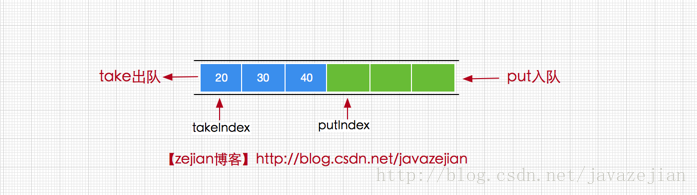

### ArrayBlockingQueue

ArrayBlockingQueue 是由数组实现的**有界阻塞队列**，其底层使用 ReentrantLock 实现同步。


#### 基本方法

+ 插入方法：
  + add(E e) : 添加成功返回true，失败抛IllegalStateException异常
  + offer(E e) : 成功返回 true，如果此队列已满，则返回 false。
  + put(E e) :将元素插入此队列的尾部，如果该队列已满，则一直阻塞
+ 删除方法:
  + remove(Object o) :移除指定元素,成功返回true，失败返回false
  + poll() : 获取并移除此队列的头元素，若队列为空，则返回 null
  + take()：获取并移除此队列头元素，若没有元素则一直阻塞。
+ 检查方法
  + element() ：获取但不移除此队列的头元素，没有元素则抛异常
  + peek() :获取但不移除此队列的头；若队列为空，则返回 null。

#### 基本使用

利用 ArrayBlockingQueue 实现生产者消费者

```java
public class ArrayBlockingQueueTest {
    // 资源
    static class Apple{}
    // 指定队列最大容量
    private final static ArrayBlockingQueue<Apple> queue = new ArrayBlockingQueue<>(5);

    private static void take(){
        while (true){
            try {
                TimeUnit.MILLISECONDS.sleep(1000);
                // 如果没有资源会阻塞
                Apple apple = queue.take();
                System.out.println("消费：" + apple);
            } catch (InterruptedException e) {
                e.printStackTrace();
            }
        }
    }

    private static void put(){
        while (true){
            try {
                TimeUnit.MILLISECONDS.sleep(1000);
                Apple apple = new Apple();
                System.out.println("生产资源：" + apple);
                queue.put(apple);
            } catch (InterruptedException e) {
                e.printStackTrace();
            }
        }
    }

    public static void main(String[] args) {
        Thread t1 = new Thread(ArrayBlockingQueueTest::put, "producer1");
        Thread t2 = new Thread(ArrayBlockingQueueTest::put, "producer2");
        Thread t3 = new Thread(ArrayBlockingQueueTest::take, "consume1");
        Thread t4 = new Thread(ArrayBlockingQueueTest::take, "consume2");

        t1.start();
        t2.start();
        t3.start();
        t4.start();
    }
}
```

### 

#### 成员变量

```java
public class ArrayBlockingQueue<E> extends AbstractQueue<E>
        implements BlockingQueue<E>, java.io.Serializable {

    /** 存储数据的数组 */
    final Object[] items;

    /**获取数据的索引，主要用于take，poll，peek，remove方法 */
    int takeIndex;

    /**添加数据的索引，主要用于 put, offer, or add 方法*/
    int putIndex;

    /** 队列元素的个数 */
    int count;


    /** 控制并非访问的锁 */
    final ReentrantLock lock;

    /**notEmpty条件对象，用于通知take方法队列已有元素，可执行获取操作 */
    private final Condition notEmpty;

    /**notFull条件对象，用于通知put方法队列未满，可执行添加操作 */
    private final Condition notFull;

    /**
       迭代器
     */
    transient Itrs itrs = null;

}
```

两个索引位置




#### 构造方法

```java
// 指定有界队列的容量，指定模式为非公平模式或者公平模式
public ArrayBlockingQueue(int capacity, boolean fair) {
    if (capacity <= 0)
            throw new IllegalArgumentException();
    this.items = new Object[capacity];
    lock = new ReentrantLock(fair);
    notEmpty = lock.newCondition();
    notFull =  lock.newCondition();
}

// 默认为非公平模式
public ArrayBlockingQueue(int capacity) {
    this(capacity, false);
}

// 用指定的容器初始化
public ArrayBlockingQueue(int capacity, boolean fair,
                              Collection<? extends E> c) {
    // 默认非公平模式
    this(capacity, fair);
    final ReentrantLock lock = this.lock;
    lock.lock(); // Lock only for visibility, not mutual exclusion
    try {
        final Object[] items = this.items;
        int i = 0;
        try {
            for (E e : c)
                items[i++] = Objects.requireNonNull(e);
        } catch (ArrayIndexOutOfBoundsException ex) {
            throw new IllegalArgumentException();
        }
        count = i;
        putIndex = (i == capacity) ? 0 : i;
    } finally {
        lock.unlock();
    }
}
```

#### 添加元素方法

```java
// 添加元素到队列，只有取到锁才会被调用
private void enqueue(E e) {
    // assert lock.isHeldByCurrentThread();
    // assert lock.getHoldCount() == 1;
    // assert items[putIndex] == null;
    final Object[] items = this.items;
    items[putIndex] = e;
    // 如果到了最后位置，则从索引0继续开始添加元素
    if (++putIndex == items.length) putIndex = 0;
    count++;
    // 添加元素后队列中有元素，唤醒 notEmpty 等待队列中的线程（执行take被阻塞的线程）
    notEmpty.signal();
}

// 添加元素，此方法不会阻塞
public boolean offer(E e) {
    // 元素不能为null
    Objects.requireNonNull(e);
    final ReentrantLock lock = this.lock;
    // 加锁
    lock.lock();
    try {
        // 队列已经满了，直接返回false
        if (count == items.length)
            return false;
        else {
            // 否则添加元素
            enqueue(e);
            return true;
        }
    } finally {
        // 解锁
        lock.unlock();
    }
}
public boolean offer(E e, long timeout, TimeUnit unit)
        throws InterruptedException{
    //...
}


// 调用了offer方法
public boolean add(E e) {
    if (offer(e))
        return true;
    // 如果添加失败，也就是队列已满，抛出异常
    else
        throw new IllegalStateException("Queue full");
}


// 添加元素，此方法会阻塞，同时是可以响应中断的
public void put(E e) throws InterruptedException {
    Objects.requireNonNull(e);
    final ReentrantLock lock = this.lock;
    lock.lockInterruptibly();
    try {
        // 如果队列已经满了，则将线程阻塞等待唤醒
        while (count == items.length)
            notFull.await();
        // 队列没满元素入队
        enqueue(e);
    } finally {
        lock.unlock();
    }
}
```

offer 和 put 的区别：如果队列已经满了，offer 会丢弃元素，添加失败；而对于 put 来说，添加元素的线程会被添加到 notFull 的阻塞队列中，等待被唤醒。

#### 移除元素方法

```java
// 删除队尾的元素，跟 enqueue 一样，只能在获得锁的时候调用，否则线程不安全
private E dequeue() {
    // assert lock.isHeldByCurrentThread();
    // assert lock.getHoldCount() == 1;
    // assert items[takeIndex] != null;
    final Object[] items = this.items;
    @SuppressWarnings("unchecked")
    E e = (E) items[takeIndex];
    items[takeIndex] = null;
    // 如果获取元素索引与数组长度一致，则从头开始获取
    if (++takeIndex == items.length) takeIndex = 0;
    // 队列数量减一
    count--;
    // 更新迭代器元素
    if (itrs != null)
        itrs.elementDequeued();
    // 因为移除了元素，所以队列中有空位，唤醒 notFull 中等待的线程（执行put被阻塞的线程）
    notFull.signal();
    return e;
}

// 移除元素，如果没有元素返回 null
public E poll() {
    final ReentrantLock lock = this.lock;
    lock.lock();
    try {
        return (count == 0) ? null : dequeue();
    } finally {
        lock.unlock();
    }
}

// 移除元素，可阻塞，可响应中断
public E take() throws InterruptedException {
    final ReentrantLock lock = this.lock;
    lock.lockInterruptibly();
    try {
        // 如果队列中没有元素可以拿则将队列阻塞
        while (count == 0)
            notEmpty.await();
        return dequeue();
    } finally {
        lock.unlock();
    }
}

// 移除元素，可阻塞，可响应中断，可指定阻塞时间
public E poll(long timeout, TimeUnit unit) throws InterruptedException {
    long nanos = unit.toNanos(timeout);
    final ReentrantLock lock = this.lock;
    lock.lockInterruptibly();
    try {
        while (count == 0) {
            // 指定事假不合法返回 null
            if (nanos <= 0L)
                return null;
            nanos = notEmpty.awaitNanos(nanos);
        }
        // 过了指定时间还没有被唤醒，则直接返回，不管队列中有没有元素
        return dequeue();
    } finally {
        lock.unlock();
    }
}
```

上面三个方法中：

+ poll() 和 poll ( long ,TimeUnit) throws InterruptedException 都有可能返回 null，而 take() 在不被中断的情况下会一直等待直到取到元素
+ poll ( long ,TimeUnit) throws InterruptedException 和 take() 都是可以阻塞线程的，而 poll() 发现队列是空直接返回 null
+ poll ( long ,TimeUnit) throws InterruptedException 可以指定阻塞时间，而 take() 如果没有被唤醒会一直阻塞


### LinkedBlockingQueue

LinkedBlockingQueue 是由链表实现的阻塞队列，它可以是有界的，也可以是无界的（无界时最大长度为 Integer.MAX_VALUE）。

**下面称增加元素线程为生产线程，移除元素线程为消费线程**

#### 属性

```java
    /**
     * Linked list node class.
     */
    static class Node<E> {
        Node<E> next;

        Node(E x) { item = x; }
    }

    // 队列容量，默认为 Integer.MAX_VALUE
    private final int capacity;

    // 队列中的元素个数，注意这里是原子类型，跟 ArrayBlockingQueue 不同
    private final AtomicInteger count = new AtomicInteger();

	// 队列头结点
    transient Node<E> head;

   // 队列尾节点
    private transient Node<E> last;

	// 移除元素的锁，如 take, poll 等
    private final ReentrantLock takeLock = new ReentrantLock();

	// 等待队列，挂起队列为空还从队列获取元素的线程
    private final Condition notEmpty = takeLock.newCondition();

	// 添加元素的锁，如 put, offer
    private final ReentrantLock putLock = new ReentrantLock();

	// 等待队列，挂起队列已满还企图添加元素的线程
    private final Condition notFull = putLock.newCondition();
```

通过属性可以得知，LinkedBlockingQueue 和 ArrayBlockingQueue 锁管理有所不同，ArrayBlockingQueue 不管是增加还是移除元素，都是使用同一把锁，而 LinkedBlockingQueue 则使用 takeLock 来管理删除元素，使用 putLock 来管理添加元素，这它可以并发执行添加和移除动作（当然，每个动作只能有一条线程执行）。

#### 添加元素

```java
// 元素入队
private void enqueue(Node<E> node) {
    // assert putLock.isHeldByCurrentThread();
    // assert last.next == null;
    last = last.next = node;
}

// 添加元素
public boolean offer(E e) {
    // 元素不能为 null
    if (e == null) throw new NullPointerException();
    // 获取队列元素个数
    final AtomicInteger count = this.count;
    // 如果队列已满，直接返回 false
    if (count.get() == capacity)
        return false;
    final int c;
    // 新建 Node 节点，存在一定开销
    final Node<E> node = new Node<E>(e);
    final ReentrantLock putLock = this.putLock;
    // 得到锁
    putLock.lock();
    try {
        // 再次判断队列是否满，处理并发情况
        if (count.get() == capacity)
            return false;
        enqueue(node);
        // 得到还没有添加新元素的队列长度，然后队列长度加一
        c = count.getAndIncrement();
        // 如果队列没有满，继续唤醒生产线程
        if (c + 1 < capacity)
            notFull.signal();
    } finally {
        putLock.unlock();
    }
    // 成功添加，c==0说明队列存在元素（有一个），可以唤醒消费线程
    if (c == 0)
        signalNotEmpty();
    return true;
}

private void signalNotEmpty() {
    final ReentrantLock takeLock = this.takeLock;
    takeLock.lock();
    try {
        // 唤醒消费线程
        notEmpty.signal();
    } finally {
        takeLock.unlock();
    }
}

// 和 offer 类似，只是队列满的时候处理方式不同
public void put(E e) throws InterruptedException {
    if (e == null) throw new NullPointerException();
    final int c;
    final Node<E> node = new Node<E>(e);
    final ReentrantLock putLock = this.putLock;
    final AtomicInteger count = this.count;
    putLock.lockInterruptibly();
    try {
        // 队列满了，加入 notFull 阻塞队列
        while (count.get() == capacity) {
            notFull.await();
        }
        enqueue(node);
        c = count.getAndIncrement();
        if (c + 1 < capacity)
            notFull.signal();
    } finally {
        putLock.unlock();
    }
    if (c == 0)
        signalNotEmpty();
}

// 跟 put 类似，但是可指定线程最大阻塞时间
public boolean offer(E e, long timeout, TimeUnit unit)
        throws InterruptedException{
    //...
}
```

**这里添加完元素后判断队列是否满，如果队列还没有满，则会唤醒生产线程，这跟 ArrayBlockingQueue 是不同的。**因为 ArrayBlockingQueue 生产和消费使用的是同一把锁，如果 ArrayBlockingQueue 添加完元素后继续唤醒生产线程，则可能导致消费线程永远阻塞。

为什么 `c == 0` 时才唤醒消费线程？

+ 如果 c == 0（此时队列中有一个元素），说明之前消费线程已经停止，notEmpty 条件队列上可能存在等待的消费线程，如果存在则唤醒，没有则结束。
+ 如果 c > 0 就唤醒，可能此时消费的线程还没有消费结束（**消费线程跟生产线程一样会唤醒其他消费线程**），notEmpty 条件队列上没有等待的消费线程，此时唤醒意义不大。


#### 移除元素

```java
// 移除元素，可响应中断
public E take() throws InterruptedException {
    final E x;
    final int c;
    // 获取队列元素个数
    final AtomicInteger count = this.count;
    final ReentrantLock takeLock = this.takeLock;
    takeLock.lockInterruptibly();
    try {
        // 如果队列没有元素，则阻塞消费线程
        while (count.get() == 0) {
            notEmpty.await();
        }
        // 消费
        x = dequeue();
        // 返回消费前元素个数，并将元素个数减一
        c = count.getAndDecrement();
        // c>1 说明还队列存在元素，唤醒消费线程
        if (c > 1)
            notEmpty.signal();
    } finally {
        takeLock.unlock();
    }
    // 此时可能存在等待的生产线程，唤醒
    if (c == capacity)
        signalNotFull();
    return x;
}
```

#### 总结

+ 队列大小有所不同，ArrayBlockingQueue是有界的初始化必须指定大小，而LinkedBlockingQueue可以是有界的也可以是无界的(Integer.MAX_VALUE)，**对于后者而言，当添加速度大于移除速度时，在无界的情况下，可能会造成内存溢出等问题。**
+ 数据存储容器不同，ArrayBlockingQueue采用的是数组作为数据存储容器，而LinkedBlockingQueue采用的则是以Node节点作为连接对象的链表。
+ ArrayBlockingQueue 经过改造也可以分离锁。Doug Lea之所以没这样去做，也许是因为ArrayBlockingQueue的数据写入和获取操作已经足够轻巧，以至于引入独立的锁机制，除了给代码带来额外的复杂性外，其在性能上完全占不到任何便宜。
+ ArrayBlockingQueue和LinkedBlockingQueue间还有一个明显的不同之处在于，前者在插入或删除元素时不会产生或销毁任何额外的对象实例，而后者则会生成一个额外的Node对象。这在长时间内需要高效并发地处理大批量数据的系统中，其对于GC的影响还是存在一定的区别。
+ ArrayBlockingQueue 可以控制对象的内部锁是否采用公平锁，默认采用非公平锁。而LinkedBlockingQueue 使用非公平锁。
+ 两者的实现队列添加或移除的锁不一样，ArrayBlockingQueue实现的队列中的锁是没有分离的，即添加操作和移除操作采用的同一个ReenterLock锁，而LinkedBlockingQueue实现的队列中的锁是分离的，其添加采用的是putLock，移除采用的则是takeLock，这样能大大提高队列的吞吐量，也意味着在高并发的情况下生产者和消费者可以并行地操作队列中的数据，以此来提高整个队列的并发性能


#### Reference

https://blog.csdn.net/javazejian/article/details/77410889

