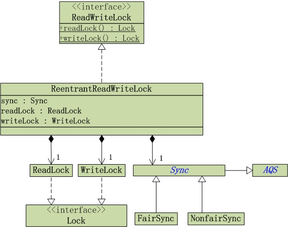
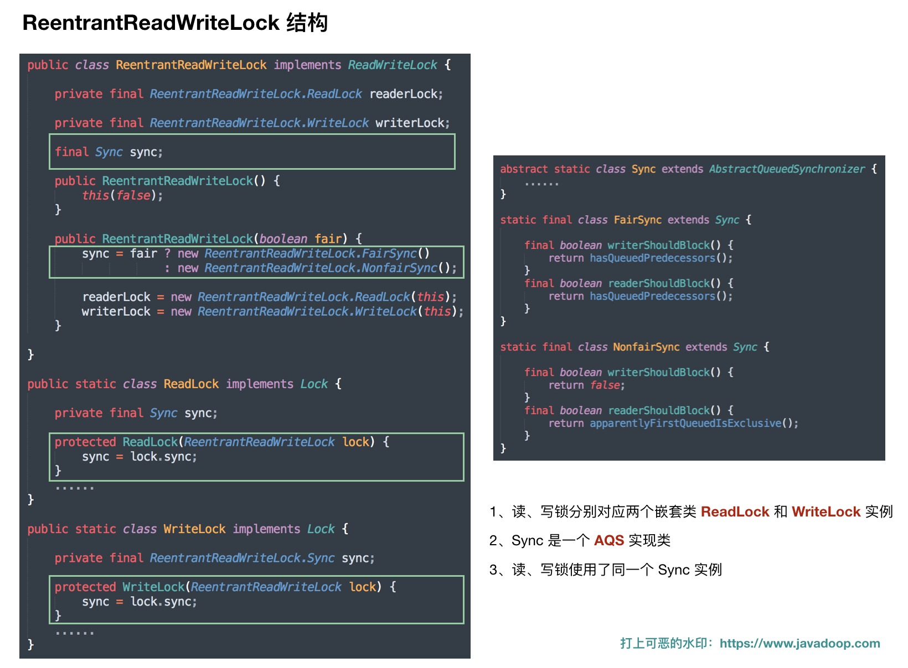
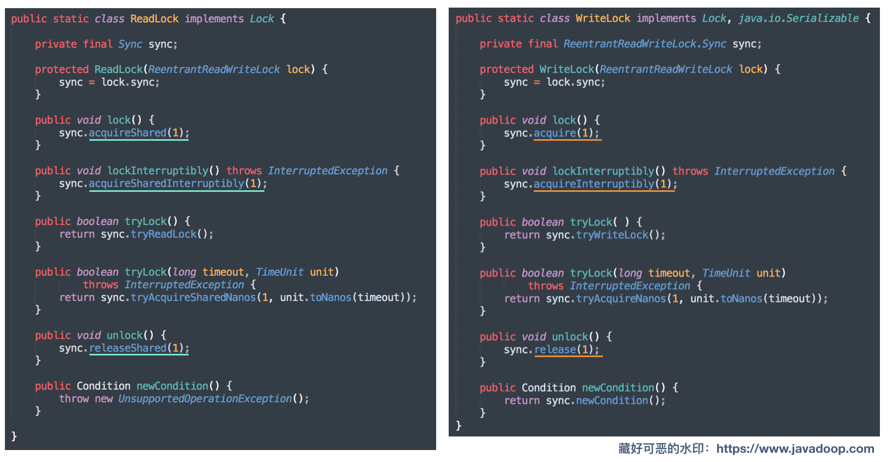
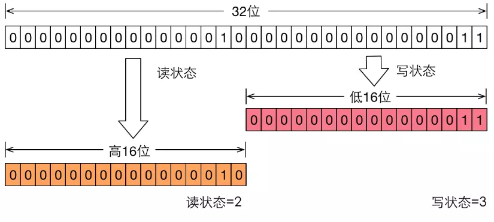

### ReentrantReadWriteLock

ReentrantReadWriteLock：读写锁，实现了 ReadWriteLock 接口，内部维护了读锁和写锁。读锁是共享锁，写锁是互斥锁。

ReadWriteLock 接口

```java
public interface ReadWriteLock {
    /**
     * Returns the lock used for reading.
     * 返回读锁
     * @return the lock used for reading
     */
    Lock readLock();

    /**
     * Returns the lock used for writing.
     * 返回写锁
     * @return the lock used for writing
     */
    Lock writeLock();
}
```

[ReentrantReadWriteLock 函数](https://www.cnblogs.com/skywang12345/p/3505809.html#a1)

```java
// 创建一个新的 ReentrantReadWriteLock，默认是采用“非公平策略”。
ReentrantReadWriteLock()
// 创建一个新的 ReentrantReadWriteLock，fair是“公平策略”。fair为true，意味着公平策略；否则，意味着非公平策略。
ReentrantReadWriteLock(boolean fair)

// 返回当前拥有写入锁的线程，如果没有这样的线程，则返回 null。
protected Thread getOwner()
// 返回一个 collection，它包含可能正在等待获取读取锁的线程。
protected Collection<Thread> getQueuedReaderThreads()
// 返回一个 collection，它包含可能正在等待获取读取或写入锁的线程。
protected Collection<Thread> getQueuedThreads()
// 返回一个 collection，它包含可能正在等待获取写入锁的线程。
protected Collection<Thread> getQueuedWriterThreads()
// 返回等待获取读取或写入锁的线程估计数目。
int getQueueLength()
// 查询当前线程在此锁上保持的重入读取锁数量。
int getReadHoldCount()
// 查询为此锁保持的读取锁数量。
int getReadLockCount()
// 返回一个 collection，它包含可能正在等待与写入锁相关的给定条件的那些线程。
protected Collection<Thread> getWaitingThreads(Condition condition)
// 返回正等待与写入锁相关的给定条件的线程估计数目。
int getWaitQueueLength(Condition condition)
// 查询当前线程在此锁上保持的重入写入锁数量。
int getWriteHoldCount()
// 查询是否给定线程正在等待获取读取或写入锁。
boolean hasQueuedThread(Thread thread)
// 查询是否所有的线程正在等待获取读取或写入锁。
boolean hasQueuedThreads()
// 查询是否有些线程正在等待与写入锁有关的给定条件。
boolean hasWaiters(Condition condition)
// 如果此锁将公平性设置为 ture，则返回 true。
boolean isFair()
// 查询是否某个线程保持了写入锁。
boolean isWriteLocked()
// 查询当前线程是否保持了写入锁。
boolean isWriteLockedByCurrentThread()
```


### ReentrantReadWriteLock 接口及子类






ReadLock & WriteLock 结构



从结构图可以看出，读写锁的实现都依赖了类 Sync（有 FairSync 和 NonfairSync ）。Sync 是 AQS 的子类。

### AQS 的共享模式与独占模式

#### 独占锁： 

1. 如果 state 为 0，说明锁空闲，尝试将 state 设置为1 代表锁被获取
2. 如果 state 为 1，或者设置 state 失败，线程将自己加入阻塞队列并休眠
3. 被唤醒，尝试将 state 设置为 1。

也就是说，通过设置共享变量 state 表示是否获取锁，state 为 0 代表可以获取锁，为 1 代表锁已经被获取。

#### 共享锁：

1. state 是否大于 0，是说明可以继续获取锁，于是获取锁并将 state 减一
2. state 小于等于 0，说明不能继续获取共享锁，线程会进入阻塞队列休眠
3. 被唤醒，尝试获取锁
4. 获取成功后唤醒其他休眠的线程

那既然在 AQS 中共享锁和独占锁都是通过修改 state ，而且锁对应的状态不同，那 ReentrantReadWriteLock 如何同时实现独占和共享？

ReentrantReadWriteLock 将 32 位的 state 分为高 16 位和低 16 位。其中高 16 位用作读锁， 低 16 位用作写锁。




### 源码分析

#### Snyc 类属性

```java
abstract static class Sync extends AbstractQueuedSynchronizer {
    private static final long serialVersionUID = 6317671515068378041L;

    static final int SHARED_SHIFT   = 16;
    static final int SHARED_UNIT    = (1 << SHARED_SHIFT);
    static final int MAX_COUNT      = (1 << SHARED_SHIFT) - 1;
    static final int EXCLUSIVE_MASK = (1 << SHARED_SHIFT) - 1;

    /** Returns the number of shared holds represented in count. */
    // 取c的高16位，记录读锁的获取次数
    static int sharedCount(int c)    { return c >>> SHARED_SHIFT; }
    /** Returns the number of exclusive holds represented in count. */
    // 取c的低16位，记录写锁的重入次数
    static int exclusiveCount(int c) { return c & EXCLUSIVE_MASK; }

	// 记录每个线程持有的读锁数量
    static final class HoldCounter {
        int count;          // initially 0
        // Use id, not reference, to avoid garbage retention
        // 利用 tid 避免垃圾回收
        final long tid = LockSupport.getThreadId(Thread.currentThread());
    }

	// ThreadLocal子类，为每个线程保存了 HoldCounter实例
    static final class ThreadLocalHoldCounter
        extends ThreadLocal<HoldCounter> {
        public HoldCounter initialValue() {
            return new HoldCounter();
        }
    }

    // 记录当前线程持有的读锁数量
    private transient ThreadLocalHoldCounter readHolds;

    // 用于缓存，记录了最后一个成功获取读锁线程的 读锁重入次数
    private transient HoldCounter cachedHoldCounter;


    // 第一个获取读锁的线程（并且还没释放锁）以及持有的读锁数量
    private transient Thread firstReader;
    private transient int firstReaderHoldCount;

    Sync() {
        readHolds = new ThreadLocalHoldCounter();
        setState(getState()); // ensures visibility of readHolds
    }

```

#### 读锁的获取

```java
// ReadLock 加锁
public void lock() {
    sync.acquireShared(1);
}
```

调用了 acquireShared

```java
public final void acquireShared(int arg) {  // arg == 1
    if (tryAcquireShared(arg) < 0)
        doAcquireShared(arg);
}
```

首先通过 tryAcquireShared 尝试获取锁

```java
/* 由 AQS 子类 Sync 实现*/
protected final int tryAcquireShared(int unused) {
    Thread current = Thread.currentThread();
    int c = getState();
    // exclusiveCount(c) != 0 说明存在线程持有写锁，如果持有写锁的不是当前线程
    // 则获取锁失败
    if (exclusiveCount(c) != 0 &&
        getExclusiveOwnerThread() != current)
        return -1;
    // 读锁的加锁次数
    int r = sharedCount(c);
    // 读锁获取是否会被阻塞
    if (!readerShouldBlock() &&
        // MAX_COUNT = 2^16-1，因为只用了16位来记录读锁次数
        r < MAX_COUNT &&
        // 通过CAS尝试将state的高16位加1
        compareAndSetState(c, c + SHARED_UNIT)) {
        // 上面条件都成立，说明成功获取读锁，进入此分支
        
        // r==0 说明是第一次获取读锁，或者之前的读锁已经释放
        if (r == 0) {
            firstReader = current;
            firstReaderHoldCount = 1;
        // 如果当前线程是第一次获取锁的线程
        } else if (firstReader == current) {
            firstReaderHoldCount++;
            // 否则不是第一次获取读锁
        } else {
            HoldCounter rh = cachedHoldCounter;
            if (rh == null || rh.tid != LockSupport.getThreadId(current))
                // 将cachedHoldCounter设置为当前线程的HoldCount
                cachedHoldCounter = rh = readHolds.get();
            else if (rh.count == 0)
                readHolds.set(rh);
            rh.count++;
        }
        // 返回大于0的数代表获取到共享锁
        return 1;
    }
    return fullTryAcquireShared(current);
}
```

readerShouldBlock 方法怎么判断读锁能否获取？

对于非公平锁：

```java
final boolean readerShouldBlock() {
    return apparentlyFirstQueuedIsExclusive();
}

final boolean apparentlyFirstQueuedIsExclusive() {
    Node h, s;
    // 如果阻塞队列有线程在等待写锁则返回 true
    // 如果阻塞队列第一个节点(不是头结点)等待的是读锁，则会发生竞争
    return (h = head) != null &&
        (s = h.next)  != null &&
        !s.isShared()         &&
        s.thread != null;
}
```

对于公平锁：

```java
final boolean readerShouldBlock() {
    // 判断阻塞队列有没有线程排队，有的话排队的线程优先获取，新来的要等待
    return hasQueuedPredecessors();
}
```

tryAcquireShared 方法如果前两个分支没有进去，则会执行 `return fullTryAcquireShared(current);`

```java
// 这个方法还是继续尝试获取共享锁
final int fullTryAcquireShared(Thread current) {
    HoldCounter rh = null;
    // 一直循环
    for (;;) {
        int c = getState();
        // 如果有其他线程获取了写锁，只能到阻塞队列排队
        if (exclusiveCount(c) != 0) {
            if (getExclusiveOwnerThread() != current)
                return -1;
        // 判断获取读锁是否应该阻塞
        } else if (readerShouldBlock()) { // 进来这个分支为了处理锁重入的情形
            
            if (firstReader == current) {
                // assert firstReaderHoldCount > 0;
            } else { // 当前线程不是第一次获取读锁的线程
                if (rh == null) {
                    rh = cachedHoldCounter;
                    if (rh == null || rh.tid != LockSupport.getThreadId(current)) {
                        // cachedHoldCounter 缓存的不是当前线程的 HoldCounter
                        // 于是从ThreadLocal获取当前线程的HoldCounter
                        // 如果当前线程没有初始化过ThreadLocal中的值，get会执行初始化
                        rh = readHolds.get();
                        // count为0说明是因为上一行代码进行了初始化，于是执行remove
                        if (rh.count == 0)
                            readHolds.remove();
                    }
                }
                // rh.count == 0说明非重入，而且readerShouldBlock已经为true，则获取锁失败
                if (rh.count == 0)
                    return -1;
            }
        }
        //=========else if 结束==================
        // 超过最大读锁数
        if (sharedCount(c) == MAX_COUNT)
            throw new Error("Maximum lock count exceeded");
        // 尝试获取锁
        if (compareAndSetState(c, c + SHARED_UNIT)) {  // 进来这个分支说明成功获取读锁
            // 以下跟 tryAcquireShared 类似
            if (sharedCount(c) == 0) {
                firstReader = current;
                firstReaderHoldCount = 1;
            } else if (firstReader == current) {
                firstReaderHoldCount++;
            } else {
                if (rh == null)
                    rh = cachedHoldCounter;
                if (rh == null || rh.tid != LockSupport.getThreadId(current))
                    rh = readHolds.get();
                else if (rh.count == 0)
                    readHolds.set(rh);
                rh.count++;
                cachedHoldCounter = rh; // cache for release
            }
            return 1;
        }
    }
}

```

#### 读锁的释放

```java
/* ReadLock*/
public void unlock() {
    sync.releaseShared(1);
}
```

```java
/* Sync */
public final boolean releaseShared(int arg) {
    if (tryReleaseShared(arg)) {
        doReleaseShared();
        return true;
    }
    return false;
}
```

```java
// 由Sync实现
protected final boolean tryReleaseShared(int unused) {
    Thread current = Thread.currentThread();
    if (firstReader == current) {
        // assert firstReaderHoldCount > 0;
        // firstReaderHoldCount==1说明此次解锁后就不再持有读锁
        if (firstReaderHoldCount == 1)
            // 设置为null给其他线程使用
            // 这里不再设置firstReaderHoldCount是因为其他线程会设置
            firstReader = null;
        else
            firstReaderHoldCount--;
    } else { // 不是第一个线程
        HoldCounter rh = cachedHoldCounter;
        // 如果cachedHoldCounter缓存的不是当前线程，到ThreadLocal取
        if (rh == null ||
            rh.tid != LockSupport.getThreadId(current))
            rh = readHolds.get();
        int count = rh.count;
        // count<=1说明此时释放后此线程不再持有锁
        if (count <= 1) {
            // 移除掉ThreadLocal中的值，防止内存泄露
            readHolds.remove();
            // unlock次数对于lock次数，抛出异常
            if (count <= 0)
                throw unmatchedUnlockException();
        }
        // 当前线程持有锁的次数减一
        --rh.count;
    }
    for (;;) {
        int c = getState();
        // 将state高16位减1
        int nextc = c - SHARED_UNIT;
        // 设置新的state
        if (compareAndSetState(c, nextc))
            // Releasing the read lock has no effect on readers,
            // but it may allow waiting writers to proceed if
            // both read and write locks are now free.
            // nextc为0说明读写锁都为空，会执行doReleaseShared()方法
            // 这个方法会唤醒阻塞队列中的线程
            return nextc == 0;
    }
}
```

#### 写锁获取

```java
// WriteLock
public void lock() {
    sync.acquire(1);
}
```

```java
// AQS
public final void acquire(int arg) {
    if (!tryAcquire(arg) &&
        // 如果 tryAcquire 失败，那么进入到阻塞队列等待
        acquireQueued(addWaiter(Node.EXCLUSIVE), arg))
        selfInterrupt();
}
```

```java
// Sync实现
protected final boolean tryAcquire(int acquires) {
    Thread current = Thread.currentThread();
    int c = getState();
    // 写锁的重入次数
    int w = exclusiveCount(c);
    // c!=0说明存在写锁或者读锁
    if (c != 0) {
        // (Note: if c != 0 and w == 0 then shared count != 0)
        // 1. w为0(写锁可用)但是c不为0，说明存在读锁
        // 2. w不为0(写锁已经被获取)但是持有写锁的不是当前线程
        if (w == 0 || current != getExclusiveOwnerThread())
            return false;
        if (w + exclusiveCount(acquires) > MAX_COUNT)
            throw new Error("Maximum lock count exceeded");
        // Reentrant acquire
        // 处理写锁重入
        setState(c + acquires);
        return true;
    }
    // c==0说明读锁写锁都为空
    // 判断写锁是否需要阻塞
    if (writerShouldBlock() ||
        !compareAndSetState(c, c + acquires))
        return false;
    // 设置独占锁为当前线程
    setExclusiveOwnerThread(current);
    return true;
}

```

writerShouldBlock 实现

```java
static final class NonfairSync extends Sync {
    // 如果是非公平模式，那么 lock 的时候就可以直接用 CAS 去抢锁，抢不到再排队
    final boolean writerShouldBlock() {
        return false; // writers can always barge
    }
    ...
}
static final class FairSync extends Sync {
    final boolean writerShouldBlock() {
        // 如果是公平模式，那么如果阻塞队列有线程等待的话，就去排队
        return hasQueuedPredecessors();
    }
    ...
}
```

#### 写锁释放

```Java
// WriteLock实现
public void unlock() {
    sync.release(1);
}

// AQS实现
public final boolean release(int arg) {
    // 1. 释放锁
    if (tryRelease(arg)) {
        // 2. 如果独占锁释放"完全"，唤醒后继节点
        Node h = head;
        if (h != null && h.waitStatus != 0)
            unparkSuccessor(h);
        return true;
    }
    return false;
}
```

```java
// Sync 实现
// 这里是线性安全的，因为只有一条线程释放锁
protected final boolean tryRelease(int releases) {
    // 如果不是当前线程持有写锁
    if (!isHeldExclusively())
        throw new IllegalMonitorStateException();
    int nextc = getState() - releases;
    // exclusiveCount(nextc)为0说明写锁为空
    boolean free = exclusiveCount(nextc) == 0;
    if (free)
        setExclusiveOwnerThread(null);
    setState(nextc);
    return free;
}
```

#### 锁降级

可重入还允许从写锁降级到读锁，方法是获取写锁，然后获取读锁，然后释放写锁。但是，无法从读锁升级到写锁。

在 tryAcquireShared 方法和 fullTryAcquireShared 中

```java
// 如果读锁已经被持有，且持有锁的线程不是当前线程才不能获取写锁，否则还是可以继续获取
if (exclusiveCount(c) != 0 && getExclusiveOwnerThread() != current)
    return -1;
```

如果按以下顺序执行

```java
readLock.lock(); //1
writeLock.lock;  //2
// do...
writeLock.unlock();
readLock.unlock();
```

那么执行这个代码段的线程都会在 `tryAcquire`被阻塞

```java
protected final boolean tryAcquire(int acquires) {
    Thread current = Thread.currentThread();
    int c = getState();
    // 写锁的重入次数
    int w = exclusiveCount(c);
    // c!=0说明存在写锁或者读锁
    if (c != 0) {
        // 假设来到这里 c!=0, w==0,则return false,线程进入阻塞队列，不会被唤醒
        if (w == 0 || current != getExclusiveOwnerThread())
            return false;
        //...
    }
```

#### 利用 ReadWriteLock 实现缓存

```java
class Chche<K, V>{
    final Map<K, V> map = new HashMap<>();
    final ReentrantReadWriteLock lock = new ReentrantReadWriteLock();
    // 写锁
    final WriteLock wl = lock.writeLock();
    //读锁
    final ReadLock rl = lock.readLock();
    
    // 获取缓存
    V get(K key){
        V value = null;
        rl.lock();
        try{
            value = map.get(key);
        }finally{
            rl.unlock();
        }
        if (value != null)
            return value;
        // 如果查询不到缓存，到数据源查询
        wl.lock();
        try{
            // 再次查询
            value = map.get(key);
            if (value == null){
                // 查询数据
                // ...
                // 赋值给 value
                // v = ...;
                // 添加到缓存
                map.put(key, value);
            }
        }finally{
                wl.unlock();
            }
        return value;
    }
}
```

之所以要再次查询，是因为可能多个线程同时检测到 value == null，准备从数据源查询，可是只有一个线程能得到写锁，查询完数据就将其放在缓存，这样其他线程进来后检测到已经存在该值就不用再到数据源查询了。