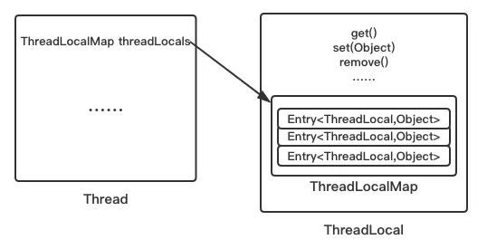
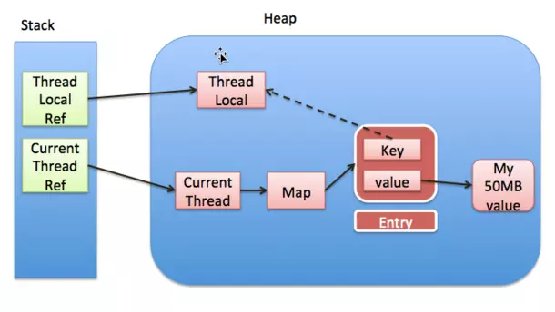

### ThreadLocal 是什么？

官方文档：

> This class provides thread-local variables. These variables differ from their normal counterparts in that each thread that accesses one (via its get or set method) has its own, independently initialized copy of the variable. ThreadLocal instances are typically private static fields in classes that wish to associate state with a thread (e.g., a user ID or Transaction ID).

也就是，这个类用来提供属于线程自己的变量，线程通过 set 或 get 等方法访问这些变量，在一个类中，ThreadLocal 成员变量通常用 private static 修饰。

简单使用：

```Java
public class ThreadLocalDemo1 {

    public static void main(String[] args){
        ThreadLocal<String> threadLocal = new ThreadLocal<>();
        // 设置属于main线程的值
        threadLocal.set("main");
        new Thread(){
            @Override
            public void run() {
                // 设置属于当前线程的值
                threadLocal.set("thread");
                // 取出当前线程的值
                System.out.println(getName() + threadLocal.get());
                threadLocal.remove();
            }
        }.start();
        
        // 取出main线程的值
        System.out.println(threadLocal.get());
        threadLocal.remove();
    }
}
```


### ThreadLocal 实现原理

内部结构图



来自https://juejin.im/post/5aa74967f265da23a334e373

由内部结构图可以知道，ThreadLocalMap 才是存储数据的容器，ThreadLocal 相当于提供了操作容器方法的工具类。而且，ThreadLocalMap 并不属于 ThreadLocal，而是属于 Thread 对象。

#### ThreadLocal 提供的方法

```java
// 获得线程t的ThreadLocalMap
ThreadLocalMap getMap(Thread t) {
    // 直接返回线程的成员对象threadLocals
    return t.threadLocals;
}

// 为线程t的成员对象threadLocals设置对象
void createMap(Thread t, T firstValue) {
    t.threadLocals = new ThreadLocalMap(this, firstValue);
}
```

set方法

```java
public void set(T value) {
    // 获取当前线程
    Thread t = Thread.currentThread();
    // 获取线程的threadLocals
    ThreadLocalMap map = getMap(t);
    if (map != null) {
        // 如果不为空则设置当前键所对应的值
        map.set(this, value);
    } else {
        // map 为空则创建ThreadLocalMap对象
        createMap(t, value);
    }
}
```

get 方法

```java
public T get() {
    Thread t = Thread.currentThread();
    ThreadLocalMap map = getMap(t);
    if (map != null) {
        // 获取以当前ThreadLocal对象为key的值的Entry
        ThreadLocalMap.Entry e = map.getEntry(this);
        if (e != null) {
            @SuppressWarnings("unchecked")
            T result = (T)e.value;
            return result;
        }
    }
    // 如果map或者e为null，则返回自己制定的初始化value并存入map
    return setInitialValue();
}

private T setInitialValue() {
    // 自己定制初始值
    T value = initialValue();
    Thread t = Thread.currentThread();
    ThreadLocalMap map = getMap(t);
    if (map != null) {
        map.set(this, value);
    } else {
        createMap(t, value);
    }
    if (this instanceof TerminatingThreadLocal) {
        TerminatingThreadLocal.register((TerminatingThreadLocal<?>) this);
    }
    return value;
}

// 自己重写这个方法定制初始化的值
protected T initialValue() {
    return null;
}
```

remove 方法

```java
public void remove() {
	//1. 获取当前线程的threadLocalMap
	ThreadLocalMap m = getMap(Thread.currentThread());
 	if (m != null)
		//2. 从map中删除以当前threadLocal实例为key的键值对
		m.remove(this);
}
```


### ThreadLocalMap

#### 一些属性

```java
// 初始化容量
private static final int INITIAL_CAPACITY = 16;

// 存储数据的Entry数组，容量必须为2的幂次方
private Entry[] table;

// 数组中的键值对数量
private int size = 0;

// 扩容的h阀值
private int threshold; // Default to 0

// 默认扩容的阀值为数组长度的 2/3
private void setThreshold(int len) {
    threshold = len * 2 / 3;
}
```


#### Entry 数组

Entry 类似于 HashMap 的 Node 类，同样是存储键值对的类。**但是这里的 Entry 数组已经指定了 Entry 的 key 的类型为 ThreadLocal。**

**我们存入的数据是通过 Entry 来组织的，也就是说，如果我们使用 `threadLocal.set(value)`，相当于存入以当前 threadLocal 为 key，value 为值的键值对。**

```java
static class Entry extends WeakReference<ThreadLocal<?>> {
    /** The value associated with this ThreadLocal. */
    Object value;

    Entry(ThreadLocal<?> k, Object v) {
        super(k);
        value = v;
    }
}
```

注意这里的 threadLocal 是弱引用，Entry 继承了 WeakReference，在 Entry 构造方法中，调用 super(k) 将 threadLocal 实例包装成 WeakReference。

thread，threadLocal，threadLocalMap，Entry之间的关系：



注意：虚线为弱引用。

#### set 方法

```java
private void set(ThreadLocal<?> key, Object value) {

    // We don't use a fast path as with get() because it is at
    // least as common to use set() to create new entries as
    // it is to replace existing ones, in which case, a fast
    // path would fail more often than not.

    Entry[] tab = table;
    int len = tab.length;
    // 根据ThreadLocal的hashcode确定位置
    int i = key.threadLocalHashCode & (len-1);
	
    // 采用开放定址法，如果产生hash冲突使用线性探测
    for (Entry e = tab[i];
         e != null;
         e = tab[i = nextIndex(i, len)]) {
        // 获取table中位置为i的entry的键 k
        ThreadLocal<?> k = e.get();
		// 因为使用线程探测法，假设之前插入值发生hash冲突，那么它可能占据我们后来想要插入的位置
        // 如果键k就是我们期待的key
        if (k == key) {
            // 更新
            e.value = value;
            return;
        }
		// 如果key为null，说明threadLocal强引用已经被释放掉
        // 也就是没办法通过这个key获取对应的entry
        if (k == null) {
            // 用当前插入值替换这个key为null的“脏”Entry
            replaceStaleEntry(key, value, i);
            return;
        }
    }
	// 直接插入
    tab[i] = new Entry(key, value);
    int sz = ++size;
    // 插入后再次清除一些key为null的脏entry，如果大于阀值看是否需要扩容
    if (!cleanSomeSlots(i, sz) && sz >= threshold)
        rehash();
}
```

**ThreadLocal 中关于 ThreadLocalHashCode 代码**

```java
private final int threadLocalHashCode = nextHashCode();

private static AtomicInteger nextHashCode =
    new AtomicInteger();


private static final int HASH_INCREMENT = 0x61c88647;


private static int nextHashCode() {
    return nextHashCode.getAndAdd(HASH_INCREMENT);
}

```

其实通过上面代码可以得知，每实例化一个 ThreadLocal 实例，它的 threadLocalHashCode 会自动计算，即自增，增量为 0x61c88647。

0x61c88647这个数是有特殊意义的，它能够保证hash表的每个散列桶能够均匀的分布，这是`Fibonacci Hashing`，关于更多介绍可以看[这篇文章的threadLocal散列值部分](https://link.juejin.im?target=https%3A%2F%2Fwww.cnblogs.com%2Fzhangjk1993%2Farchive%2F2017%2F03%2F29%2F6641745.html)。也正是能够均匀分布，所以threadLocal选择使用开放地址法来解决hash冲突的问题。

#### getEntry方法

因为 ThreadLocalMap 中采用开放定址法，所以当前 key 的散列值和元素在数组中的索引并不一定完全对应。所以在 get 的时候，首先会看 key 的散列值对应的数组元素是否为要查找的元素，如果不是，再调用 `getEntryAfterMiss` 方法查找后面的元素。

```java
private Entry getEntry(ThreadLocal<?> key) {
	//1. 确定在散列数组中的位置
    int i = key.threadLocalHashCode & (table.length - 1);
	//2. 根据索引i获取entry
    Entry e = table[i];
	//3. 满足条件则返回该entry
    if (e != null && e.get() == key)
        return e;
    else
		//4. 未查找到满足条件的entry，继续处理
        return getEntryAfterMiss(key, i, e);
}

// 未找到entry后的操作
private Entry getEntryAfterMiss(ThreadLocal<?> key, int i, Entry e) {
    Entry[] tab = table;
    int len = tab.length;
	// 从 i 开始向后查找
    while (e != null) {
        ThreadLocal<?> k = e.get();
        // 查找到key，返回
        if (k == key)
            return e;
        // 查找到脏key，清除
        if (k == null)
            expungeStaleEntry(i);
        // 继续向后查找
        else
            i = nextIndex(i, len);
        e = tab[i];
    }
    return null;
}

```


### ThreadLocal 几个问题

#### 一、为什么不直接使用线程 id 作为 ThreadLocalMap 的 key？

答：一个线程中可能使用多个 ThreadLocal 对象，也就是 ThreadLocalMap 有多个键值对，如果使用线程 id 作为 key，则线程中的 ThreadLocalMap只能有一个键值对。

#### 二、内存泄露问题

首先要知道内存泄露和内存溢出的区别：

内存溢出：创建大量被引用的对象，导致后续继续申请内存空间时没有足够的内存空间。

内存泄露：程序申请完内存后无法将其释放（不再使用的变量任然占据空间）


如上图，如果 ThreadLocal 没有强引用，则系统 gc 时会被回收，那么 ThreadLocalMap 就出现了 key 为 null 的 Entry，而对于 value 来说，存在一条强引用链

>  Thread Ref -> Thread -> ThreaLocalMap -> Entry -> value

如果线程没有结束，则 value 所占据的空间不会被回收，造成内存泄露。

只有当前thread结束以后, Thread Ref就不会存在栈中,强引用断开, Thread,、ThreadLocalMap、 Entry 将全部被GC回收。但如果是线程对象不被回收的情况，比如使用线程池，线程结束是不会销毁的，就可能出现真正意义上的内存泄露。

所以在使用 ThreadLocal 时，最好显示进行 remove。虽然在 ThreadLocalMap 中的 set，getEntry，resize 等方法会尽力处理这些脏entry，但还是有可能造成内存泄露。

#### 三、为什么使用弱引用？

首先看使用强引用会有什么后果。如果使用强引用，当我们在代码中执行 `threadLocal = null`，也就是清除 threadLocal 实例，因为存在强引用链 `Thread Ref -> Thread -> ThreaLocalMap -> Entry -> key -> threadLocal`，导致 threadLocal 根本不会被回收，这样代码无法达到我们的目的，出现逻辑错误。

