### 线程的生命周期

#### 线程的 new 状态

用 new 关键字创建一个 Thread 对象，而且还没有调用 start() 方法，则线程处于 new 状态，new 状态通过调用 start() 方法进入 runnable 状态。

#### 线程的 runnable 状态

当我们调用 start() 方法后，线程处于 runnable（可执行） 状态，这个时候并没有真正执行线程，需要等待 cpu 调度。除了意外终止，处于 runnable 不会越过 running 状态直接进入其他状态，因为就算调用线程中的 wait、sleep 或者其他 bolck 的 IO 操作等，也必须等待 cpu 的调度才行。

#### 线程的running状态

线程被 cpu 调度后就进入 runnable 状态。 

#### 线程的 blocked 状态

#### 线程的 terminated 状态

几种状态的转换：


### 并发编程 BUG 的源头


#### 一、缓存导致的可见性问题

在单核时代，所有线程在一颗 CPU 上执行，操作的都是同一个 CPU 的缓存，一个线程的读写对于另外一个线程来说一定是可见的。

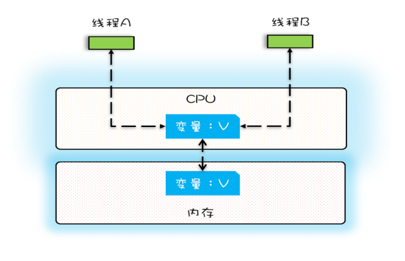

如上图，在线程 A 与线程 B 操作的是同一个 CPU 缓存，当线程 A 更新缓存中的变量 V 后，线程 B 再去访问变量 V ，得到的一定是线程 A 更新过的。

==一个线程对共享变量的修改，另外一个线程可以立刻看到，称为可见性。==

但在多核时代，每个 CPU 都有自己的缓存，当线程在不同的 CPU 执行时，他们操作的缓存自然不一样，这样自然会造成很多问题。

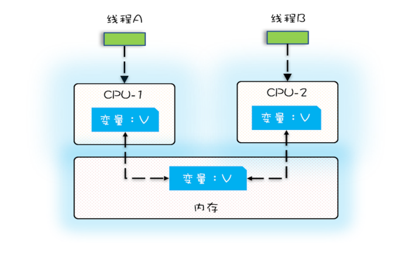

假设两个线程的任务都是将变量 V （假设此时为0）加一，两个线程将变量 V 读入各自的缓存进行加一操作，变量 V 在两个 CPU 的缓存都是 1，所以写回内存的时候，结果是 1， 并不是预期的 2。

#### 二、线程切换带来的原子性问题

现代操作系统为了更有效利用 CPU ，提出了线程调度（刚开始是进程），线程调度自然会涉及到线程切换，线程切换发生在**当前 CPU 指令**执行完后，高级语言与 CPU 指令并不是一一对应，有时候一句高级语言对应几个 CPU 指令。如代码 `count += 1`，至少需要三个 CPU 指令。

指令 1：首先，需要把变量 count 从内存加载到 CPU 的寄存器；

指令 2：之后，在寄存器中执行 +1 操作；

指令 3：最后，将结果写入内存（缓存机制导致可能写入的是 CPU 缓存而不是内存

假设线程  A 执行完指令一后 CPU 切换到线程 B，线程B 执行结束后，CPU 缓存或者内存中 count = 1，接着切换回线程 A，A 从指令二开始执行，因为 A 读取 count 的时候 count = 0， 所以 Ａ执行结束后 count 仍然为 1，如下图。注意这里是对于一个 CPU 来说。

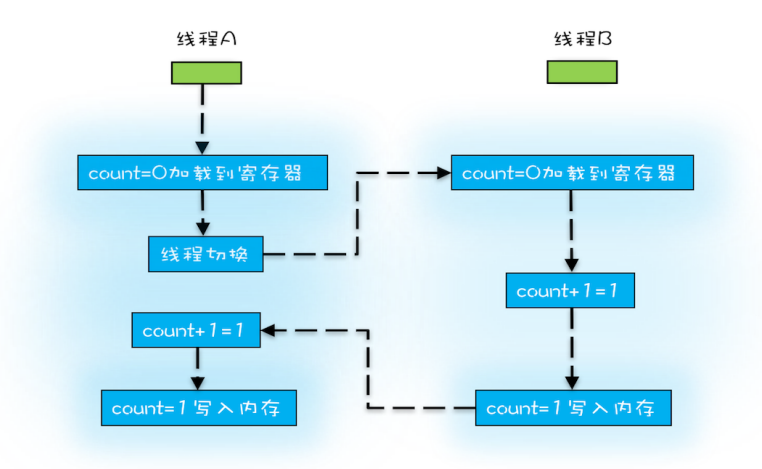

**我们把一个或者多个操作在 CPU 执行的过程中不被中断的特性称为原子性。**


#### 三、编译优化带来的有序性

有序性指的是程序按照代码的先后顺序执行。编译器为了优化性能，有时候会改变程序中语句的先后顺序。比如程序中："a = 6; b = 7;"，但是编译器优化后变成："b = 7; a = 6"。虽然执行的顺序发生改变，但是执行的结果是不会变的。

#### 在多线程下创建单例对象

```java
public class Singleton {
  static Singleton instance;
  static Singleton getInstance(){
    if (instance == null) {
      synchronized(Singleton.class) {
        if (instance == null)
          instance = new Singleton();
      }
    }
    return instance;
  }
}
```

假设刚开始运行，线程 A、B 同时运行到 第一个`if (instance == null)`并都进入代码块，它们同时对 `Singleton.class`加锁，因为只能有一个线程成功加锁，这里假设为线程 A。于是线程 B 处于等待状态。当 A 创建完实例后，线程 B 进行第二个`if (instance == null)`，发现不成立，于是直接返回 instance。

来到这里看似没有问题，但是。

首先，对于语句 `instance = new Singleton();`，会有如下三个操作（实际上不止），

一、为对象开辟空间

二、初始化对象

三、将对象的引用存放到 instance 中

假设经过编译器优化后，操作的顺序变为

一、为对象开辟空间

二、将对象的引用存放到 instance 中

三、初始化对象

当线程 A 执行完操作二后，线程执行切换到线程 B，B发现 instance != null，于是直接返回 instance，可是此时 instance 还没有进行初始化。


### Java内存模型：解决可见性和有序性

#### Java 内存模型

+ 主内存：Java内存模型规定了所有变量都存储在主内存(Main Memory)中（此处的主内存与介绍物理硬件的主内存名字一样，两者可以互相类比，但此处仅是虚拟机内存的一部分）。

+ 工作内存：每条线程都有自己的工作内存(Working Memory，又称本地内存，可与前面介绍的处理器高速缓存类比)，线程的工作内存中保存了该线程使用到的变量的主内存中的共享变量的副本拷贝。**工作内存是 JMM 的一个抽象概念，并不真实存在**。它涵盖了缓存，写缓冲区，寄存器以及其他的硬件和编译器优化。

Java 内存模型抽象示意图

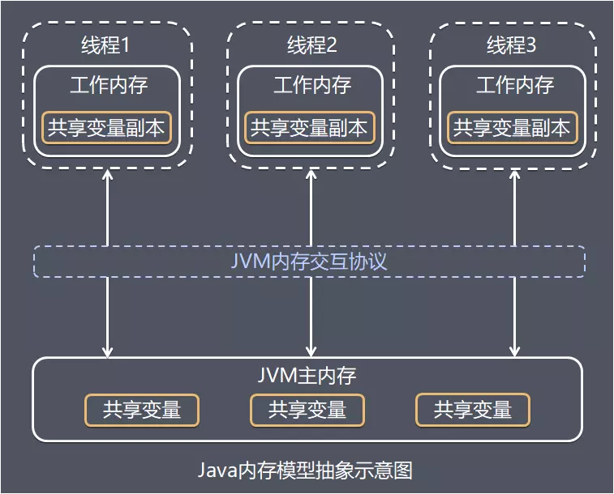

[Java 内存模型](https://juejin.im/post/5bf2977751882505d840321d#heading-3)

#### 内存间的交互操作

关于主内存与工作内存之间的具体交互协议，即一个变量如何从主内存拷贝到工作内存、如何从工作内存同步回主内存之类的实现细节，Java内存模型中定义了下面介绍8种操作来完成。

虚拟机实现时必须保证下面介绍的每种操作都是原子的，不可再分的(对于double和long型的变量来说，load、store、read、和write操作在某些平台上允许有例外）。

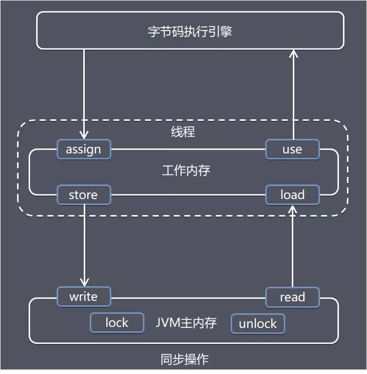

+ lock (锁定) 作用于**主内存**的变量，它把一个变量标识为一条线程独占的状态。

+ unlock (解锁) 作用于**主内存**的变量，它把一个处于锁定状态的变量释放出来，释放后的变量才可以被其他线程锁定。

+ read (读取) 作用于**主内存**的变量，它把一个变量的值从主内存**传输**到线程的工作内存中，以便随后的load动作使用。

+ load (载入) 作用于**工作内存**的变量，它把read操作从主内存中得到的变量值放入工作内存的变量副本中。

+ use (使用) 作用于**工作内存**的变量，它把工作内存中一个变量的值传递给执行引擎，每当虚拟机遇到一个需要使用到变量的值得字节码指令时就会执行这个操作。

+ assign (赋值) 作用于**工作内存**的变量，它把一个从执行引擎接收到的值赋给工作内存的变量，每当虚拟机遇到一个给变量赋值的字节码指令时执行这个操作。

+ store (存储) 作用于**工作内存**的变量，它把工作内存中一个变量的值传送到主内存中，以便随后write操作使用。

+ write (写入) 作用于**主内存**的变量，它把store操作从工作内存中得到的变量的值放入主内存的变量中。

#### volatile 型变量

如果一个变量被定义为 volatile 之后，他将具有两种特性。

+ 第一是指保证此变量对所有线程的具有可见性。这里的可见性是指当一个线程修改这个变量的值，新值对于其他变量来说是立即得知的。跟普通变量不同，例如，对于变量 `a = 1`存储在主内存和线程 A、B 的工作内存，如果线程 A 将 a 修改为 2 之后写入主内存，如果线程 B 不再次从主内存读取，他还是保留 `a = 1`。
+ 第二是禁止指令重排序。

**[volatile 如何保证可见行？](https://zhuanlan.zhihu.com/p/55167585)**

比如对 volatile 变量进行赋值，线程会做如下两件事：

1.  更新主内存
2. 向 CPU 总线发送一个修改信号

**这时监听CPU总线的处理器会收到这个修改信号后，如果发现修改的数据自己缓存了，就把自己缓存的数据失效掉。这样其它线程访问到这段缓存时知道缓存数据失效了，需要从主内存中获取。这样所有线程中的共享变量i就达到了一致性。**

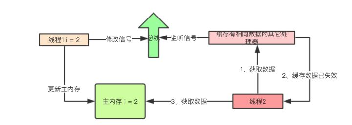

**那 Java 如何保证有序性？主要就是定义了 [`happens-before`](https://juejin.im/post/5a2b53b7f265da432a7b821c#heading-3)原则。**

1. **程序顺序规则**： 一个线程中的每个操作，happens-before于该线程中的任意后续操作

2. **监视器锁规则**：对一个线程的解锁，happens-before于随后对这个线程的加锁

3. **volatile变量规则**： 对一个volatile域的写，happens-before于后续对这个volatile域的读

4. **传递性**：如果A happens-before B ,且 B happens-before C, 那么 A happens-before C

5. **start()规则**： 如果线程A执行操作`ThreadB_start()`(启动线程B) ,  那么A线程的`ThreadB_start()`happens-before 于B中的任意操作

6. **join()原则**： 如果A执行`ThreadB.join()`并且成功返回，那么线程B中的任意操作happens-before于线程A从`ThreadB.join()`操作成功返回。

7. **interrupt()原则**： 对线程`interrupt()`方法的调用先行发生于被中断线程代码检测到中断事件的发生，可以通过`Thread.interrupted()`方法检测是否有中断发生

8. **finalize()原则**：一个对象的初始化完成先行发生于它的`finalize()`方法的开始


第1条规则程序顺序规则是说在一个线程里，所有的操作都是按顺序的，但是在JMM里其实只要执行结果一样，是允许重排序的，==这边的happens-before强调的重点也是单线程执行结果的正确性，但是无法保证多线程也是如此。==

#### volatile 实现原理

**内存屏障**

内存屏障是被插入两个CPU指令之间的一种指令，用来禁止处理器指令发生重排序（像屏障一样），从而保障**有序性**的。

另外，为了达到屏障的效果，它会使处理器在写入、读取值（内存屏障之后的语句）之前将主内存的值写入高速缓存，清空无效队列，从而保障可见性。

比如

```
Store1; 
Store2;   
Load1;   
StoreLoad;  //内存屏障
Store3;   
Load2;   
Load3;
```

对于以上的 CPU 指令，以 StoreLoad 为分界线，StoreLoad 之前和之后的指令是不能进行交换的，而StoreLoad 之前的指令之前，之后的指令之间是可以交换位置的（保证运行结果不变的前提下）。

常见的四种内存屏障：

+ LoadLoad屏障： 对于这样的语句 Load1; LoadLoad; Load2，在Load2及后续读取操作要读取的数据被访问前，保证Load1要读取的数据被读取完毕。

+ StoreStore屏障： 对于这样的语句 Store1; StoreStore; Store2，在Store2及后续写入操作执行前，保证Store1的写入操作对其它处理器可见。

+ LoadStore屏障： 对于这样的语句Load1; LoadStore; Store2，在Store2及后续写入操作被执行前，保证Load1要读取的数据被读取完毕。

+ StoreLoad屏障： 对于这样的语句Store1; StoreLoad; Load2，在Load2及后续所有读取操作执行前，保证Store1的写入对所有处理器可见。它的开销是四种屏障中最大的（冲刷写缓冲器，清空无效化队列）。在大多数处理器的实现中，这个屏障是个万能屏障，兼具其它三种内存屏障的功能。

volatile 变量实现

具体实现方式是在编译期生成字节码时，会在指令序列中增加内存屏障来保证，下面是基于保守策略的JMM内存屏障插入策略：

+ 在每个volatile写操作的前面插入一个StoreStore屏障。 该屏障除了保证了屏障之前的写操作和该屏障之后的写操作不能重排序，还会保证了volatile写操作之前，任何的读写操作都会先于volatile被提交。

+ 在每个volatile写操作的后面插入一个StoreLoad屏障。 该屏障除了使volatile写操作不会与之后的读操作重排序外，还会刷新处理器缓存，使volatile变量的写更新对其他线程可见。

+ 在每个volatile读操作的后面插入一个LoadLoad屏障。 该屏障除了使volatile读操作不会与之前的写操作发生重排序外，还会刷新处理器缓存，使volatile变量读取的为最新值。

+ 在每个volatile读操作的后面插入一个LoadStore屏障。 该屏障除了禁止了volatile读操作与其之后的任何写操作进行重排序，还会刷新处理器缓存，使其他线程volatile变量的写更新对volatile读操作的线程可见。

#### 利用锁解决原子性

我们把一段需要互斥执行的代码称为临界区，线程进入临界区之前要尝试加锁，如果成功，进入临界区执行代码，此时称这个线程持有锁；如果不成功，则等待至持有锁的线程解锁。执行完临界区代码的线程需要释放锁。

**Java 中的锁技术：synchronized**

```java
class X{
  synchronized void methed1(){
    //临界区
  }

  synchronized static void staticMethod(){
    //临界区
  }

  Object obj = new Object();
  void method2(){
    synchronized(obj){
      //临界区
    }
  }
}
```

对于 method2 ，我们将 obj 作为锁，线程在执行里面被 synchronized 包围的代码时，需要检查是否能获得锁 obj。

对于 method1 和 staticMethod 都是通过 synchronized 来修饰方法，他们的锁是隐式的。它的规则如下：

+ 当修饰静态方法的时候，锁定的是当前类的 Class 对象，在上面的例子中就是 Class X；
+ 当修饰非静态方法的时候，锁定的是当前实例对象 this。

// todo

## [synchronized优化](https://www.jianshu.com/p/457c40e95a0d)

### Synchronized底层原理

#### Java 对象头

Java 对象头主要包括两部分数据：**Mark Word（标记字段）**和**Klass Pointer**（类型指针）

- Klass Pointer 是对象指向它的类（Class）元数据的指针，虚拟机通过这个指针来确定这个对象是哪个类的实例。
- Mark Word 用于存储对象自身的运行时数据。
  - 如哈希码（HashCode）、GC 分代年龄、锁状态标志、线程持有的锁、偏向线程 ID、偏向时间戳等。


#### Monitor（监视器锁）

Object 的实现类 [oppDesc](http://hg.openjdk.java.net/jdk10/jdk10/hotspot/file/5ab7a67bc155/src/share/vm/oops/oop.hpp)

```c++
class oopDesc {
  friend class VMStructs;
  friend class JVMCIVMStructs;
 private:
  volatile markOop  _mark;//markOop:Mark Word标记字段
  union _metadata {
    Klass*      _klass;//对象类型元数据的指针
    narrowKlass _compressed_klass;
  } _metadata;

  // Fast access to barrier set.  Must be initialized.
  static BarrierSet* _bs;

 public:
  markOop  mark() const         { return _mark; }
  markOop* mark_addr() const    { return (markOop*) &_mark; }

  void set_mark(volatile markOop m)      { _mark = m;   }

  void    release_set_mark(markOop m);
  markOop cas_set_mark(markOop new_mark, markOop old_mark);

  // Used only to re-initialize the mark word (e.g., of promoted
  // objects during a GC) -- requires a valid klass pointer
  void init_mark();

  Klass* klass() const;
  Klass* klass_or_null() const volatile;
  Klass** klass_addr();
  narrowKlass* compressed_klass_addr();
//....省略...
}
```

里面的 [markOop](http://hg.openjdk.java.net/jdk10/jdk10/hotspot/file/5ab7a67bc155/src/share/vm/oops/markOop.hpp) 类继承自oopDesc，并拓展了自己的方法monitor()

```c++
  ObjectMonitor* monitor() const {
    assert(has_monitor(), "check");
    // Use xor instead of &~ to provide one extra tag-bit check.
    return (ObjectMonitor*) (value() ^ monitor_value);
  }
```

[ObjectMonitor](http://hg.openjdk.java.net/jdk10/jdk10/hotspot/file/5ab7a67bc155/src/share/vm/runtime/objectMonitor.hpp) 类部分属性

```c++
ObjectMonitor() {
    _header       = NULL;//markOop对象头
    _count        = 0; // _count is approximately |_WaitSet| + |_EntryList|
    _waiters      = 0,//等待线程数
    _recursions   = 0;//重入次数
    _object       = NULL;//监视器锁寄生的对象。锁不是平白出现的，而是寄托存储于对象中。
    _owner        = NULL;//指向获得ObjectMonitor对象的线程或基础锁
    _WaitSet      = NULL;//处于wait状态的线程，会被加入到wait set；
    _WaitSetLock  = 0 ;
    _Responsible  = NULL ;
    _succ         = NULL ;
    _cxq          = NULL ; 
    FreeNext      = NULL ;
    _EntryList    = NULL ;//处于等待锁block状态的线程，会被加入到entry set；
    _SpinFreq     = 0 ;
    _SpinClock    = 0 ;
    OwnerIsThread = 0 ;// _owner is (Thread *) vs SP/BasicLock
    _previous_owner_tid = 0;// 监视器前一个拥有者线程的ID
  }
```

由上面可知，Java 的基类 Object 类存在 Monitor 对象与之关联，**所以，这是为什么Java中任意对象都可以作为锁的原因，同时也是notify/notifyAll/wait方法等存在于顶级对象Object中的原因。**


在 Monitor 中存在两个队列，_EntryList 和 _WaitSet，分别为锁池和等待池，当多个线程想要进入同步代码块，会一起进入锁区，只有一个线程能得到锁， _owner  会指向得到锁的线程，而没有得到锁的线程会在锁区等待，并处于阻塞状态。

如果获得锁的线程调用了 wait 的方法，owner 属性将会被置为 null，并且线程会进入_**WaitSet**中等待被唤醒。


### 偏向锁

- 开启偏向锁 **-XX:+UseBiasedLocking -XX:BiasedLockingStartupDelay=0**。
- 关闭偏向锁 **-XX:-UseBiasedLocking**。

偏向于第一个访问的线程。当一个线程访问同步代码块时，会在对象头存储偏向的线程 ID，以后这个线程进入这个同步代码块时就不用进行 CAS 操作来加锁和解锁，只需要测试一下 Mark Word 中是否存储指向当前线程的偏向锁。

#### 偏向锁的获取（当线程访问同步代码块）：

1. 访问 Mark Word 中的偏向锁标志是否设置成1， 锁标志是否为 01，确认为可偏向态。

2. 如果为可偏向状态，则测试线程 ID 是否指向当前线程。

   + 是，执行同步代码
   + 否，下一步

3. 如果线程 ID 没有指向当前线程，则通过 CAS 操作竞争锁。

   + 竞争成功：将 Mark Word 中的线程 ID 设置为当前线程 ID，执行同步代码块。
   + 竞争失败，下一步

4. 若 CAS 获取偏向锁失败，则表示有竞争（多个线程同时要执行代码块）

   当到达全局安全点时获得偏向锁的线程会被挂起（当前执行代码块的线程），偏向锁升级为轻量级锁，然后在被阻塞的安全点继续执行同步代码块。（撤销偏向锁的时候会导致 stop the world，时间很短）

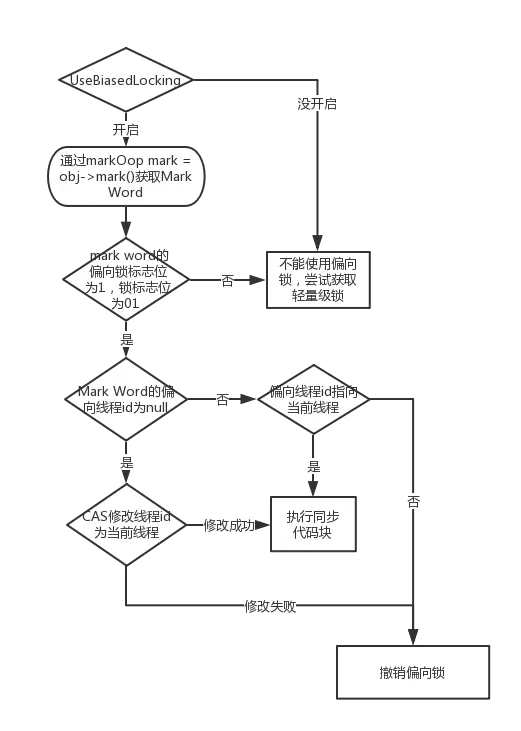

#### 偏向锁的释放

1. 偏向锁只有遇到其他线程尝试竞争锁时，持有偏向锁的线程才会释放锁，线程不会主动释放偏向锁。

2. 偏向锁的撤销：

   偏向锁需要在**等待全局安全点**（这个时间点没有字节码在执行）撤销。

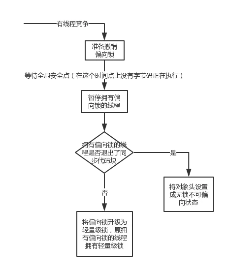

#### 小结

- 一个对象刚开始实例化的时候，没有任何线程来访问它的时候，它是可偏向的，当第一个
  线程来访问它的时候，它会偏向这个线程，此时，对象持有偏向锁。线程在修改对象头成为偏向锁的时候使用 CAS 操作，并将对象头中的 ThreadID 改成自己的 ID，之后再次访问这个对象时，只需要对比 ID，不需要再使用 CAS 在进行操作。
- 一旦有第二个线程访问这个对象，因为偏向锁不会主动释放，所以第二个线程可以看到对象是偏向状态，这时表明在这个对象上已经存在竞争了，检查原来持有该对象锁的线程是否依然存活，如果挂了，则将对象变为无锁状态，然后重新偏向新的线程。
- 如果原来的线程依然存活，则马上执行那个线程的操作栈，检查该对象的使用情况，如果仍然需要持有偏向锁，则偏向锁升级为轻量级锁，（偏向锁就是这个时候升级为轻量级锁的）。如果不存在使用了，则可以将对象回复成无锁状态，然后重新偏向。

### 轻量级锁

轻量级锁原理非常简单，如果持有锁的线程能在很短时间内释放锁资源，那么那些等待竞争锁的线程就不需要做内核态和用户态之间的切换进入阻塞挂起状态，它们只需要等一等（自旋），等持有锁的线程释放锁后即可立即获取锁，这样就避免用户线程和内核的切换的消耗。

#### 轻量级锁加锁过程

#### 加锁

1. 在线程进入同步代码块时，如果同步对象锁状态为无锁且不开启偏向锁，虚**拟机会在当前线程栈帧中建立一个叫做锁记录（Lock Record）的空间**，用于存储锁对象的 Mark Word 的拷贝，如下图

   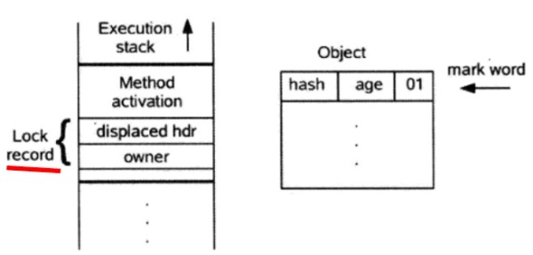

2. 拷贝锁对象头中的 Mark Word 到锁记录中

3. 拷贝成功后，**虚拟机尝试使用 CAS 操作将对象头 Mark Word 更新为指向 Lock Record 的指针**。如果更新成功，进入步骤4，不成功进入步骤5

4. 如果这个更新动作成功了，那么这个线程就拥有了该对象的锁，并且对象Mark Word的锁标志位设置为“00”，Lock Record 的owner 指向锁对象，即表示此对象处于轻量级锁定状态，这时候线程堆栈与对象头的状态如下图所示：

   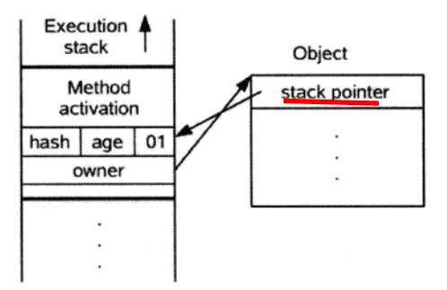

5. 如果更新失败，虚拟机会先检查 Mark Word 是否指向当前线程的栈帧，如果是说明线程已经拥有这个对象的锁，将锁的获取次数加一并进入同步代码块执行。如果不是则说明有多个线程在竞争锁，此时线程会尝试通过自旋等待锁，如果自旋时间过长，则会膨胀成重量级锁。

#### 解锁

轻量级解锁时，会使用原子的CAS操作将Displaced Mark Word替换回到对象头，如果成功，则表示没有竞争发生。如果失败，表示当前锁存在竞争，锁就会膨胀成重量级锁。

### 死锁

当同时出现以下四种情况会导致死锁

1. 互斥，共享资源 X 和 Y 只能被一个线程占用；
2. 占有且等待，线程 T1 已经取得共享资源 X，在等待共享资源 Y 的时候，不释放共享资源 X；
3. 不可抢占，其他线程不能强行抢占线程 T1 占有的资源；

4. 循环等待，线程 T1 等待线程 T2 占有的资源，线程 T2 等待线程 T1 占有的资源，就是循环等
待。

当我们破坏其中一个条件，就可以避免死锁的发生。

首先，互斥是没办法避免的，因为锁本来就是利用互斥。那其他三种如何破坏？

1. 对于“占用且等待”这个条件，我们可以一次性申请所有的资源，这样就不存在等待了。
2. 对于“不可抢占”这个条件，占用部分资源的线程进一步申请其他资源时，如果申请不到，可
以主动释放它占有的资源，这样不可抢占这个条件就破坏掉了。
3. 对于“循环等待”这个条件，可以靠按序申请资源来预防。所谓按序申请，是指资源是有线性
顺序的，申请的时候可以先申请资源序号小的，再申请资源序号大的，这样线性化后自然就不
存在循环了。

### 各种锁的比较

| 锁       | 优点                               | 缺点                                       | 适用场景                               |
| -------- | ---------------------------------- | ------------------------------------------ | -------------------------------------- |
| 偏向锁   | 加锁解锁不需要额外消耗             | 如果线程间存在竞争，会带来额外的锁撤销消耗 | 一个线程访问同步块的场景               |
| 轻量级锁 | 竞争线程不会阻塞，提高程序响应速度 | 得不到锁竞争的线程，会自旋消耗 CPU         | 追求响应时间，同步块执行速度很快的场景 |
| 重量级锁 | 线程竞争不适用自旋，不消耗 CPU     | 线程阻塞，响应速度慢                       | 追求吞吐量，同步块执行时间较长的场景   |

### 等待通知机制

所谓的等待通知机制就是当线程所需的条件受不到满足，则线程阻塞自己进入等待状态，当线程所需的条件满足后，**通知**等待的线程重新执行。

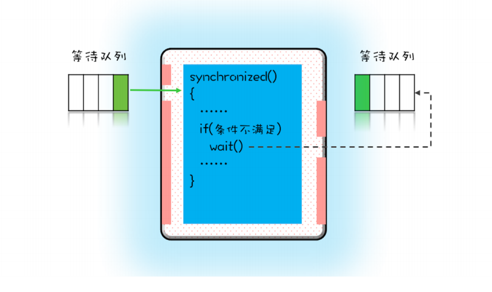

如上图，当一个线程进入临界区后，其他线程只能进入左边的等待队列中等待，==这个等待队列和互斥锁是一对一的关系，每个互斥锁都有自己的等待队列。==

在并发过程中，当一个线程进入临界区，如果需要的条件不满足，则可以调用它所持有的锁 X 的 wait() 方法，这时线程会被阻塞并进入右边的等待队列，同时，线程在进入等待队列的同时，会释放所持有的互斥锁。

当线程需要的条件都得到了满足后，可以通过调用锁 X 的 notify() 和 notifyAll() 来通知等待队列中的线程它们的条件曾经满足过。

为什么说是曾经满足过呢？因为notify() 只能保证在通知时间点，条件是满足的。而被通知线程
的执行时间点和通知的时间点基本上不会重合，所以当线程执行的时候，很可能条件已经不满足
了（保不齐有其他线程插队）。

#### 尽量使用 notifyAll()

notify()：随机通知等待队列中的一个线程。

notifyAll() ： 通知等待队列中的所有线程。

如果使用 notify()  可能导致线程饥饿，即线程没机会被唤醒。

#### wait() 方法和 sleep() 方法都能让当前线程挂起一段时间，那它们的区别是什么？

+ wait会释放所有锁而sleep不会释放锁资源
+ wait只能在同步方法和同步块中使用，而sleep任何地方都可以
+  sleep是Thread的方法，而wait是Object类的方法


### reference

[Java synchronized原理总结 - EnjoyMoving的文章 - 知乎](https://zhuanlan.zhihu.com/p/29866981)

