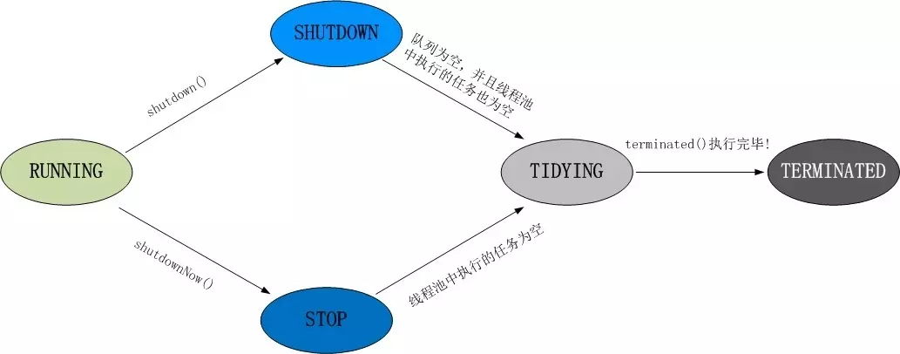

### 简介

线程池是管理一组线程的资源池。之所以要使用线程池，是因为创建、销毁线程需要消耗系统资源，对于任务执行时间短的线程，不停的创建、销毁线程的时间可能比执行线程任务的时间还长。

### Executor框架


### Executor 接口

```java
public interface Executor {

    /**
     * Executes the given command at some time in the future.  The command
     * may execute in a new thread, in a pooled thread, or in the calling
     * thread, at the discretion of the {@code Executor} implementation.
     *
     * @param command the runnable task
     * @throws RejectedExecutionException if this task cannot be
     * accepted for execution
     * @throws NullPointerException if command is null
     */
    void execute(Runnable command);
}
```

Executor 是 Executor 框架的顶级接口


### ExecutorService 接口

该接口在 Executor 的基础上提供了对任务执行的生命周期的管理，它的主要方法

```java
public interface ExecutorService extends Executor {

    // 等待所有任务完成，并设置超时时间
    boolean awaitTermination(long timeout, TimeUnit unit);

    // 执行所有任务
    <T> List<Future<T>> invokeAll(Collection<? extends Callable<T>> tasks);


    // 执行所有任务，但设置了超时时间
    <T> List<Future<T>> invokeAll(Collection<? extends Callable<T>> tasks, long 
                                  timeout, TimeUnit unit);

    // 执行任意一个任务，返回执行完任务的结果
    <T> T invokeAny(Collection<? extends Callable<T>> tasks);

	// 同上，只是设置了超时时间
    <T> T invokeAny(Collection<? extends Callable<T>> tasks, long timeout, 
                    TimeUnit unit);

    // 判断线程池是否已经关闭
    boolean isShutdown();

    // 如果调用了 shutdown() 或 shutdownNow() 方法后，所有任务结束了，那么返回true
    // 这个方法必须在调用shutdown或shutdownNow方法之后调用才会返回true
    boolean isTerminated();

    // 关闭线程池，已经提交的任务继续执行，拒绝接受新任务
    void shutdown();

    // 尝试停止正在执行的任务，拒绝接受新任务
    List<Runnable> shutdownNow();
    
    // 提交 Callable 任务
    <T> Future<T> submit(Callable<T> task);

    // 提交 Runnable 任务
    Future<?> submit(Runnable task);
    
    // // 提交 Runnable 任务， result 为任务返回的结果
    <T> Future<T> submit(Runnable task, T result);
}
```


### 相关接口

#### 二、Runnable接口

表示可以异步执行的任务

```java
@FunctionalInterface
public interface Runnable {
    public abstract void run();
}
```

#### 三、Callable 接口

该接口允许有返回值，会抛出异常

```java
@FunctionalInterface
public interface Callable<V> {
    V call() throws Exception;
}
```


### AbstractExecutorService类

AbstractExecutorService 派生自 ExecutorService 接口。 AbstractExecutorService 实现了 submit 和 invoke... 等方法。

#### submit方法

三个方法类似，但是注意参数

```java
    public Future<?> submit(Runnable task) {
        if (task == null) throw new NullPointerException();
        // 将任务包装成 FutureTask
        RunnableFuture<Void> ftask = newTaskFor(task, null);
        // 执行
        execute(ftask);
        return ftask;
    }

    public <T> Future<T> submit(Runnable task, T result) {
        if (task == null) throw new NullPointerException();
        RunnableFuture<T> ftask = newTaskFor(task, result);
        execute(ftask);
        return ftask;
    }


    public <T> Future<T> submit(Callable<T> task) {
        if (task == null) throw new NullPointerException();
        RunnableFuture<T> ftask = newTaskFor(task);
        execute(ftask);
        return ftask;
    }


// 将 runnable 对象包装成 FutureTask
    protected <T> RunnableFuture<T> newTaskFor(Runnable runnable, T value) {
        return new FutureTask<T>(runnable, value);
    }
// 将 callable 对象包装成 FutureTask
    protected <T> RunnableFuture<T> newTaskFor(Callable<T> callable) {
        return new FutureTask<T>(callable);
    }
```


### ThreadPoolExecutor

#### 简介

ThreadPoolExecutor 是 JDK 中的线程池实现，这个类实现了一个线程池需要的各个方法，它实现了任务提交、线程管理、监控等等方法。继承了 AbstractExecutorService，submit 的任务并不会通过 `new Thread(runnable).start() `，而是处于任务队列，等待线程过来领取执行，如下图


#### 构造函数

```java


// 其他几个也是调用这个构造函数
public ThreadPoolExecutor(int corePoolSize,
                          int maximumPoolSize,
                          long keepAliveTime,
                          TimeUnit unit,
                          BlockingQueue<Runnable> workQueue,
                          ThreadFactory threadFactory,
                          RejectedExecutionHandler handler) {
    if (corePoolSize < 0 ||
        maximumPoolSize <= 0 ||
        maximumPoolSize < corePoolSize ||
        keepAliveTime < 0)
        throw new IllegalArgumentException();
    // 几个不能为空的参数
    if (workQueue == null || threadFactory == null || handler == null)
        throw new NullPointerException();
    this.corePoolSize = corePoolSize;
    this.maximumPoolSize = maximumPoolSize;
    this.workQueue = workQueue;
    this.keepAliveTime = unit.toNanos(keepAliveTime);
    this.threadFactory = threadFactory;
    this.handler = handler;
}
```

主要参数含义：

+ corePoolSize

  核心线程数量

+ maximumPoolSize

  最大线程数量

+ workQueue

  任务队列，BlockingQueue 接口的某个实现，主要有以下几种

  | 阻塞队列              | 说明                                   |
  | --------------------- | -------------------------------------- |
  | ArrayBlockingQueue    | 一个由数组结构组成的有界阻塞队列。     |
  | LinkedBlockingQueue   | 一个由链表结构组成的有界阻塞队列。     |
  | PriorityBlockingQueue | 一个支持优先级排序的无界阻塞队列。     |
  | DelayQueue            | 一个使用优先级队列实现的无界阻塞队列。 |
  | SynchronousQueue      | 一个不存储元素的阻塞队列。             |
  | LinkedTransferQueue   | 一个由链表结构组成的无界阻塞队列。     |
  | LinkedBlockingDeque   | 一个由链表结构组成的双向阻塞队列。     |

+ keepAliveTime

  如果线程池中线程数多于核心线程数，空闲线程的最大等待时间，超过该时间空闲线程会被回收。当然 corePoolSize 的线程也可以通过设置而得到回收（allowCoreThreadTimeOut(true)）

+ threadFactory

  创建线程的工厂

+ handler

  线程池任务满了之后再添加任务的处理策略。默认使用 ThreadPoolExecutor.AbortPolicy，即任务被拒绝时抛出异常。

  线程池有以下几种已经定义的策略：

  | 策略                                   | 说明                                                     |
  | -------------------------------------- | -------------------------------------------------------- |
  | ThreadPoolExecutor.AbortPolicy         | 丢弃任务并抛出 RejectedExecutionException 异常。         |
  | ThreadPoolExecutor.DiscardPolicy       | 丢弃任务，但是不抛出异常。                               |
  | ThreadPoolExecutor.DiscardOldestPolicy | 丢弃队列最前面的任务，然后重新尝试执行任务（重复此过程） |
  | ThreadPoolExecutor.CallerRunsPolicy    | 由调用线程处理该任务。                                   |


#### 主要属性

```Java
// ctl包含了两部分内容
// 1. 有效线程数，低29位
// 2. 线程池状态，高3位
private final AtomicInteger ctl = new AtomicInteger(ctlOf(RUNNING, 0));
private static final int COUNT_BITS = Integer.SIZE - 3;
// COUNT_MASK：00011111111111111111111111111111
private static final int COUNT_MASK = (1 << COUNT_BITS) - 1;

// 线程池状态
// runState is stored in the high-order bits
// 就这个状态小于0
private static final int RUNNING    = -1 << COUNT_BITS;
private static final int SHUTDOWN   =  0 << COUNT_BITS;
private static final int STOP       =  1 << COUNT_BITS;
private static final int TIDYING    =  2 << COUNT_BITS;
private static final int TERMINATED =  3 << COUNT_BITS;

// Packing and unpacking ctl
private static int runStateOf(int c)     { return c & ~COUNT_MASK; }
private static int workerCountOf(int c)  { return c & COUNT_MASK; }
private static int ctlOf(int rs, int wc) { return rs | wc; }

// 存放 Worker 的集合，需要获取到锁才能进入
private final HashSet<Worker> workers = new HashSet<>();
```


几种状态：

+ RUNNING：自然运行状态，正在执行任务，可以接受任务。
+ SHUTDOWN：不再接受新任务，但是还在执行任务队列中的任务。
+ STOP：不再接受新任务，也不执行任务队列中的任务。
+ TIDYING：所有的任务都销毁了，workCount 为 0。线程池的状态在转换为 TIDYING 状态时，会执行钩子方法 terminated()
+ TERMINATED：terminated() 方法结束后，线程池的状态就会变成这个

状态转换：




#### 内部类Worker

线程池中的线程会被包装成 Worker

```Java
private final class Worker
    extends AbstractQueuedSynchronizer
    implements Runnable
{
    private static final long serialVersionUID = 6138294804551838833L;

    // 执行任务的线程
    final Thread thread;

    // 线程执行的第一个任务，线程不止执行一个任务
    // 这个值也可以为NUll，这时候从任务队列取任务就行了
    Runnable firstTask;

    // 用于存放此线程完成的任务数
    volatile long completedTasks;

    // Worker 只有这一个构造方法，传入 firstTask，也可以传 null
    Worker(Runnable firstTask) {
        setState(-1); // inhibit interrupts until runWorker
        this.firstTask = firstTask;
        // 调用 ThreadFactory 来创建一个新的线程
        this.thread = getThreadFactory().newThread(this);
    }

    // 这里调用了外部类的 runWorker 方法
    public void run() {
        runWorker(this);
    }

    // 加锁
    protected boolean tryAcquire(int unused) {
        if (compareAndSetState(0, 1)) {
            setExclusiveOwnerThread(Thread.currentThread());
            return true;
        }
        return false;
    }

    // 解锁
    protected boolean tryRelease(int unused) {
        setExclusiveOwnerThread(null);
        setState(0);
        return true;
    }
    //...
}
```

注意 Worker 实现的是不可重入的互斥锁


#### 提交任务 executor

```java
public void execute(Runnable command) {
    if (command == null)
        throw new NullPointerException();
    /*
     * Proceed in 3 steps:
     *
     * 1. If fewer than corePoolSize threads are running, try to
     * start a new thread with the given command as its first
     * task.  The call to addWorker atomically checks runState and
     * workerCount, and so prevents false alarms that would add
     * threads when it shouldn't, by returning false.
     *
     * 2. If a task can be successfully queued, then we still need
     * to double-check whether we should have added a thread
     * (because existing ones died since last checking) or that
     * the pool shut down since entry into this method. So we
     * recheck state and if necessary roll back the enqueuing if
     * stopped, or start a new thread if there are none.
     *
     * 3. If we cannot queue task, then we try to add a new
     * thread.  If it fails, we know we are shut down or saturated
     * and so reject the task.
     */
    int c = ctl.get();
    // 如果当前线程数小于核心线程数，直接创建 Worker 执行任务
    if (workerCountOf(c) < corePoolSize) {
        // 如果addWorker返回false，提交任务失败，否则成功
        if (addWorker(command, true))
            return;
        // 重新获取 ctl
        c = ctl.get();
    }
    // 如果线程池处于 RUNNING 状态并且任务添加到任务队列成功
    if (isRunning(c) && workQueue.offer(command)) {
        // double check
        int recheck = ctl.get();
        // 如果线程池不处于 RUNNING 状态，则移除任务并执行拒绝策略
        if (! isRunning(recheck) && remove(command))
            reject(command);
        // 如果当前线程数为0，开启新线程
        // 这里是为了处理SHUTDOWN状态下没有活动线程了，但是队列里还有任务没执行这种特殊情况。
        // 因为不再接受新任务，所以传入的任务为null
        // 创建的 Worker 会到任务队列执行任务
        else if (workerCountOf(recheck) == 0)
            addWorker(null, false);
    }
    // 这里说明 1.线程数大于核心线程数且任务队列满，不能再添加任务， 2.状态不为RUNNING
    // 于是以 maximumPoolSize 为界创建新 Worker
    // 如果失败，说明当前线程数为 maximumPoolSize，执行拒绝策略
    else if (!addWorker(command, false))
        reject(command);
}

```

这个方法主要步骤：

处于 RUNNING 状态

1. 活动线程小于核心线程，对于新来的任务则创建新线程去执行。
2. 活动线程大于等于核心线程，则将新来任务加入任务队列
3. 如果上面的条件都不满足，则创建新线程执行任务，但是线程数小于maximumPoolSize
4. 上面条件不满足，对任务执行拒绝策略

不处于 RUNNING 状态，对任务执行拒绝策略


**从 execute 也可以看出，当任务队列使用的是无界队列，参数 maximumPoolSize 也就显得没有意义，因为就算工作线程数超过核心线程数，新来的任务都会被添加到任务队列中。**


**之所以  double check 线程池的状态，是因为在多线程环境下，线程池的状态时刻在变化，而 `ctl.get()` 是非原子操作，很有可能刚获取了线程池状态后线程池状态就改变了。紧接着判断是否将 command 加入 workque 获取的是线程池之前的状态。**

**倘若没有 double check，万一线程池处于非 RUNNING 状态（在多线程环境下很有可能发生），那么 command 将永远不会执行。**


#### 处理提交的任务 addWorker

```java
// firstTask为提交的任务，可以为空
// core：是否使用corePoolSize作为创建线程的界限
// core为false表示以maximumPoolSize作为界限
private boolean addWorker(Runnable firstTask, boolean core) {
    retry:
    for (int c = ctl.get();;) {
        // Check if queue empty only if necessary.
        if (runStateAtLeast(c, SHUTDOWN) // c>=SHUTDOWN，还有STOP, TIDYING, 或 TERMINATED 三种可能状态，如果为SHUTDOWN，不能提交任务，会继续执行已有的任务
            &&
            // c>=STOP，还有TIDYING, 或 TERMINATED可能状态，此时不允许提交任务，并且会中断线程
            (runStateAtLeast(c, STOP)
             // 因为当前线程池状态不能再提交任务，所以firstTask要为null
                || firstTask != null
             // 对应SHUTDOWN状态且任务队列没有任务，如果此状态下还有任务，则继续执行
                || workQueue.isEmpty()))
            return false;
        
        // 走到这的情形：
        // 1.线程池状态为RUNNING
        // 2.SHUTDOWN状态，但队列中还有任务需要执行
        for (;;) {
            // 判定已有工作线程数和界限的大小关系
            if (workerCountOf(c)
                >= ((core ? corePoolSize : maximumPoolSize) & COUNT_MASK))
                return false;
            // 前面的条件符合，准备创建线程，这里通过CAS修改工作线程数
            if (compareAndIncrementWorkerCount(c))
                break retry;
            c = ctl.get();  // Re-read ctl
            // 如果有线程修改了线程池状态，如关闭线程池，需要继续走外面循环
            if (runStateAtLeast(c, SHUTDOWN))
                continue retry;
            // else CAS failed due to workerCount change; retry inner loop
        }
    }

    // 开始创建新线程
    
    // 表示线程是否启动成功
    boolean workerStarted = false;
    // 表示Worker是否添加成功
    boolean workerAdded = false;
    Worker w = null;
    try {
        // 包装线程，创建线程会调用传入的 ThreadFactory
        w = new Worker(firstTask);
        final Thread t = w.thread;
        if (t != null) {
            final ReentrantLock mainLock = this.mainLock;
            // 加锁，因为关闭线程同样需要获取锁
            // 保证添加新Worker到 workers 时线程池不会被关闭
            mainLock.lock();
            try {
                // Recheck while holding lock.
                // Back out on ThreadFactory failure or if
                // shut down before lock acquired.
                int c = ctl.get();
				// 重新检查
                // 1.处于 RUNNING 状态
                // 2.处于 SHUTDOWN 但是任务队列中还有任务
                if (isRunning(c) ||
                    (runStateLessThan(c, STOP) && firstTask == null)) {
                    // Worker中的线程应该处于没启动的状态
                    if (t.isAlive()) // precheck that t is startable
                        throw new IllegalThreadStateException();
                    workers.add(w);
                    int s = workers.size();
                    if (s > largestPoolSize)
                        // largestPoolSize 代表线程池曾经达到的最大线程数
                        largestPoolSize = s;
                    workerAdded = true;
                }
            } finally {
                mainLock.unlock();
            }
            if (workerAdded) {
                t.start();
                workerStarted = true;
            }
        }
    } finally {
        // 启动线程失败
        if (! workerStarted)
            addWorkerFailed(w);
    }
    return workerStarted;
}
```

addWorkerFailed，主要任务就是删除添加到 worker，并且将 worker 数量减1

```java
private void addWorkerFailed(Worker w) {
    final ReentrantLock mainLock = this.mainLock;
    mainLock.lock();
    try {
        if (w != null)
            workers.remove(w);
        decrementWorkerCount();
        tryTerminate();
    } finally {
        mainLock.unlock();
    }
}
```

#### runWorker

当添加新Worker成功，调用了 t.start()，会调用 Worker 的 run 方法

```java
public void run() {
    runWorker(this);
}
```

实际上调用了runWorker

```Java
// 线程启动后执行的方法
final void runWorker(Worker w) {
    Thread wt = Thread.currentThread();
    // 获取线程的任务，可能为null
    Runnable task = w.firstTask;
    w.firstTask = null;
    // Worker的构造函数中抑制了线程中断setState(-1)，所以这里需要unlock从而允许中断
    w.unlock(); // allow interrupts
    boolean completedAbruptly = true;
    try {
        // 循环获取任务
        while (task != null || (task = getTask()) != null) {
            w.lock();
            // If pool is stopping, ensure thread is interrupted;
            // if not, ensure thread is not interrupted.  This
            // requires a recheck in second case to deal with
            // shutdownNow race while clearing interrupt
            // 判断线程池状态或者线程状态
            if ((runStateAtLeast(ctl.get(), STOP) ||
                 (Thread.interrupted() &&
                  runStateAtLeast(ctl.get(), STOP))) &&
                !wt.isInterrupted())
                wt.interrupt();
            try {
                // 钩子方法，留给需要的子类实现
                beforeExecute(wt, task);
                try {
                    // 执行任务
                    // 可能是我们任务的run
                    // 也可能是FutureTask的run方法
                    task.run();
                    afterExecute(task, null);
                } catch (Throwable ex) {
                    // 钩子方法
                    afterExecute(task, ex);
                    throw ex;
                }
            } finally {
                // 置空 task，准备 getTask 获取下一个任务
                task = null;
                // 总共完成的任务
                w.completedTasks++;
                w.unlock();
            }
        }
        completedAbruptly = false;
    } finally {
        // 来到这里是取不到任务了
        // 移除线程等工作
        processWorkerExit(w, completedAbruptly);
    }
}
```

#### 获取任务 getTask

```java
private Runnable getTask() {
    boolean timedOut = false; // Did the last poll() time out?

    for (;;) {
        int c = ctl.get();

        // Check if queue empty only if necessary.
        // 判断
        // 1.处于SHUTDOWN且任务队列空
        // 2.状态 >= STOP
        if (runStateAtLeast(c, SHUTDOWN)
            && (runStateAtLeast(c, STOP) || workQueue.isEmpty())) {
            // 减少工作线程数量
            decrementWorkerCount();
            return null;
        }

        int wc = workerCountOf(c);

        // Are workers subject to culling?
        // 允许核心线程的回收 或者当前线程数大于核心线程
        boolean timed = allowCoreThreadTimeOut || wc > corePoolSize;

        // 1.为什么 wc 会大于 maximumPoolSize，原因是用户将maximumPoolSize调小
        if ((wc > maximumPoolSize || (timed && timedOut))
            && (wc > 1 || workQueue.isEmpty())) {
            if (compareAndDecrementWorkerCount(c))
                return null;
            continue;
        }

        try {
            // 获取任务，如果没有任务，线程阻塞在此
            Runnable r = timed ?
                workQueue.poll(keepAliveTime, TimeUnit.NANOSECONDS) :
            workQueue.take();
            if (r != null)
                return r;
            timedOut = true;
        } catch (InterruptedException retry) {
            timedOut = false;
        }
    }
}
```

#### shutdown 方法

```java
public void shutdown() {
    final ReentrantLock mainLock = this.mainLock;
    // 锁住 workers 集合，与前面添加新 worker 呼应
    mainLock.lock();
    try {
        // 检查权限
        checkShutdownAccess();
        // 设置线程池状态为SHOTDOWN
        advanceRunState(SHUTDOWN);
        // 中断空闲的线程
        interruptIdleWorkers();
        onShutdown(); // hook for ScheduledThreadPoolExecutor
    } finally {
        mainLock.unlock();
    }
    // 尝试终止线程池
    tryTerminate();
}
```

#### shutdownNow

```java
public List<Runnable> shutdownNow() {
    List<Runnable> tasks;
    final ReentrantLock mainLock = this.mainLock;
    mainLock.lock();
    try {
        checkShutdownAccess();
        // 设置线程池状态为STOP
        advanceRunState(STOP);
        // 中断所有线程
        interruptWorkers();
        // 保存还没有执行的任务
        tasks = drainQueue();
    } finally {
        mainLock.unlock();
    }
    tryTerminate();
    return tasks;
}
```


### 线程池异常处理

在处理线程池异常之前，要先知道线程异常如何处理。


#### 没有捕获的异常哪里去了？

如果异常被抛出，在后续操作中没有被捕获处理，则会一直向上抛出，直到被 main() 方法或者 Thread.run() 方法抛出，这时虚拟机会调用 Thread.dispatchUncaughtException() 来分派异常。

```java
/* Thread */
private void dispatchUncaughtException(Throwable e) {
    getUncaughtExceptionHandler().uncaughtException(this, e);
}

// 获取未捕获异常的handle，如果当前线程没有设置则调用当前线程所属的线程组的handle
public UncaughtExceptionHandler getUncaughtExceptionHandler() {
    return uncaughtExceptionHandler != null ?
        uncaughtExceptionHandler : group;
}

/********************************************/

/*  ThreadGroup.uncaughtException  */
// ThreadGroup继承了UncaughtExceptionHandler并实现了默认的uncaughtException
public void uncaughtException(Thread t, Throwable e) {
    if (parent != null) {
        parent.uncaughtException(t, e);
    } else {
        // 查看有没有设置属于全部线程的handle
        Thread.UncaughtExceptionHandler ueh =
            Thread.getDefaultUncaughtExceptionHandler();
        if (ueh != null) {
            ueh.uncaughtException(t, e);
        } else if (!(e instanceof ThreadDeath)) { // 打印错误
            System.err.print("Exception in thread \""
                             + t.getName() + "\" ");
            e.printStackTrace(System.err);
        }
    }
}
```

**由上面分析可以得到我们在主线程是没办法捕获子线程异常的**

```java
public class ExceptionTest {

    public static void main(String[] args) {

        try {
            Thread thread = new Thread(()->{
                System.out.println(1/0);  // 除0
            });
            thread.start();
        }catch (Exception e){ //尝试捕捉异常
            System.out.println("error");
        }
    }
}
```

结果

```
Exception in thread "Thread-0" java.lang.ArithmeticException: / by zero
	at ExceptionTest.lambda$main$0(ExceptionTest.java:7)
	at java.base/java.lang.Thread.run(Thread.java:834)
```

通过结果验证结论的正确性。

异常在 thread 中的 run 被抛出来后，JVM 会调用 thread.dispatchUncaughtException() ，最终通过 thread 的线程组来处理这个异常。


#### 那如何捕获线程中的异常？

一、子线程自己处理

```java
public static void main(String[] args) {
    Thread thread = new Thread(() -> {
        try {
            System.out.println(1/0);
        }catch (Exception e){
            System.out.println("catch error");
        }
    });
    thread.start();
}

// 结果：catch error
```

二、使用 FutureTask

```java
public static void main(String[] args) {
    FutureTask<String> task = new FutureTask<>(()->{
        System.out.println(1/0);
        return "task execute";
    });
    Thread thread = new Thread(task);
    thread.start();
    try{
        // 获取结果，如果任务执行发生异常会抛出ExecutionException
        // 任务被中断会抛出InterruptedException
        String res = task.get(); 
    }catch (InterruptedException | ExecutionException e){
        System.out.println("catch error");
        // 打印异常
        e.printStackTrace();
    }
}
```

结果

```java
catch error
java.util.concurrent.ExecutionException: java.lang.ArithmeticException: / by zero
	at java.base/java.util.concurrent.FutureTask.report(FutureTask.java:122)
	at java.base/java.util.concurrent.FutureTask.get(FutureTask.java:191)
	at ExceptionTest.main(ExceptionTest.java:14)
Caused by: java.lang.ArithmeticException: / by zero
	at ExceptionTest.lambda$main$0(ExceptionTest.java:8)
	at java.base/java.util.concurrent.FutureTask.run(FutureTask.java:264)
	at java.base/java.lang.Thread.run(Thread.java:834)
```

三、为线程设置未捕捉异常的 handle

```java
public static void main(String[] args) {
    Thread thread = new Thread(()->{
        System.out.println(1/0);
    });
		
    // 设置未捕捉异常handle
    thread.setUncaughtExceptionHandler((t, e) -> {
        System.out.println("thread : " + t.getName() + " execute error");
    });
    
    thread.start();
}
```

四、设置全局的未捕捉异常的 handle

```java
public static void main(String[] args) {

    // 在此设置
    Thread.setDefaultUncaughtExceptionHandler((t, e) ->{
        System.out.println("thread: " + t.getName() + " execute error");
        // 打印异常
        //            e.printStackTrace();
    });

    // 线程1
    new Thread(()->{
        System.out.println(1/0);
    }).start();

    // 线程2
    new Thread(()->{
        Object obj = null;
        System.out.println(obj.toString());
    }).start();

}
```

结果：

```
thread: Thread-0 execute error
thread: Thread-1 execute error
```

**这里要注意，使用 Thread.setDefaultUncaughtExceptionHandler 设置全局 handle 时，要在线程启动前设置，准确来说，应该在错误发生前设置，否则不会捕捉到异常。**

如下面：

```java
import java.util.concurrent.TimeUnit;

public class ExceptionTest {

    public static void main(String[] args) {


        // 线程1
        new Thread(()->{
            try {
                // 睡眠
                TimeUnit.MILLISECONDS.sleep(500);
            } catch (InterruptedException e) {
                e.printStackTrace();
            }
            System.out.println(1/0);
        }).start();

        // 线程2
        new Thread(()->{
            Object obj = null;
            System.out.println(obj.toString());
        }).start();

        Thread.setDefaultUncaughtExceptionHandler((t, e) ->{
            System.out.println("thread: " + t.getName() + " execute error");
            // 打印异常
            //            e.printStackTrace();
        });
    }
}

```

结果

```java
// 第二个线程异常没有被捕捉
Exception in thread "Thread-1" java.lang.NullPointerException
	at ExceptionTest.lambda$main$1(ExceptionTest.java:21)
	at java.base/java.lang.Thread.run(Thread.java:834)
// 捕捉到第一个线程的异常
thread: Thread-0 execute error
```

#### 线程池异常处理

如下代码

```java
ExecutorService executor = Executors.newFixedThreadPool(1);
// submit 方式
executor.submit(() -> {
    System.out.println("submit");
    Object obj = null;
    System.out.println(obj.toString());
    System.out.println("************************");
});

// execute 方式
executor.execute(()->{
    System.out.println("execute");
    Object obj = null;
    System.out.println(obj.toString());
    System.out.println("************************");
});
```

结果：

```java
// submit中异常没有被抛出
submit

// execute中的异常有抛出
execute
Exception in thread "pool-1-thread-1" java.lang.NullPointerException
	at ExceptionTest.lambda$main$1(ExceptionTest.java:19)
	at java.base/java.util.concurrent.ThreadPoolExecutor.runWorker(ThreadPoolExecutor.java:1128)
	at java.base/java.util.concurrent.ThreadPoolExecutor$Worker.run(ThreadPoolExecutor.java:628)
	at java.base/java.lang.Thread.run(Thread.java:834)
```

**一、submit 方式**捕获异常

通过结果可以得知，submit 方式提交的任务如果发生异常，它并不会一直抛出直到被打印到控制台，也就是说，异常在某处被处理了。

通过上面代码的分析可以知道，submit 的任务会被包装成一个 FutureTask 对象，在 runWorker 中语句 task.run() 调用的是 FutureTask 的 run 方法，如下：

```java
public void run() {
    if (state != NEW ||
        !RUNNER.compareAndSet(this, null, Thread.currentThread()))
        return;
    try {
        Callable<V> c = callable;
        if (c != null && state == NEW) {
            V result;
            boolean ran;
            try {
                // 在这里调用我们自己的任务
                result = c.call();
                ran = true;
            // 如果我们任务发生异常，捕获
            } catch (Throwable ex) {
                result = null;
                ran = false;
                // 保存异常到 outcome 中
                setException(ex);
            }
            if (ran)
                set(result);
        }
    } finally {
        runner = null;
        int s = state;
        if (s >= INTERRUPTING)
            handlePossibleCancellationInterrupt(s);
    }
}
```

从上面可以看出，如果我们的任务出现异常，会在 FutureTask.run 中被捕获，所以在控制台中没有错误信息。

那如何得知我们的任务出现异常？

当我们调用 get 方法时，如果任务发生异常，在其调用的 report 中会将异常抛出。

```java
public V get() throws InterruptedException, ExecutionException {
    // 获取任务状态
    int s = state;
    if (s <= COMPLETING)
        s = awaitDone(false, 0L);
    return report(s);
}

// 根据任务状态返回结果
private V report(int s) throws ExecutionException {
    // 如果任务是正常执行完，outcome 保存的是返回结果
    // 如果任务抛出异常，outcome 保存的是对应的 exception
    Object x = outcome;
    // 正常执行完
    if (s == NORMAL)
        return (V)x;
    if (s >= CANCELLED)
        throw new CancellationException();
    // 任务执行异常，抛出异常
    throw new ExecutionException((Throwable)x);
}
```

所以，我们可以通过 get() 方法捕获异常：

```java
ExecutorService executor = Executors.newFixedThreadPool(1);
Future<?> submit = executor.submit(() -> {
    System.out.println("submit");
    Object obj = null;
    System.out.println(obj.toString());
    System.out.println("************************");
});
try{
    submit.get();
}catch (InterruptedException | ExecutionException e){
    System.out.println("catch error");
}
```

或者重写 ThreadPoolExecutor 的 afterExecute 方法

```java
@Override
protected void afterExecute(Runnable r, Throwable t) {
    super.afterExecute(r, t);
    if (t == null
        && r instanceof Future<?>
        && ((Future<?>)r).isDone()) {
        try {
            Object result = ((Future<?>) r).get();
        } catch (CancellationException ce) {
            t = ce;
        } catch (ExecutionException ee) {
            t = ee.getCause();
        } catch (InterruptedException ie) {
            // ignore/reset
            Thread.currentThread().interrupt();
        }
    }
    if (t != null)
        System.out.println(t);
}
```


**二、submit 和 execute 捕获异常**

在线程中 try catch 

```java
ExecutorService executor = Executors.newFixedThreadPool(1);
executor.submit(() -> {
    try{
        System.out.println("submit");
        Object obj = null;
        System.out.println(obj.toString());
        System.out.println("************************");
    }catch (Exception e){
        System.out.println("catch error");
    }
});

executor.execute(()->{
    try{
        System.out.println("submit");
        Object obj = null;
        System.out.println(obj.toString());
        System.out.println("************************");
    }catch (Exception e){
        System.out.println("catch error");
    }
});
```

**三、execute 捕获异常**

在准备捕获异常之前，要知道 execute 方法，如果我们传入的是 Runnable 而不是 FutureTask ，在 runWorker 中语句 task.run() 调用的是我们的任务，如果出现异常，会被抛出。

```java
// 线程启动后执行的方法
final void runWorker(Worker w) {
    Thread wt = Thread.currentThread();
    Runnable task = w.firstTask;
    w.firstTask = null;
    w.unlock(); // allow interrupts
    boolean completedAbruptly = true;
    try {
        while (task != null || (task = getTask()) != null) {
            w.lock();
            if ((runStateAtLeast(ctl.get(), STOP) ||
                 (Thread.interrupted() &&
                  runStateAtLeast(ctl.get(), STOP))) &&
                !wt.isInterrupted())
                wt.interrupt();
            try {
                // 钩子方法，留给需要的子类实现
                beforeExecute(wt, task);
                try {
                    // 调用任务
                    task.run();
                    afterExecute(task, null);
                } catch (Throwable ex) {
                    // 钩子方法
                    afterExecute(task, ex);
                    // 抛出异常
                    throw ex;
                }
            } finally {
                task = null;
                w.completedTasks++;
                w.unlock();
            }
        }
        completedAbruptly = false;
    } finally {
        processWorkerExit(w, completedAbruptly);
    }
}
```


1. 设置线程工厂，为线程添加 UncaughtExceptionHandler

```java
ExecutorService executor = Executors.newFixedThreadPool(1, r -> {
    Thread thread = new Thread(r);
    thread.setUncaughtExceptionHandler((t, e) -> {
        System.out.println(t.getName() + " catch error");
    });
    return thread;
});

executor.execute(()->{
    System.out.println("execute");
    Object obj = null;
    System.out.println(obj.toString());
    System.out.println("************************");
});

executor.shutdown();
```

结果：

```java
execute
Thread-0 catch error
```


### 几种常用的线程池


#### 一、newFixedThreadPool

```java
public static ExecutorService newFixedThreadPool(int nThreads) {
    return new ThreadPoolExecutor(nThreads, nThreads,
                                  0L, TimeUnit.MILLISECONDS,
                                  new LinkedBlockingQueue<Runnable>());
}
```

特点：

+ 核心线程数与最大线程数大小一样
+ 空闲时间为0
+ 阻塞队列为无界队列

因为阻塞队列为无界队列，所以当执行的任务时间过长，会导致队列中的任务堆积过多，造成内存溢出，**也就是说，当使用 newFixedThreadPool 时，可能会导致内存飙升。**

```java
public class ExecutorsTest {

    public static void main(String[] args) {
        ExecutorService executor = Executors.newFixedThreadPool(2);
        // 不断提交任务
        while (true){
            executor.submit(()->{
                try {
                    TimeUnit.SECONDS.sleep(10);
                } catch (InterruptedException e) {
                    e.printStackTrace();
                }
            });
        }
    }
}
```

结果

```java
Exception in VM (AttachListener::init) : 
java.lang.OutOfMemoryError: Java heap space

Exception: java.lang.OutOfMemoryError thrown from the UncaughtExceptionHandler in thread "main"
```

所以，newFixedThreadPool 适合处理 CPU 密集型任务。

#### 二、newCachedThreadPool

```java
public static ExecutorService newCachedThreadPool(ThreadFactory threadFactory) {
    return new ThreadPoolExecutor(0, Integer.MAX_VALUE,
                                  60L, TimeUnit.SECONDS,
                                  new SynchronousQueue<Runnable>(),
                                  threadFactory);
}
```

特点：

+ 核心线程数为0
+ 最大线程数为 Integer.MAX_VALUE
+ 空闲线程的存活时间为 60s

如果短时间内任务量大，可能导致创建线程过多而造成内存溢出。当长时间没有执行任务，newCachedThreadPool 里面的线程数为0。


#### 三、newSingleThreadExecutor

```java
public static ExecutorService newSingleThreadExecutor(ThreadFactory threadFactory) {
    return new FinalizableDelegatedExecutorService
        (new ThreadPoolExecutor(1, 1,
                                0L, TimeUnit.MILLISECONDS,
                                new LinkedBlockingQueue<Runnable>(),
                                threadFactory));
}
```

特点：

+ 核心线程数为1
+ 最大线程数为1
+ 阻塞队列为无界队列
+ keepAliveTime 为0

newFixedThreadPool 存在的内存溢出问题这里同样存在。


#### 四、newScheduledThreadPool

```java
public ScheduledThreadPoolExecutor(int corePoolSize) {
    super(corePoolSize, Integer.MAX_VALUE,
          DEFAULT_KEEPALIVE_MILLIS, MILLISECONDS,
          new DelayedWorkQueue());
}
```

特点：

+ 最大线程数为Integer.MAX_VALUE
+ schedultWithFixedDelay 是以固定的延时去执行任务，延时是指上一次执行成功之后和下一次开始执行的之前的时间。
+ ScheduledThreadPoolExecutor 继承自 ThreadPoolExecutor， 最多线程数为 Integer.MAX_VALUE ，使用 DelayedWorkQueue 作为任务队列。

