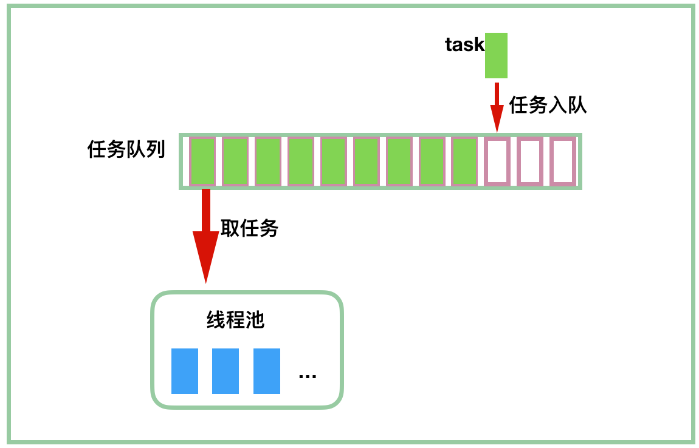

### 简介

线程池是管理一组线程的资源池。之所以要使用线程池，是因为创建、销毁线程需要消耗系统资源，对于任务执行时间短的线程，不停的创建、销毁线程的时间可能比执行线程任务的时间还长。

### Executor框架


### Executor 接口

```java
public interface Executor {

    /**
     * Executes the given command at some time in the future.  The command
     * may execute in a new thread, in a pooled thread, or in the calling
     * thread, at the discretion of the {@code Executor} implementation.
     *
     * @param command the runnable task
     * @throws RejectedExecutionException if this task cannot be
     * accepted for execution
     * @throws NullPointerException if command is null
     */
    void execute(Runnable command);
}
```

Executor 是 Executor 框架的顶级接口


### ExecutorService 接口

该接口在 Executor 的基础上提供了对任务执行的生命周期的管理，它的主要方法

```java
public interface ExecutorService extends Executor {

    // 等待所有任务完成，并设置超时时间
    boolean awaitTermination(long timeout, TimeUnit unit);

    // 执行所有任务
    <T> List<Future<T>> invokeAll(Collection<? extends Callable<T>> tasks);


    // 执行所有任务，但设置了超时时间
    <T> List<Future<T>> invokeAll(Collection<? extends Callable<T>> tasks, long 
                                  timeout, TimeUnit unit);

    // 执行任意一个任务，返回执行完任务的结果
    <T> T invokeAny(Collection<? extends Callable<T>> tasks);

	// 同上，只是设置了超时时间
    <T> T invokeAny(Collection<? extends Callable<T>> tasks, long timeout, 
                    TimeUnit unit);

    // 判断线程池是否已经关闭
    boolean isShutdown();

    // 如果调用了 shutdown() 或 shutdownNow() 方法后，所有任务结束了，那么返回true
    // 这个方法必须在调用shutdown或shutdownNow方法之后调用才会返回true
    boolean isTerminated();

    // 关闭线程池，已经提交的任务继续执行，拒绝接受新任务
    void shutdown();

    // 尝试停止正在执行的任务，拒绝接受新任务
    List<Runnable> shutdownNow();
    
    // 提交 Callable 任务
    <T> Future<T> submit(Callable<T> task);

    // 提交 Runnable 任务
    Future<?> submit(Runnable task);
    
    // // 提交 Runnable 任务， result 为任务返回的结果
    <T> Future<T> submit(Runnable task, T result);
}
```


### 相关接口

#### 二、Runnable接口

表示可以异步执行的任务

```java
@FunctionalInterface
public interface Runnable {
    public abstract void run();
}
```

#### 三、Callable 接口

该接口允许有返回值，会抛出异常

```java
@FunctionalInterface
public interface Callable<V> {
    V call() throws Exception;
}
```


### AbstractExecutorService类

AbstractExecutorService 派生自 ExecutorService 接口。 AbstractExecutorService 实现了 submit 和 invoke... 等方法。

#### submit方法

三个方法类似，但是注意参数

```java
    public Future<?> submit(Runnable task) {
        if (task == null) throw new NullPointerException();
        // 将任务包装成 FutureTask
        RunnableFuture<Void> ftask = newTaskFor(task, null);
        // 执行
        execute(ftask);
        return ftask;
    }

    public <T> Future<T> submit(Runnable task, T result) {
        if (task == null) throw new NullPointerException();
        RunnableFuture<T> ftask = newTaskFor(task, result);
        execute(ftask);
        return ftask;
    }


    public <T> Future<T> submit(Callable<T> task) {
        if (task == null) throw new NullPointerException();
        RunnableFuture<T> ftask = newTaskFor(task);
        execute(ftask);
        return ftask;
    }


// 将 runnable 对象包装成 FutureTask
    protected <T> RunnableFuture<T> newTaskFor(Runnable runnable, T value) {
        return new FutureTask<T>(runnable, value);
    }
// 将 callable 对象包装成 FutureTask
    protected <T> RunnableFuture<T> newTaskFor(Callable<T> callable) {
        return new FutureTask<T>(callable);
    }
```


### ThreadPoolExecutor

#### 简介

ThreadPoolExecutor 是 JDK 中的线程池实现，这个类实现了一个线程池需要的各个方法，它实现了任务提交、线程管理、监控等等方法。继承了 AbstractExecutorService，submit 的任务并不会通过 `new Thread(runnable).start() `，而是处于任务队列，等待线程过来领取执行，如下图



#### 构造函数

```java


// 其他几个也是调用这个构造函数
public ThreadPoolExecutor(int corePoolSize,
                          int maximumPoolSize,
                          long keepAliveTime,
                          TimeUnit unit,
                          BlockingQueue<Runnable> workQueue,
                          ThreadFactory threadFactory,
                          RejectedExecutionHandler handler) {
    if (corePoolSize < 0 ||
        maximumPoolSize <= 0 ||
        maximumPoolSize < corePoolSize ||
        keepAliveTime < 0)
        throw new IllegalArgumentException();
    // 几个不能为空的参数
    if (workQueue == null || threadFactory == null || handler == null)
        throw new NullPointerException();
    this.corePoolSize = corePoolSize;
    this.maximumPoolSize = maximumPoolSize;
    this.workQueue = workQueue;
    this.keepAliveTime = unit.toNanos(keepAliveTime);
    this.threadFactory = threadFactory;
    this.handler = handler;
}
```

主要参数含义：

+ corePoolSize

  核心线程数量

+ maximumPoolSize

  最大线程数量

+ workQueue

  任务队列，BlockingQueue 接口的某个实现，主要有以下几种

  | 阻塞队列              | 说明                                   |
  | --------------------- | -------------------------------------- |
  | ArrayBlockingQueue    | 一个由数组结构组成的有界阻塞队列。     |
  | LinkedBlockingQueue   | 一个由链表结构组成的有界阻塞队列。     |
  | PriorityBlockingQueue | 一个支持优先级排序的无界阻塞队列。     |
  | DelayQueue            | 一个使用优先级队列实现的无界阻塞队列。 |
  | SynchronousQueue      | 一个不存储元素的阻塞队列。             |
  | LinkedTransferQueue   | 一个由链表结构组成的无界阻塞队列。     |
  | LinkedBlockingDeque   | 一个由链表结构组成的双向阻塞队列。     |

+ keepAliveTime

  如果线程池中线程数多于核心线程数，空闲线程的最大等待时间，超过该时间空闲线程会被回收。当然 corePoolSize 的线程也可以通过设置而得到回收（allowCoreThreadTimeOut(true)）

+ threadFactory

  创建线程的工厂

+ handler

  线程池任务满了之后再添加任务的处理策略。默认使用 ThreadPoolExecutor.AbortPolicy，即任务被拒绝时抛出异常。

  线程池有以下几种已经定义的策略：

  | 策略                                   | 说明                                                     |
  | -------------------------------------- | -------------------------------------------------------- |
  | ThreadPoolExecutor.AbortPolicy         | 丢弃任务并抛出 RejectedExecutionException 异常。         |
  | ThreadPoolExecutor.DiscardPolicy       | 丢弃任务，但是不抛出异常。                               |
  | ThreadPoolExecutor.DiscardOldestPolicy | 丢弃队列最前面的任务，然后重新尝试执行任务（重复此过程） |
  | ThreadPoolExecutor.CallerRunsPolicy    | 由调用线程处理该任务。                                   |


#### 主要属性

```Java
// ctl包含了两部分内容
// 1. 有效线程数，低29位
// 2. 线程池状态，高3位
private final AtomicInteger ctl = new AtomicInteger(ctlOf(RUNNING, 0));
private static final int COUNT_BITS = Integer.SIZE - 3;
// COUNT_MASK：00011111111111111111111111111111
private static final int COUNT_MASK = (1 << COUNT_BITS) - 1;

// 线程池状态
// runState is stored in the high-order bits
// 就这个状态小于0
private static final int RUNNING    = -1 << COUNT_BITS;
private static final int SHUTDOWN   =  0 << COUNT_BITS;
private static final int STOP       =  1 << COUNT_BITS;
private static final int TIDYING    =  2 << COUNT_BITS;
private static final int TERMINATED =  3 << COUNT_BITS;

// Packing and unpacking ctl
private static int runStateOf(int c)     { return c & ~COUNT_MASK; }
private static int workerCountOf(int c)  { return c & COUNT_MASK; }
private static int ctlOf(int rs, int wc) { return rs | wc; }

```


几种状态：

+ RUNNING：自然运行状态，正在执行任务，可以接受任务。
+ SHUTDOWN：不再接受新任务，但是还在执行任务队列中的任务。
+ STOP：不再接受新任务，也不执行任务队列中的任务。
+ TIDYING：所有的任务都销毁了，workCount 为 0。线程池的状态在转换为 TIDYING 状态时，会执行钩子方法 terminated()
+ TERMINATED：terminated() 方法结束后，线程池的状态就会变成这个

状态转换：


#### 内部类Worker

线程池中的线程会被包装成 Worker

```Java
private final class Worker
    extends AbstractQueuedSynchronizer
    implements Runnable
{
    private static final long serialVersionUID = 6138294804551838833L;

    // 执行任务的线程
    final Thread thread;

    // 线程执行的第一个任务，线程不止执行一个任务
    // 这个值也可以为NUll，这时候从任务队列取任务就行了
    Runnable firstTask;

    // 用于存放此线程完成的任务数
    volatile long completedTasks;

    // Worker 只有这一个构造方法，传入 firstTask，也可以传 null
    Worker(Runnable firstTask) {
        setState(-1); // inhibit interrupts until runWorker
        this.firstTask = firstTask;
        // 调用 ThreadFactory 来创建一个新的线程
        this.thread = getThreadFactory().newThread(this);
    }

    // 这里调用了外部类的 runWorker 方法
    public void run() {
        runWorker(this);
    }

    // 加锁
    protected boolean tryAcquire(int unused) {
        if (compareAndSetState(0, 1)) {
            setExclusiveOwnerThread(Thread.currentThread());
            return true;
        }
        return false;
    }

    // 解锁
    protected boolean tryRelease(int unused) {
        setExclusiveOwnerThread(null);
        setState(0);
        return true;
    }
    //...
}
```

注意 Worker 实现的是不可重入的互斥锁

// TODO


#### 提交任务 executor

```java
public void execute(Runnable command) {
    if (command == null)
        throw new NullPointerException();
    /*
     * Proceed in 3 steps:
     *
     * 1. If fewer than corePoolSize threads are running, try to
     * start a new thread with the given command as its first
     * task.  The call to addWorker atomically checks runState and
     * workerCount, and so prevents false alarms that would add
     * threads when it shouldn't, by returning false.
     *
     * 2. If a task can be successfully queued, then we still need
     * to double-check whether we should have added a thread
     * (because existing ones died since last checking) or that
     * the pool shut down since entry into this method. So we
     * recheck state and if necessary roll back the enqueuing if
     * stopped, or start a new thread if there are none.
     *
     * 3. If we cannot queue task, then we try to add a new
     * thread.  If it fails, we know we are shut down or saturated
     * and so reject the task.
     */
    int c = ctl.get();
    // 如果当前线程数小于核心线程数，直接创建 Worker 执行任务
    if (workerCountOf(c) < corePoolSize) {
        // 如果addWorker返回false，提交任务失败，否则成功
        if (addWorker(command, true))
            return;
        // 重新获取 ctl
        c = ctl.get();
    }
    // 如果线程池处于 RUNNING 状态并且任务添加到任务队列成功
    if (isRunning(c) && workQueue.offer(command)) {
        // double check
        int recheck = ctl.get();
        // 如果线程池不处于 RUNNING 状态，则移除任务并执行拒绝策略
        if (! isRunning(recheck) && remove(command))
            reject(command);
        // 如果当前线程数为0，开启新线程
        // 这里是为了处理SHUTDOWN状态下没有活动线程了，但是队列里还有任务没执行这种特殊情况。
        // 因为不再接受新任务，所以传入的任务为null
        // 创建的 Worker 会到任务队列执行任务
        else if (workerCountOf(recheck) == 0)
            addWorker(null, false);
    }
    // 这里说明 1.线程数大于核心线程数且任务队列满，不能再添加任务， 2.状态不为RUNNING
    // 于是以 maximumPoolSize 为界创建新 Worker
    // 如果失败，说明当前线程数为 maximumPoolSize，执行拒绝策略
    else if (!addWorker(command, false))
        reject(command);
}

```

这个方法主要步骤：

处于 RUNNING 状态

1. 活动线程小于核心线程，对于新来的任务则创建新线程去执行。
2. 活动线程大于等于核心线程，则将新来任务加入任务队列
3. 如果上面的条件都不满足，则创建新线程执行任务，但是线程数小于maximumPoolSize
4. 上面条件不满足，对任务执行拒绝策略

不处于 RUNNING 状态，对任务执行拒绝策略


**之所以  double check 线程池的状态，是因为在多线程环境下，线程池的状态时刻在变化，而 `ctl.get()` 是非原子操作，很有可能刚获取了线程池状态后线程池状态就改变了。紧接着判断是否将 command 加入 workque 获取的是线程池之前的状态。**

**倘若没有 double check，万一线程池处于非 RUNNING 状态（在多线程环境下很有可能发生），那么 command 将永远不会执行。**

